# 动态叠加动画原理
## 概述
- Make Dynamic Additive 节点：**动态计算两个动画之间的差值**，并将其作为一个 Additive 动画输出。即**加成动画** = 目标动画帧 - 参考动画帧
## 动画蓝图
- 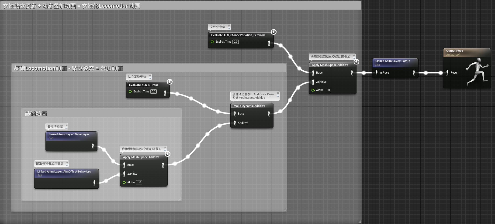
# 分层动态叠加
- 由于对身体的各部分要分别使用覆盖和叠加，还要使用不同的混合度，所以要分层动态叠加
- 其中运手臂姿态要跟随脊椎姿态，所以要使用局部空间混合和叠加
- 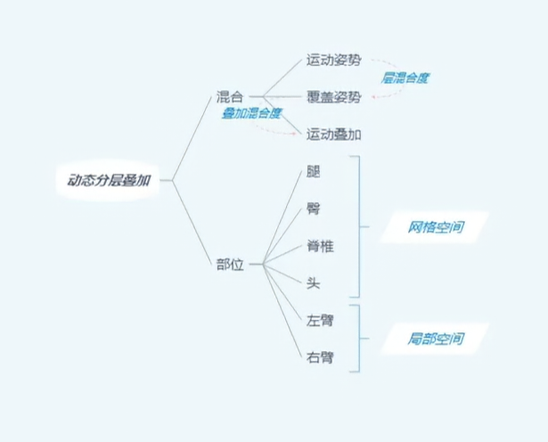
## 动画蓝图

### LayerBlending动画层
- 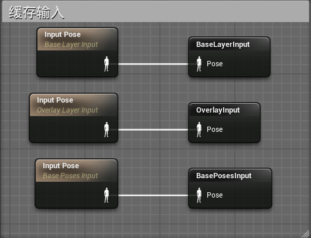
- 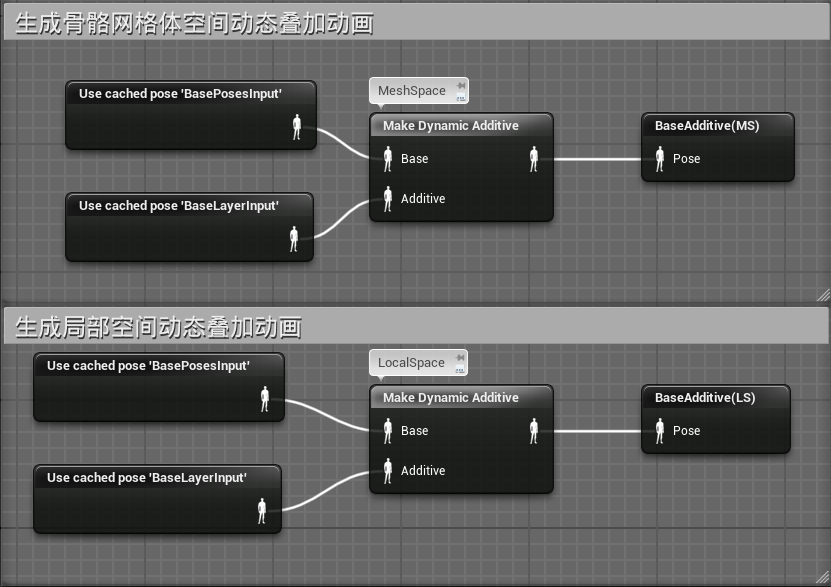

- 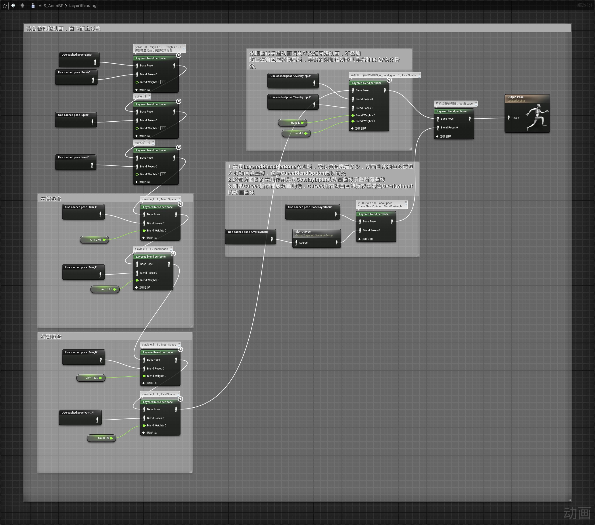
### 获取动画曲线并更新变量
- GetAnimCurve_Compact宏用于根据动画曲线名称获取动画曲线值
- 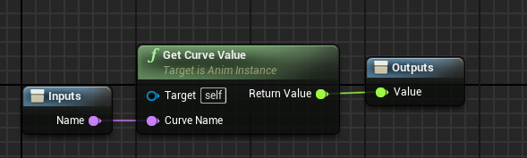
- Update Layer Values函数，获取动画曲线值并设置变量
- 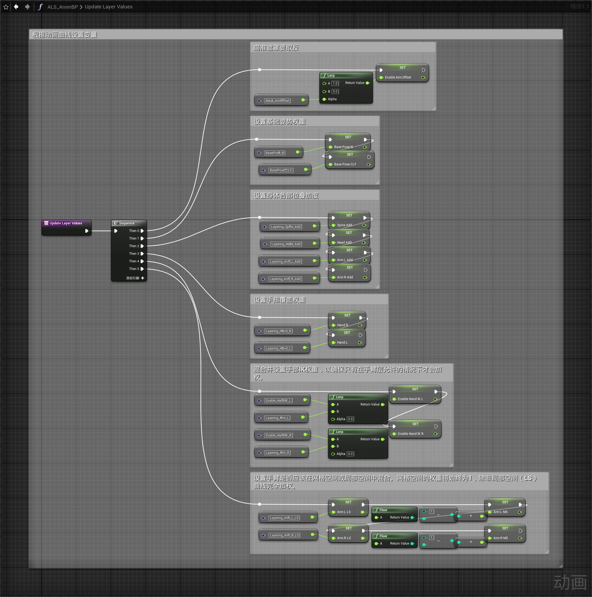
- 在updateGraph中调用函数
- 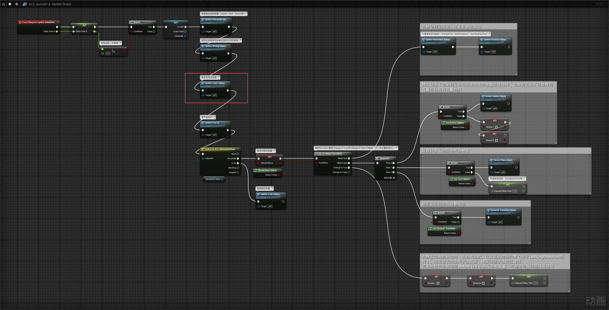
### BasePose动画层
- 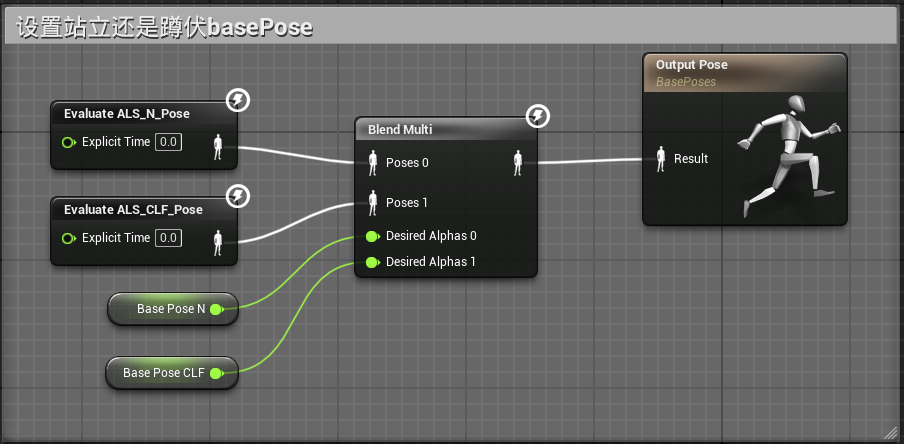
### OverlayLayer动画层
- 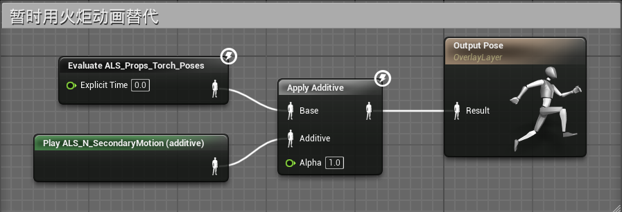
### 主动画蓝图
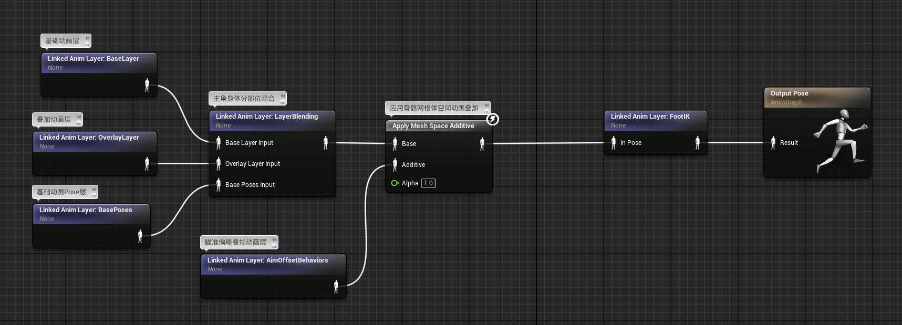