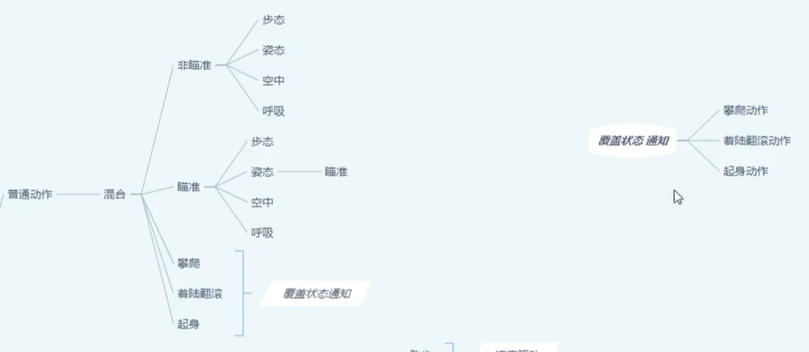
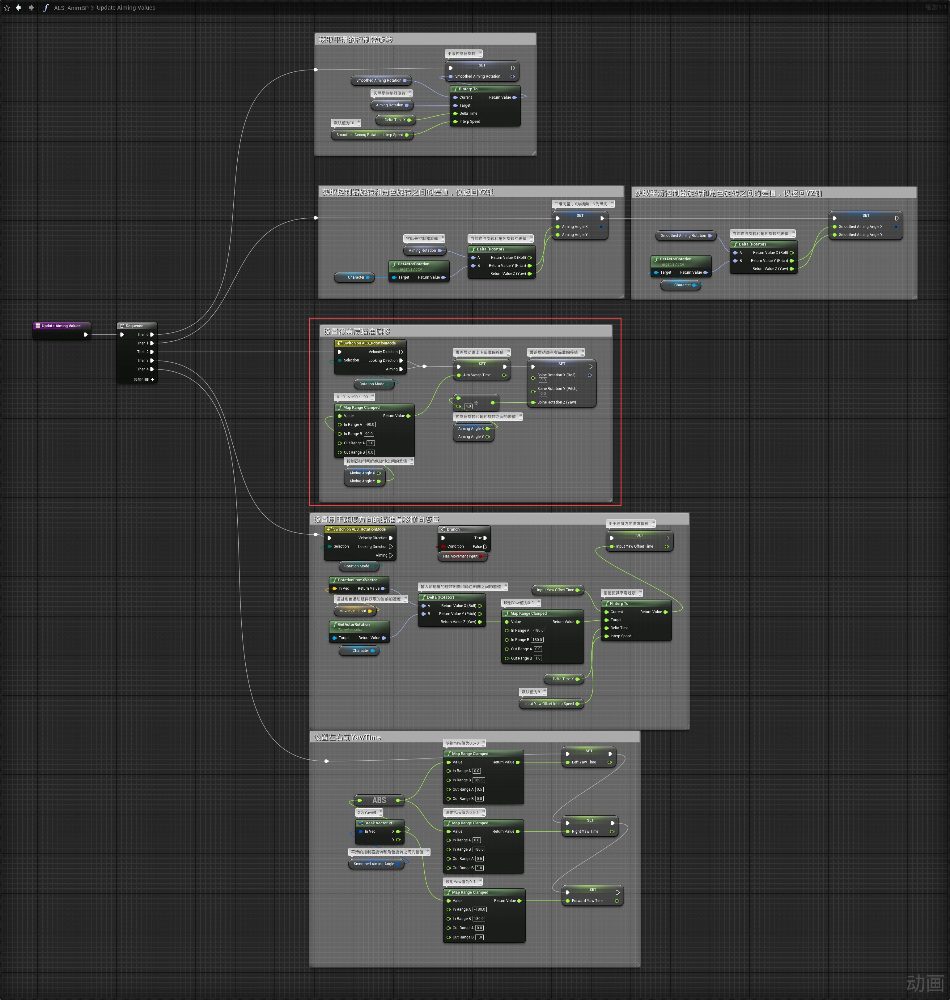
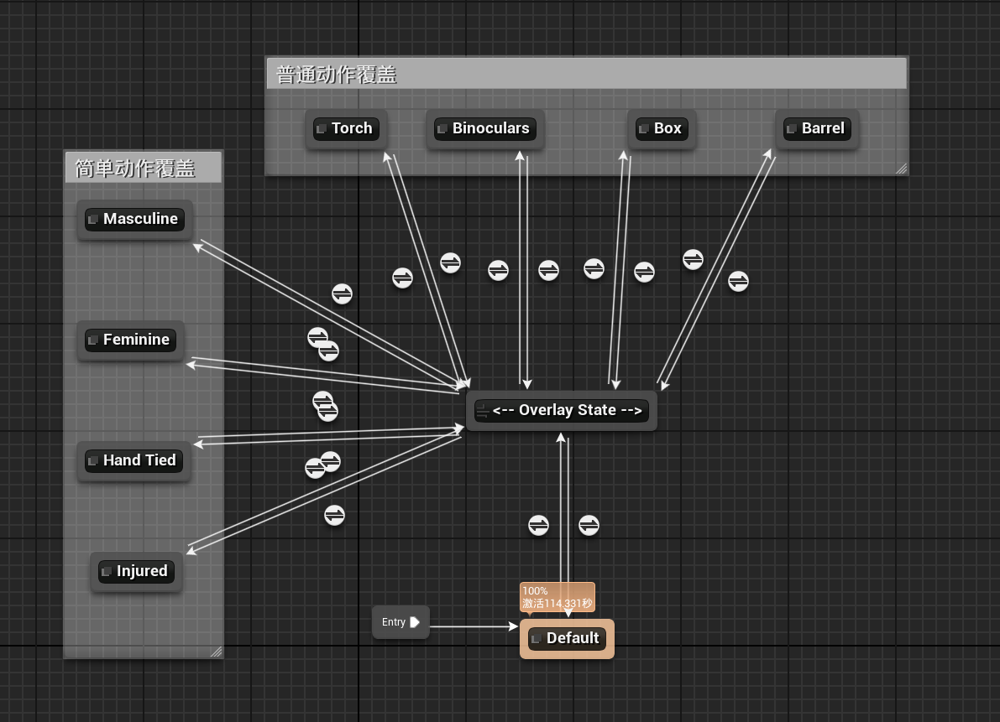
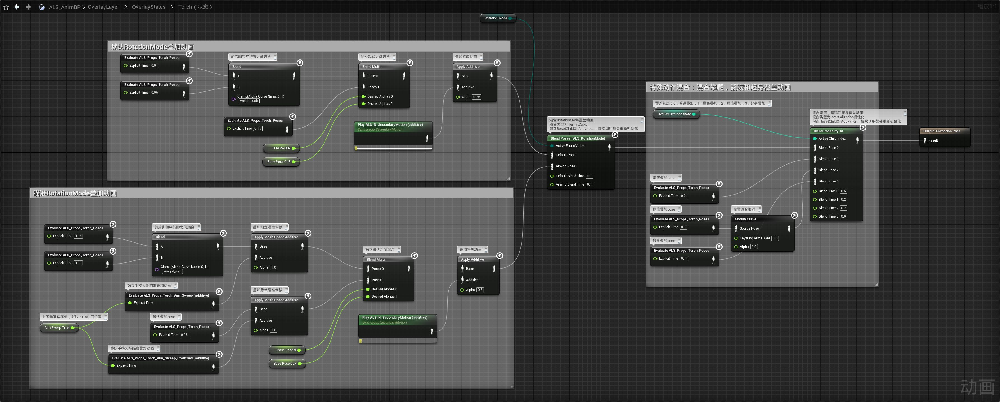
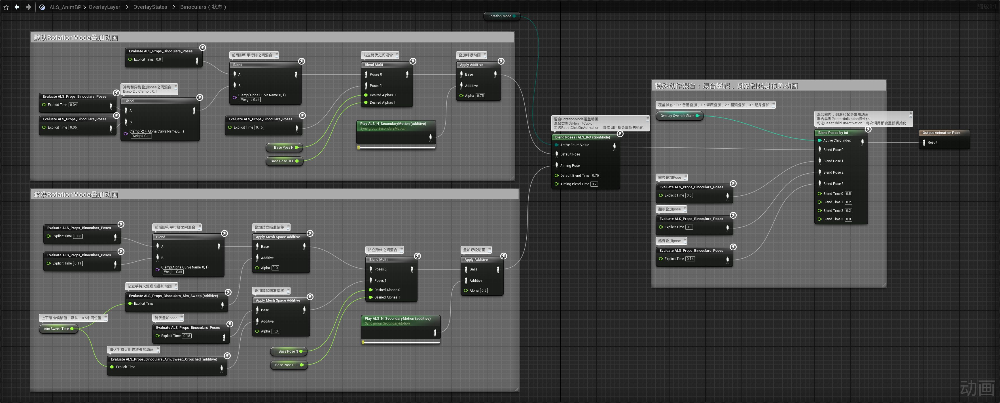
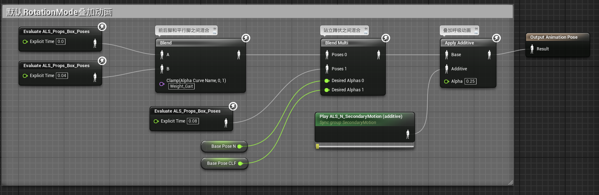
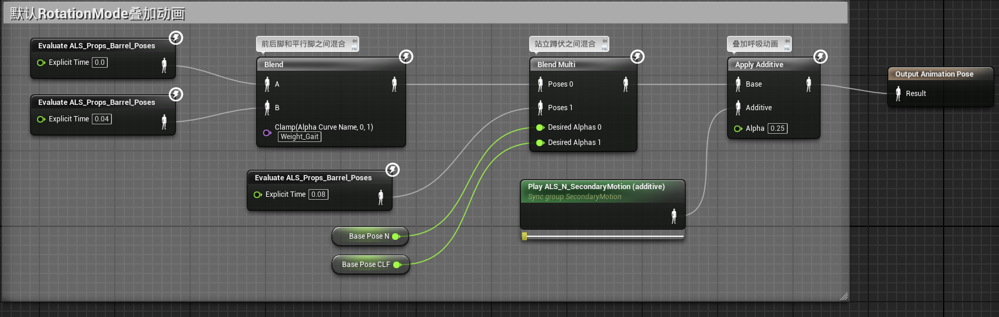

# 概述
- 实现覆盖层普通动作：火炬，望远镜，木箱，木桶
- 
# 动画蓝图
## 事件图表
在函数Update Aiming Values中设置用于覆盖层动画的瞄准偏移参数AimSweepTime和SpineRotation

## 动画蓝图
- 在OverlayLayer动画层中实现普通动作覆盖
- 
- 他们的条件均为变量OverlayState是否等于相应的枚举值
- Torch：火炬状态
- Binoculars：望远镜状态
- Box：抱箱子
- Barrel：抗桶