# 概述
- 实现覆盖层之简单动作：壮汉，女性，绑手，负伤
- **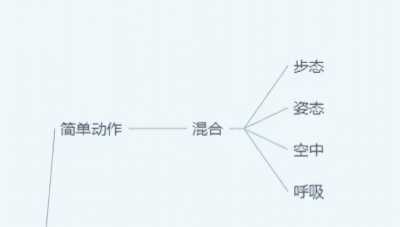**
# 角色蓝图
- 在ALS_Base_CharacterBP中
- 在接口函数BPIGetCurrentStates中同步变量OverlayState
- 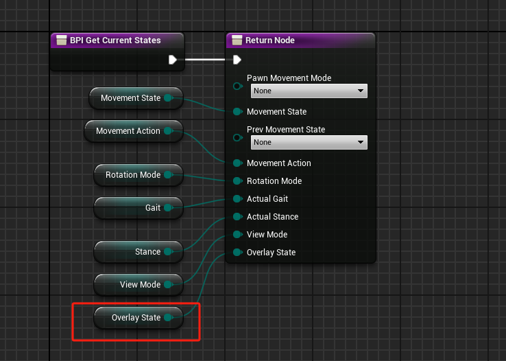
- 创建函数OnOverlayStateChanged
- 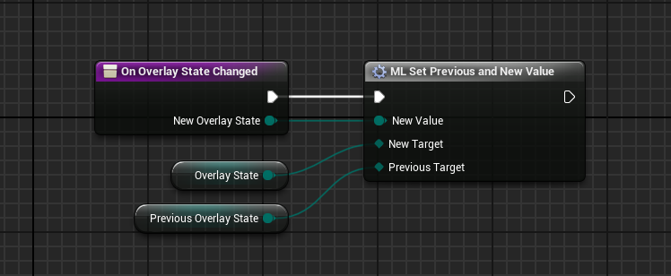
- 在事件图表中实现接口函数BPISetOverlayState
- 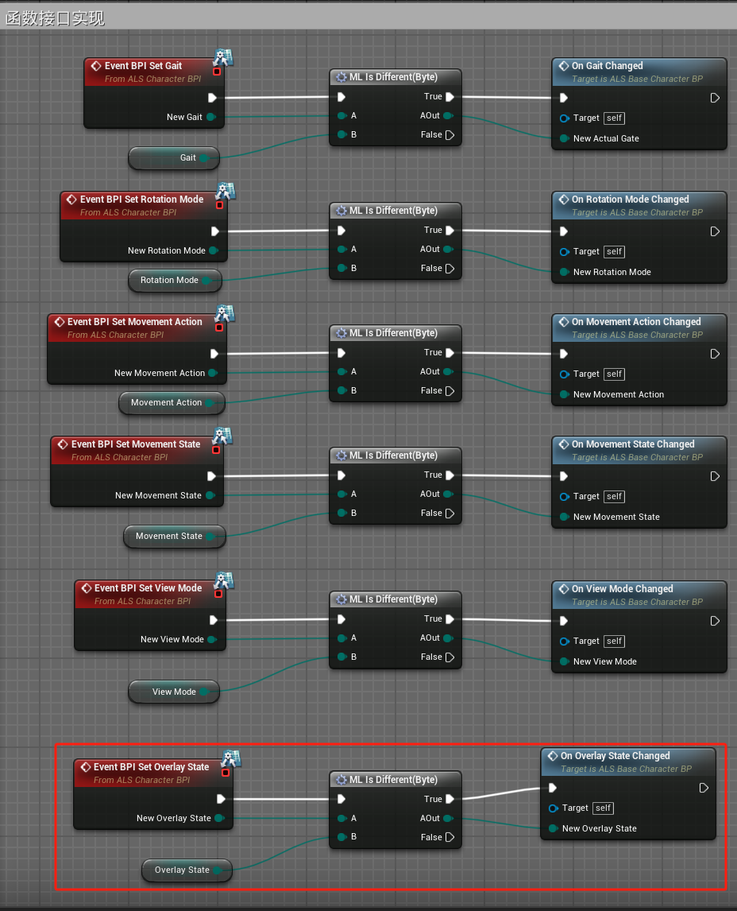
- 在OnBeginPlay函数中初始化变量
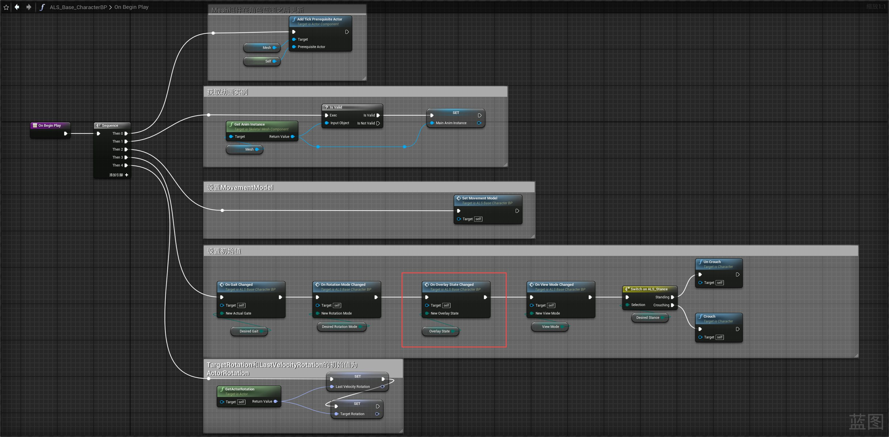
# 动画蓝图
## 事件图表
- 在Update Character Info函数中接受来自角色蓝图的变量OverlayState
- 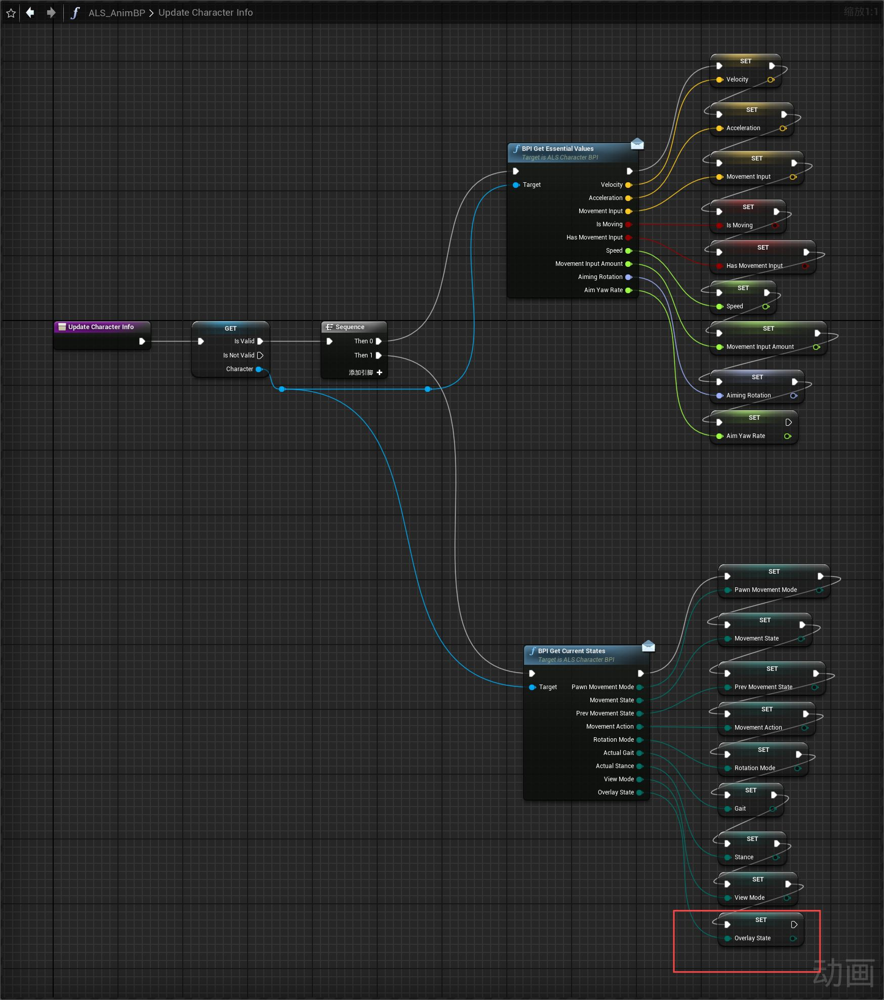
- 
## 动画图表
- 在OverlayStates动画层中
- 创建OverlayStates状态机并应用Intertialization惯性化过渡
- 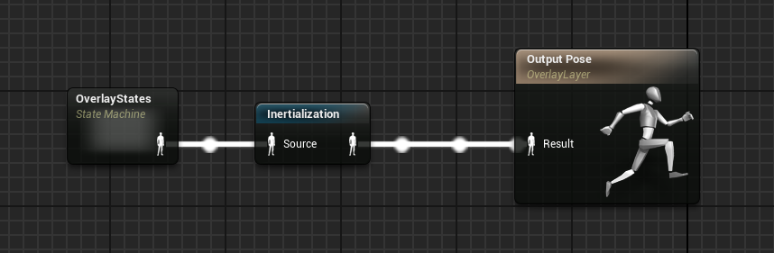
- 在OverlayStates状态机状态机中
- 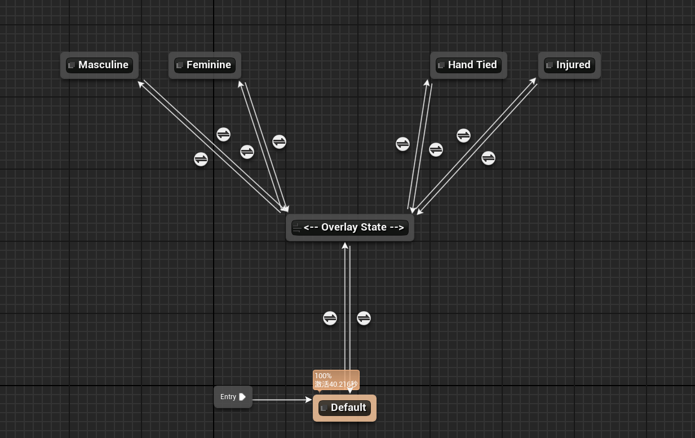
- 开始进入Default状态机
- 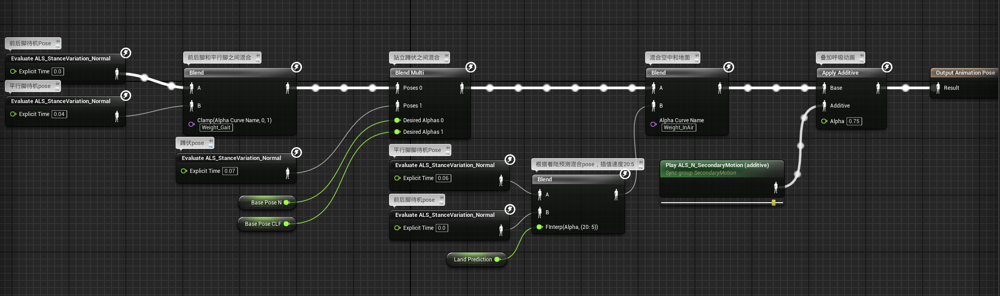
- 如果OverlayState变量的值不为Default 则进入<-- Overlay State -->导管
- 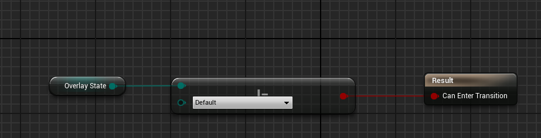
- 如果OverlayState变量的值为Default 则回到Default状态
- 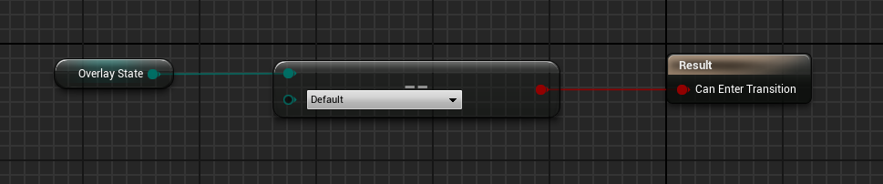
- 剩余的状态Masculine，Feminine，Hand Tied，Injured则由Default状态修改动画相应的资产得来
	- Masculine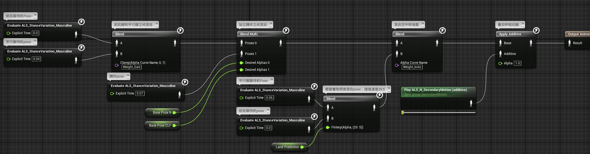
	- Feminine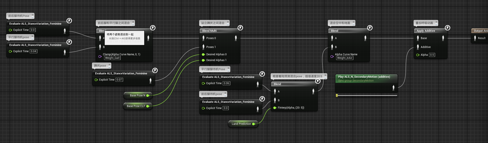
	- Hand Tied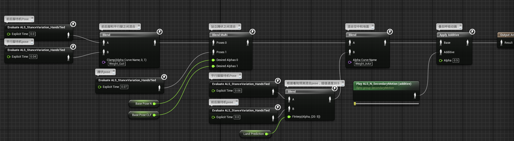
	- Injured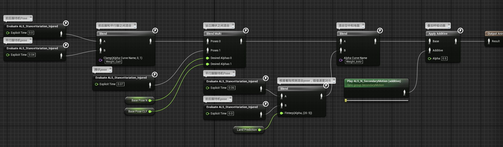
- 对应的过渡规则均为OverlayState变量的值，所有的规则都使用惯性化