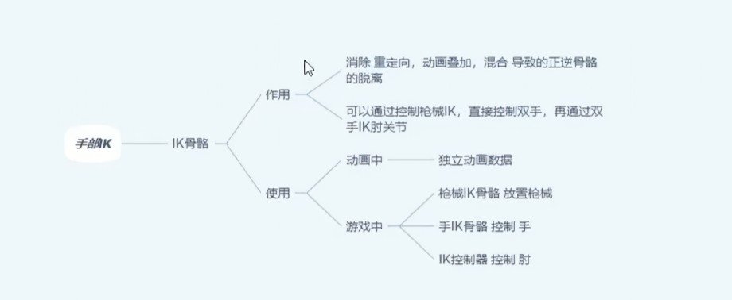
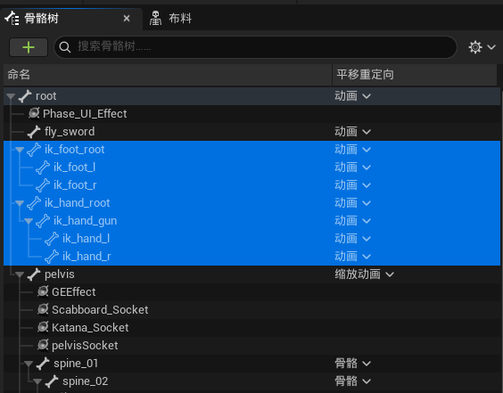
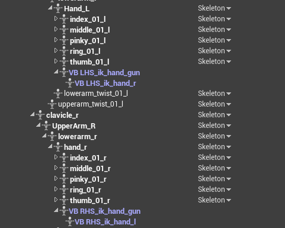
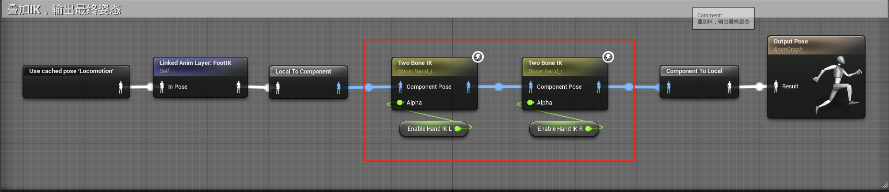
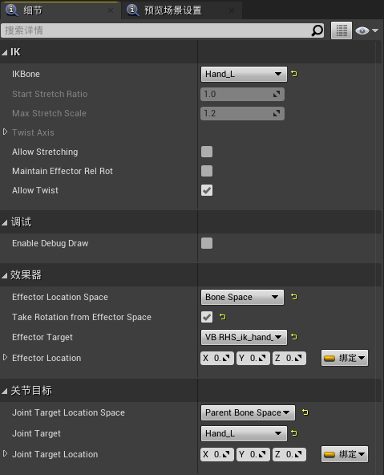
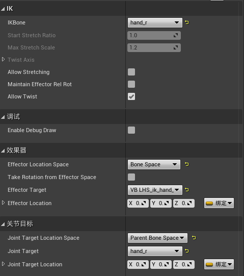

# 概述
- 实现手部IK以解决覆盖层握持武器手部偏移问题
- 

- ## 官方文档中关于动画重定向如何处理 End Effector

https://dev.epicgames.com/documentation/en-us/unreal-engine/animation-retargeting-in-unreal-engine
>
高个子角色跑得更快吗，他们是否还能拿着相同的道具 - 这些是进行重新定位时可能出现的问题。简而言之，没有自动工作发生，由用户决定他们希望它做什么。
关于持有道具，可以采用的一种方法是创建一个单独的骨骼链，该骨骼链跟随原始动画中的手部，称为“手部 IK 骨骼”。==然后重新定位身体和手臂，但不重新定位“手部 IK 骨骼”，以便它们在重新定位后保持不变。==这将允许您让不同比例的角色纵相同的道具（例如，为步枪装弹）。
拥有单独的骨骼链可以让您在需要时轻松地在 FK 和 IK 之间平滑切换（例如，您希望在重新装填武器时打开手部 IK，在伸手从口袋中拿弹匣时关闭）。
该系统非常灵活，可以根据您的需求进行定制。也许您只想将左手作为 IK，而右手使用其 FK 位置，但使用 IK 旋转。脚有时是这样处理的，有时不是。当踩到非常精确的道具时，您可能希望启用 IK;当你只是四处奔波时，你会想要使用 FK，这样你就不会得到一个弓形腿的角色（或相反）。

- 官方文档中关于动画重定向如何处理 End Effector的描述，意思是对主角进行动画重定向的时候，仅仅重定向身体骨骼，不去重定向IK骨骼（ik_为前缀）。因为IK骨骼的父骨骼为root，所以身体骨骼不会影响IK骨骼，IK骨骼依旧保持着重定向前的变换，我们可以使用双骨骼IK节点将重定向后的手部骨骼拖拽回IK骨骼的位置，来修改重定向后的手部位置偏移。
# 骨骼资产
## IK骨骼平移重定向设置
- Animation - Bone Translation 来自动画数据，保持不变。
- skeleton - 骨骼平移来自 目标骨架 的绑定姿势。
- AnimationScaled（缩放的动画） - 骨骼平移来自动画数据，但是通过骨架的比例进行缩放。这是 Target Skeleton（目标骨架）（正在播放动画的骨架）和 Source Skeleton（为其创作动画的骨架）的骨骼长度之间的比率。

- 如图所示，骨骼树中根骨骼root位移信息从动画中读取，IK骨骼的位移信息从动画中读取，Pelvis的位移信息通过缩放动画读取，其余身体骨骼位移数据从骨骼中读取。

## 虚拟骨骼设置

- 在左手 Hand_L 层级之下创建虚拟骨骼 LHS_ik_hand_gun 指向ik_hand_gun位置，在虚拟骨骼 LHS_ik_hand_gun 层级之下创建虚拟骨骼LHS_ik_hand_r指向 ik_hand_r 的位置。这样就有了原始动画相对于左手的ik_hand_gun和ik_hand_r的位置
- 右手同理，虚拟骨骼为RHS_ik_hand_gun ，RHS_ik_hand_l
# 动画蓝图

- 其中第一个TwoBoneIK节点，EffectTarget为RHS_ik_hand_l

- 第二个TwoBoneIK节点， EffectTarget为LHS_ik_hand_r

- 扩展：Hand IK Retargeting
https://dev.epicgames.com/documentation/en-us/unreal-engine/animation-blueprint-hand-ik-retargeting-in-unreal-engine