# 概述
- 实现角色持武器的握持系统
- 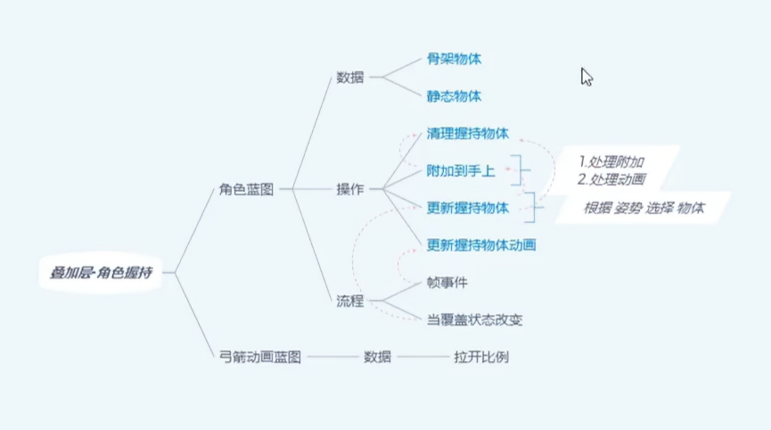
# 角色蓝图
## 父角色蓝图
- 主角色蓝图ALS_Base_CharacterBP中
- Mesh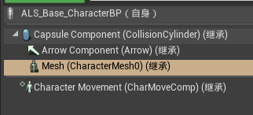的信息为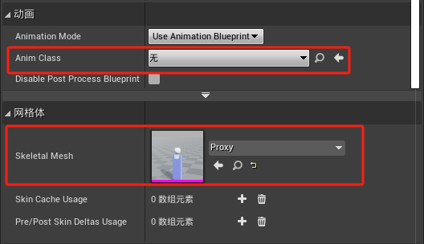
## 子角色蓝图
- 子角色蓝图ALS_AnimMan_CharacterBP
- 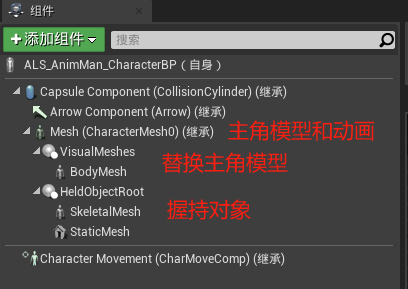
- 其中Mesh信息为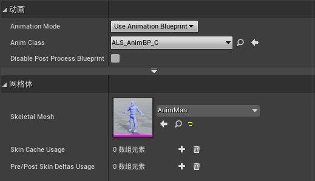
- BodyMesh的信息为：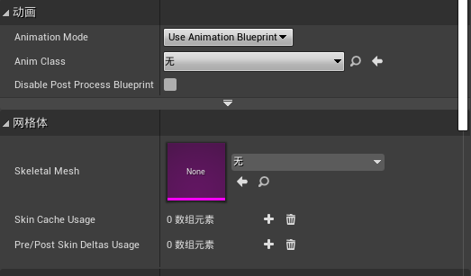
- 握持对象SkeletalMesh的信息为：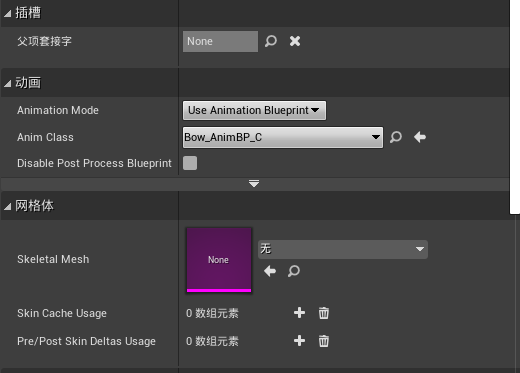
- 握持对象StaticMesh的信息为：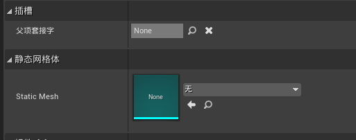
- 创建四个函数ClearHeldObject，AttachToHand，UpdateHeldObject， UpdateHeldObjectAnimations
- 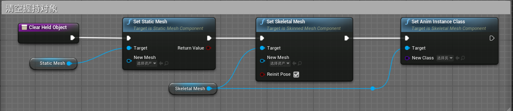
- 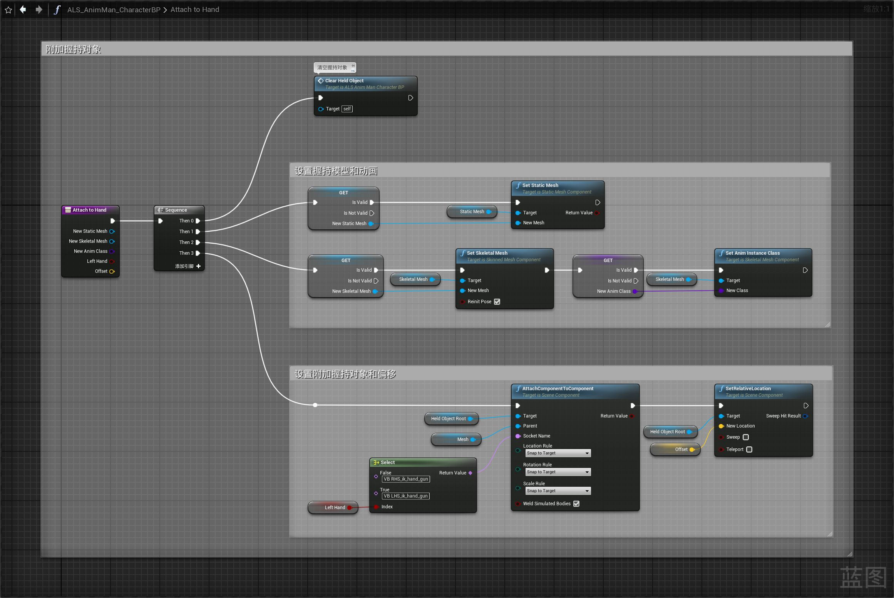
- 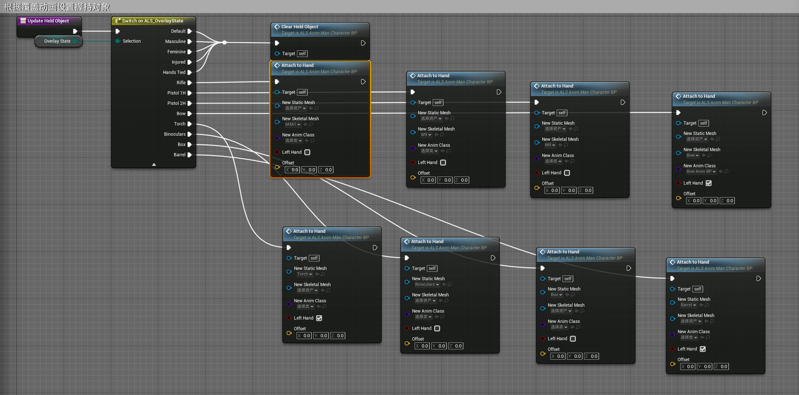
- 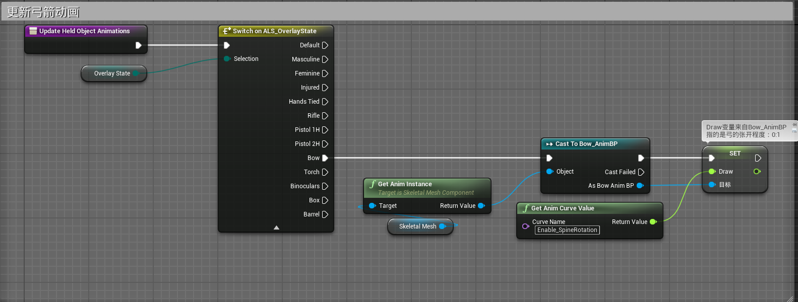
- 其中变量Draw来自弓箭动画蓝图Bow_AnimBP
- 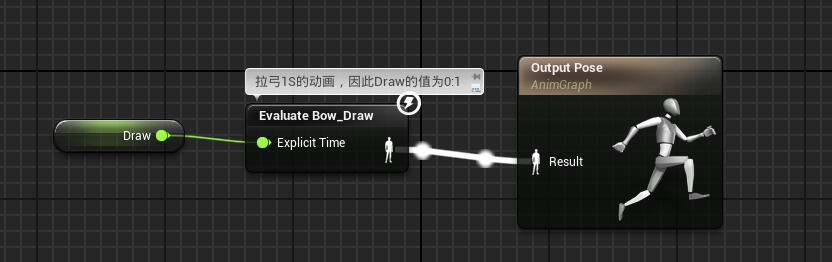
- 重载父角色蓝图函数OnOverlayStateChanged
- 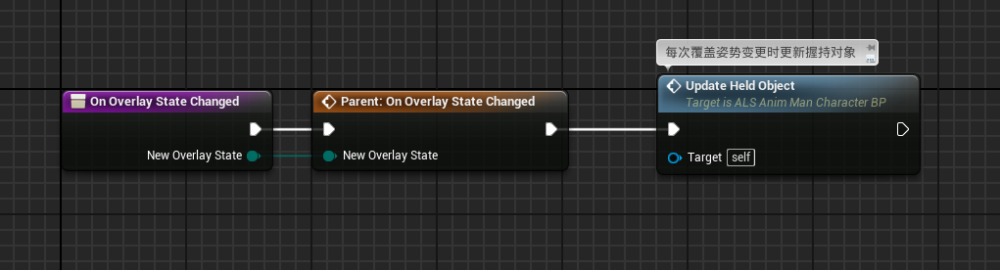
- 在事件图表中调用更新弓箭动画函数
- 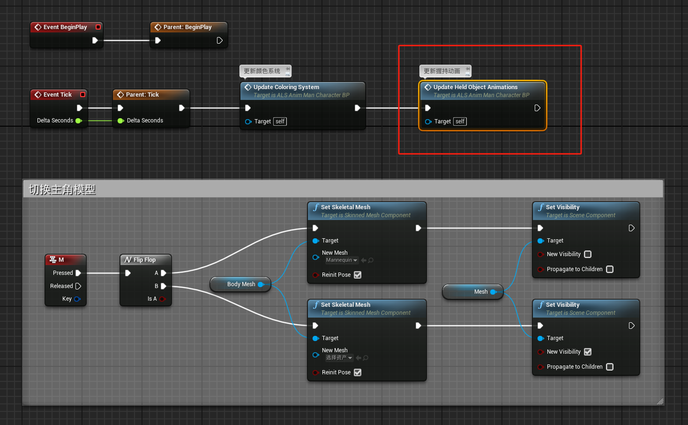