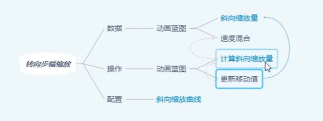
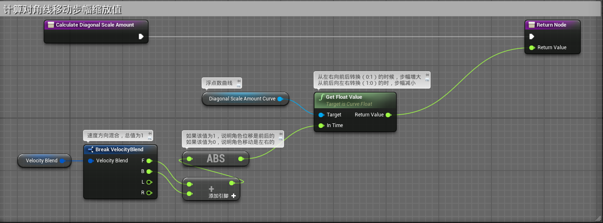
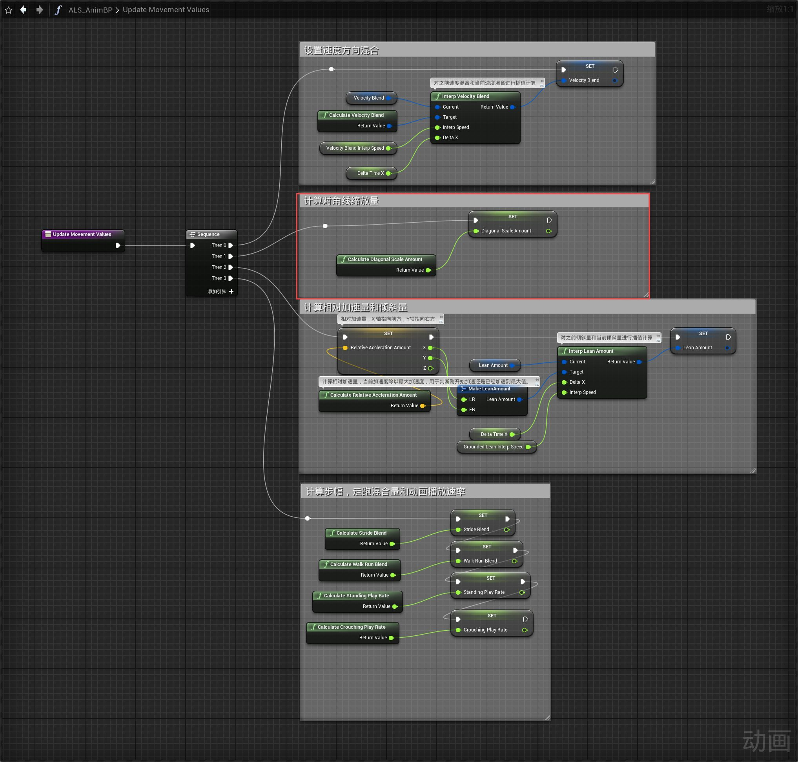
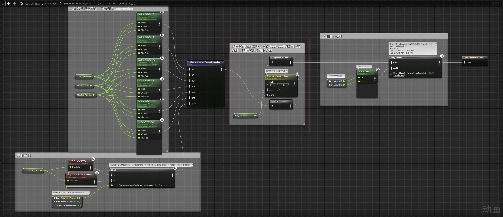

# 概述
- 该功能主要原理为：
	- 通过DiagonalScaleAmount曲线和VelocityBlend变量计算一个DiagonalScaleAmount浮点值
	- DiagonalScaleAmount浮点值在从左右向前后转换（0:1）的时候增大。从前后向左右转换（1:0）的时减小。
	- 在Locomotion八向移动中通过对ik_foot_root的XY轴进行缩放，以IK实现步幅的缩放
- 
# 动画蓝图
## 事件图表
- 实现Calculate Diagonal Scale Amount函数
- 
- 在Update Movement Values函数中调用
- 
## 动画图表
- 在中
- 