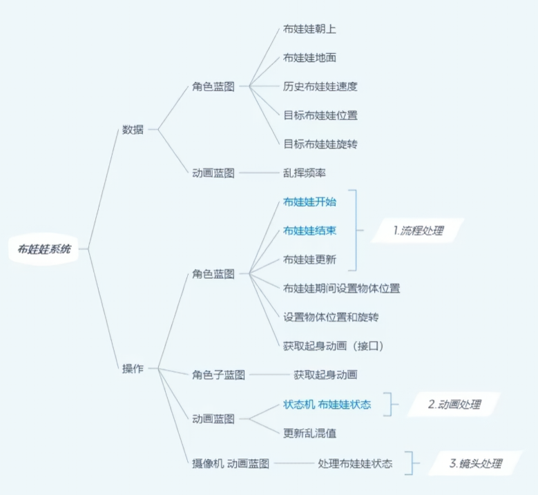
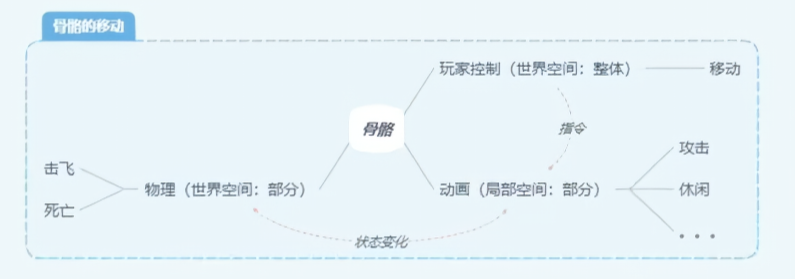
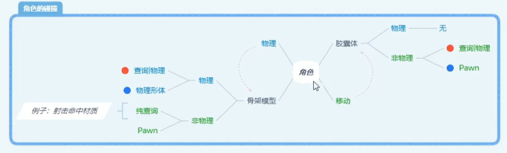
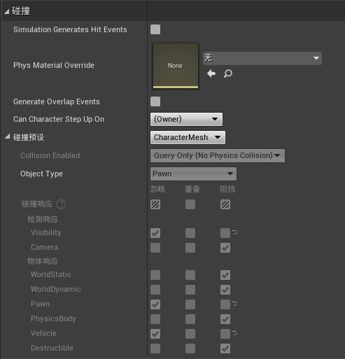
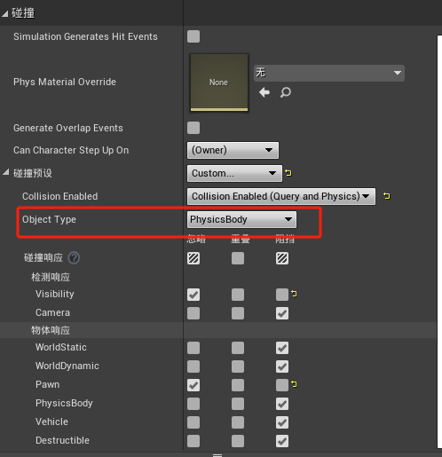
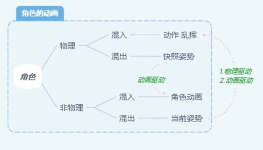
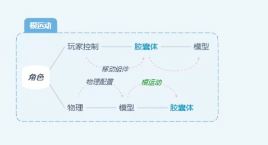
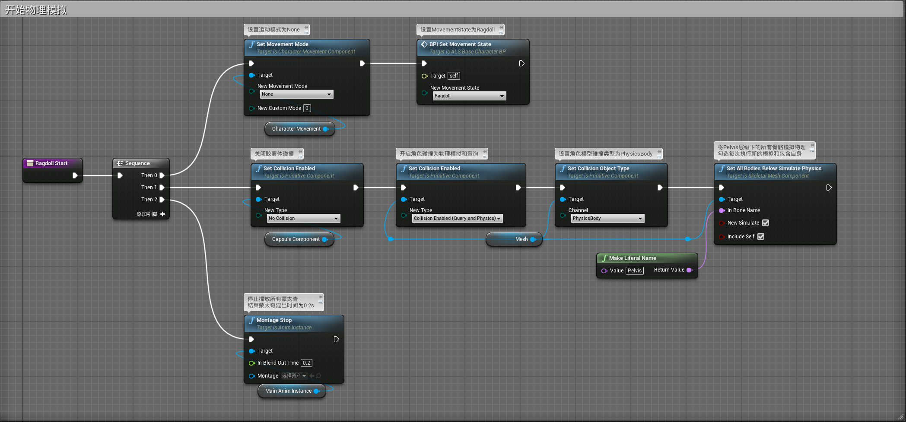
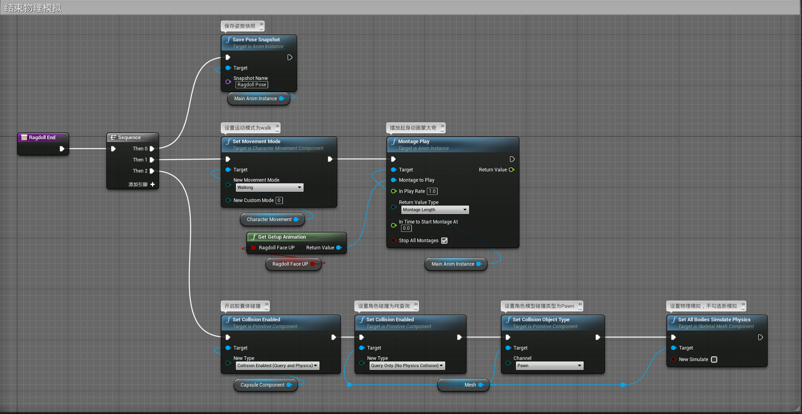
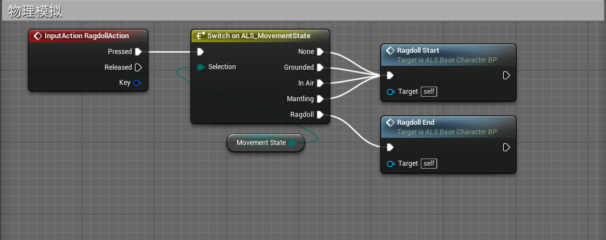

# 概述
- 学习物理模拟系统
- 
- 在非物理资产模拟的情况下使用玩家控制器控制角色，物理资产模拟的情况下使用物理资产模拟角色动画
- 
- 在非物理资产模拟的情况下使用胶囊体碰撞，物理资产模拟的情况下关闭胶囊体碰撞，开启物理资产碰撞
- 
- 角色蓝图中mesh组件碰撞属性
- 对象类型为Pawn是开启了胶囊体碰撞
- 对象类型为PhysicsBody是开启了物理模拟
- 在开关物理资产模拟的情况下要混合非物理资产模拟和物理资产模拟的动画
	- 物理状态混出的时候要用姿势快找记录当前的角色姿态，用于混入角色动画
	- 动画状态混入的物理模拟的时候要播放一个挣扎动画再混入到物理状态，增加死亡真实度
- 
- 物理模拟类似于根运动处理，物理模拟完成后要将胶囊体和角色进行位置同步
- 物理模拟开始的时候要将移动组建移动状态设为无，使物理资产拿到控制权，退出物理模拟再将移动组建恢复
- 
# 角色蓝图
## ALS_Base_CharacterBP
- 创建两个函数Ragdoll Start和Ragdoll End
- 
- 
- 在player input graph中设置输入
- 