# 概述
- 处理物理模拟状态和动画状态的混入混出
# 动画蓝图
## 事件图表
- Update Ragdoll Values 计算混入物理模拟的挥舞手臂动画的播放速率
- 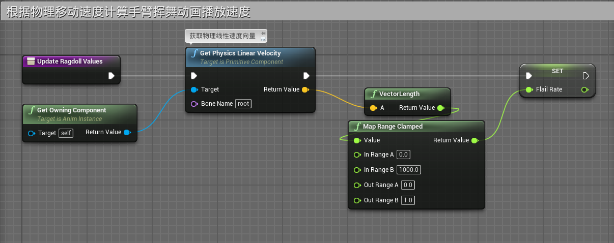
- 在UpdateGraph中调用函数
- 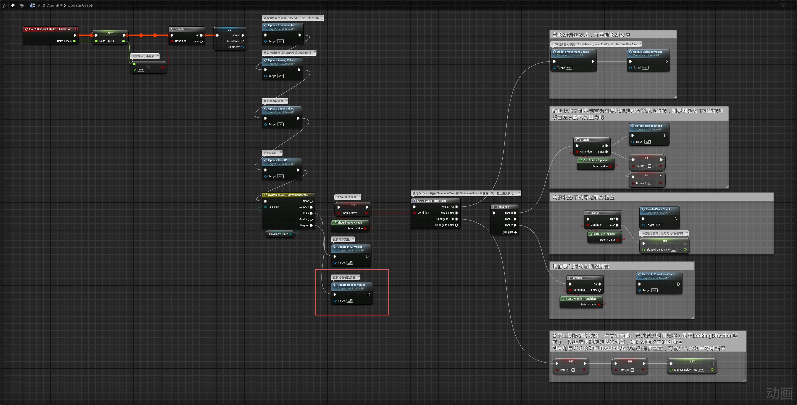
## 动画图表
- 在动画蓝图中混入物理模拟
- 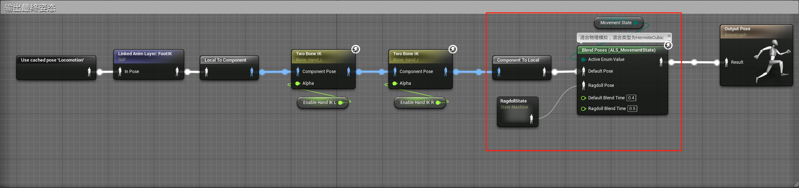
- 在RagdollState状态机中
- 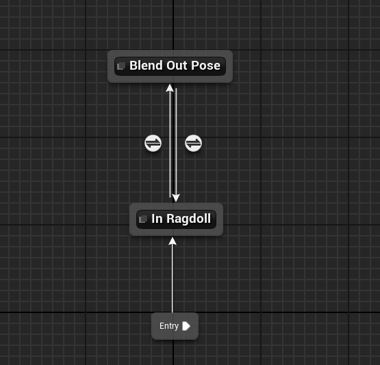
	- 开始进入In Ragdoll状态
	- 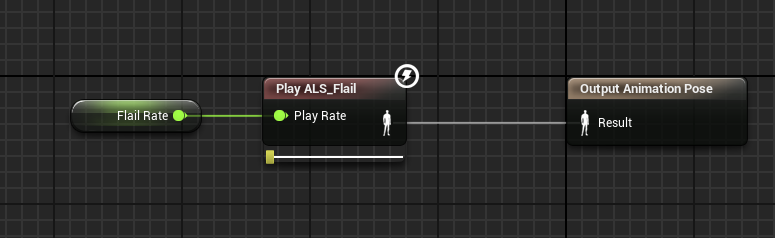
	- 如果MovementState值不等于Ragdoll则进入Blend Out Pose状态
	- 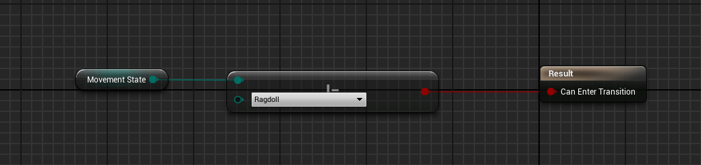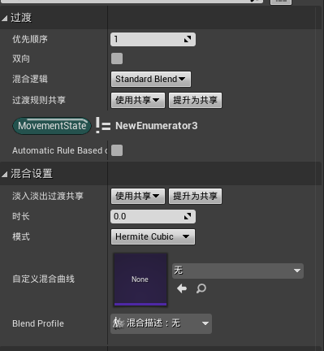
	- Blend Out Pose状态
	- 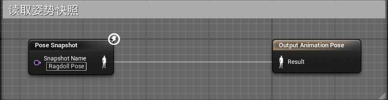
	- 如果MovementState值等于Ragdoll则回到In Ragdoll状态
	- 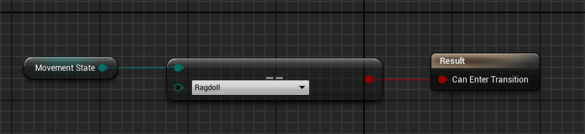**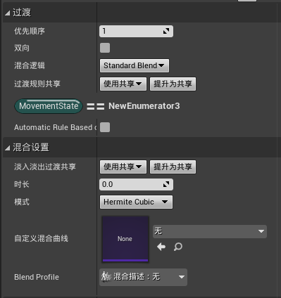**
# 角色蓝图
## ALS_Base_CharacterBP
- 创建虚函数Get Getup Animation不实现，用于子类覆盖实现
- 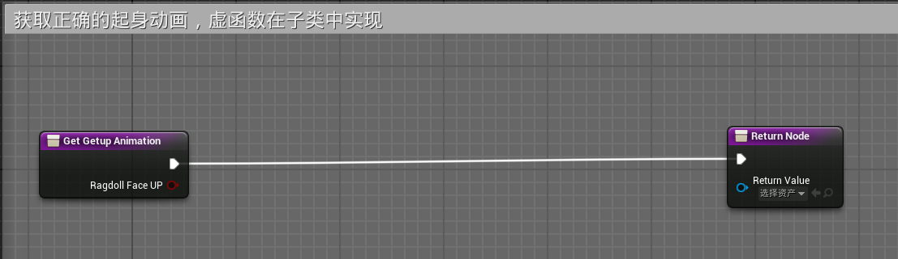
- 创建函数Set Actor Location During Ragdoll
- 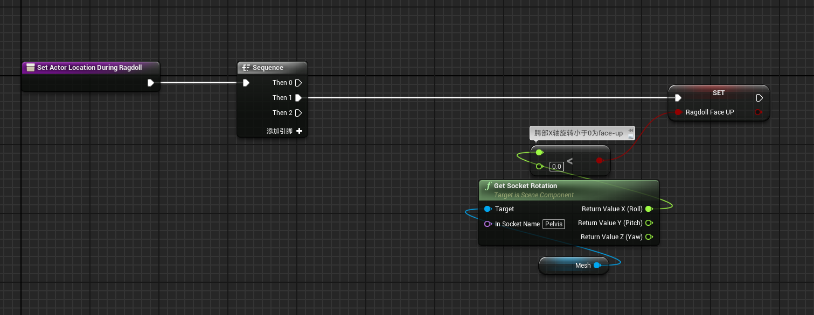
- 创建Ragdoll Update函数调用Set Actor Location During Ragdoll
- 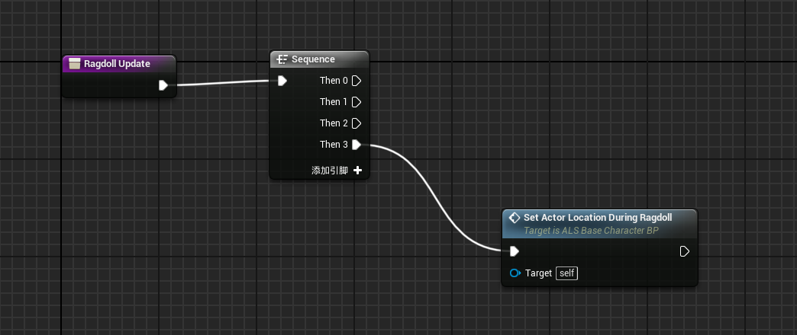
- 在TickGraph中更新
- 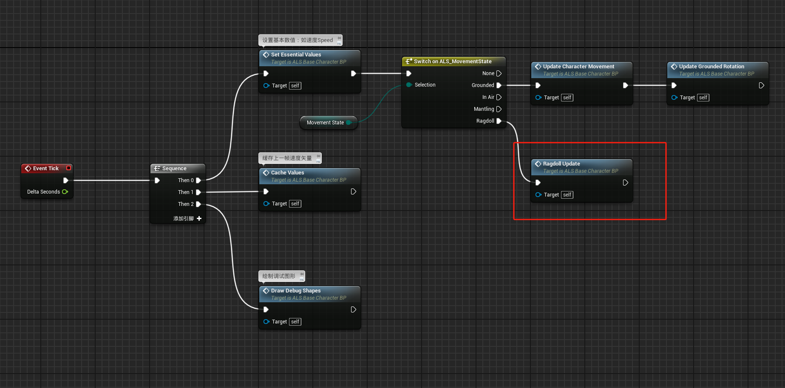
## ALS_AnimMan_CharacterBP
- 在Mesh组件属性中
- 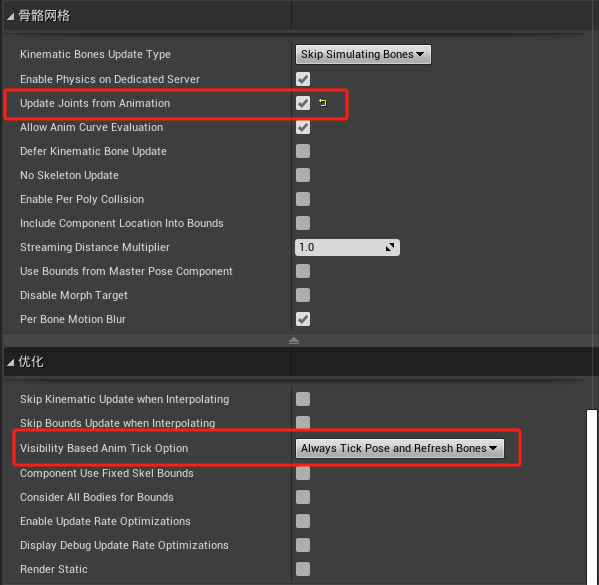
- 第一个选项用于将骨骼动画数据传入对应物理资产图元约束属性，使物理资产可以混合动画
- 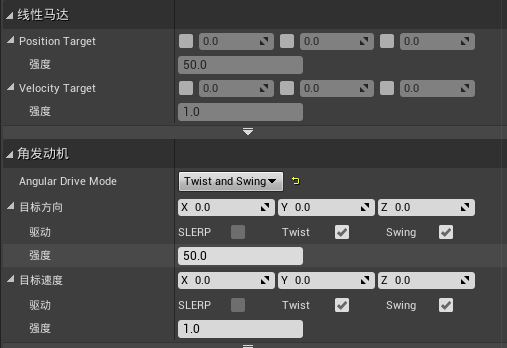
- 第二个选项为无论角色组件是否渲染都固定更新Tick和BoneTransforms
### 事件图表
- 重载函数GetGetUpAnimation，获取正确的起身动画
- 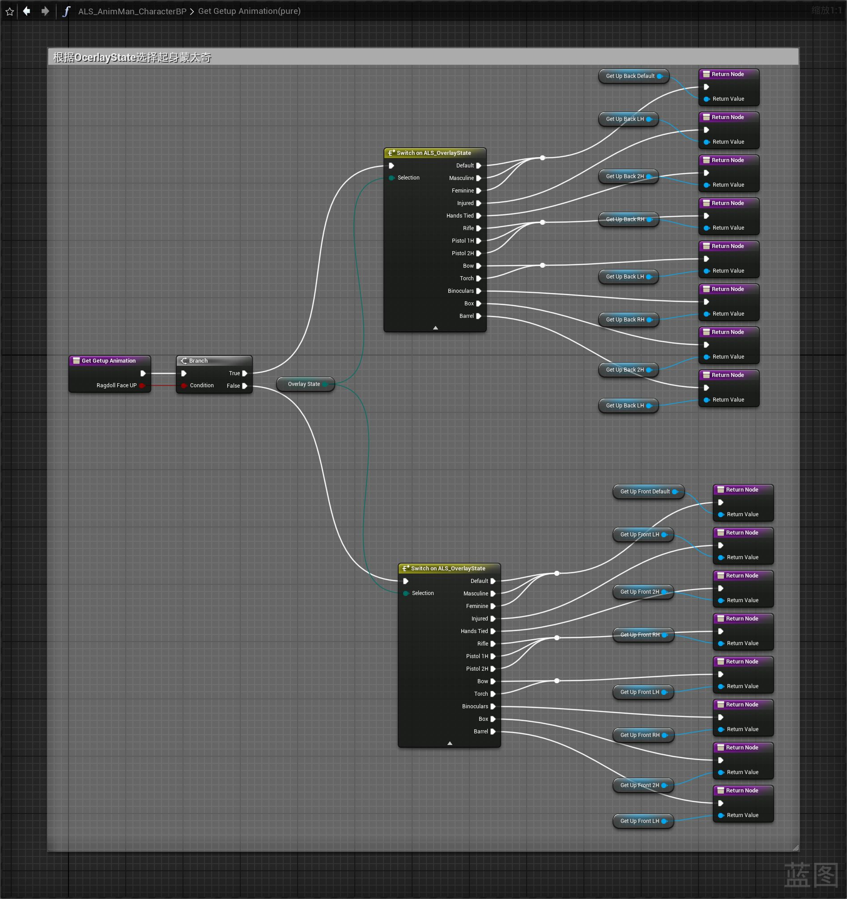
- 更新重载函数GetRollAnimation
- 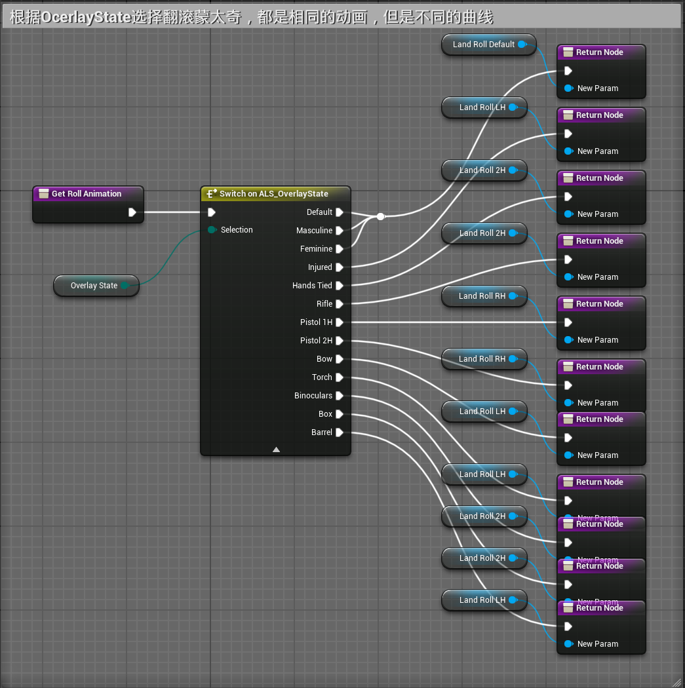