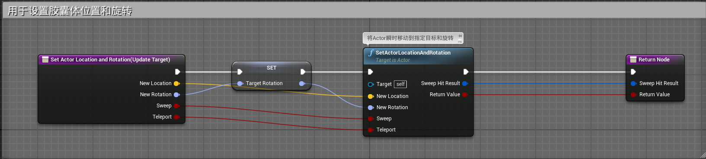
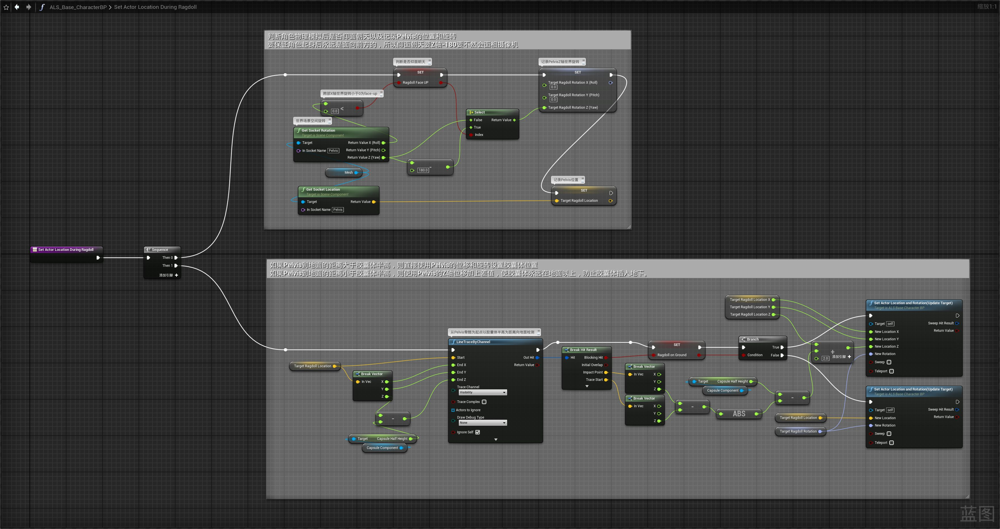
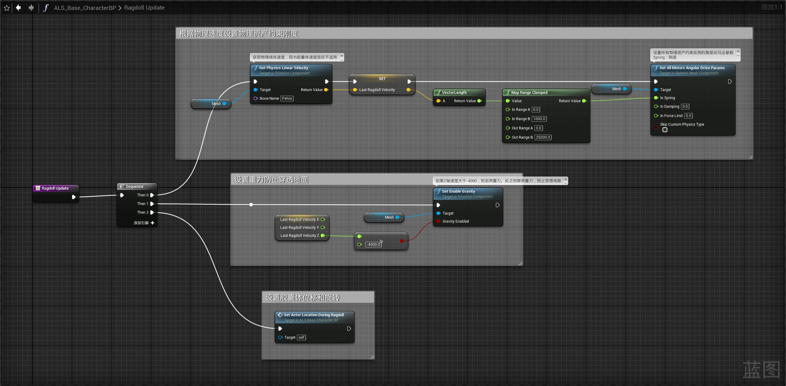
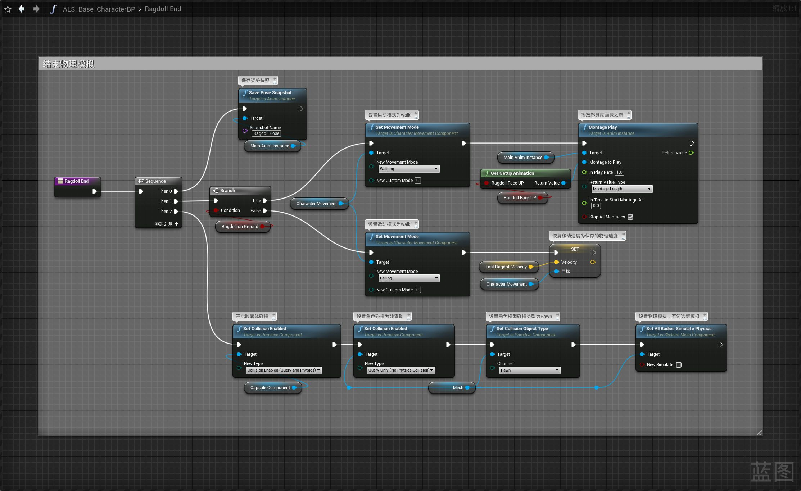
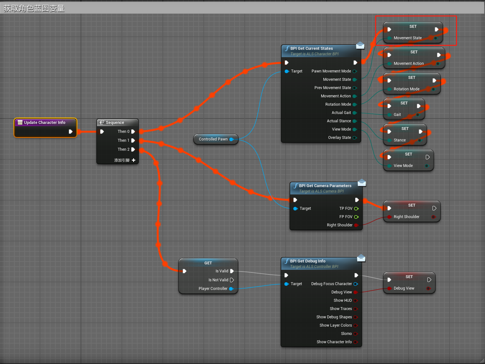
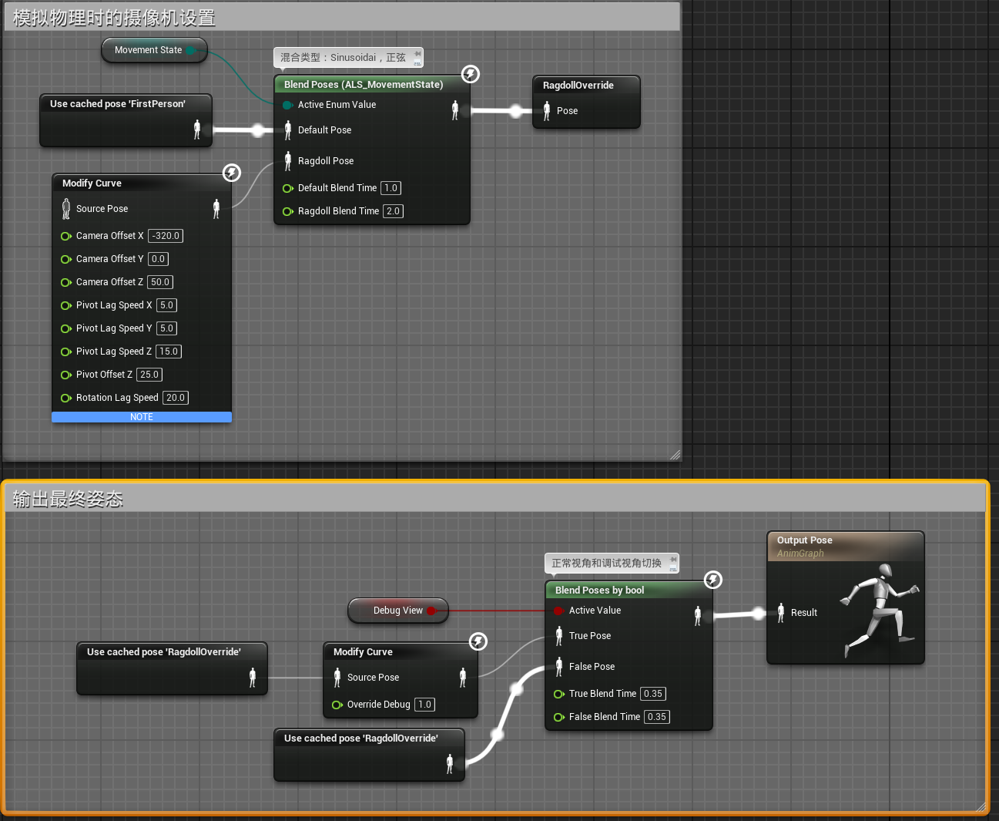

# 胶囊体处理
## 角色蓝图
### ALS_Base_CharacterBP
- 创建函数Set Actor Location And Rotation(Update Target)，用于设置胶囊体位置和旋转
- 
- 更新函数Set Actor Location During Ragdoll
- 
- 更新Ragdoll Update函数
- 
- 更新Ragdoll End函数
- 
# 设置摄像机
## ALS_CameraBehavior_ABP摄像机动画蓝图
### 事件图表
- 更新Update Character Info函数
- 
### 动画图表

- 