# 概述
- 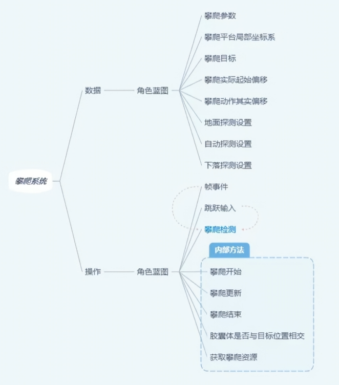
- 
- 攀爬探测
- 
- 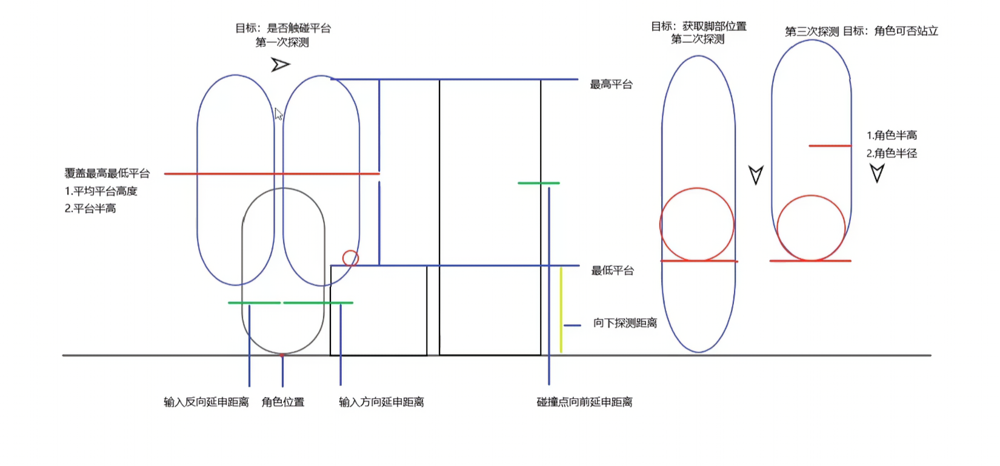
- 第一次检测：判断平台高度是否可攀爬
- 第二次检测：判断是否有可以踩踏的点
- 第三次检测：判断平台是否有足够空间容纳角色
- 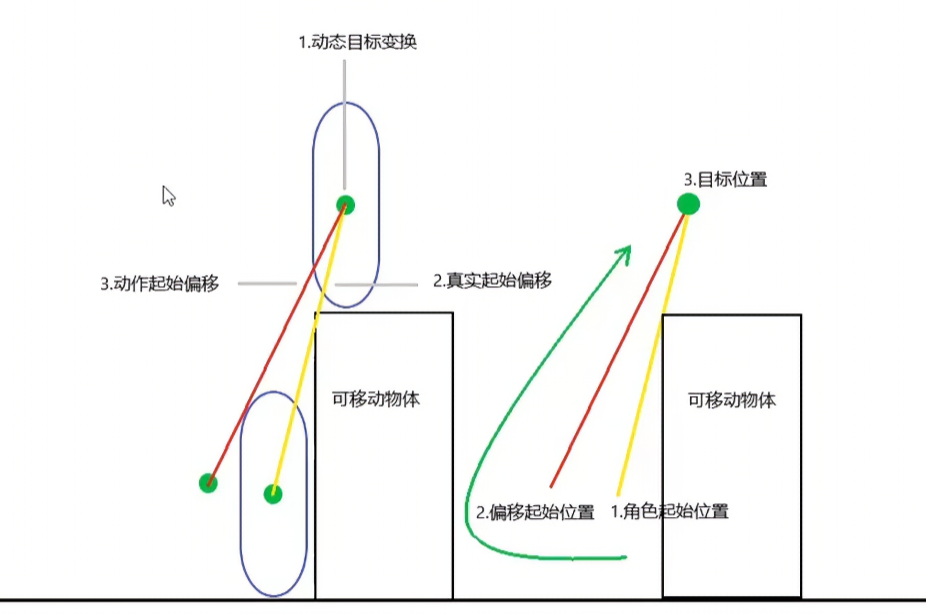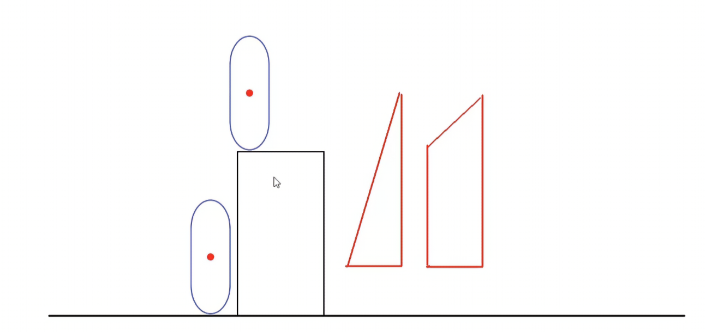
- 在攀爬过程中要先后退，再垂直上升，在横向平移，防止角色和平台穿插
# 角色蓝图
- ALS_Base_CharacterBP
- 创建函数Get Capsule Base Location计算胶囊体基点位置
- 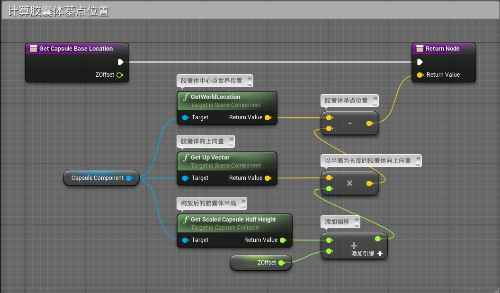
- 创建函数Get Capsule  Location from Base根据胶囊体基点位置计算胶囊体中点位置
- 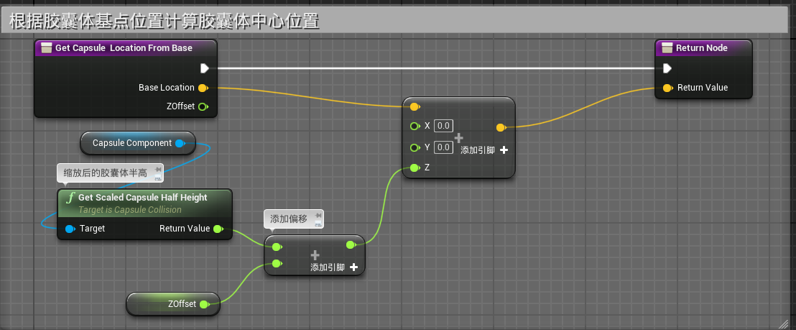
- 创建函数Get Player Movement Input通过Controller的移动方向乘以玩家的输入值获取玩家的移动输入向量
- 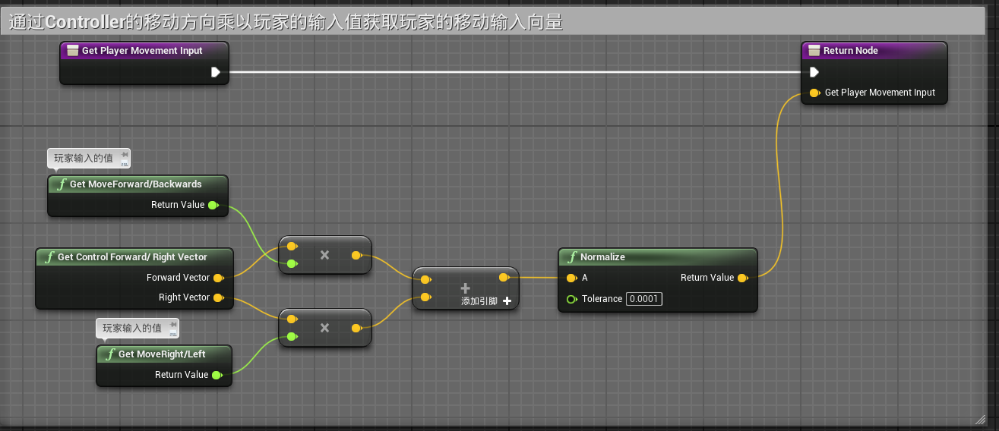
- 创建函数Get Control Forward/ Right Vector通过控制旋转的Yaw轴获取向前和向右的单位向量
- 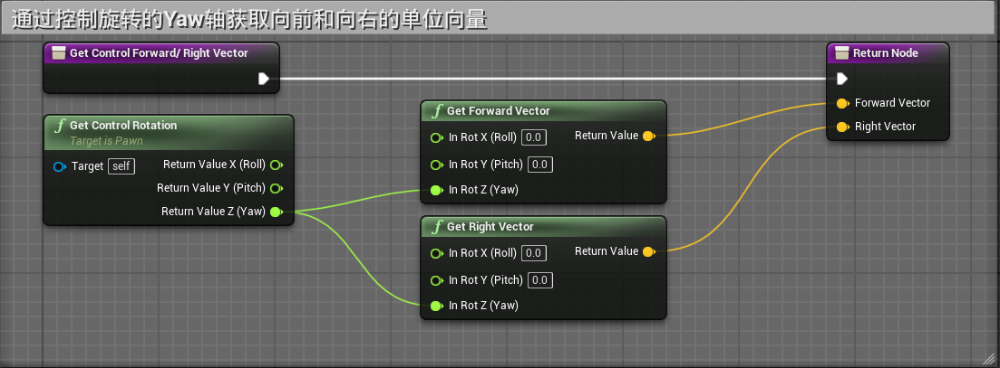
- 创建函数Mantle Check来探测攀爬平台
- 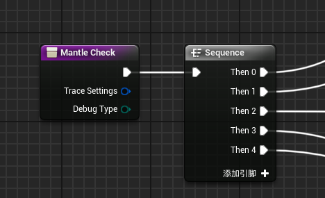
- 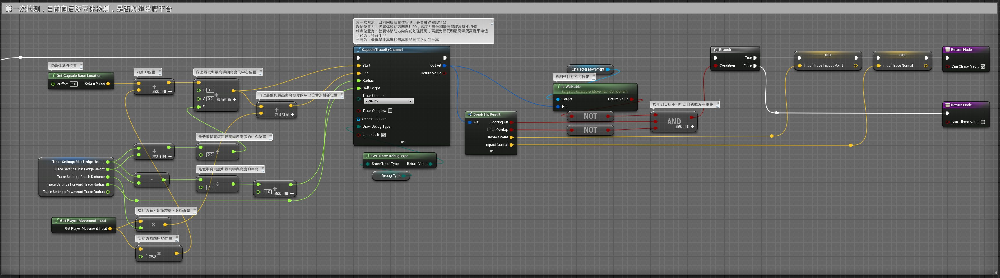
- 其中的Mantle_TraceSettings结构体是攀爬探测设置
- 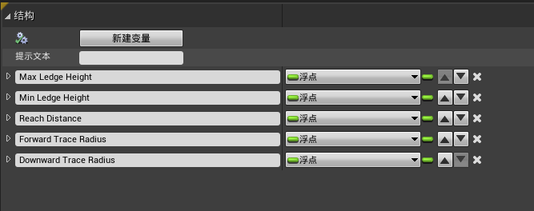
- 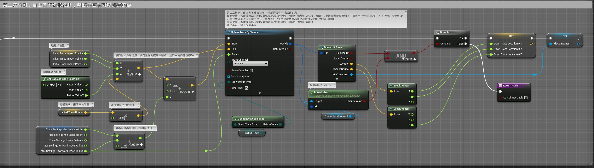
- 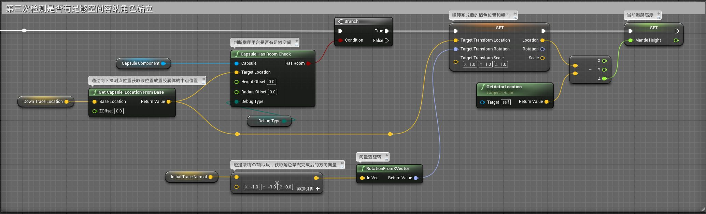
	- 其中Capsule Has Room Check函数
	- 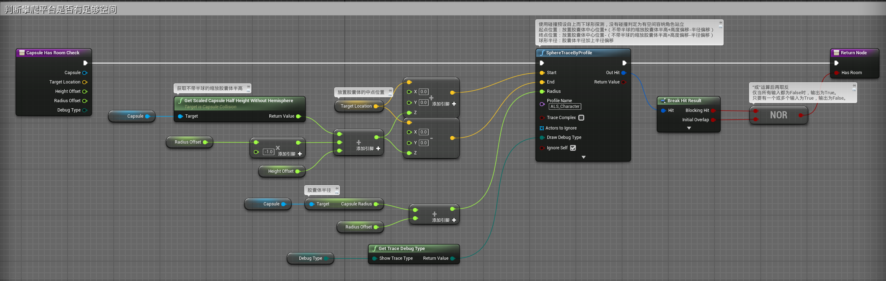
- 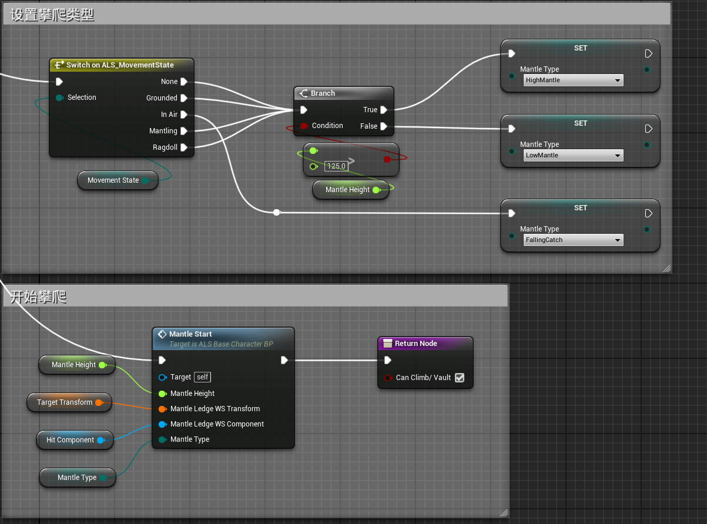
- 其中Mantle Start函数在下章
- 在PlayerInputGraph图表中和Tick事件中调用函数
- 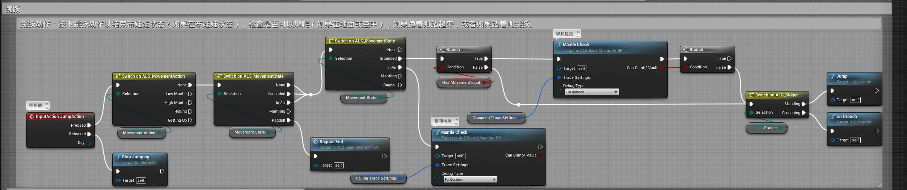
- 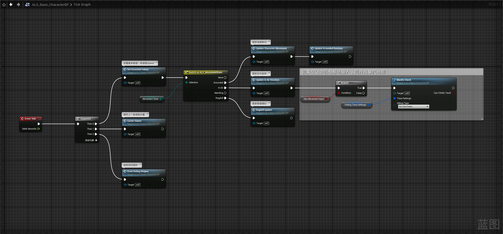
- 其中的GroundedTraceSettins变量为
- 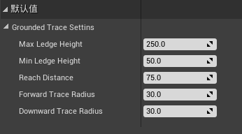
- FallingTraceSettings变量为
- 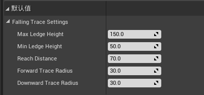