# 概述
- 执行攀爬动画
# 动画资产
- ALS_N_Mantle_1m_LH：攀爬高度1m的右手支撑左手空闲攀爬动画
- ALS_N_Mantle_1m_RH：攀爬高度1m的左手支撑右手空闲攀爬动画
- ALS_N_Mantle_2m：攀爬高度2m的双手支撑攀爬动画
- 以上所有动画均为根动画，但是会勾选强制锁定根骨骼，不勾选启用根运动。便于匹配不同高度的攀爬平台。
# 结构体
- Mantle_Asset
- 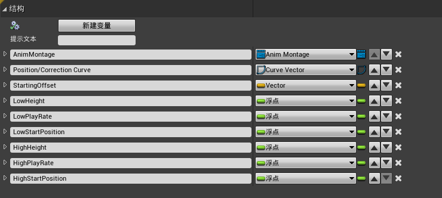
	- AnimMontage：要播放的攀爬动画蒙太奇
	- Position/Correction Curve：因为勾选强制锁定根骨骼，所以根动画由程序控制，此向量曲线是根据时间调整根骨骼动画位置的
		- 有Mantle_1m和Mantle_2m两条曲线，Mantle_1m曲线为
		- 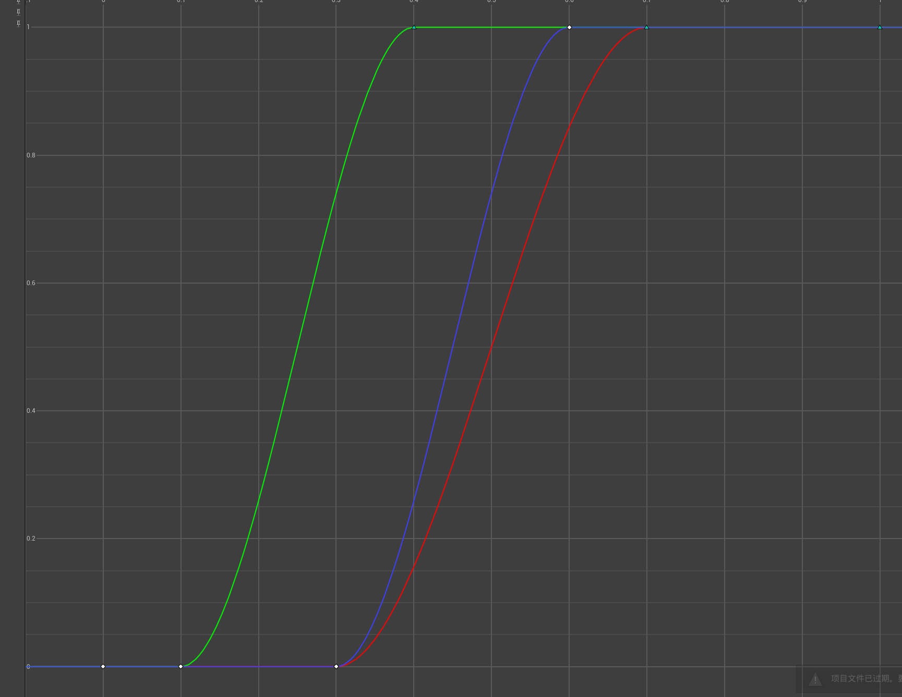
		- 红色曲线X轴：程序根动画混合时机，为0.3s-0.7s，也就是说程序根动画的事件是0.3s：0.7s之间
		- 绿色曲线Y轴：程序根动画水平运动曲线混合时机
		- 蓝色曲线Z轴：程序根动画垂直运动曲线混合时机
		- 由曲线可以看到，先混合水平运动，再混合垂直运动。以防止穿模。
		- 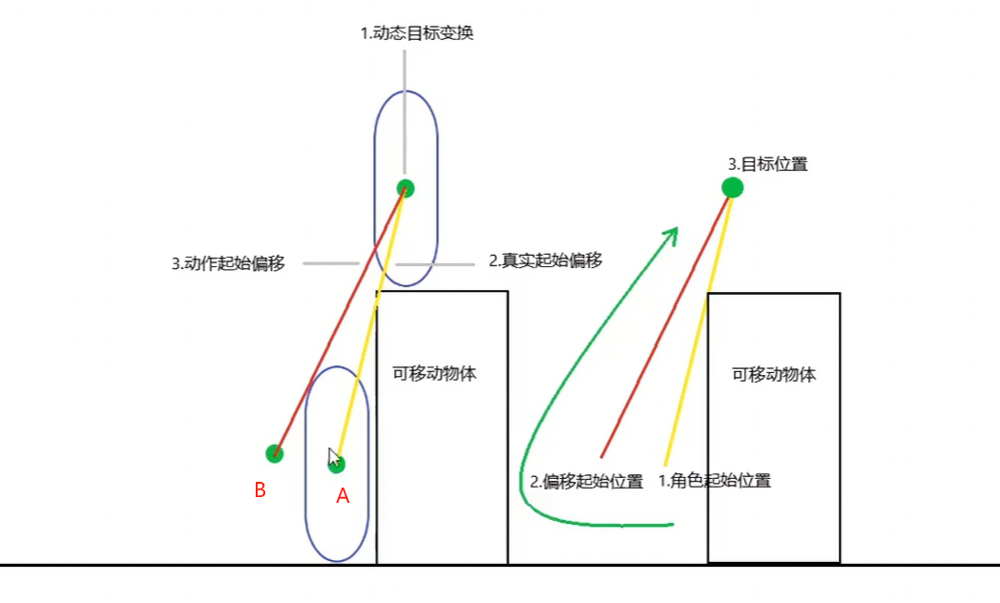
		- A点为角色起始位置，B点为偏移起始位置。由A线向B线混合
	- StartingOffset：角色起始位置偏移
	- LowHeight：最低攀爬高度
	- LowPlayRate：最低攀爬高度动画播放速率
	- LowStartPosition：最低攀爬动画开始时间，低攀爬动画往往不需要攀爬动画开始时的蓄力动作部分，会将动画截断播放
	- HighHeight：最高攀爬高度
	- HighPlayRate：最高攀爬高度动画播放速率
	- HighStartPosition：最高攀爬动画开始时间
- Mantle_Params，由Mantle_Asset根据不同的高度映射而来。Mantle_Asset是静态的，Mantle_Params是动态的。
- 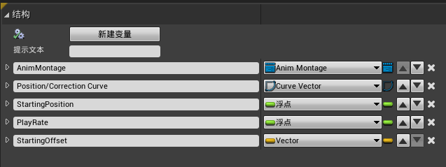
# 角色蓝图
- ALS_Base_CharacterBP
## 事件图表
- 创建函数Get Mantle Asset，根据攀爬类型获取资。该函数在父角色蓝图中创建在子蓝图中覆盖
- 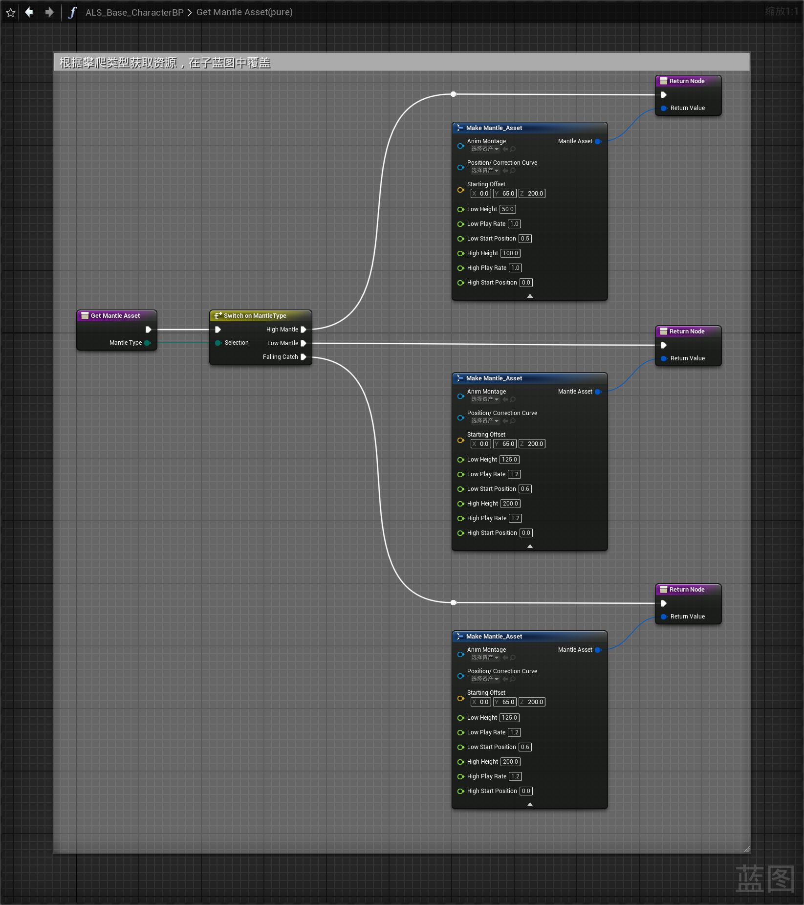
- 在子蓝图ALS_AnimMan_CharacterBP中重载
- 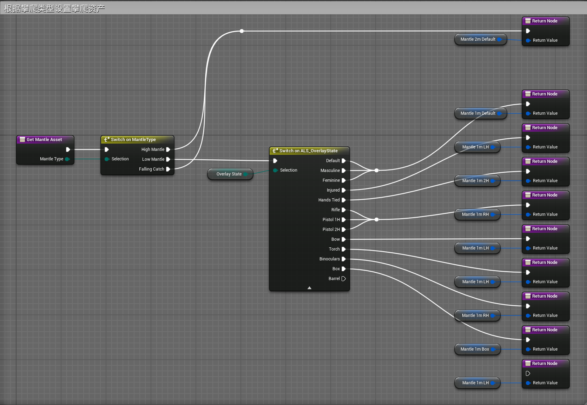
- 创建Mantle Start函数
- 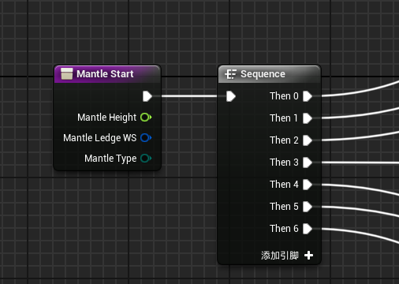
- 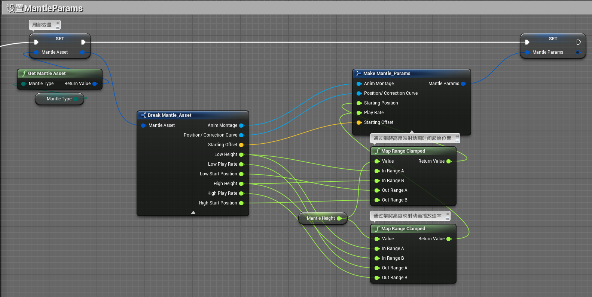
- 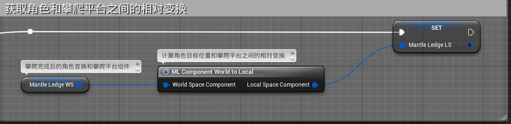
- 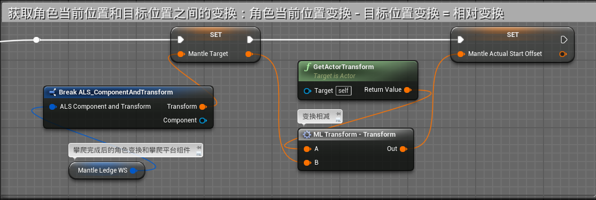
- 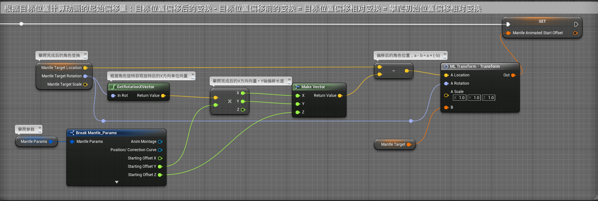
- 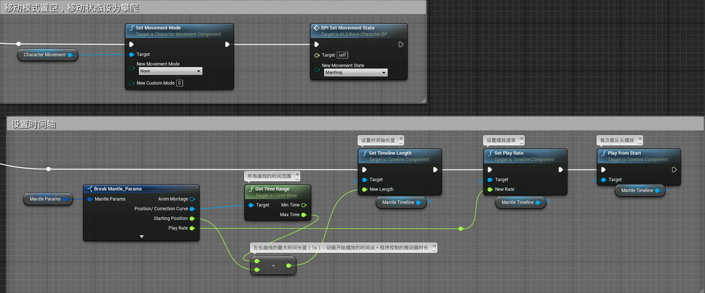
- 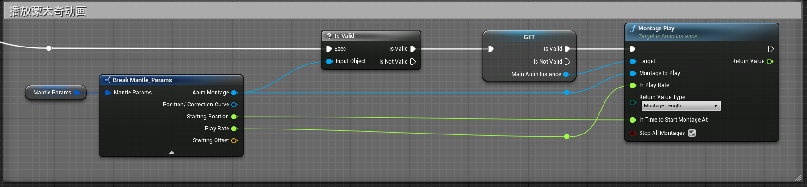
- 其中的攀爬时间轴MantleTimeline在事件蓝图中创建，用于更新攀爬和结束攀爬
- 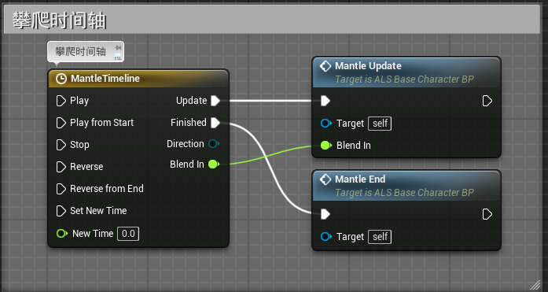
- 时间轴曲线，起始点为（0,0），末尾点为（0.2,1）。0：0.2s用于攀爬动画开始时混合动画
- 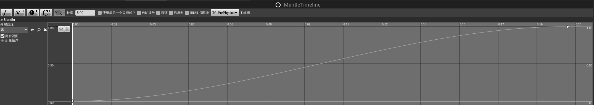
- 其中的函数Mantle Update和Mantle End在下章讲解