# AI
## 虚幻引擎中AI的结构
- AI
	- 黑板：指令数据
	- 行为树：指令树
	- 控制器：控制角色
	- 角色：行为
## 创建简单的AI系统
### AIController
- 创建AI控制器，继承自AIController
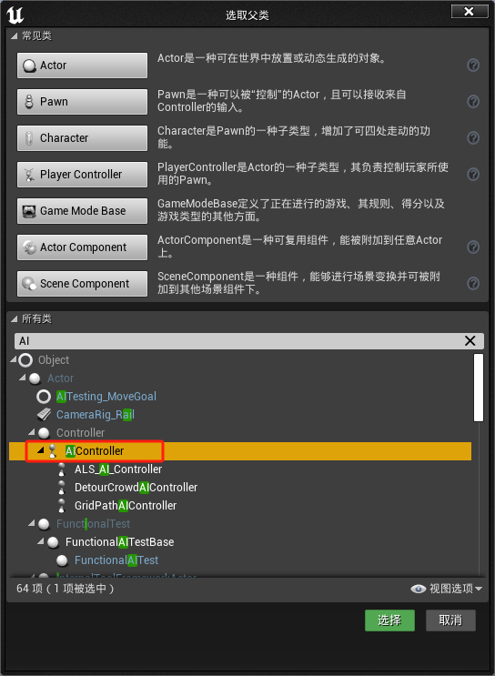
- 将一个角色蓝图拖入场景中形成角色实例，选中该角色在细节面板中找到Pawn卷展栏，可以设置它的控制器为我们的AIController，这个角色就被AI控制了
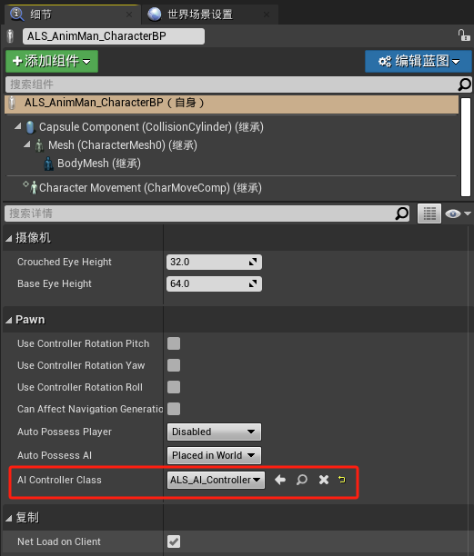

### 行为树
- 创建行为树
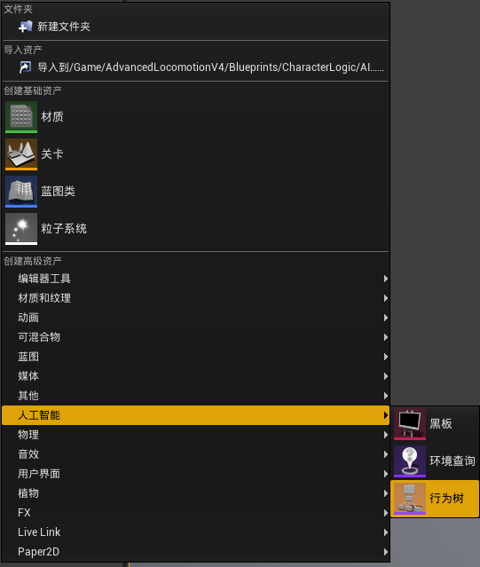
### 黑板
- 创建黑板
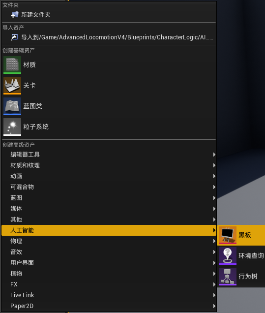
## 关联数据
- 在行为树中关联黑板
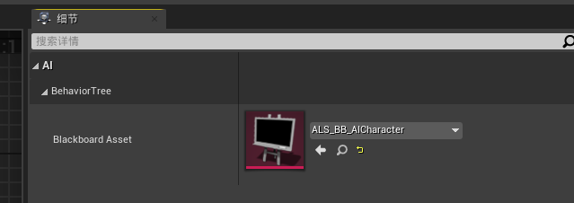
- 在AI控制器的事件蓝图中关联行为树
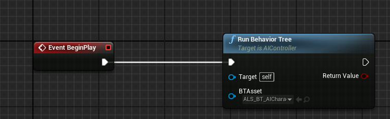
- 关联流程：场景中的角色关联AIcontroller，AIController运行行为树，行为树关联黑板数据。

## 在角色蓝图中创建自定义事件
- 创建自定义事件ChangeMesh
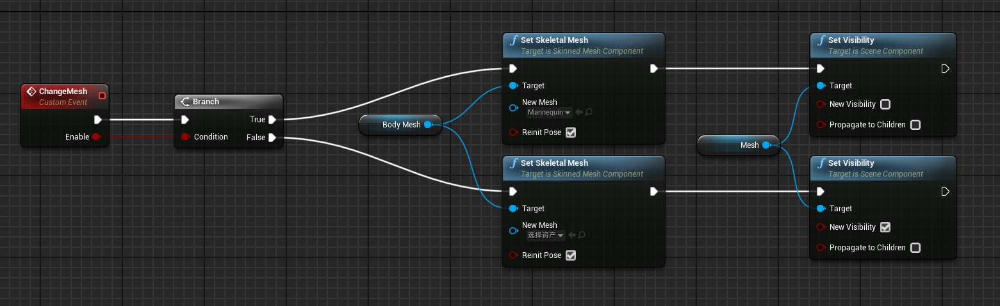
### 在行为树中创建任务
- 创建任务ALS_BTTask_ChangeMesh
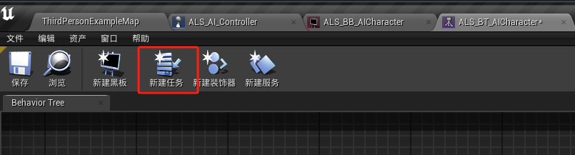
- 在任务中重载函数接收执行AI
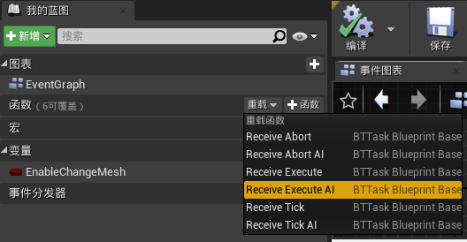
- 函数重载为调用角色自定义事件ChangeMesh
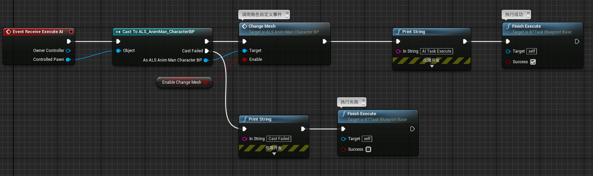
### 制作行为树
- 行为树自上而下，自左而右执行
- 在行为树中，Composites是流程控制。Task是执行任务的叶节点
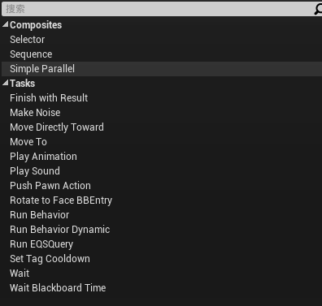
- 行为树中调用任务
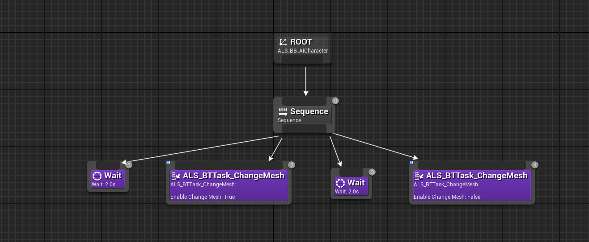
# UI
# 创建UI界面
## 创建UI组件
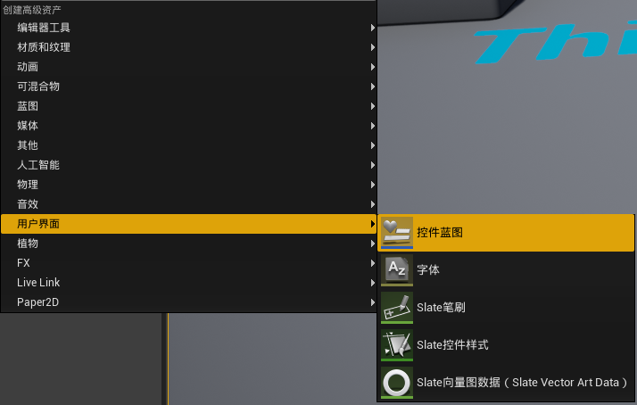
## 编辑UI组件

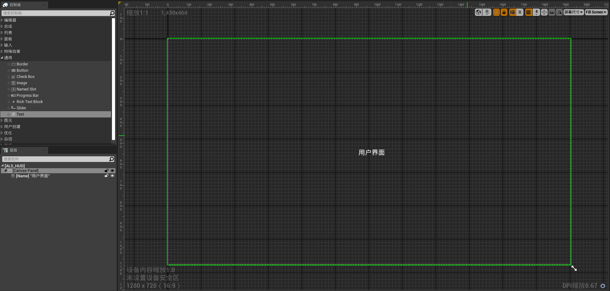
# 调用UI界面
- 调用UI界面是在ALS_Player_Controller控制器中
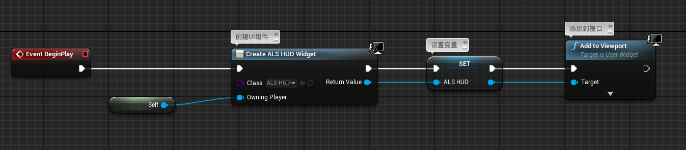
# 效果
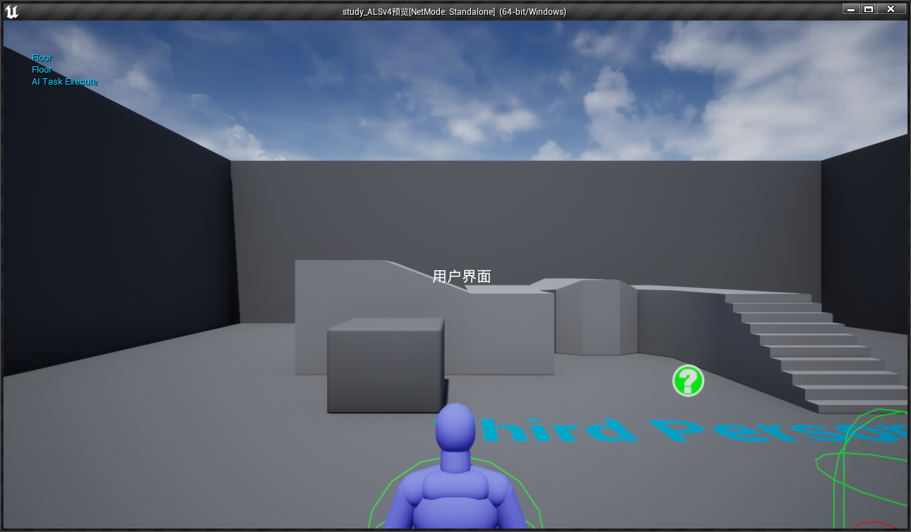