# 步态切换
- 步态（Gait）分为三种：行走(Walk)，奔跑(Run)和冲刺(Sprint)
## 步态的按键切换
- 在父角色蓝图ALS_Base_CharacterBP新增一个Gait变量，类型是ALS_Gait
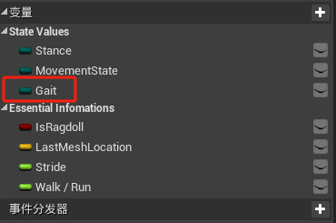
- 新建一张图表名称为PlayerInputGraph，将有关输入的逻辑放入其中，包含移动，查看，条约，蹲伏
- 编写步态切换的逻辑
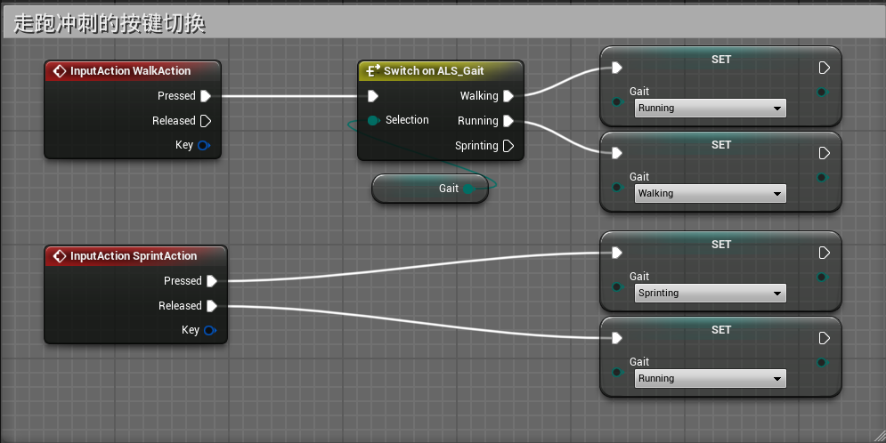
## 步态的数据更新
- 新建一张TickGraph图表，用于放Tick逻辑
- 创建两个函数
	- UpdateDynamicMovementSettings函数，输入参数为ALS_Gait类型的变量AllowedGait
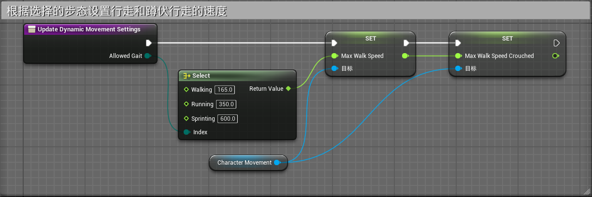
	- UpdateCharacterMovement函数
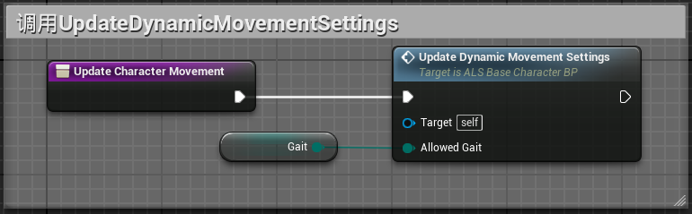
	- 在Tick图表中执行在地面时更新角色移动
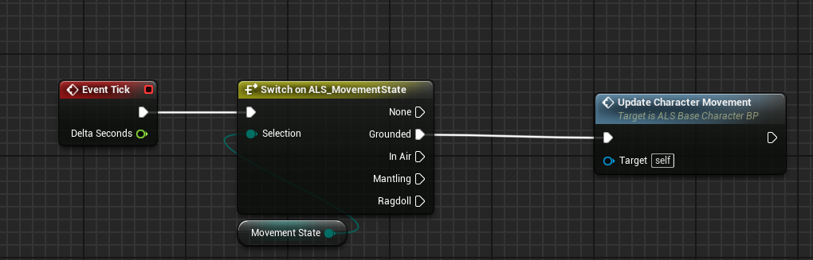
# 数据驱动
- Struct结构体是一系列的变量的集合，DataTable数据表是一系列结构体的集合，数据表可被CSV文件或Json文件导入导出，通过配表的方式来实现功能。
- 其中MovementSettings包含以下属性
- 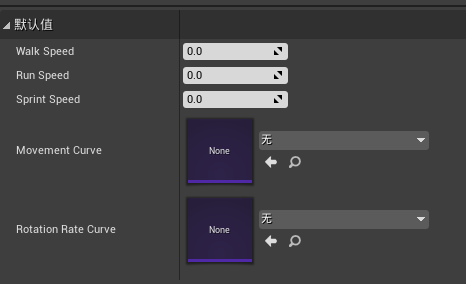
- MovementSettings_Stance
- 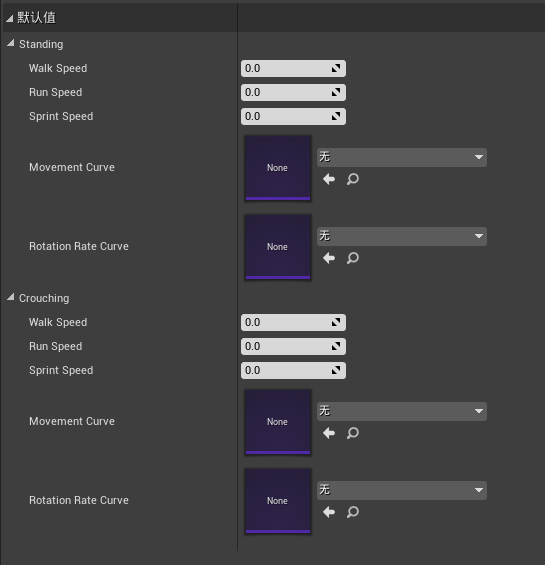
- MovementSettings_State
- 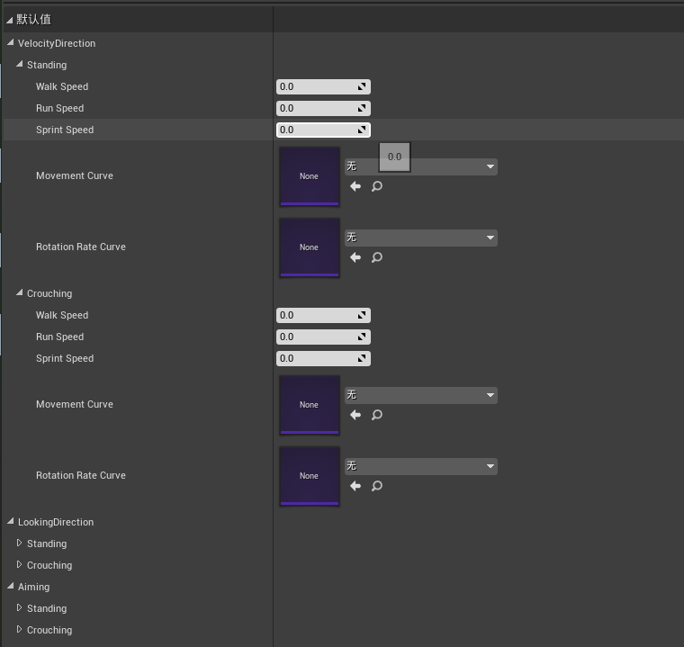
- 总结：这是一个嵌套结构，MovementSettings_State嵌套 MovementSettings_Stance嵌套MovementSettings。
	- MovementSettings是移动速度和曲线属性
	- MovementSettings_Stance是站立和蹲伏（Stance）下的MovementSettings
	- MovementSettings_State是速度方向，观察方向和瞄准方向（RotationMode）下的MovementSettings_Stance
## 读取数据表信息
- 在父角色蓝图中创建一个变量MovementModle,类型为DataTableRowHandle数据表行句柄，设置数据表格为MovementModleTable，行名称为Normal
- 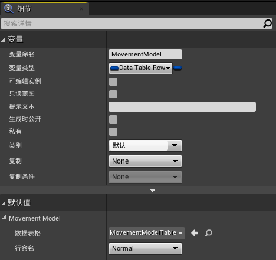
- 创建一个方法SetMovementModle用于处理数据表格
- 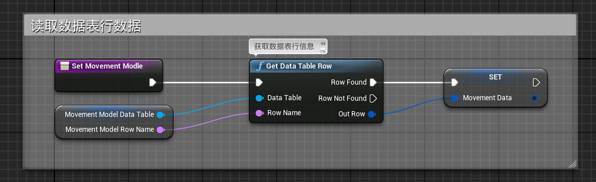
- 创建一个方法OnBeginPlay保存BeginPlay逻辑，并执行SetMovementModle函数
- 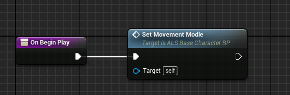
- 在事件图表中执行begin play
- 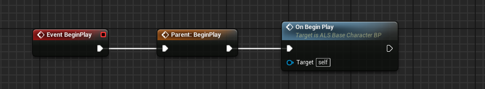
## 使用数据表信息
- 在角色蓝图中创建变量RotationMode，类型为ALS_RotaionMode
- 创建一个函数GetTargetMovementSettings，输出参数为MovementSettings
- 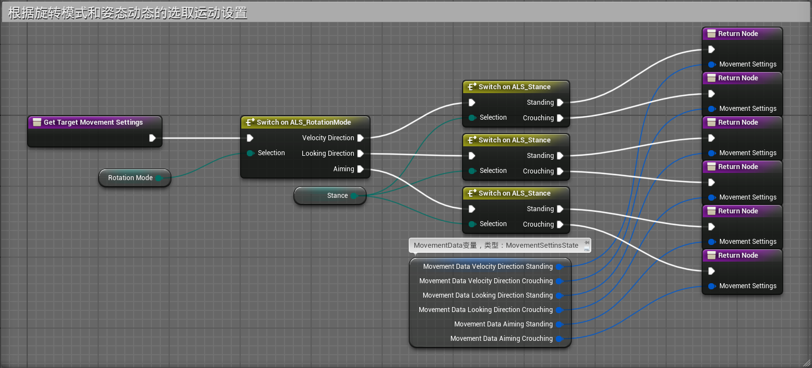
- 更新UpdateDynamicMovementSettings函数
- 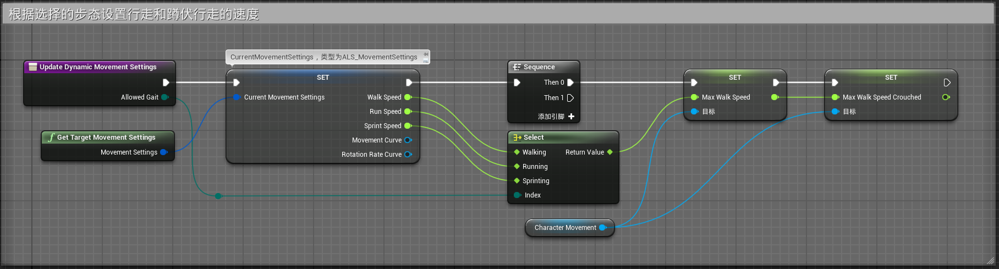