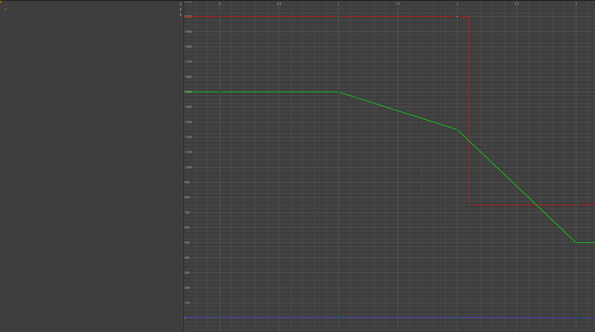
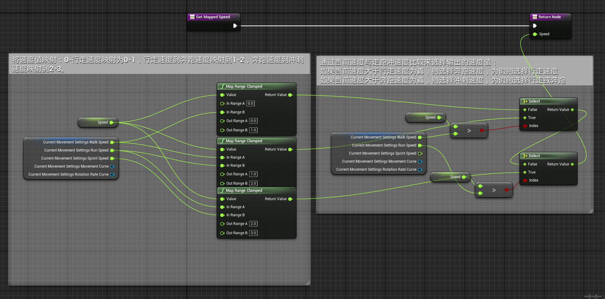
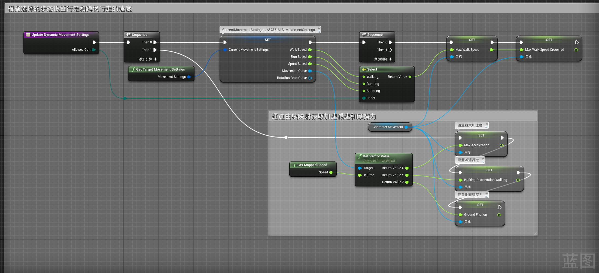

# 概述
在高级运动系统中，加速度，减速度和摩擦力是使用曲线映射的方式来实现的

其中：
- 横向坐标0， 1， 2， 3为速度轴对应静止，行走，奔跑和冲刺
- 
- 纵向坐标值为加速度，减速度和摩擦力的值
- 红色的X曲线为加速度，绿色的Y曲线为减速度，蓝色的Z曲线为摩擦力
- 在使用的时候通过横坐标的速度值来获取纵坐标的数值使用
# 映射函数
- Get Mapped Speed

# 事件蓝图函数
- Update Dynamic Movement Settings
