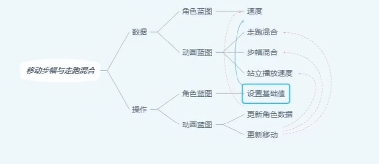
# 概述
- 本章内容主要是为了计算步幅混合（StrideBlend），走跑混合（WalkRunBlend）和混合空间播放速度（StandingPlayRate）作为参数传递给动画蓝图中的混合空间
- 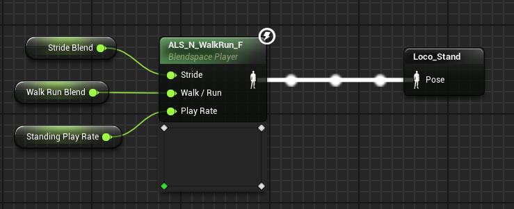
# 角色蓝图
- 速度（Speed）变量通过Velocity计算出来的
- 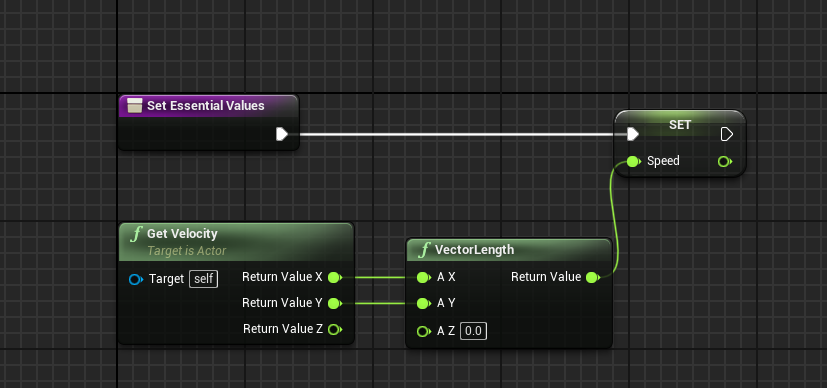
- 然后通过继承的接口函数在角色蓝图和动画蓝图之间传递变量
- 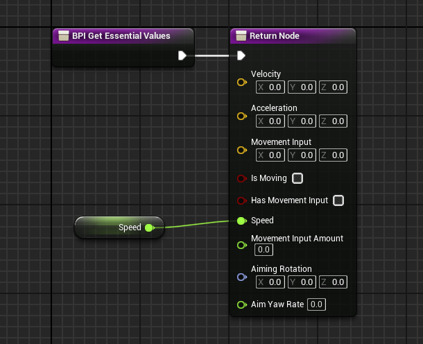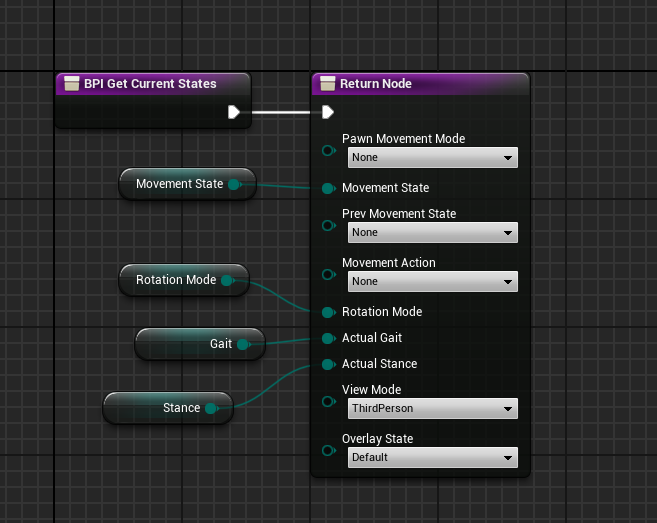
# 动画蓝图
## 动画蓝图事件蓝图
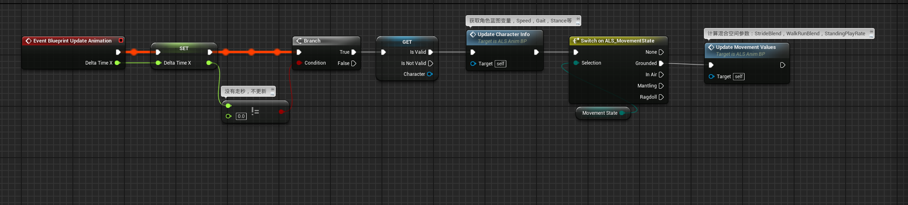
- 其中UpdateCharacterInfo函数用于通过接口函数（不必继承借口，继承借口用于实现函数）获取角色蓝图变量，Speed，Gait，Stance等
- 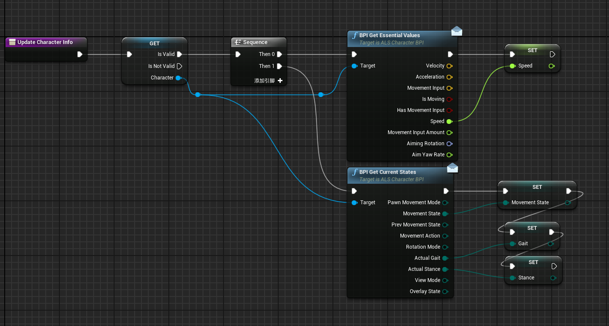
- UpdateMovementValues函数用于计算混合空间参数：StrideBlend，WalkRunBlend，StandingPlayRate
- 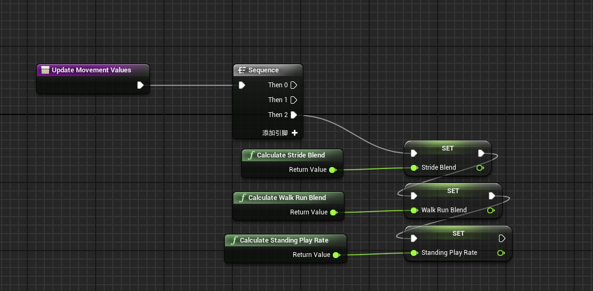
- 其中CalculateStrideBlend函数用于计算步幅的混合，通过速度作为横坐标来获取浮点值曲线的纵坐标数值进行插值计算
- 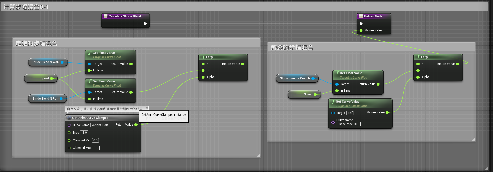
- 其中的宏GetAnimCurveClamped为：
- 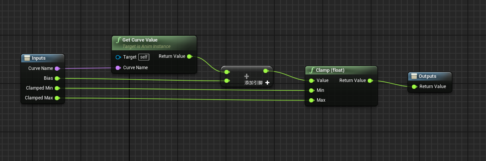
- CalculateWalkRunBlend函数同意步态获取获取走跑混合，行走为0，跑冲为1
- 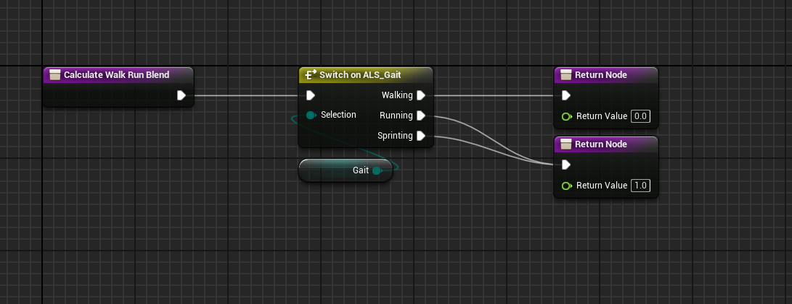
- CalculateStandingPlayRate函数计算混合空间播放频率，其中AnimatedWalkSpeed为150，AnimatedWRunSpeed为350，AnimatedSprintSpeed为600.通过与速度相除来获取播放频率
- 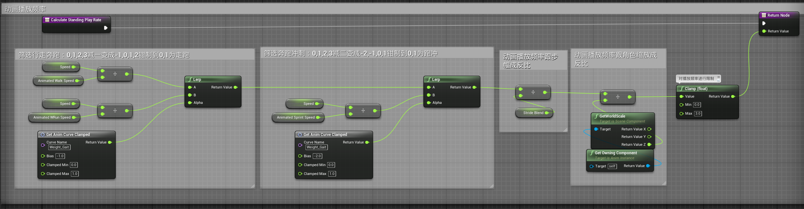
## 动画蓝图动画图表
- 应用计算出来的三个数值
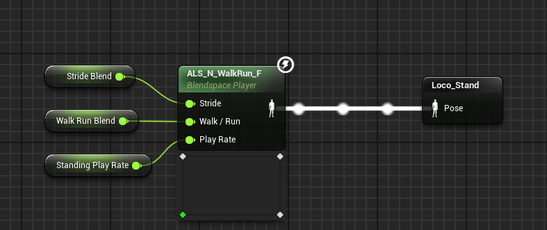
- 混合空间勾选
- 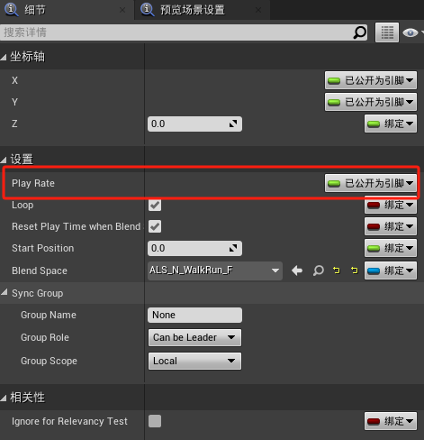