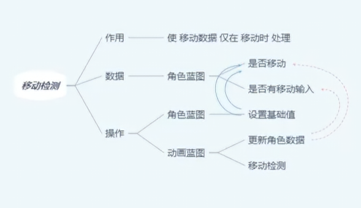
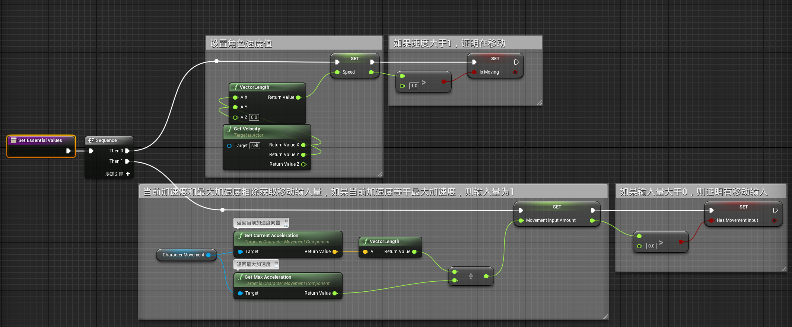
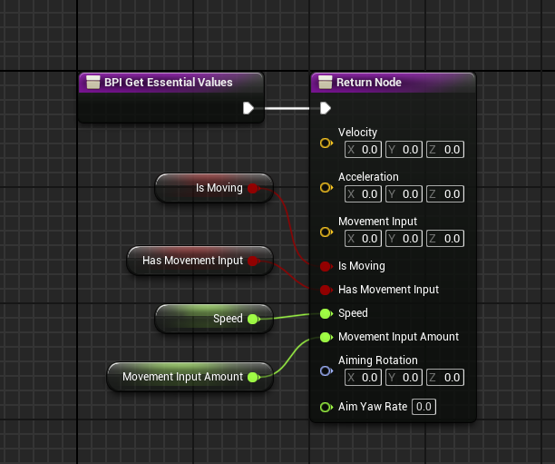
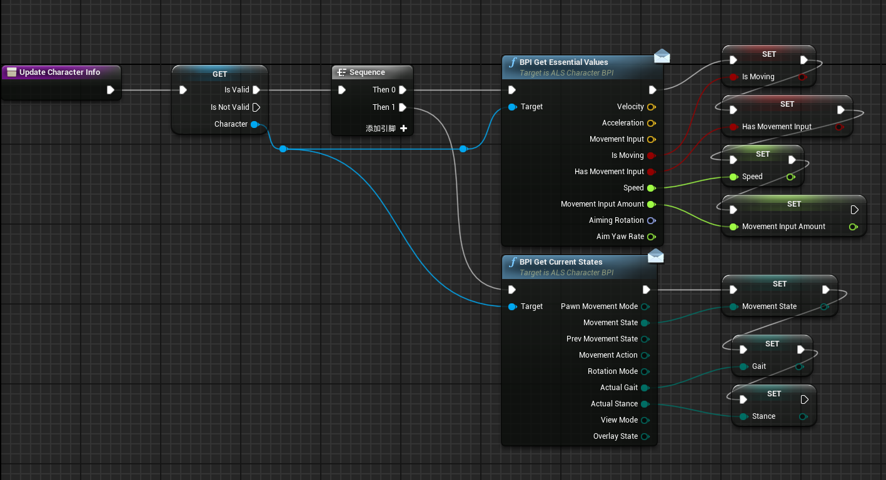
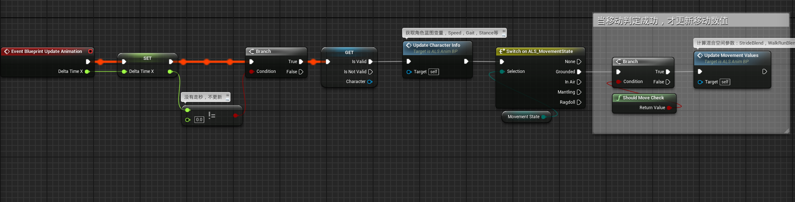
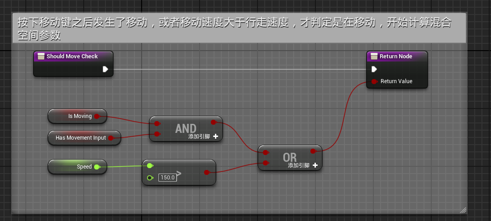

# 概述
检测角色是否在移动，主要考虑两方面
- 角色速度是否大于1
- 角色是否有移动输入
# 角色蓝图
- Set Essential Values函数
- 
- 继承的接口函数BPI Get Essential Values
- 
# 动画蓝图
## 事件图表
- Update Character Info函数，通过接口函数获取角色蓝图变量
- 
- 事件蓝图更新动画
- 
- 其中ShouldMoveCheck函数
- 