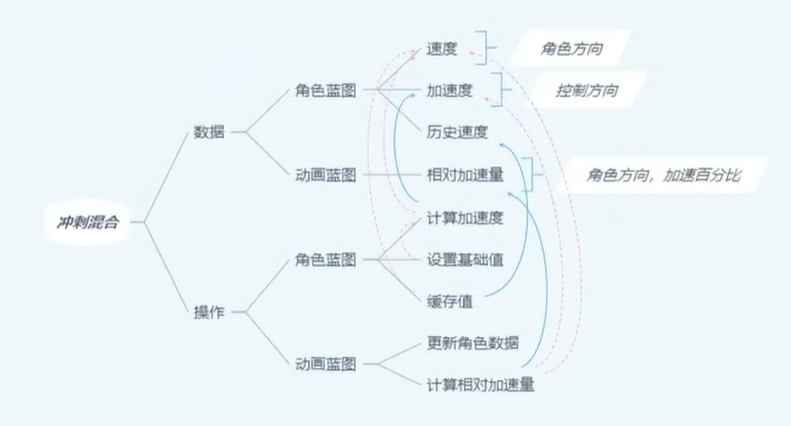
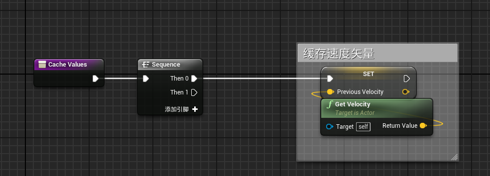
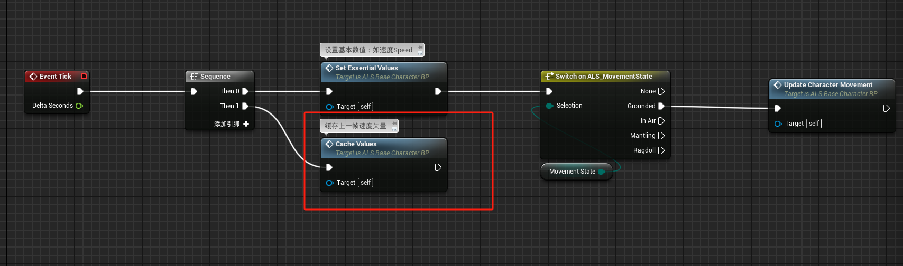
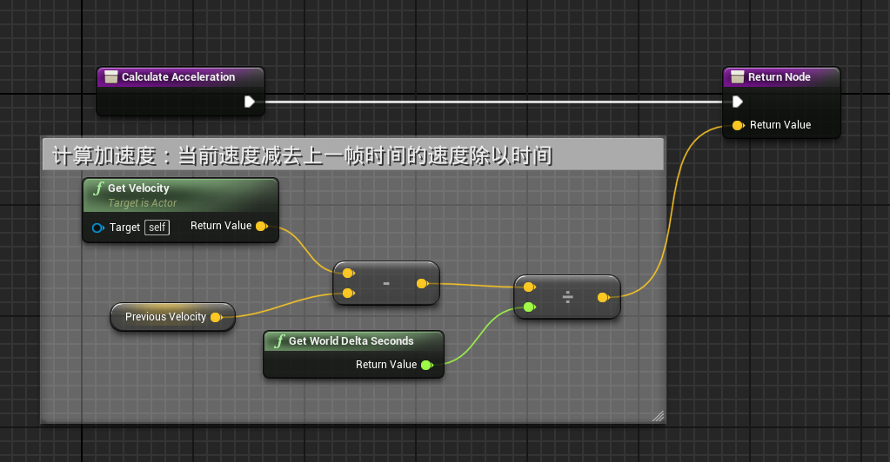
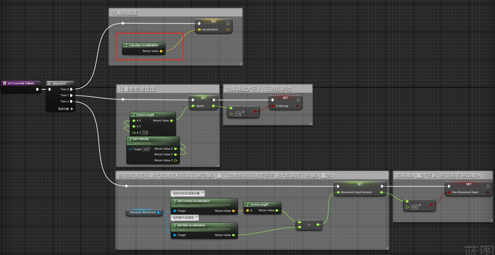
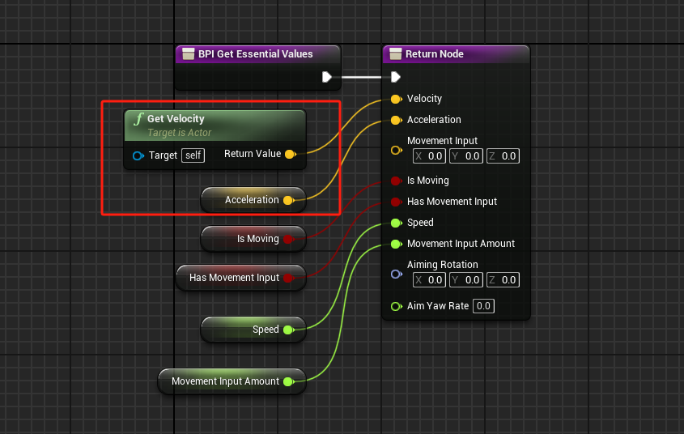
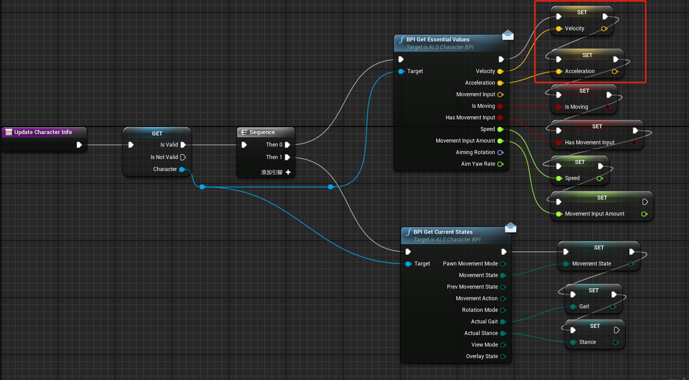
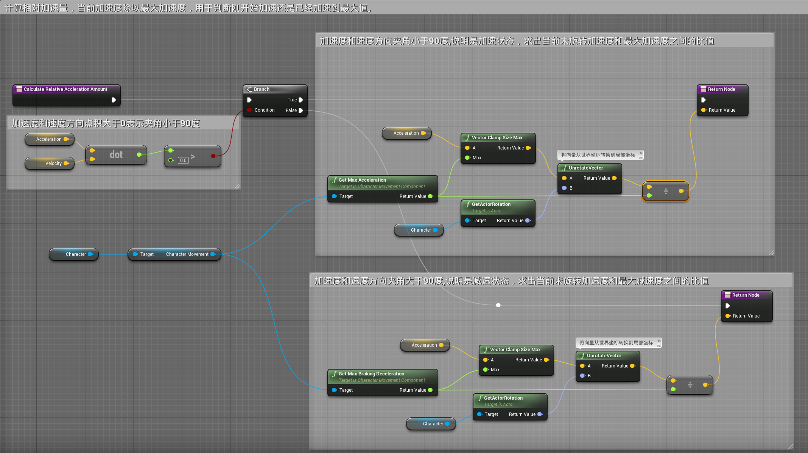
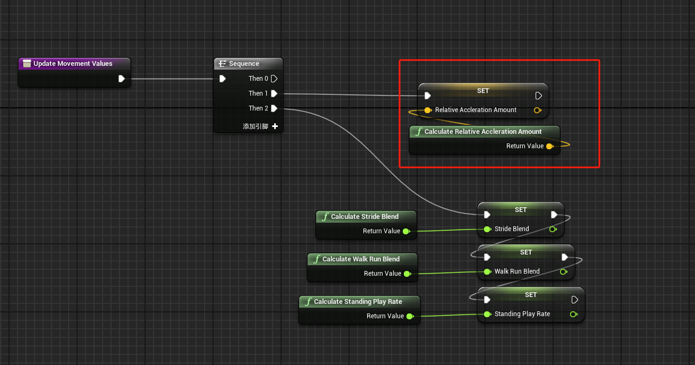
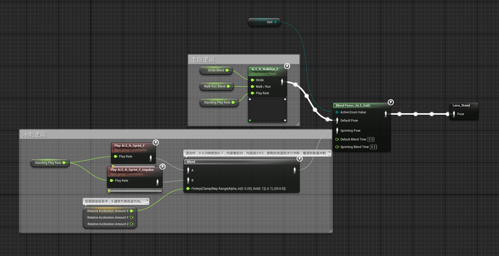

# 概述
- 通过计算真实加速度来做冲刺混合
# 角色蓝图
- 创建函数CacheValues来缓存上一帧的速度值
- 
- 并在Tick中调用函数
- 
- 创建函数Calculate Acceleration来计算真实加速度，算法为：当前速度减去上一帧时间的 **速度变化量** 除以 **时间变化量**
- 
## 加速度
是描述物体速度变化快慢的物理量，表示速度随时间的变化率。以下是其关键点：

### 定义
加速度是速度对时间的变化率，公式为：
$$
\vec{a} = \frac{\Delta \vec{v}}{\Delta t} 
$$

其中：
- $\vec{a}$ 为加速度
- $\Delta \vec{v}$ 为速度变化量
- $\Delta t$ 为时间变化量

### 单位
国际单位制中，加速度的单位是米每二次方秒（m/s²）。

### 分类
1. **平均加速度**：一段时间内速度变化的平均值。
2. **瞬时加速度**：某一时刻速度变化的瞬时值。

### 物理意义
- **正加速度**：速度增加。
- **负加速度（减速度）**：速度减小。
- **零加速度**：速度不变。

### 影响因素
- **力**：根据牛顿第二定律$\vec{F} = m\vec{a}$，力是产生加速度的原因。
- **质量**：相同力下，质量越大，加速度越小。

### 应用
- **运动学**：分析物体运动状态。
- **工程**：设计车辆、飞机等交通工具。
- **物理学**：研究天体运动、粒子加速等。

### 示例
- 自由落体：重力加速度约为 \( 9.8 \, \text{m/s}^2 \)。
- 汽车加速：从静止加速到100 km/h，加速度约为 \( 2.78 \, \text{m/s}^2 \)。

总结：加速度是速度变化率的度量，广泛应用于物理学和工程领域。

- 并在Set Essential Values函数中调用
- 
- 在接口函数中将数值传出
- 
# 动画蓝图
## 事件图表
- 在函数Update Character Info通过接口函数接收角色蓝图数值
- 
- CalculateRelativeAcclerationAmount计算加速量函数，返回的是一个向量。
- 本函数计算相对加速量，用来判断每个方向的加速度大小，用 当前加速度向量 除以 最大加速度浮点数 ，获取每个分量的加速度和多大加速度之间的比值。
- X轴为前后（-1为后最大加速度，1为前最大加速度，0为不加速），Y轴为左右（-1为左最大加速度，1为右最大加速度，0为不加速）。
- 
- 在Update Movement Values函数中调用
- 
# 动画蓝图
- 冲刺动画分为两个
	- ALS_N_Sprint_F：普通冲刺动画
	- ALS_N_Sprint_F_Impulse：冲击冲刺动画，身体前倾，冲击力更强
- 所需要的效果就是：
	- 冲刺开始的时候快速进入ALS_N_Sprint_F_Impulse动画，然后慢速过渡到ALS_N_Sprint_F
