# **Actor**

- 所有可以被放入关卡（level）的对象都是Actor

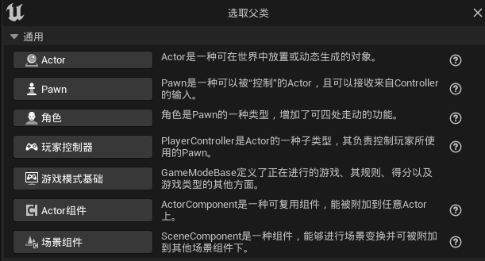

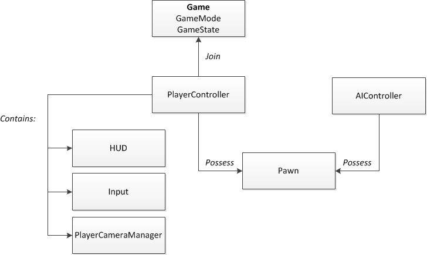

- Actor-->子类Pawn-->子类Character

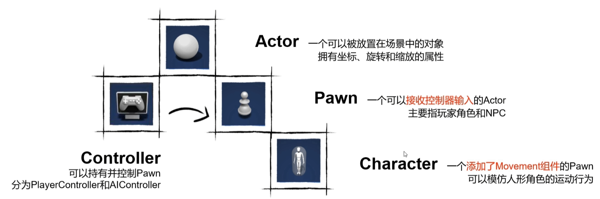

# **蓝图类的继承**

- 当子类蓝图调用父类蓝图的事件时，若果要直接调用父类的事件而不是重写，需要右键事件，将调用添加到父函数。

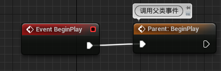

- 当子类蓝图调用父类蓝图的函数时，使用子类蓝图函数的重载功能。

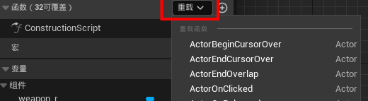

- 子类蓝图无法继承父类蓝图的宏

- 编写思路

- 怎样触发该功能（事件）

- 执行该功能的条件（条件）

- 执行功能是什么（动作）

- 蓝图节点类型

- 事件节点

- 功能节点

- 变量节点

- 引用节点

# **节点介绍**

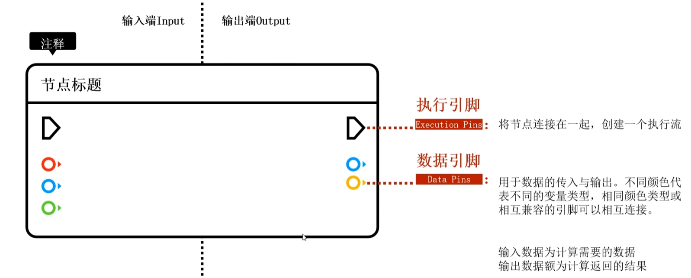

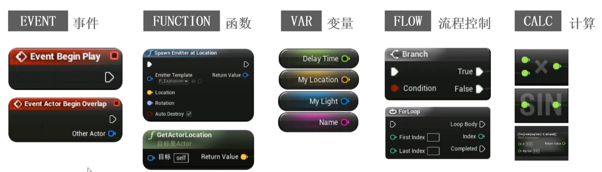

# **事件节点**

- Event BeginPlay：开始游戏立即触发，游戏开始之后新诞生Actor，诞生时执行一次。

- Event End Play：Actor结束（销毁）时触发（角色死亡时触发）

- Event Tick：事件Tick，当项目开始运行的时候，实时执行（游戏进程中每帧调用的简单事件。按照间隔时间Delta Second不断执行）

- Event Actor Begin Overlap：Actor开始重叠事件（发生重叠的Actor双方必须打开Generate Overlap Event选项）

- Event Actor Begin Overlap：Actor结束重叠事件（发生重叠的Actor双方必须打开Generate Overlap Event选项）

- Event Hit：发生碰撞一瞬间（发生碰撞的Actor之一打开了Generate Hit Event即可）

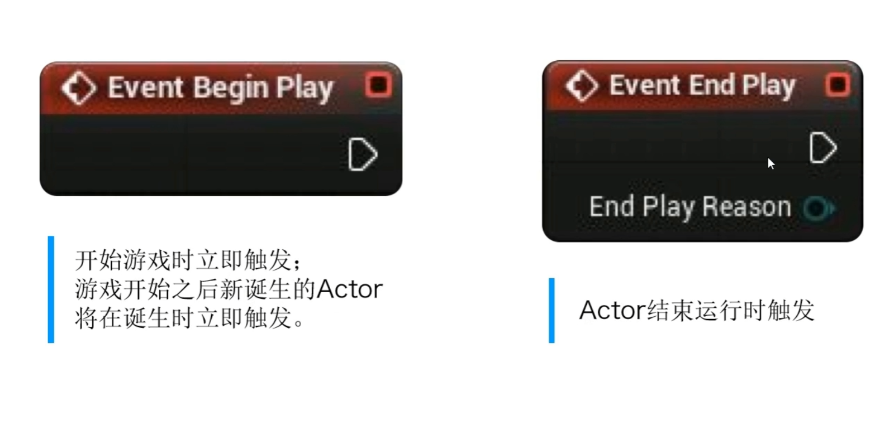

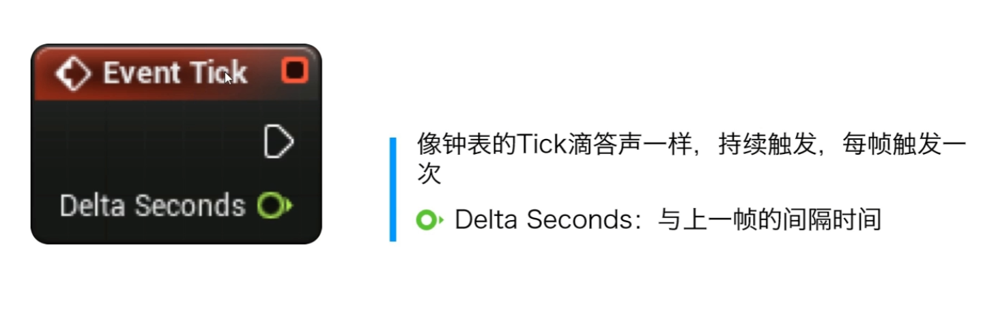

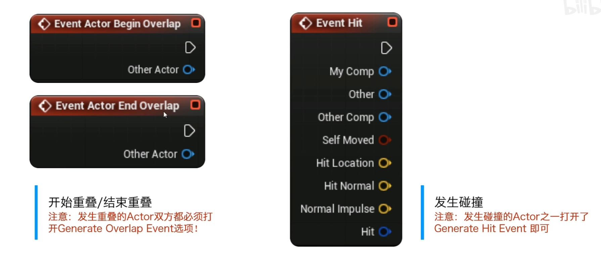

# **变量**

- **变量数据类型：**

| 变量类型 | 表示 | 
| -- | -- |
| 布尔（Boolean） | true或false值（ | 
| 字节（Byte） | 0与255之间的整数值（ | 
| 整数（Integer） | −2,147,483,648与2,147,483,647之间的整数值（ | 
| 64位整数（Integer64） | −9,223,372,036,854,775,808与9,223,372,036,854,775,807之间的整数值（ | 
| 浮点（Float） | 例如0.0553、101.2887、-78.322等带小数的数值（ | 
| 命名（Name） | 用于在游戏中识别事物的一段文本。 | 
| 字符串（String） | 例如  | 
| 文本（Text） | 向用户显示的文本。针对要本地化的文本使用此类型。 | 
| 矢量（Vector） | 三个数字组成的集（X、Y、Z）。此类型对3D坐标和RGB颜色数据很有用。 | 
| 旋转体（Rotator） | 定义3D空间中旋转的一组数字。 | 
| 变换（Transform） | 结合平移（3D位置）、旋转和缩放的数据集。 | 
| 对象（Object） | 如光源、Actor、静态网格体、摄像机和SoundCue等蓝图对象。 | 

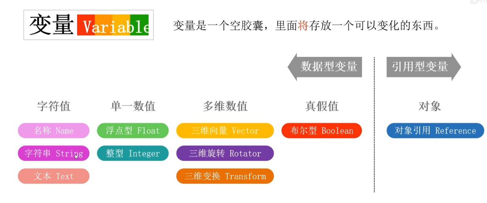

## 布尔类型：
- bool，true或false值（bool）。

## **数值类型：**

- Byte：字节，0-255之间的整数值

- Integer：整数，-2147483648到2147483647之间的整数

- Integer64: 64位整数，−9,223,372,036,854,775,808与				 	9,223,372,036,854,775,807之间的整数值（long）。

- float：浮点，表示小数。

- 数值计算：

- add：加(+)

- subtra：减(-)

- Mutiply：乘(*)

- Divide：除(/)

- sqrt：square root，平方根

- %：模除，数值一除以数值二得到的余数(%), 5 % 2=1,（5 除以 2 商 2 余 1）

- Increment Int：增量整数，++(等同于Python中+=1)

- Decrement Int：减量整数，--(等同于Python中-=1)

- 比较运算

- Equal：等于`（==）`

- Not Equal：不等于（！=）

- Greater：大于（>）

- Greater Equal ：大于等于(>=)

- Less ：小于(<)

- Less Equal：小于等于(<=)

## **文本类型**

- Name：命名，用于在游戏中识别事物的一段文本。

- String：字符串，例如 Hello World 之类的一组字母数字字符（string）。

- Text：文本，向用户显示的大段文本。针对要本地化的文本使用此类型。

- 文本操作：

- Append：字符串附加，注意，是String--Append。

- Equal Exactly（String）：字符串是否相等（===）

- Not Equal Exactly（String）：字符串是否不相等（!==）

## **向量类型**

- Vector：向量，三个数字组成的集（X、Y、Z）。此类型对3D坐标和RGB颜色数据很有用。

- 向量运算

- add：向量相加

- Multiply：向量数乘

- DotProduct：向量点乘

- CrossProduct：向量叉乘

- Distance： 两点距离

- Vector Length：向量的模

- Normal：向量规格化(归一化)

## **旋转体类型**

- Rotator，定义3D空间中旋转的一组数字（X：Roll，Y：Pich，Z：Yaw）。

- Roll：风车旋转，Pitch：鞠躬，Yaw：灯塔旋转灯。

## **变换类型**

- **Transform，**

- 平移、旋转和缩放三种变换，九个数值。

# 流程控制

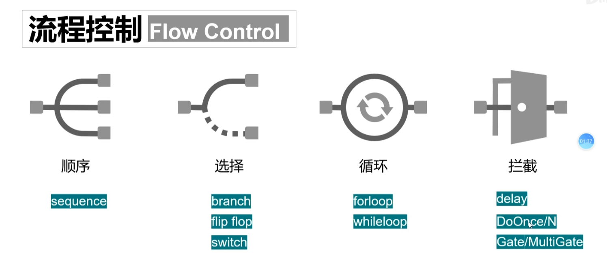

## **分支节点**

- Branch，用于判定条件是否满足，如果满足，则执行True输出节点的逻辑，反之，则执行False输出节点的逻辑。

- 

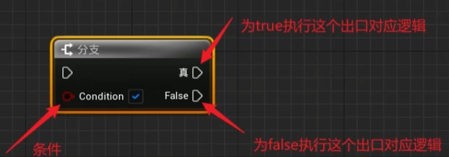

## **序列节点**

- Sequence，作用是讲一个很长的顺序执行蓝图划分成段，便于管理。注意，序列节点是单线程的，分段会根据引脚（pin）顺序执行。

- 

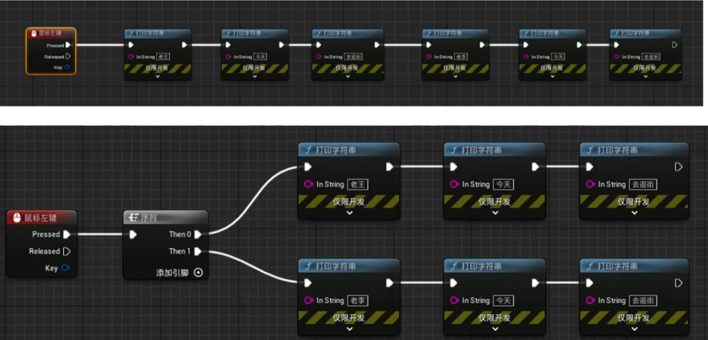

## 循环节点

- For Loop 节点，执行指定次数功能的节点，需要传入循环开始值和结束值。

- For Loop With Break，没有执行Break时跟For Loop 节点一样，执行Break，循环终止。

- 

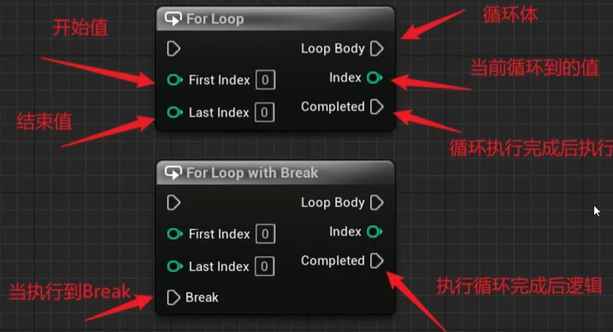

- 范例：事件开始播放--进入循环（0-10）--当索引大于7时Break，当索引小于7时--打印索引--打印“Hello”--循环结束后打印“done”。

- 

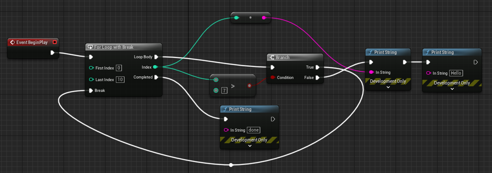

- **While循环节点**

- While Loop，只要满足循环条件，一直执行循环。

- 

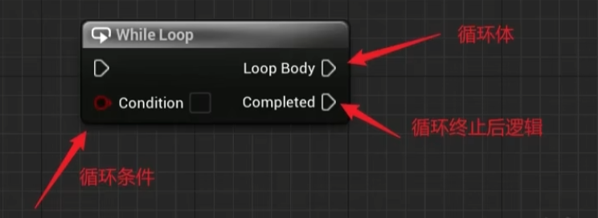

- 范例：事件开始播放--While循环，以LIly的年龄小于等于18为条件（age变量初始值为1），打印字符串拼接f“Lily is {age} years old”--age变量++（+=1）

- 

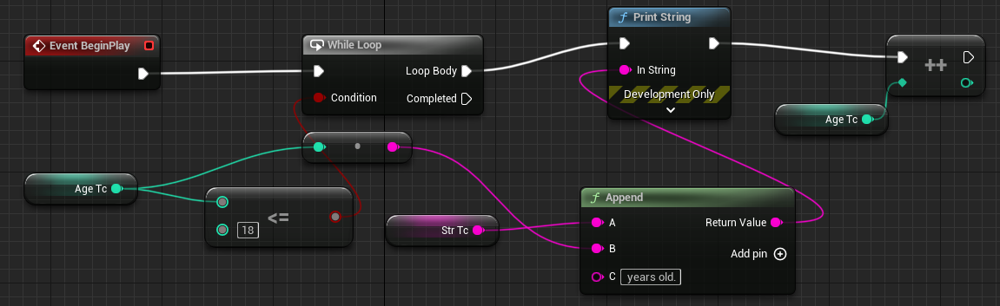

## **Do N节点和Do Once 节点**

- Do N节点，当执行到第N次时，功能停止执行，要想再次执行，需要执行一次Reset。

- 

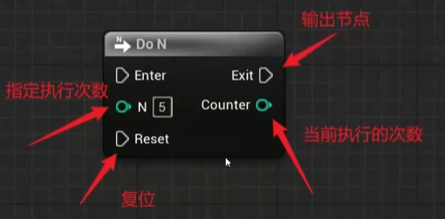

- 范例：每次点击鼠标左键，会依次打印12345，完成后不在打印，除非点击右键重置计数。

- 

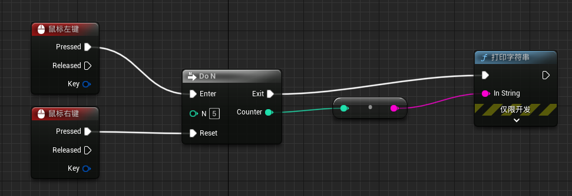

- Do Once 节点，只执行一次，想要再次执行需执行reset

- 如果Start Closed勾选，只有先执行reset，之后才能在执行节点

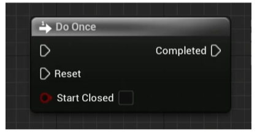

## **Flip Flop节点**

- 又称翻转节点，可以输出两个功能，第一次执行A功能，第二次执行B功能，第三次再执行A功能，以此类推

- 

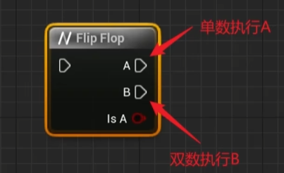

- 第一次执行A功能，第二次执行B功能，第三次再执行A功能，以此类推

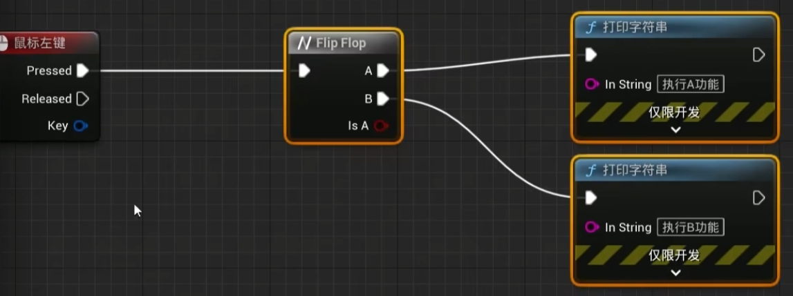

## **Gate节点**

- 又称门节点，当门打开时，随时可以执行功能，当门关闭时，无法执行。

- Toggle,如果执行到Toggle，之前是打开的就会变成关闭，反之亦然。

- Start Closed，勾选的话，此门默认关闭。

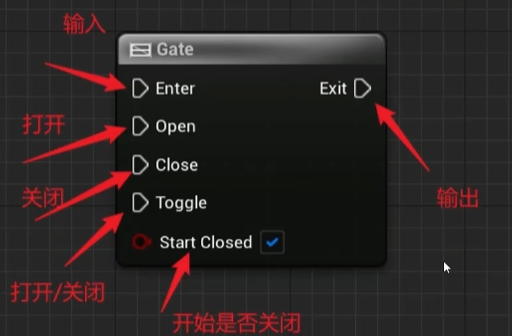

- 范例：鼠标左键为执行，鼠标右键为功能开关

- 

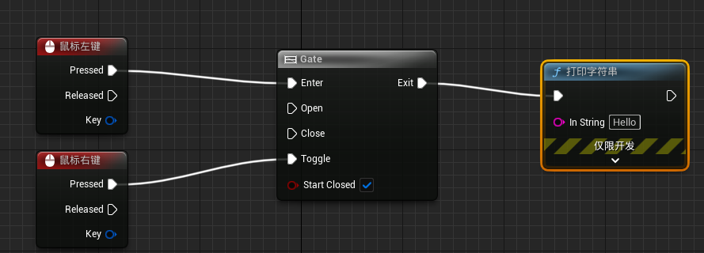

## **Multi Gate 多门节点**

- Multi Gate 多门节点，默认情况下会依次执行输出，当所有输出完成后，不再执行输出。除非执行Reset。输出节点可添加，还可以循环（输出结束门不会关闭，会循环输出）和随机（随机输出）。Start Index 是开始下标。

- 

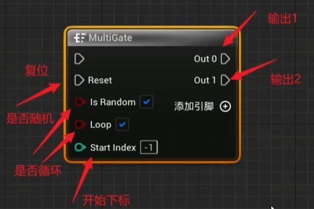

- 

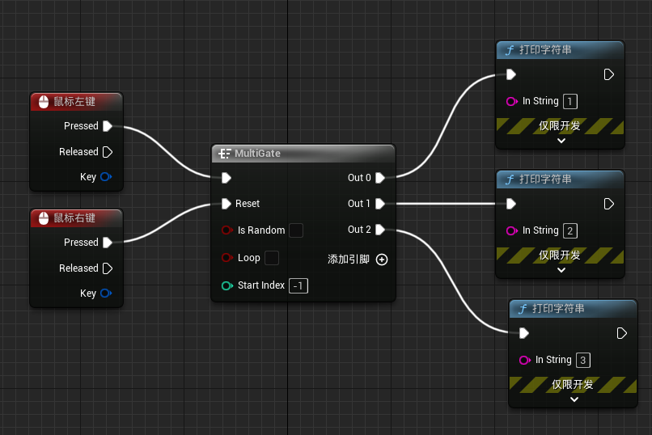

# **数组**

- Array：由多个相同类型数据组成的集合

- 蓝图中数组的特点

- 存入的数据类型必须一致

- 动态，可添加，可删除

- 如何定义数组

- Make Array：创建数组

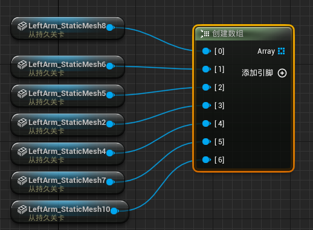

- 将变量设置为数组

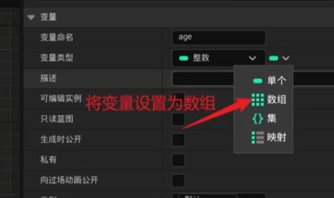

- 如何添加数组

- 将变量设置为数组后，执行编译，默认数组元素个数为0，要先指定数组的默认长度。

- 数组元素的获取

- 通过Get来获取，通过数组元素的索引来访问数组元素

- Get（a copy），Get（复制），只是获取当前数组元素的副本，更改后不影响原应用的数组

- Get（a ref），Get（引用），获取当前数组元素，更改后将直接更改该数组

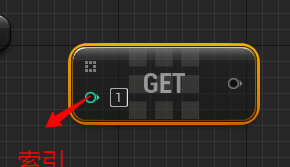

- Find Item，输入元素的数值，返回对应元素的索引，如果数组中没有此元素则返回-1.

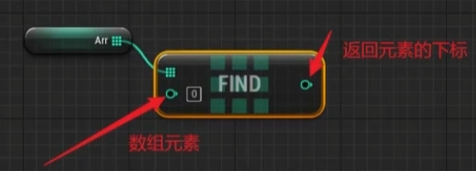

- Length，获取数组长度

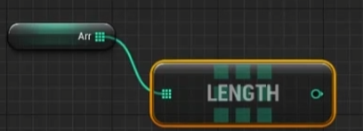

- Last Index，获取数组最后一个元素索引

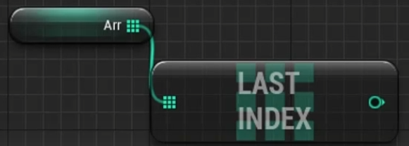

- 数组元素的添加，移除，是否包含

- Insert，插入数组元素

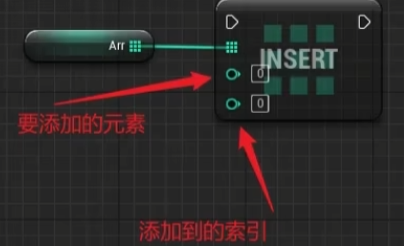

- Remove，根据元素移除元素

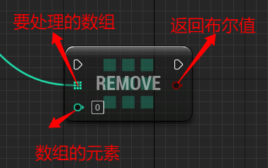

- Remove Index，根据索引移除元素

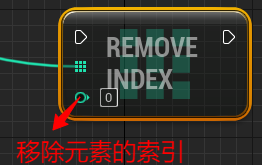

- Contains Item，判断数组中是否包含指定元素

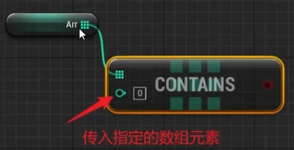

- 数组的遍历

- For Each Loop，For Each Loop With Break

- 

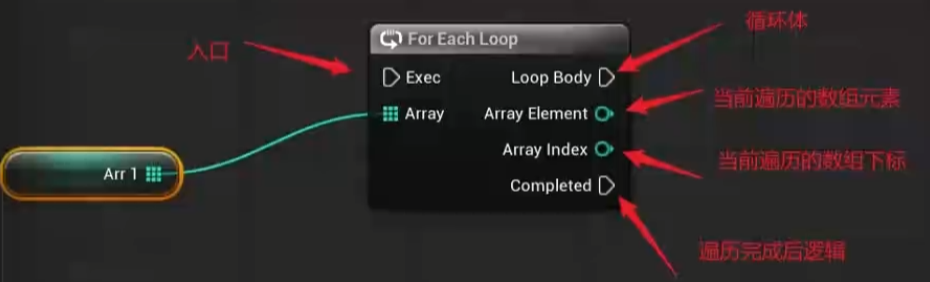

- 

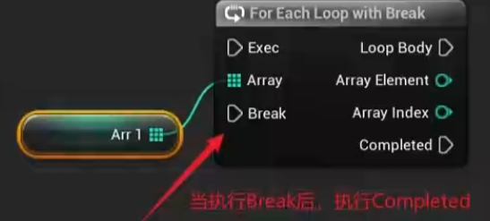

- 范例：字符串数组变量--进行遍历--如果字符串为“Charles”则Break，执行Completed，打印“done”--如果字符串不为“Charles”，打印字符串。

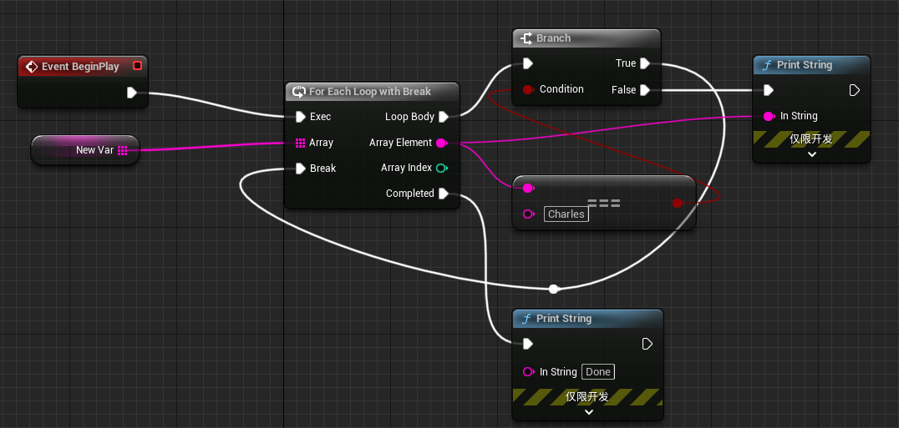

# **蓝图类（BluePrint Class）**

- 是一种允许开发者轻松地给予现有游戏类型添加功能的资源。有多种父类。

## **设置角色蓝图类**

- 设置蓝图类：设置摄像机，并在摄像机下设置骨骼模型

- 

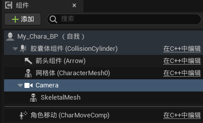

- 设置事件蓝图

- unreal5.2按键输入可使用增强输入，详细内容参见[UE5 增强输入系统（基础篇）](UE5%20增强输入系统（基础篇）.md)和[UE5 增强输入系统（蓝图篇）](UE5%20增强输入系统（蓝图篇）.md)

- 创建输入

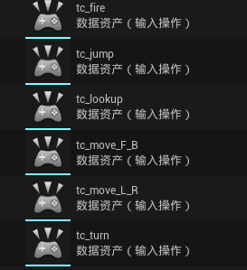

- 创建映射

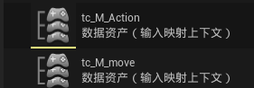

- pass

- 事件开始时添加映射

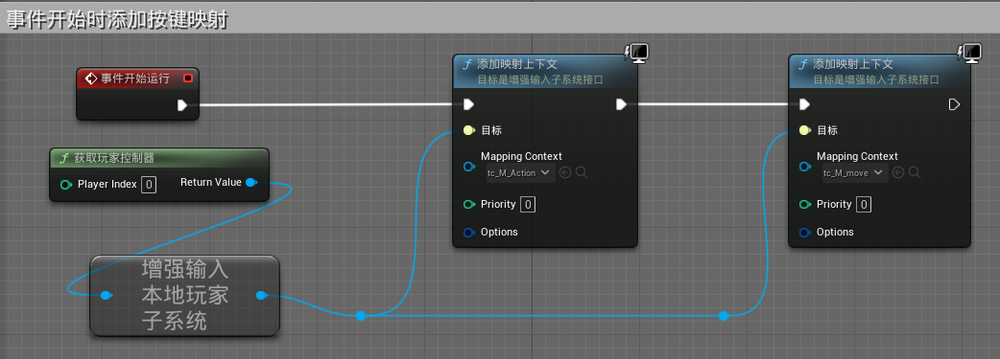

- 设置移动和转向

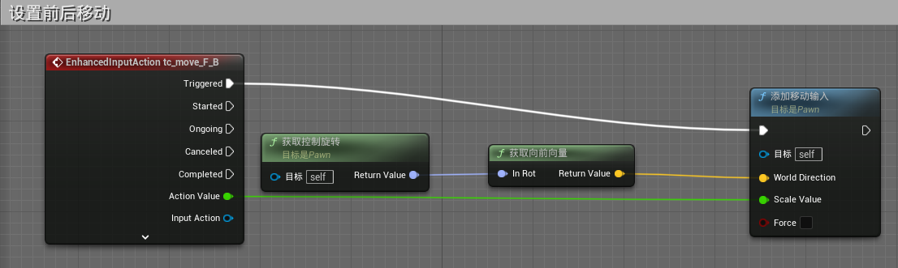

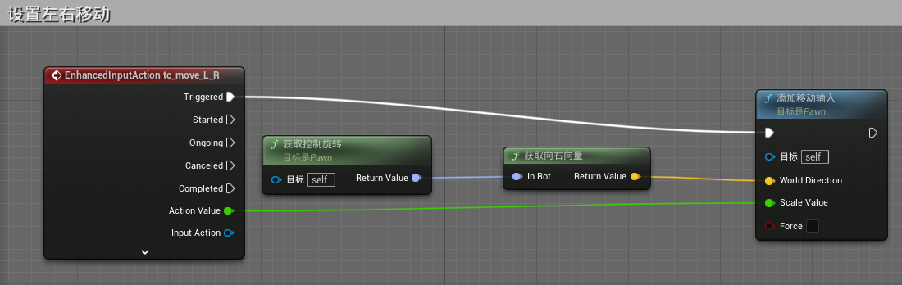

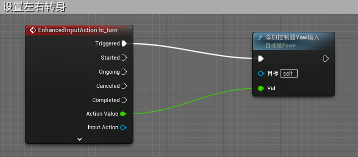

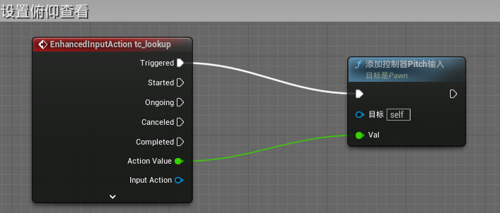

- 设置跳跃

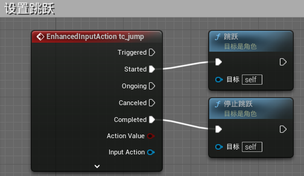

- 设置射击，如果枪支蓝图变量有效，执行自定义射击事件（Gun变量为枪支蓝图对象引用，shootEvent为枪支蓝图内的自定义事件）

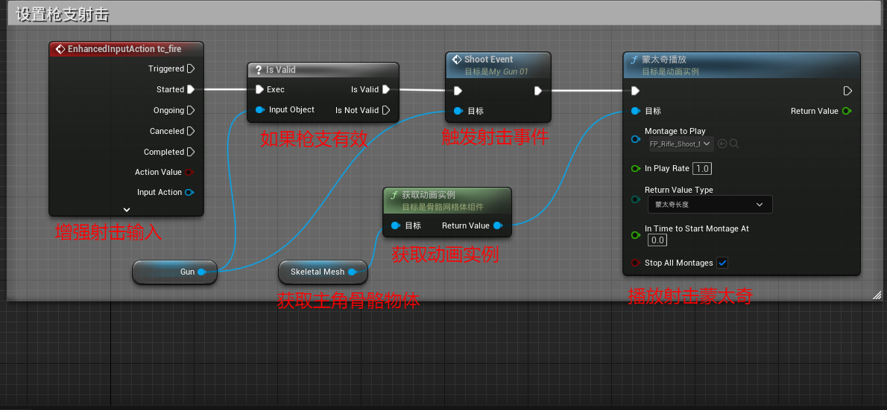

- 所用到的节点

- Add Movement Input：添加移动输入，需要输入世界方向和值

- Get Actor Forward/Right Vector，获取Actor 向前/向右 向量（方向上的单位向量）

- Add Controller Yaw/Pitch Input， 添加控制器Yaw/Pitch 输入

- 蓝图摄像机细节面板设置

- 此项不勾选，无法做Pitch旋转。因为Yaw旋转是胶囊体通知的，但是胶囊体没有Pitch旋转，勾选此项使鼠标往哪边 摄像机/弹簧臂就会朝向哪边。

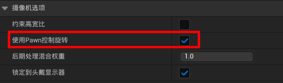

## **设置枪械蓝图**

- 创建Actor蓝图Gun_01，添加骨骼模型SK_FPGun，设置Actor为蓝图根节点，添加碰撞盒

- 

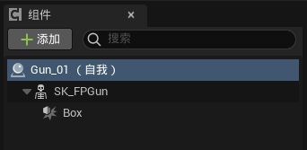

- 

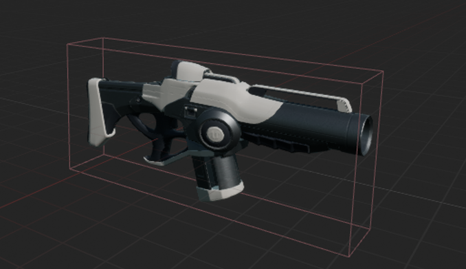

- 事件蓝图

- 设置一个isAttach的布尔变量，用来判断武器是否附加给了角色

- 开始重叠事件---将碰撞Actor转换为自定义角色蓝图---获取角色蓝图骨骼模型组件---附加枪支模型到骨骼模型组件---设置isAttach变量为真---将此蓝图设置给角色蓝图的Gun变量，以便角色蓝图调用枪械蓝图中的射击事件

- 

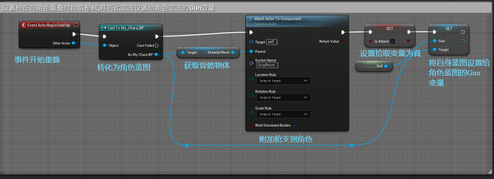

- 事件Tick---分支判断枪支是否被拾取---如果返回为否---设置枪支旋转

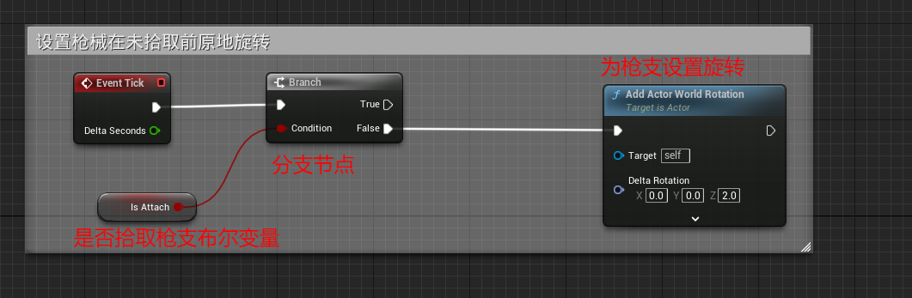

- 定义射击事件

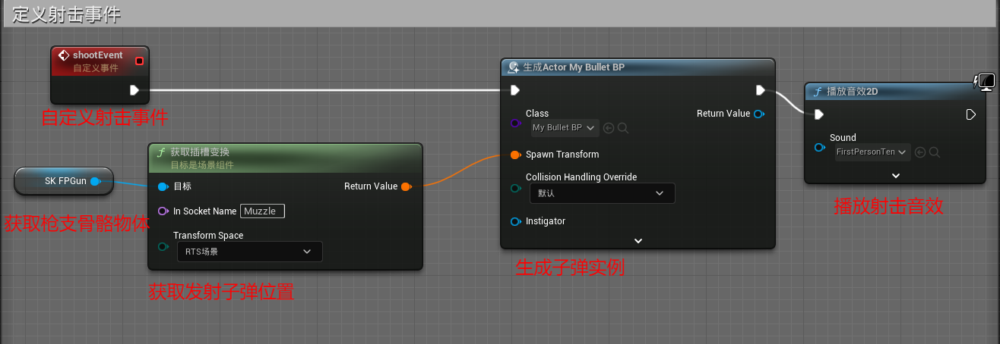

- **设置关卡蓝图**

- 在Point_Actor的位置生成一个Gun01的蓝图实例

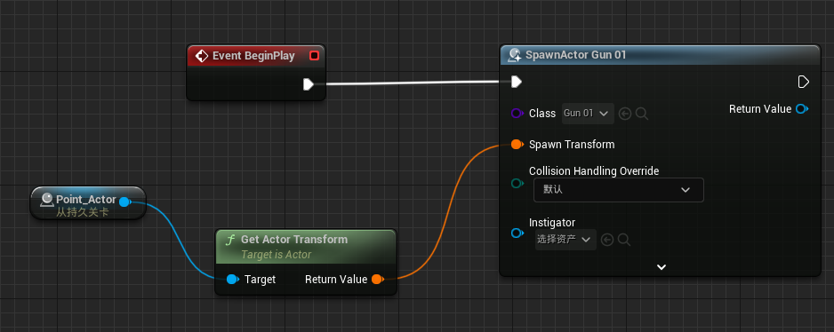

- Spawn Actor from Class 节点：从类生成Actor实例

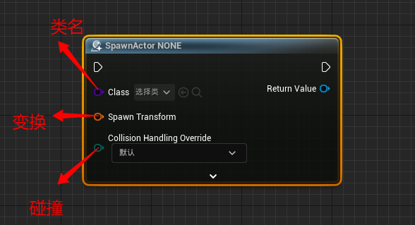

## **设置子弹蓝图**

- 子弹蓝图是个Actor蓝图

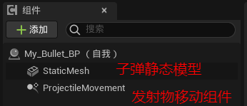

- 发射物移动组件设置

- 

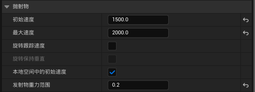

# **函数**

- 函数，传入参数经过处理，输出返回值，

- 函数可以为 纯（Pure） 类型，也可以为 非纯（Impure） 类型。主要区别在于，纯函数承诺不以任何方式修改状态 或类的成员，而非纯函数可以自由修改状态。纯函数通常用于只输出数据值的 getter函数或运算符。纯函数没有执行线。

- 局部变量只能在函数内使用。

| 设置（Setting） | 说明（Description） | 
| -- | -- |
| 公开（Public） | 公开（Public）设置意味着任何其他对象都可以调用此函数。这是默认设置。 | 
| 受保护（Protected） | 受保护（Protected）设置意味着只能由当前蓝图以及从当前蓝图派生的任何蓝图调用此函数。 | 
| 私有（Private） | 私有（Private）设置意味着只能从当前蓝图中调用此函数。 | 

- 

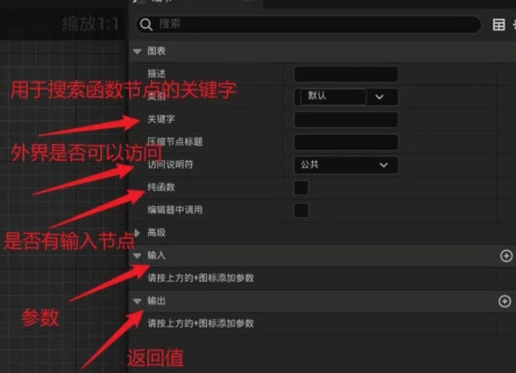

- **案例**

- **求和函数**

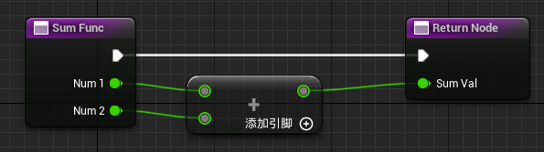

- **两点之间距离函数**

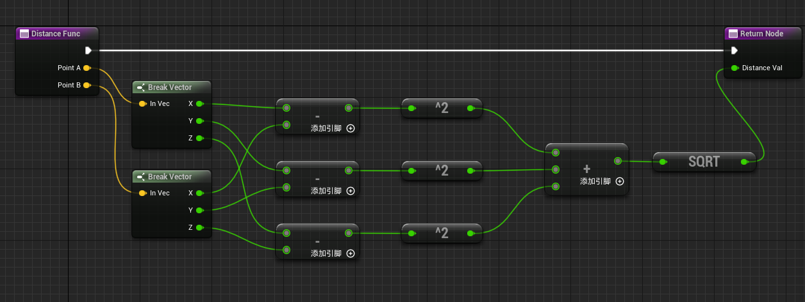

- 函数的使用

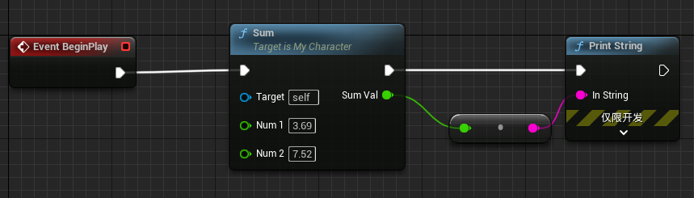

# **宏**

- 蓝图宏（Blueprint Macros） 或 宏（Macros） 本质上与节点的折叠图相同。它们有一个由隧道节点 指定的入口点和出口点。每个隧道都可以有任意数量的执行或数据引脚，当在其他蓝图和图表中使用时， 这些引脚在宏节点上可见。

- 函数只有一个引脚，宏可以有多个输入输出引脚（多指令，根据条件修改指令流分支）

- 可以调用延迟类指令

- 其他蓝图可以调用函数，不能调用宏

- 将多个宏文件组成宏库，可以在其他蓝图中调用。

- 案例

- 宏设置

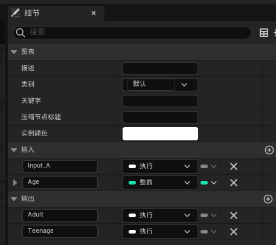

- 宏内容

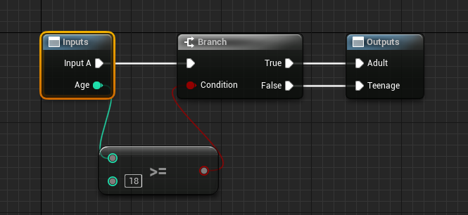

- 宏应用

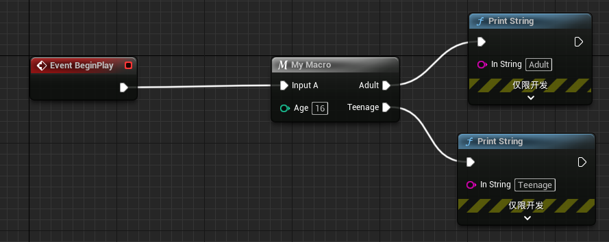

- 宏库

- 将多个宏管理起来的库文件，由于是文件所以需要创建宏库，我们可以在所有蓝图中调用宏库。
# Unreal引擎中函数，事件，宏的区别

## 语法上的区别

- **执行引脚:** 调用函数和发射事件只能有一个执行引脚，而宏在调用的时候可以有很多执行引脚进入或者输出。
- **返回值:** 事件被触发了在执行触发事件的逻辑之后，没有返回值，函数和宏有返回值。
- **延迟节点:** 函数和宏可以直接使用延迟节点，而事件需要通过自定义事件来实现延迟。
- **允许访问范围:** 函数和宏可以在任何地方调用，而事件只能在声明事件的类或子类中调用。

## 逻辑区别

- **函数:** 函数是一种代码块，它可以执行一系列操作并返回一个值。函数通常用于封装代码，以便可以重复使用。
- **事件:** 事件是一种通知机制，它允许一个对象通知其他对象发生了某些事情。事件通常用于在对象之间进行通信。
- **宏:** 宏是一种代码替换机制，它允许将一段代码替换为另一个代码。宏通常用于简化代码或提高代码效率。

## 总结

- 函数和宏都用于封装代码，但函数的执行顺序是有保证的，而宏的执行顺序是不确定的。
- 事件用于在对象之间进行通信，它没有返回值，并且只能在声明事件的类或子类中调用。
- 在需要保证执行顺序的情况下，应该使用函数。
- 在需要在对象之间进行通信的情况下，应该使用事件。
- 在需要简化代码或提高代码效率的情况下，可以使用宏。
# **TimeLine：时间轴节点**

- 时间轴节点石兰图中的特殊节点，功能是在指定时间内将指定的值变化到目标值。

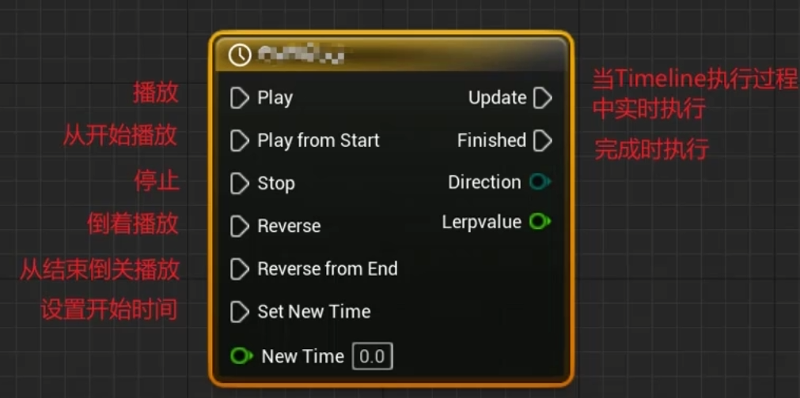

- 双击该节点，可编辑

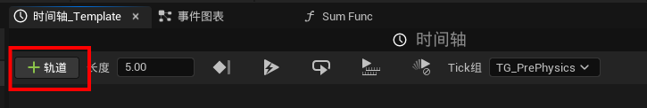

- 添加浮点数（float）轨道

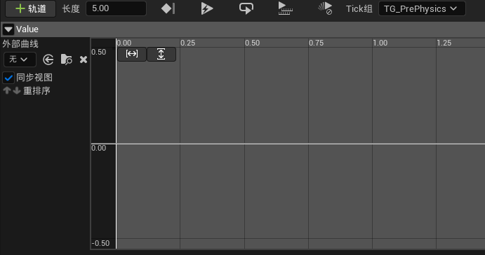

- 给轨道添加关键帧

- 

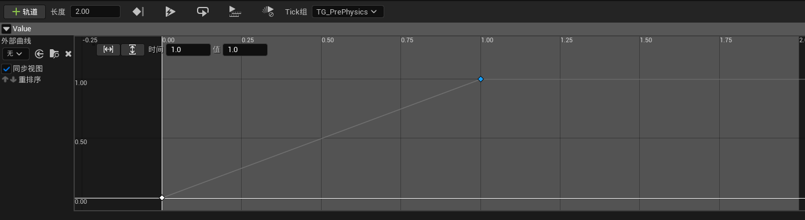

- 节点上便多出一个引脚，并打印时间轴数值

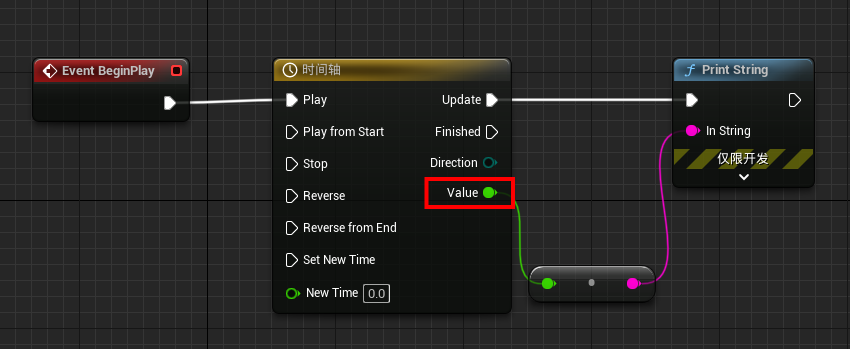

# **Lerp：插值节点**

- 根据Alpha的值返回A到B之间的值，Alpha的取值范围为0-1。可搭配时间线节点使用

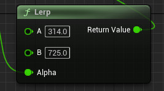

- 插值的应用

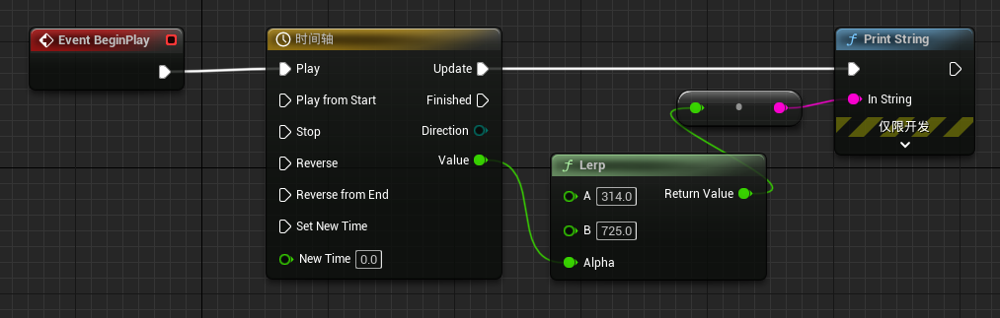

# **案例：自动门**

- 创建门蓝图为Actor

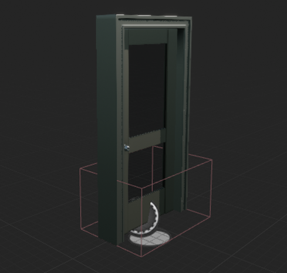

- 蓝图结构

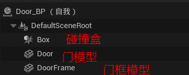

- 事件蓝图

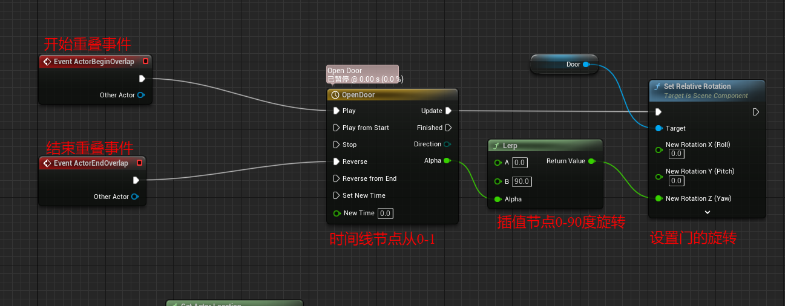

- 时间线节点

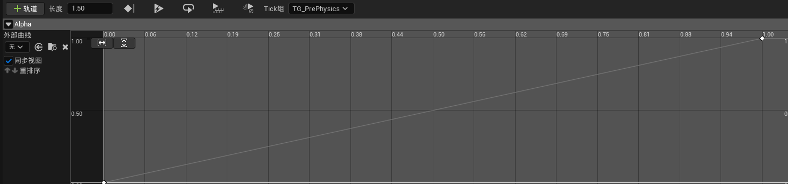

- 增强版，两侧开关门

- 通过比较主角和门的X轴坐标大小，得到主角在门的哪一侧，从而确定开关门方向

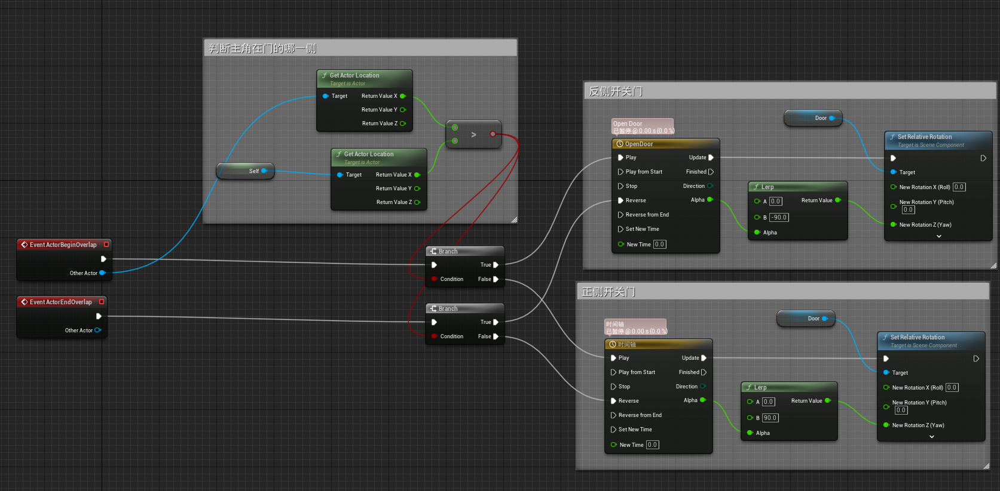

# **蓝图类和关卡蓝图交互**

- 在关卡蓝图中定义自定义事件来执行蓝图类

- 在蓝图类中通过执行控制台命令（Execute Console Command）节点来执行关卡蓝图事件

- 注意，事件必须为自定义事件，否则会调用失败

- Command中输入ce事件名，必须以ce开头。ce为关键字，ce后面需要加空格(f“ce {关卡蓝图自定义事件名称}”)。ce 关键字后为要执行事件的名称。

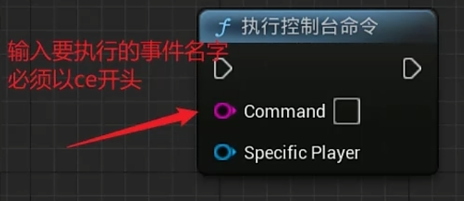

- 设置关卡蓝图

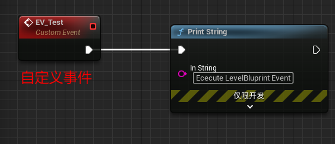

- 设置蓝图类

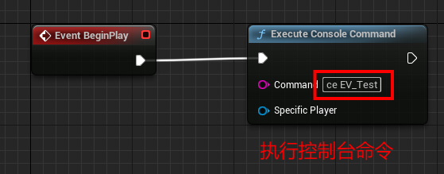

- 将蓝图类丢到场景中点播放，就会执行关卡蓝图的自定义事件

- **案例**

- 在门蓝图中定义开门自定义事件

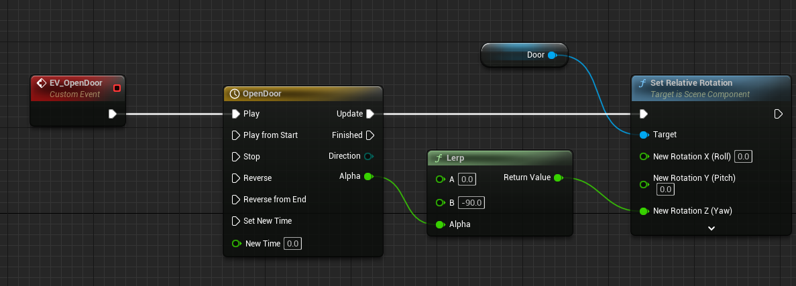

- 在关卡蓝图中定义自定义事件并调用门蓝图中的开门自定义事件

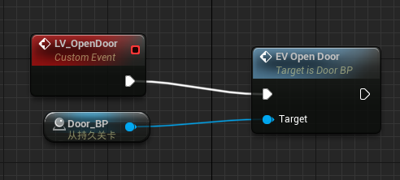

- 在钥匙蓝图中调用关卡蓝图开门自定义事件

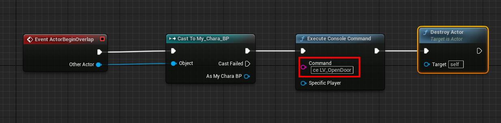

- 