# 蓝图之间的通信

- **知识要点**

- UE4/5中不存在无差别通信，只能一对一、一对多(具体）。

- 因此，蓝图通信的首要任务是设法获得通信对象的引用(reference)。

- 获得通信对象引用的方式包括:指定，碰撞，创建，get (all) + cast to。

- 蓝图通信有三种方式:直接通信，蓝图接口，事件分发器。

- 蓝图通信是单向的。

- **获得通信对象的引用**

- 指派，碰撞，创建，get (all) + cast to

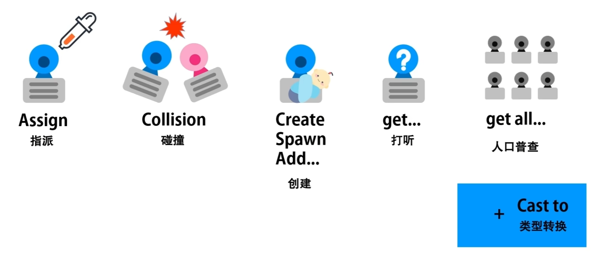

- **三种主要的通信方式**

- 直接通信，蓝图接口（正向发送），事件分发器（反向监听）。

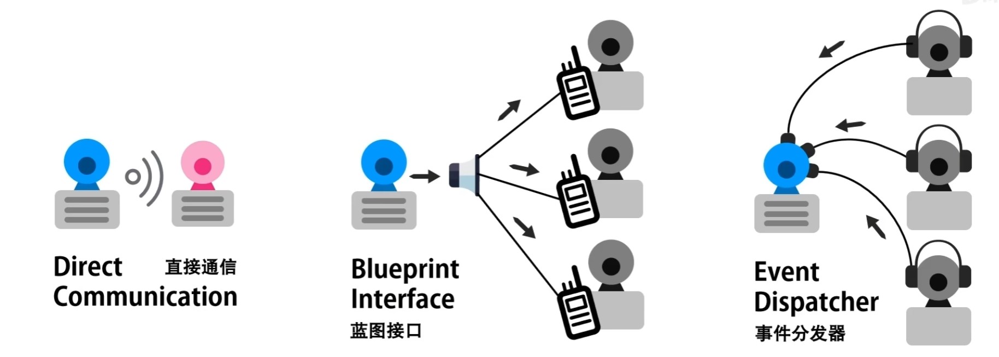

- **直接通信**

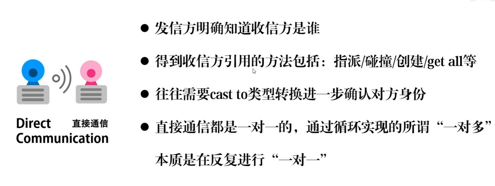

- **Assign指派**

- 通过在蓝图类中创建通信对象的变量，并把变量公开，在世界场景中吸取指派通信对象。

- 新建一个变量，将此变量设为公有，在主窗口中选中该蓝图的实例，在细节面板中可选择或吸取另一个蓝图实例。

- 

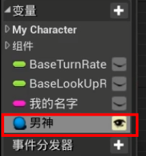

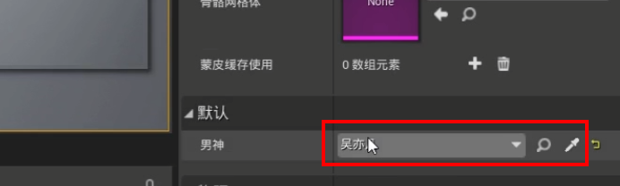

- **collision碰撞**

- 通过蓝图类之间的碰撞（重叠，碰撞，球形检测，射线检测）来获取通信对象。

- 碰撞 重叠

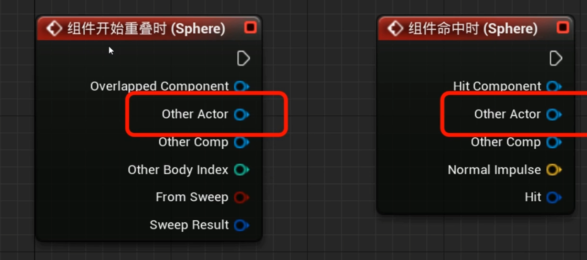

- 检测

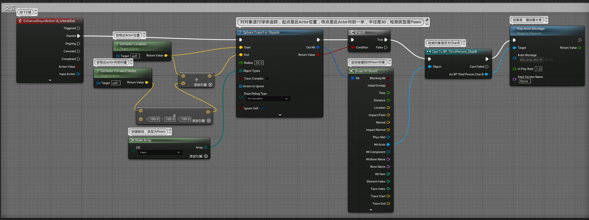

- **create/spawn/add创建**

- 在创建对象的时候，会返回该节点。该节点使用即可。

- **get**

- 获取，例如：get Player character（获取玩家角色），get game mode（获取游戏模式）

- **getAll**

- 获取全部。例如：get all Actors of class(获取类的所有对象) ,get all Actors with tag（通过标签获取对象），通常需要配合 for Each loop 节点循环使用。

- 

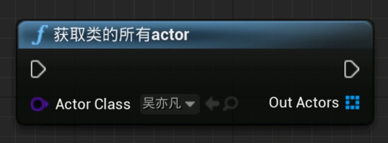

- **蓝图接口**

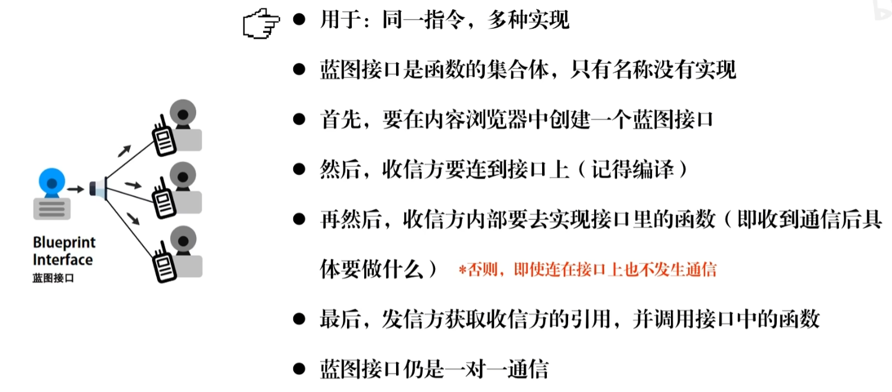

- **创建蓝图接口**

- 右键-蓝图-蓝图接口

- 蓝图接口函数为只读，只能修改函数名称和细节，无法修改函数内容。细节中，有输入值，无输出值，可以作为事件调用，有输入值，有输出值只能作为函数调用。

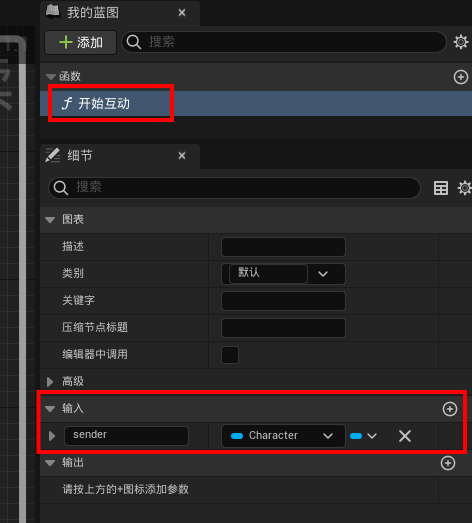

- **设置收信对象事件蓝图**

- 在互动对象的事件蓝图中，点击类设置，找到 接口 项，点击添加，找到Hudong_interface，添加接口。

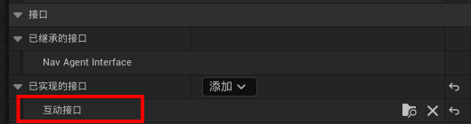

- 调用蓝图接口，有事件和函数两种形式，发消息时使用调用函数，接收消息并执行使用调用事件。

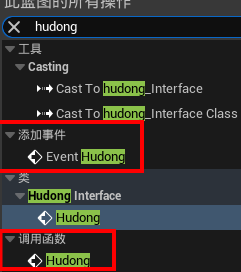

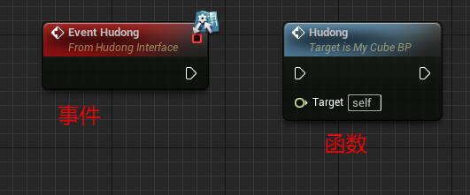

- 此时左侧我的蓝图--接口 项目便出现了我们定义的接口，双击可添加接口事件

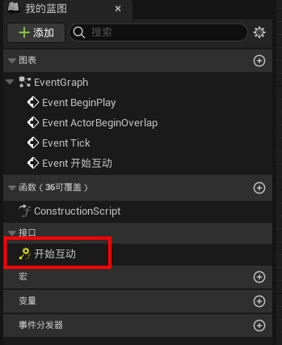

- 在事件蓝图中，编辑互动事件

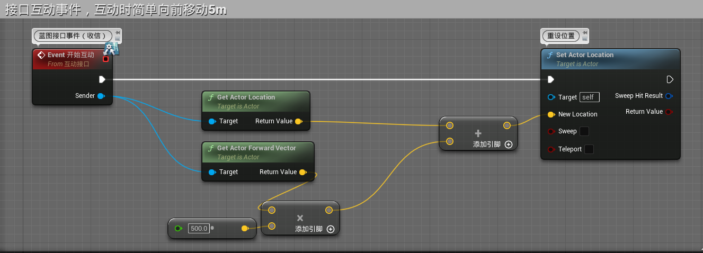

- **设置发信角色事件蓝图**

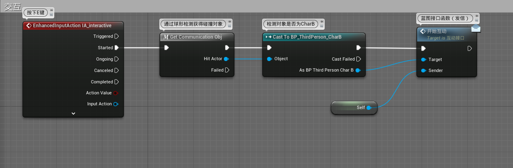

- 其中get_communication_obj宏为

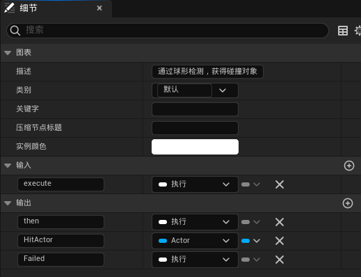

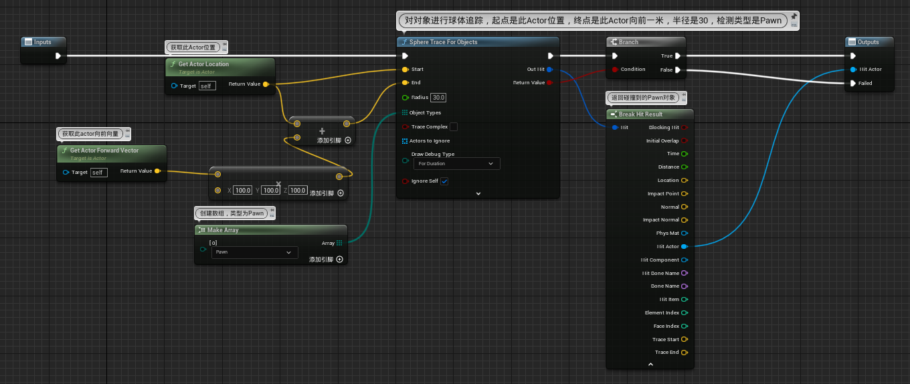

- **事件分发器**

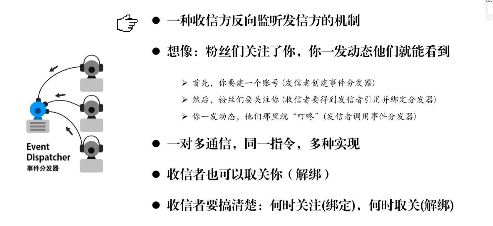

- **角色事件蓝图**

- 创建事件分发器

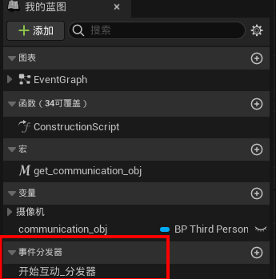

- 调用事件分发器

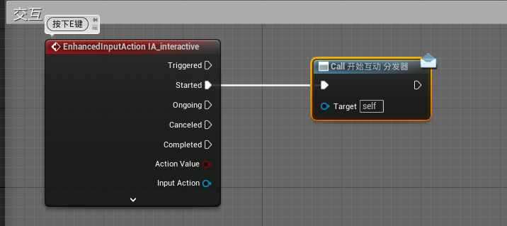

- **交互对象事件蓝图**

- （交互对象添加一个球形碰撞以实现角色重叠事件）

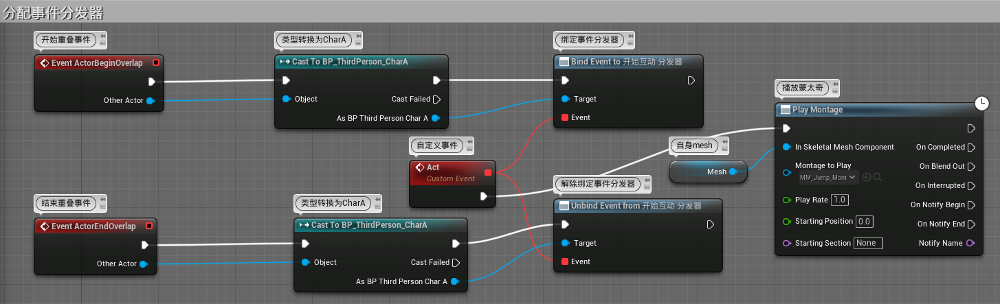

- 蓝图接口和事件分发器的区别

- 

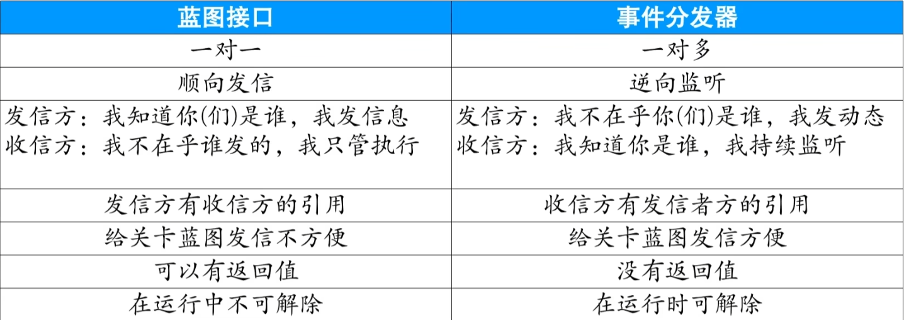

- 