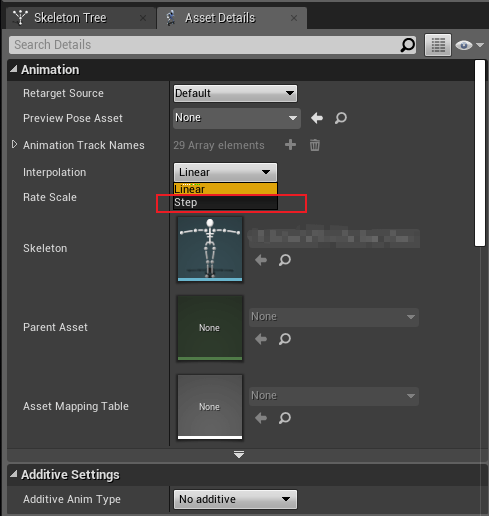
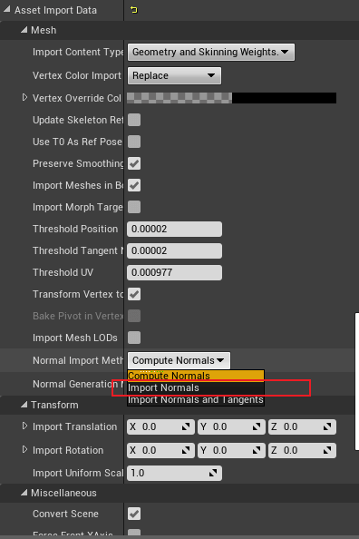
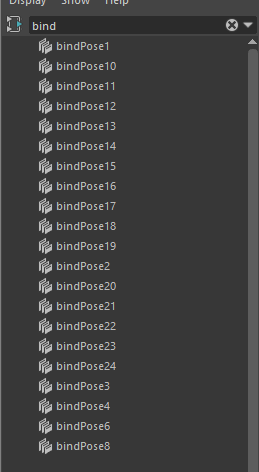

# 动画导入
- 动画资产 interpolation 选择 step 选项

> [!INFO] 原理
>  动画导入到虚幻的时候务必要勾选 step  ,否则动画读取小数位的关键帧会有抖动的问题。否则小数帧抖动只能通过增加帧率来改善。
# 模型导入
- 模型导入到虚幻的时候通常都需要将 normal 的切换为 imported normal
- 
 > [!INFO] 原理
>  将 normal 的切换为 imported normal ，否则一些特殊修改的法线信息就不会导入了
# 动作错位
- 可能和 Maya 绑定的 bindpose 有关，有可能是绑定文件修改过多导致产生多个 BindPose  
  bindpose 直接不匹配就有可能导致偏移问题。

> [! INFO] 原理
> 解决方法也很简单，只需要将这些 bindpose 全部删除掉，重新生成一个新的 bindpose 就可以了。执行代码如下：
```python
import pymel.core as pm

#查询绑定姿态
dagPose = pm.dagPose(bindPose=True,q=True)
#删除所有绑定姿势
pm.delete(dagPose)
#保存当前绑定姿态
pm.dagPose(bindPose=True,save=True)
```