# Spring Controller
- spring controller节点一般用于果冻效果单根骨骼弹簧结算，一般用于乳房和屁股颤动的效果，是一个简单高效的节点，没有碰撞。
- 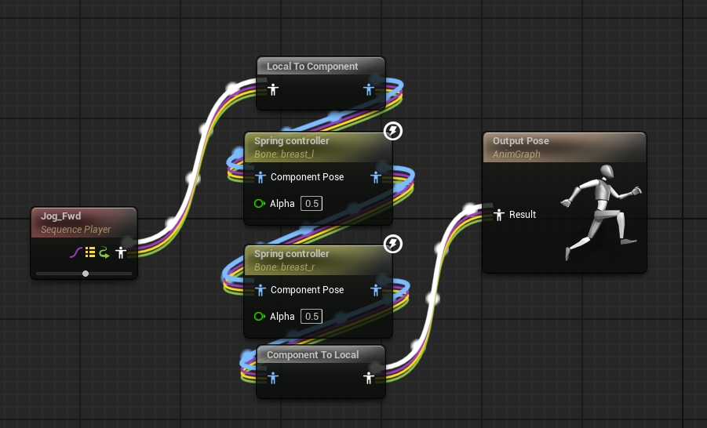
- 可以通过Alpha值(0.5)来调整颤动幅度
- 节点设置
- 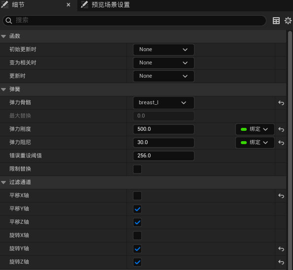
# AnimDynamics
- AnimDynamics[动画蓝图](https://dev.epicgames.com/documentation/zh-cn/unreal-engine/animation-blueprints-in-unreal-engine?application_version=5.5)节点是一种轻量级的物理模拟解决方案。你可以用它在运行时对角色的部分[骨架网格体](https://dev.epicgames.com/documentation/zh-cn/unreal-engine/skeletal-mesh-assets-in-unreal-engine?application_version=5.5)应用基于物理的附属动画。与使用角色[物理资产](https://dev.epicgames.com/documentation/zh-cn/unreal-engine/physics-asset-editor-in-unreal-engine?application_version=5.5)的[RigidBody](https://dev.epicgames.com/documentation/zh-cn/unreal-engine/animation-blueprint-rigid-body-in-unreal-engine?application_version=5.5)节点不同，AnimDynamics节点可以模拟自己的物理刚体，以提升项目性能。
- 类似于一个简化版的KawaiiPhysics，不建议使用。
- 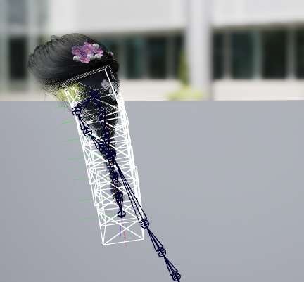
- 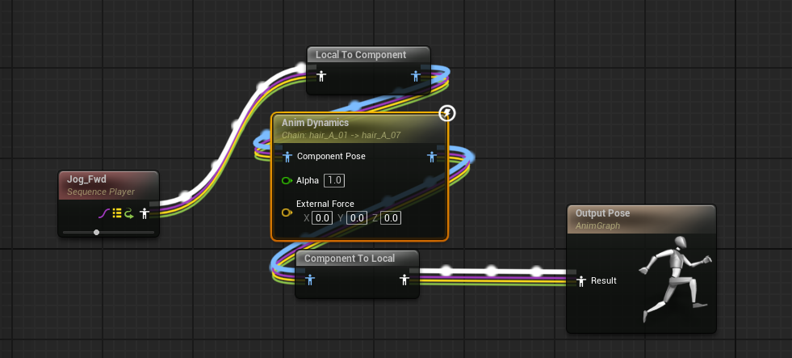
- 节点设置
- 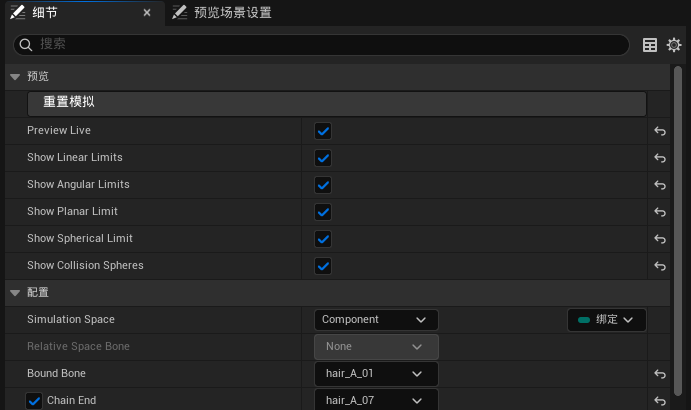
- 设置物理体（盒体）属性
- 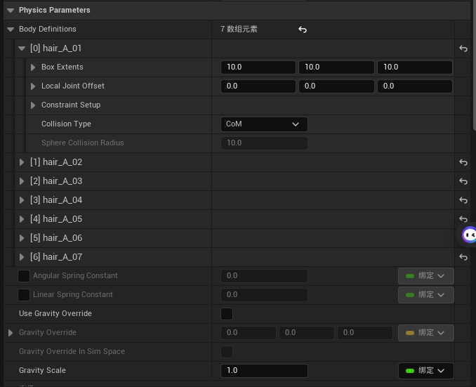
- 设置碰撞（限制）属性
- 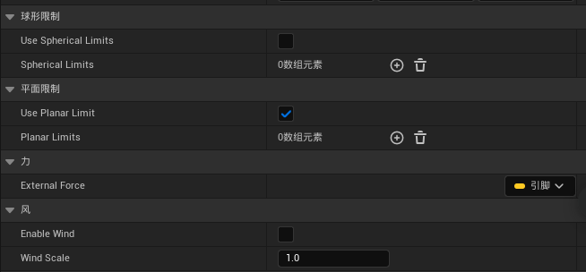
# KawaiiPhysics
- KawaiiPhysics是一个轻量级的次级动画结算插件，是一个伪物理插件。它允许您为头发、裙子和乳房等对象创建简单可爱的动画。
- 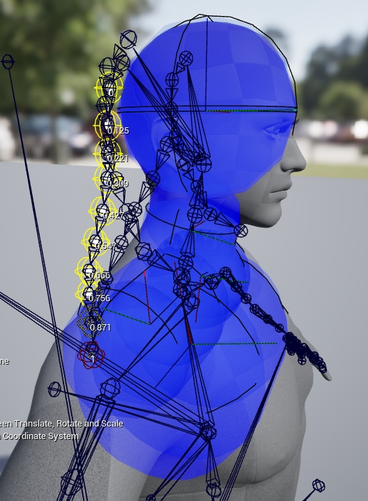
- 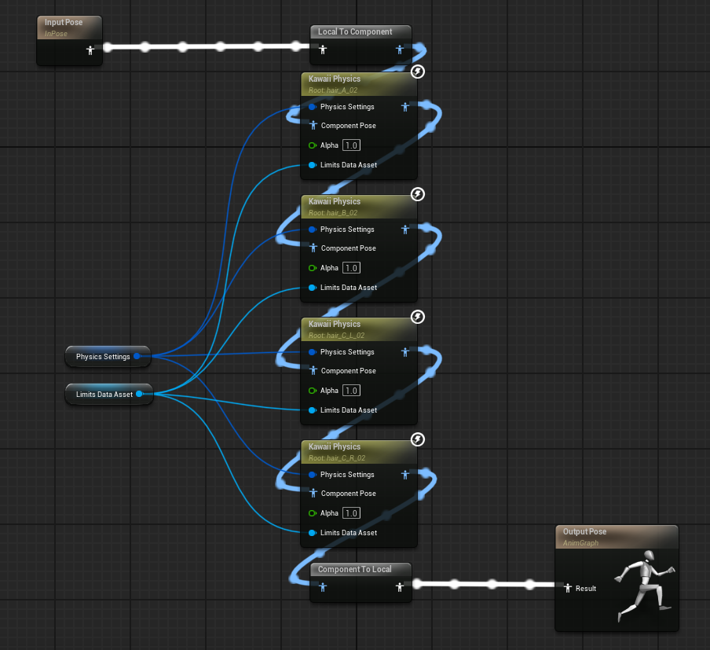
- 节点
- 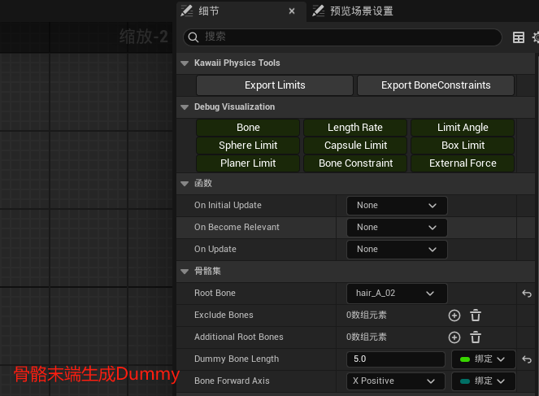
- 物理设置
- 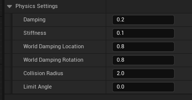
- 碰撞（限制）写在一个DataAsset里面
- 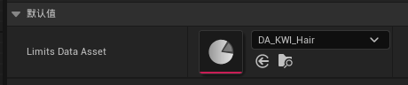
- 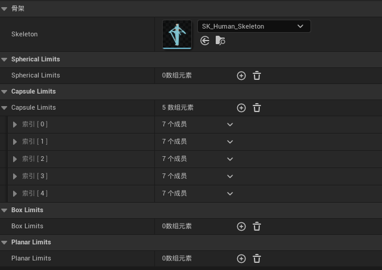
- 骨骼约束，可以用一个骨骼约束另一个骨骼，实现裙摆效果
- 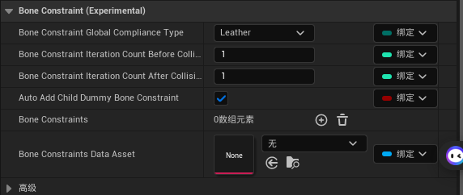
- 设置重力
- 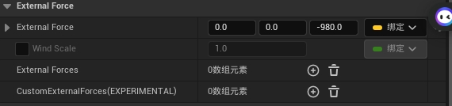
# RigidBody
- RigidBody节点的功能类似于[Anim Dynamics](https://dev.epicgames.com/documentation/zh-cn/unreal-engine/animation-blueprint-animdynamics-in-unreal-engine?application_version=5.5)节点，但提供了功能更为丰富的物理模拟解决方案，让你能够集成角色的物理资产，更好地控制模拟。将RigidBody节点与物理资产结合使用，你还可以模拟与角色其余部分以及关卡中其他对象的碰撞。
## 设置物理资产
- 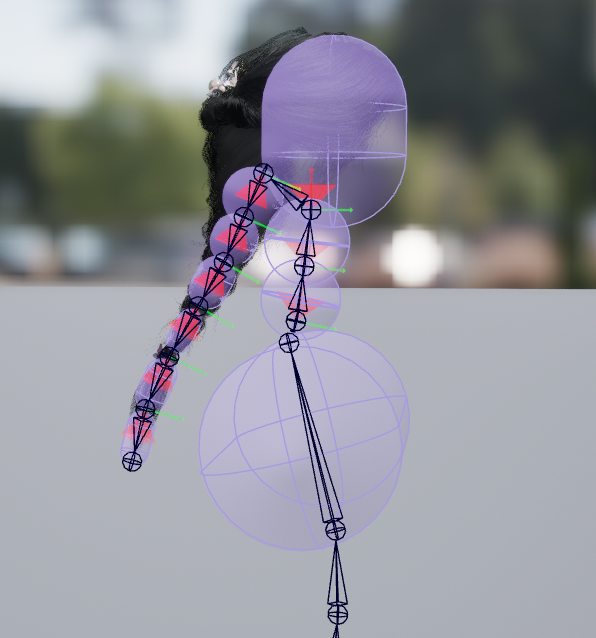
- 设置好物理体之前是否启用碰撞
- 需要结算的骨骼物理体设置为：Sumulated（模拟）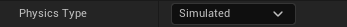
- 需要被碰撞的骨骼物理体设置为：Kinematic（运动学）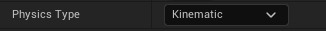
- 辫子的质量从上往下减小，最靠近父结构的形体设置为最重的物理形体，并将链中每个后续形体的质量减半。（解决颤动问题）
- 模拟运动和碰撞的所有形体上，为 **线性阻尼（Linear Damping）** 和 **角阻尼（Angular Damping）** 属性设置值比如30-50。值越高，运动越少，从而抑制模拟形体的摆动和颤动。
- 在碰撞设置中可以选择将简单碰撞用于复杂碰撞以减少消耗。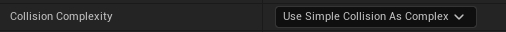
- 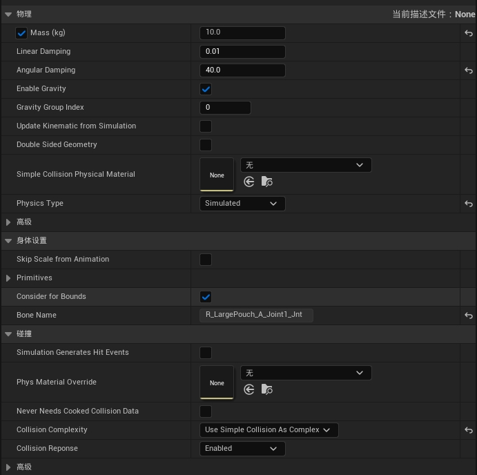
## 动画蓝图
- 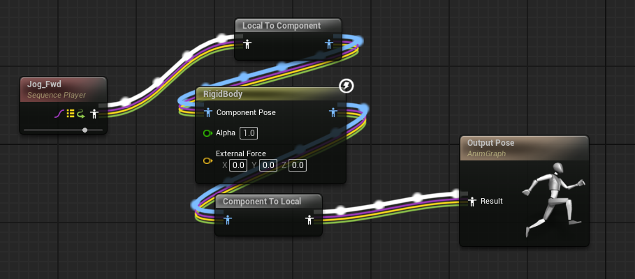
- 节点设置：
- 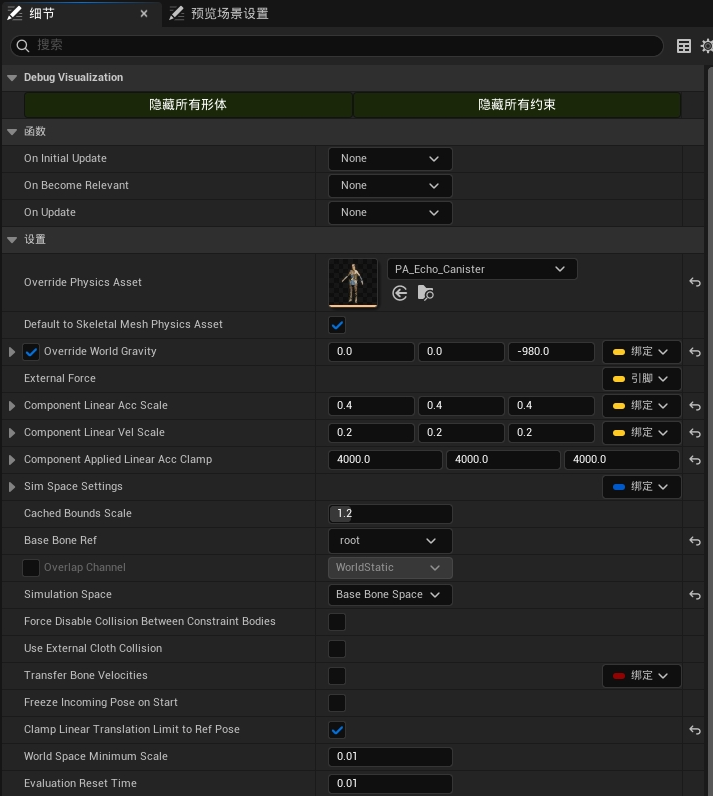
- 如果想要重力效果可以开启OverrideWorldGravity，Z轴设为-980
# PoseDriver
## 创建姿势资产
- 根据骨骼变换驱动另一个骨骼变换
- 根据骨骼变换驱动混合变形（BlendShape），可以使用maya的PoseEditor（姿势编辑器）或者Shapes插件，最好是使用虚幻官方的插件PoseWrangler
- [Pose Driver Connect插件](https://www.fab.com/listings/745c5017-d248-4aab-8e11-2e00f57aaca0),包含一个maya插件（PoseWrangler），一个unreal插件（Pose Driver Connect）
- 每帧一个pose导出，无论是混合变形还是骨骼姿势。将动画导入引擎，在引擎中将动画转换为姿态
- 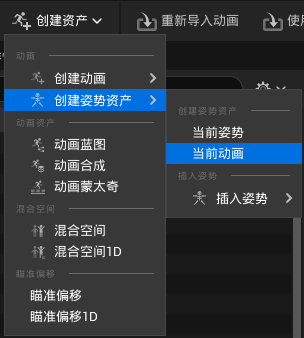
- 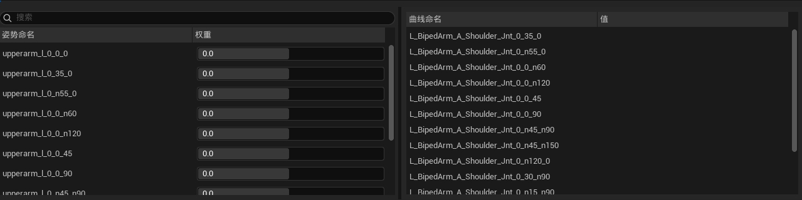

## 动画蓝图
- 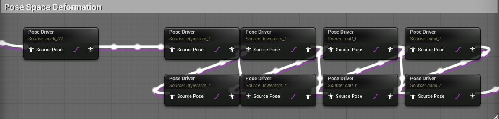
- 将姿势资产载入PoseDriver节点，并选择源骨骼
- 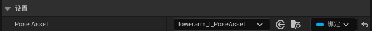
- 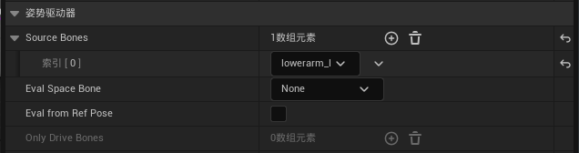
- 添加变形目标，可以选择从姿势资产复制所有，如果在maya中使用 PoseWrangler插件，可使用 Pose Driver Connect虚幻插件导入数据
- 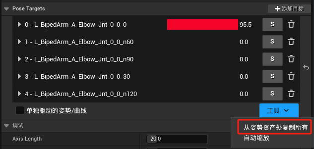
- RBF设置
- 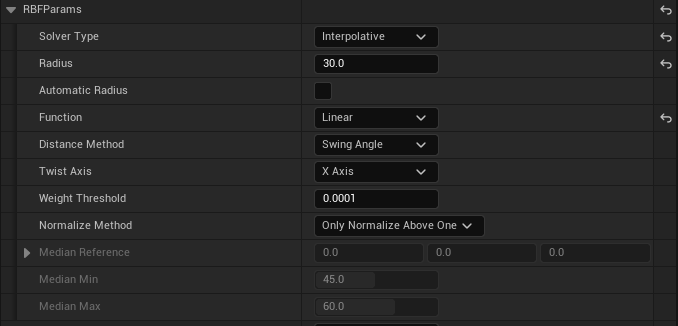
- 设置驱动源和驱动输出，可以选择Rotation或Translation来驱动曲线(混合变形)或姿势（骨骼变形和混合变形）
- 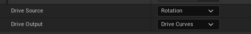
- 所有节点选项
- 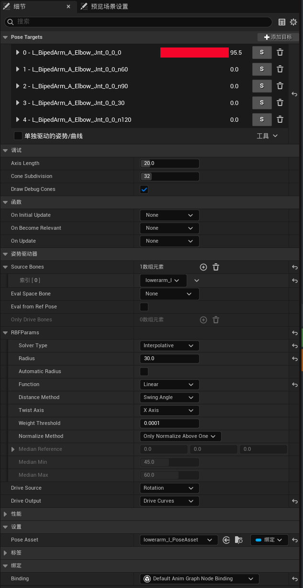
# 布料
详见[虚幻引擎中的布料资产处理](虚幻引擎中的布料资产处理.md)
