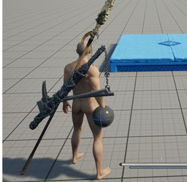
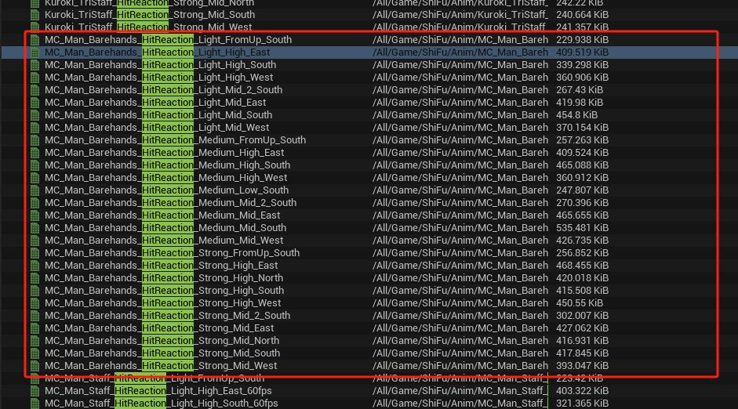

---

kanban-plugin: board

---

## # 待处理

- [ ] ## 任务名称：织布机动画
	## 策划：黄益
	### 任务内容：
- [ ] ## 任务名称：秽魔新增动画
	## 策划：刘恺
	### 任务内容：
	- 回魔新增变形和装备
	- H:\Project_PJX\Monster\Mummy\怪物动作需求模板-秽魔-刘恺.xlsx
- [ ] ## 任务名称：施法动画
	## 策划：卢旭
	### 任务内容：
	- H:\Project_PJX\Animation\magic
- [ ] ## 任务名称：人形怪驯养
	
	### 任务内容：
	- NPC站立到蹲伏
	- NPC蹲伏循环
	- 主角踢一脚，NPC蹲伏到平躺（互动）
	- 主角扛起NPC（互动）
	- 扛着NPC待机（互动）
	- 主角放下NPC平躺（互动）
	- NPC平躺到蹲伏
- [ ] ## 任务名称：鹿动画重定向
	## 策划：李晨阳
	### 任务内容：H:\Project_PJX\Animal\deer
- [ ] ## 任务名称：蹲伏采集动画
	## 策划：徐大禹
	### 任务内容：
- [ ] ## 任务名称：动画重定向
	## 策划：李嘉铭
	### 任务内容：
	- H:\Project_PJX\Animpackage\New\Retarget
- [ ] ## 任务名称：石狮子
	
	## 策划：
	### 任务内容：
- [ ] ## 任务名称：法器动画需求
	## 策划：王大伟
	### 任务内容：
	- "H:\Project_PJX\DOC\法器武器动作需求-王大伟.xlsx"
	-


## # 进行中

- [ ] ## 任务名称：击倒和站起
	## 策划：李嘉铭
	### 任务内容：
	- BigGuy_barehands_KnockDown_GetUp_Front
	- BigGuy_barehands_hitted_toDown_mid_south
- [ ] ## 任务名称：精英狼展示动画
	## 策划：刘凯
	### 任务内容：
	- H:\Project_PJX\Animal\Wolf
	- Wolf_BeginningShow_Montage
	- 一个精英狼出场动画不用太长
- [ ] ## 任务名称：物理资产
	## 策划：李嘉明
	### 任务内容：
	- 鸟怪导入
- [ ] ## 任务名称：移动中出入武器
	## 策划：卢旭
	### 任务内容：
	- H:\Project_PJX\Animation\Anim_1h\Equip


## # 已完成

**完成**
- [x] ## 任务名称：悬浮建造动画
	## 策划：黄益
	### 任务内容：
	- 分三段
	- /Script/Engine.AnimSequence'/Game/Characters/Animaiton/Unarmed/Locomotion/idles/Anim_human_floating_loop.Anim_human_floating_loop'
- [x] ## 任务名称：新体型，服装，头发
	## 策划：
	### 任务内容：
	- 服装
	- 头发
	- 胡须
	- 新形体：男人02，女人02，小孩
- [x] ## 任务名称：二段跳
	## 策划：卢旭
	### 任务内容：
- [x] ## 任务名称：狼和秽魔的处决动画
	## 策划：刘凯
	### 任务内容：
- [x] ## 任务名称：朝凤技能修改
	## 策划：王亚楠
	### 任务内容：
	- "D:\Work_MobilGame\outsourcing\Submissions\Boss_ChaoFeng\嘲风动作提交_0726\max\Boss_CF_Attack_12.max"
	- 拆分为三段：前摇，站起挠空气，落下
- [x] ## 任务名称：受击动画修改
	## 策划：卢旭
	### 任务内容：
	* 受击动画不再制作回到初始姿态的部分
	* 回到初始姿态使用引擎混合
	* 主要目的是提高玩家流畅度
- [x] ## 任务名称：鹿的被处决动画
	### 任务内容：
	- Anim_Human_Execution_1h_01_Att_Montage1
	- 2H_spear_Skill_attack_Montage
- [x] ## 任务名称：主角吃东西动画
	## 策划：董建成
	### 任务内容：
	- 30帧左右，吃东西动作，右手抬起往嘴里送东西的动作
- [x] ## 任务名称：女主角脸型替换
	## 策划：
	### 任务内容：
	- "H:\Project_PJX\Character\Import\SK_Human_Female_02.fbx"
- [x] ## 任务名称：待机动画重新设计
	## 策划：卢旭
	### 任务内容：
	- 空手，单手和长柄武器到集动画重新设计
- [x] ## 任务名称：角色开箱子动画
	## 策划：盖云鹏
	### 任务内容：
	- 右手抬起做一个开箱子动画
- [x] ## 任务名称：圆盘启动动画
	## 策划：李晨阳
	### 任务内容：
- [x] ## 任务名称：用葫芦动画
	## 策划：董建成
	### 任务内容：
	- H:\Project_PJX\Animation\HuLu
	- 喝酒：
	- 装酒：空手，6-7s
	- 换葫芦
	- Anim_Human_Live_Drink_01_Montage
	- SM_Gourd_001
- [x] ## 任务名称：化解动画调整
	## 策划：卢旭
	### 任务内容：
	- 使用卧龙的转身化解1H_Sword_Dodge_F替换现在的滑行化解
- [x] ## 任务名称：渡劫化解天雷的技能
	## 策划：薛剑
	### 任务内容：
	渡劫想做个化解天雷的技能，玩家的化解动画要用新的，就是接住雷然后轮一圈忘天上丢，这个化解动画可以不分方向  
	https://www.bilibili.com/video/BV1Lt411M7A9/?spm_id_from=333.337.search-card.all.click&vd_source=3c20e77f2ef2f5bc41104060216452b9  
	3分45到4分00  
	https://www.bilibili.com/video/BV1fL411y75v/?spm_id_from=333.337.search-card.all.click&vd_source=3c20e77f2ef2f5bc41104060216452b9  
	12分00到12分05  
	有点点像只狼里的雷电奉还，但是我们这个是往天上丢
- [x] ## 任务名称：空翻动画
	## 策划：卢旭
	### 任务内容：
	- RM_ButterflyKick_LB
- [x] ## 任务名称：帧率修改
	## 策划：郑亚楠
	### 任务内容：
	- /Game/Monster/BiGou/Animation/A_BiGou_Attack_Special_end1、A_BiGou_Attack_Special_end2、A_BiGou_Attack_Special_end3、A_BiGou_Attack_Special_end4、A_BiGou_Disappear_Air  这五个动画不是30帧的
- [x] ## 任务名称：女主角变形重新制作
	## 策划：
	### 任务内容：
- [x] ## 任务名称：空手攻击动画
	## 策划：卢旭
	### 任务内容：
	- H:\Project_PJX\Animpackage\New\Lucy
- [x] ## 任务名称：主角交互动画制作
	## 策划：
	### 任务内容：
- [x] ## 任务名称：女主角乳摇效果测试
	## 策划：
	### 任务内容：
- [x] ## 任务名称：女主角模型和变形调整
	## 策划：
	### 任务内容：
- [x] ## 任务名称：格挡反击动画
	## 策划：卢旭
	### 任务内容：
	- 左右格挡反击动画
- [x] ## 任务名称：长枪动画
	## 策划：卢旭
	## 制作：罗超
	### 任务内容：
	- "H:\Project_PJX\Animation\Anim_Polarms\Resources\长枪真的超帅的好吗！.mp4"
- [x] ## 任务名称：建造用动画
	## 策划：黄益
	### 任务内容：
	- 站立->伸手托球
	- 伸手托球循环
	- 伸手托球 -> 站立
	- 
- [x] ## 任务名称：捏人待机动画
	## 策划：卢旭
	
	### 任务内容：
	- Anim_Human_Execution_1h_01_Att_Montage1
	- Anim_Human_Execution_1h_01_Vic_Montage1
- [x] ## 任务名称：处决动画摄像机测试
	## 策划：卢旭
	
	### 任务内容：
	- Anim_Human_Execution_1h_01_Att_Montage1
	- Anim_Human_Execution_1h_01_Vic_Montage1
- [x] ## 任务名称：主角模型微调
	## 策划：
	### 任务内容：
	- H:\Project_PJX\character_rig\assets\new
- [x] ## 任务名称：仙鹤动画调整
	## 策划：李辰阳
	### 任务内容：
	- H:\Project_PJX\character_rig\assets\new
- [x] ## 任务名称：宝箱动画调整
	## 策划：盖云鹏
	### 任务内容：
	- H:\Project_PJX\character_rig\assets\new
- [x] ## 任务名称：气绝动画
	## 策划：卢旭
	### 任务内容：
	- /Script/Engine.AnimSequence'/Game/Characters/Animaiton/Anim_1h/Execute/Deaths_Guts_Fallout1.Deaths_Guts_Fallout1'
	- 先站姿后仰定身，然后手扶膝盖气喘吁吁
	- 从站立状态到气喘吁吁5s
- [x] ## 任务名称：喝酒动画
	## 策划：董建成
	### 任务内容：
	"H:\Project_PJX\DOC\喝酒动作需求.xlsx"
	-
- [x] ## 任务名称：宝箱蒙皮
	## 策划：盖云鹏
	### 任务内容：
	- 度风机会给模型
- [x] ## 任务名称：单手剑的休闲动作
	## 策划：
	- 薛剑
	### 任务内容：
	- 现在动画库里有单手剑的休闲动作吗？搞个人形怪想让他偶尔放放装逼动作
- [x] ## 任务名称：单剑四连击
	### 任务内容：
	- WudangSword_Animset
- [x] ## 任务名称：主角单剑格挡动画
	### 任务内容：
	- 三段式，开始格挡，格挡循环，结束格挡
	- 格挡八项行走
	- 格挡受击：轻中重
	- 格挡弹反：左右
	- 被弹反动画：左右
	- [只狼格挡弹反](https://www.bilibili.com/video/BV1a14y1Z7zr/?spm_id_from=333.1387.favlist.content.click&vd_source=8b3046779dab454f938247b89b8bc983)
- [x] ## 任务名称：突破成功动画
	## 策划：薛剑
	### 任务内容：
	- 参考这个感觉，基础姿势还是原来那个打坐的，然后手划来划去，最后一下要散开的感觉
	- 
- [x] ## 任务名称：受击动画修改
	## 策划：卢旭
	### 任务内容：
	- 轻的后受击和前受击动画帧数不一样 的问题你回头看看
- [x] ## 任务名称：掐诀施法动画
	### 任务内容：
	- [掐诀施法动画](H:\Project_PJX\DOC\掐决施法动作需求.xlsx)
	-
- [x] ## 任务名称：原地动画转根骨骼动画22个
	## 策划：
	- 李嘉明
	### 任务内容：
	- ZhuYan怪所有Attack动画转根动画
- [x] ## 任务名称：怪物动画调整
	### 任务内容：
	- Anim_Monster_Mummy_Long_Attack_03 老哥这个也需要把位移去掉 0.0
- [x] ## 任务名称：砍树调整
	### 任务内容：
	AnimationSequence_Survival_TreeChop_Horizontal_Loop  
	这个砍树的也要帮忙调整一下，砍的时候脚下不要动
- [x] ## 任务名称：怪物Mummy
	动画修改
	### 任务内容：
	-
- [x] ## 任务名称：蹲伏动画制作
	### 任务内容：
	-
- [x] ## 任务名称：头发蒙皮测试
	
	### 任务内容：
	-
- [x] ## 任务名称：单剑武器布料和kawaii
	### 任务内容：
	-
- [x] ## 任务名称：
	### 任务内容：SKM_Rocky_Troll_Rig物理资产
	-
- [x] ## 任务名称：单剑处决
	### 任务内容：
- [x] ## 任务名称：动画包载入
	### 任务内容：
	- Frank_RPG_Spear
	- Frank_Assassin
- [x] ## 任务名称：采集动画修改
	### 任务内容：
	- AnimationSequence_Survival_Foraging_BerryBush这个动画里的采集动作播了3次  只要播一次就可以
- [x] ## 任务名称：创建物理资产
	### 任务内容：
	- CraneBird_B3
	- Qilin_B4
- [x] ## 任务名称：MOE怪物迁移
	### 任务内容：
	- RockyMountainTroll
- [x] ## 任务名称：女主角服装
	### 任务内容：
	- H:\Project_PJX\Cloth\import
- [x] ## 任务名称：男主角模型修改
	### 任务内容：
- [x] ## 任务名称：石狮子和麒麟动画重定向
	### 任务内容：
- [x] ## 任务名称：新女主角蒙皮
	### 任务内容：
	* H:\Project_PJX\Character\Import\SK_Orc_F_Fox_01.fbx
- [x] ## 任务名称：四方向受击动画
	### 任务内容：
- [x] ## 任务名称：弓箭攻击技能
	
	### 任务内容：
- [x] ## 任务名称：原地起跳动画双脚齐平
	
	### 任务内容：
- [x] ## 任务名称：御剑飞行
	
	### 任务内容：
- [x] ## 任务名称：游泳动画修改
	### 任务内容：
- [x] ## 任务名称：化解动画
	### 任务内容：
- [x] ## 任务名称：女主角绑定蒙皮
	### 任务内容：
- [x] ## 任务名称：DGSH项目打坐动画
	### 任务内容：
	- 修炼境界的时候想让玩家播个打坐的动画
- [x] ## 任务名称：搬箱子
	### 任务内容：
	- 金永明需求搬箱子三段动画
	-
- [x] ## 任务名称：PJX项目1D动画重定向
	### 任务内容：
	-
- [x] ## 任务名称：PJX项目8D动画重定向
	### 任务内容：M_Neutral_Walk_Pivot_RR_LR_Rfoot 
	-
- [x] ## 任务名称：DGSH项目关羽布料修改
	### 任务内容：男性大胖子
	
	- 


## # 已取消

- [ ] ## 任务名称：狼动画修改
	## 策划：刘恺
	### 任务内容：
	- Loco_SneakL_1
	- Loco_SneakR_1
- [ ] ## 任务名称：空手攻击动画
	## 策划：卢旭
	### 任务内容：
	/Script/Engine.AnimSequence'/Game/Characters/Animaiton/Unarmed/Combat/Lucy_Fist10_2_ALL_Root.Lucy_Fist10_2_ALL_Root'
	/Script/Engine.AnimSequence'/Game/Characters/Animaiton/Unarmed/Combat/Lucy_Kick04_Root.Lucy_Kick04_Root'
	/Script/Engine.AnimSequence'/Game/Characters/Animaiton/Unarmed/Combat/Lucy_Kick08_Root.Lucy_Kick08_Root'
- [ ] ## 任务名称：爬墙动画重定向修改
	
	### 任务内容：
- [ ] ## 任务名称：卧龙动画重定向
	### 任务内容：卧龙A52 A20两个动画帮我Retarget过来，需要对应骨架的RTG
- [ ] ## 任务名称：麒麟蒙皮动画重定向
	### 任务内容：H:\Project_PJX\Amount\Import


***

## 归档

- [x] ## 任务名称：尸解仙动画
	### 任务内容：
	- XXXXX
	### 附件：
	* "D:\Work\Animation\package\new\MagicalKnight_Set"
	
	* "D:\Work\Animation\package\new\FlyingMageAnimSet"
	* XXXXX
	### 标签：
	#XX 
	### 时间：
	开始：
	结束：
	### 任务优先级：★★★★☆
- [x] ## 任务名称：伐木机器人
	### 任务内容：
	- D:\Work\Animation\props\lumberingRobot\伐木机
	### 附件：
	* XXXXX
	* XXXXX
	* XXXXX
	### 标签：
	#XX 
	### 时间：
	开始：
	结束：
	### 任务优先级：★★★★☆
- [x] ## 任务名称：索道滑行动画
	
	### 任务内容：
	- XXXXX
	### 附件：
	
	* XXXXX
	* XXXXX
	* XXXXX
	### 标签：
	#XX 
	### 时间：
	开始：
	结束：
	### 任务优先级：★★★★☆
- [x] ## 任务名称：老鹰新增动画
	### 任务内容：
	- 大佬。老鹰站起动画现在没有，有时间也麻烦帮忙做一下
	
	SG/Content/AnimalsFullpack/Eagle/Animations
	### 附件：
	* XXXXX
	* XXXXX
	* XXXXX
	### 标签：
	#XX 
	### 时间：
	开始：
	结束：
	### 任务优先级：★★★★☆
- [x] ## 任务名称：鸵鸟动画增加
	### 任务内容：
	- XXXXX
	### 附件：
	鸵鸟动画需求
	起跳，滞空，落地
	急停
	驯养时挣扎动画
	### 标签：
	#XX 
	### 时间：
	开始：
	结束：
	### 任务优先级：★★★★☆
- [x] ## 任务名称：索道绑定和动画
	### 任务内容：
	- D:\Work\Animation\Pose\241203
	### 附件：
	* XXXXX
	* XXXXX
	* XXXXX
	### 标签：
	#XX 
	### 时间：
	开始：
	结束：
	### 任务优先级：★★★★☆
- [x] ## 任务名称：骆驼动画增加
	### 任务内容：
	- XXXXX
	### 附件：
	骆驼要做成跟马一样的，所以缺少动作:
	- 跳跃
	- 急停
	- 走路左转身
	- 走路右转身
	- 奔跑左转身
	- 奔跑右转身
	- 后退左转身
	- 后退右转身
	- 小跑
	- 慢跑
	- 驯养时挣扎动画
	### 标签：
	#XX 
	### 时间：
	开始：
	结束：
	### 任务优先级：★★★★☆
- [x] ## 任务名称：四脚机关兽
	### 任务内容：
	- H:/帝国神话开发版/Projects/SG/Content/Props/Weapons/Machines/Mch_BaseTrans_001/Mesh/SM_TransportMech_base.uasset
	### 附件：
	* XXXXX
	* XXXXX
	* XXXXX
	### 标签：
	#XX 
	### 时间：
	开始：
	结束：
	### 任务优先级：★★★★☆
- [x] ## 任务名称：弓箭技能修改
	### 任务内容：
	- Anim_human_skill_bow_007
	Anim_weapon_skill_bow_007
	
	这个蛛网束缚的技能动画要改成3段
	第一段，从开始到弓箭拉到底
	第二段，维持弓箭拉到底的状态（这一段要可以循环播放）
	第三段，发射
	
	加了一个瞄准选区域的阶段
	### 附件：
	* XXXXX
	* XXXXX
	* XXXXX
	### 策划：薛剑
	
	### 标签：
	#XX 
	### 时间：
	开始：
	结束：
	### 任务优先级：★★★★☆
- [x] ## 任务名称：大型船坞需求
	### 任务内容：
	- D:\Work\Animation\props\WaterBase
	### 附件：
	动力笼（Mch_WaterBase_Floor_Cage_001）
		需求一个动力笼运行的动画
	推进器（Mch_WaterBase_Floor_Propeller_001）
		需求一个推进器运行的动画
	平台筏子（Mch_WaterBase_Floor_Raft_002）
		一个舵待机动作
		舵左转动作
		舵右转动作
	### 标签：
	#XX 
	### 时间：
	开始：
	结束：
	### 任务优先级：★★★★☆
- [x] ## 任务名称：武器绑定
	### 任务内容：
	- XXXXX
	### 附件：
	* SM_Weapon_2H_SteelBlunt_lv40
	* WPFa_11_Gre_Bow_IronBow_A01  
	
	### 标签：
	#XX 
	### 时间：
	开始：
	结束：
	### 任务优先级：★★★★☆
- [x] ## 任务名称：增加物理资产
	### 任务内容：
	- SkeletalMesh'/Game/AnimalsFullpack/Bug01/SK_bug01_1.SK_bug01_1'
	### 附件：
	* XXXXX
	* XXXXX
	* XXXXX
	### 标签：
	#XX 
	### 时间：
	开始：
	结束：
	### 任务优先级：★★★★☆
- [x] ## 任务名称：Spider_Skill_05动画修改
	### 任务内容：
	- 改成3段（起跳、空中的循环、落地）的动作？然后是不带位移的
	
	### 附件：
	* XXXXX
	* XXXXX
	* XXXXX
	### 标签：
	#XX 
	### 时间：
	开始：
	结束：
	### 任务优先级：★★★★☆
- [x] ## 任务名称：弓箭技能
	### 任务内容：
	- XXXXX
	### 附件：
	* D:\Work\Animation\skill\Doc
	* XXXXX
	* XXXXX
	### 标签：
	#XX 
	### 时间：
	开始：
	结束：
	### 任务优先级：★★★★☆
- [x] ## 任务名称：服装Kawaii调整
	### 任务内容：
	- F:\DGSHRes\Projects\SG\Content\Mannequin\Equipment\DLC_Cloth\Cloth_Greece\Cloth_GRE_HArmour_A04
	### 附件：
	* XXXXX
	* XXXXX
	* XXXXX
	### 标签：
	#XX 
	### 时间：
	开始：
	结束：
	### 任务优先级：★★★★☆
- [x] ## 任务名称：怪物服装蒙皮
	### 任务内容：
	- D:\Work\Animation\Monsters\cloth\import
	### 附件：
	* XXXXX
	* XXXXX
	* XXXXX
	### 标签：
	#XX 
	### 时间：
	开始：
	结束：
	### 任务优先级：★★★★☆
- [x] ## 任务名称：怪物资产转移
	### 任务内容：
	- XXXXX
	### 附件：
	* D:\Work\Animation\Monsters\doc
	* XXXXX
	* XXXXX
	### 标签：
	#XX 
	### 时间：
	开始：
	结束：
	### 任务优先级：★★★★☆
- [x] ## 任务名称：武器添加骨骼
	### 任务内容：
	- SM_Weapon_ObsidianBattleAxe_YMZRseries
	### 附件：
	* XXXXX
	* XXXXX
	* XXXXX
	### 标签：
	#XX 
	### 时间：
	开始：
	结束：
	### 任务优先级：★★★★☆
- [x] ## 任务名称：希腊箭塔修改
	### 任务内容：
	- 可不改
	### 附件：
	* \Projects\SG\Content\Props\Weapons\Machines\WatchTower_Gre_001\Mesh
	SM_WatchTower_Gre_002
	### 标签：
	#XX 
	### 时间：
	开始：
	结束：
	### 任务优先级：★★★★☆
- [x] ## 任务名称：盾牌格挡动画制作
	### 任务内容：
	- XXXXX
	### 附件：
	* XXXXX
	* XXXXX
	* XXXXX
	### 标签：
	#XX 
	### 时间：
	开始：
	结束：
	### 任务优先级：★★★★☆
- [x] ## 任务名称：神将绑定蒙皮
	### 任务内容：
	- D:\Work\Animation\Character\NPC\import
	### 附件：
	* 孙策
	* 太史慈：1.04
	* 夏侯渊：1.06
	### 标签：
	#XX 
	### 时间：
	开始：
	结束：
	### 任务优先级：★★★★☆
- [x] ## 任务名称：战船绑定动画
	### 任务内容：
	- SM_Warship_003
	### 附件：
	* XXXXX
	* XXXXX
	* XXXXX
	### 标签：
	#XX 
	### 时间：
	开始：
	结束：
	### 任务优先级：★★★★☆
- [x] ## 任务名称：神将技能制作
	### 任务内容：
	- 罗超在做
	### 附件：
	* [神将技能美术需求.xlsx](D:\Work\Animation\DOC\神将技能美术需求.xlsx)
	* XXXXX
	* XXXXX
	### 标签：
	#XX 
	### 时间：
	开始：
	结束：
	### 任务优先级：★★★★☆
- [x] ## 任务名称：流马弩箭骨骼动画修改
	### 任务内容：
	- XXXXX
	### 附件：
	* XXXXX
	* XXXXX
	* XXXXX
	### 标签：
	#XX 
	### 时间：
	开始：
	结束：
	### 任务优先级：★★★★☆
- [x] ## 任务名称：协助市场制作视频和图片
	### 任务内容：
	- XXXXX
	### 附件：
	* 提供部分动画和pose
	* XXXXX
	* XXXXX
	### 标签：
	#XX 
	### 时间：
	开始：
	结束：
	### 任务优先级：★★★★☆
- [x] ## 任务名称：箭塔蒙皮动画
	### 任务内容：
	- 希腊新箭塔蒙皮动画
	### 附件：
	* SkeletalMesh'/Game/Props/Weapons/Machines/WatchTower_Gre_001/Mesh/SK_WatchTower_Gre_001.SK_WatchTower_Gre_001'
	### 标签：
	#XX 
	### 时间：
	开始：
	结束：
	### 任务优先级：★★★★☆
- [x] ## 任务名称：pose
	### 任务内容：
	- 就是我们那个希腊文明的DLC嘛，要求出一个主视觉，要体现那种希腊文明和中式文明的碰撞，所以我们提了一个方案，有点类似刺客信条奥德赛登录界面这种感觉，俩人一个进攻，一个举盾应敌的感觉，就是这个动作需要你帮忙给调一版，你看工作量大不？
	### 附件：
	* ! [[attachments/微信图片_20240611140523]]
	* XXXXX
	* XXXXX
	### 标签：
	#XX 
	### 时间：
	开始：
	结束：
	### 任务优先级：★★★★☆
- [x] ## 任务名称：乐器动画修改
	### 任务内容：
	- 铃鼓动画修改4个
	- 七弦琴动画修改3个
	### 附件：
	* XXXXX
	* XXXXX
	* XXXXX
	### 标签：
	#XX 
	### 时间：
	开始：
	结束：
	### 任务优先级：★★★★☆
- [x] ## 任务名称：新增动物
	### 任务内容：
	- XXXXX
	### 附件：
	* "D:\Work\Animation\Animal\DLC动物.xlsx"
	* XXXXX
	* XXXXX
	### 标签：
	#XX 
	### 时间：
	开始：
	结束：
	### 任务优先级：★★★★☆
- [x] ## 任务名称：希腊战船制作
	### 任务内容：
	- XXXXX
	### 附件：
	* XXXXX
	* XXXXX
	* XXXXX
	### 标签：
	#XX 
	### 时间：
	开始：
	结束：
	### 任务优先级：★★★★☆
- [x] ## 任务名称：乐器动画
	### 任务内容：
	- 最高优先级：里拉琴、巴比托琴；其次是双簧阿夫洛斯管；最后优先级排笛、铃鼓、黄铜萨尔宾克斯号
	### 附件：
	* [[D:\Work\Animation\musical instrument\GRE_MUSIC\希腊乐器模型及对应动作需求.xlsx]]
	* XXXXX
	* XXXXX
	### 标签：
	#XX 
	### 时间：
	开始：
	结束：
	### 任务优先级：★★★★☆
- [x] ## 任务名称：秽魔服装
	### 任务内容：
	- D:\Work\Animation\Monsters\cloth\import
	### 附件：
	* XXXXX
	* XXXXX
	* XXXXX
	### 标签：
	#XX 
	### 时间：
	开始：
	结束：
	### 任务优先级：★★★★☆
- [x] ## 任务名称：马鞍马铠蒙皮
	### 任务内容：马腾，张辽，太史慈，庞统。
	- XXXXX
	### 附件：
	* 田超：马腾，庞统
	* 罗超：太史慈，张辽
	* XXXXX
	### 标签：
	#XX 
	### 时间：
	开始：
	结束：
	### 任务优先级：★★★★☆
- [x] ## 任务名称：这个划船的动作，得有个idle
	### 任务内容：
	- AnimSequence'/Game/Mannequin/Animation/Work/Drive_boat/Anim_Human_Boat_001_drive.Anim_Human_Boat_001_drive'
	
	### 标签：
	#XX 
	### 时间：
	开始：@@{15:45} 
	结束：
	### 任务优先级：★★★★☆
- [x] ## 任务名称：马鞍马凯蒙皮
	### 任务内容：
	- D:\Work\Animation\horse\Import
	### 附件：
	* XXXXX
	* XXXXX
	* XXXXX
	### 标签：
	#XX 
	### 时间：
	开始：
	结束：
	### 任务优先级：★★★★☆
- [x] ## 任务名称：战旗
	### 任务内容：
	- XXXXX
	### 附件：
	* D:\Work\Animation\props\flag\import
	### 标签：
	#XX 
	### 时间：
	开始：
	结束：
	### 任务优先级：★★★★☆
- [x] ## 任务名称：站立抗人动画
	### 任务内容：
	- XXXXX
	### 附件：
	* AnimMontage'/Game/Mannequin/Animation/Interaction/CarryPerson/Anim_Human_CarryFromVehicle.Anim_Human_CarryFromVehicle'
	从马上扛人的动画
	* AnimMontage'/Game/Mannequin/Animation/Interaction/CarryPerson/Anim_Human_BeCarryUpFromVehicle.Anim_Human_BeCarryUpFromVehicle'
	从马上被抗的动画 
	* 都改成 从站立扛人，和站立被抗的动画
	### 标签：
	#XX 
	### 时间：
	开始：
	结束：
	### 任务优先级：★★★★☆
- [ ] ## 任务名称：斗篷效果测试
	### 任务内容：
	- 斗篷用布料解算，部件用物理资产结算动画和碰撞
	### 附件：
	* XXXXX
	* XXXXX
	* XXXXX
	### 标签：
	#XX 
	### 时间：
	开始：
	结束：
	### 任务优先级：★★★★☆
- [ ] ## 任务名称：长柄格挡动画修改
	### 任务内容：
	- 长柄格挡动画脱手
	### 附件：
	* XXXXX
	* XXXXX
	* XXXXX
	### 标签：
	#XX 
	### 时间：
	开始：
	结束：
	### 任务优先级：★★★★☆
- [ ] ## 任务名称：NPC顶点动画
	### 任务内容：
	- 赵云NPC增加头盔帽缨骨骼
	- 烘焙帽缨动画
	### 附件：
	
	### 标签：
	
	### 时间：
	开始：2023年12月26日 10:59:46
	结束：
	### 任务优先级：★★★★☆
- [ ] ## 任务名称：木牛流马自动炮塔
	### 任务内容：
	- 根骨骼位置调整
	### 附件：
	* SK_Mch_LiuMa_crossbow_001
	### 标签：
	#XX 
	### 时间：
	开始：
	结束：
	### 任务优先级：★★★★☆
- [ ] ## 任务名称：喝酒动画修改
	### 任务内容：
	- 举杯邀明月
	### 附件：
	* Anim_Human_Stand_Emot_drink_Male
	### 标签：
	#XX 
	### 时间：
	开始：
	结束：
	### 任务优先级：★★★★☆
- [ ] ## 任务名称：击鼓动画修改
	### 任务内容：
	- 击鼓敲边动画改为从中间出发
	### 附件：
	- AnimSequence'/Game/Mannequin/Animation/Emot/Anim_Human_Stand_Emot_Drum_L01_End.Anim_Human_Stand_Emot_Drum_L01_End'
	- AnimSequence'/Game/Mannequin/Animation/Emot/Anim_Human_Stand_Emot_Drum_L01_Start.Anim_Human_Stand_Emot_Drum_L01_Start'
	- AnimSequence'/Game/Mannequin/Animation/Emot/Anim_Human_Stand_Emot_Drum_R01_End.Anim_Human_Stand_Emot_Drum_R01_End'
	- AnimSequence'/Game/Mannequin/Animation/Emot/Anim_Human_Stand_Emot_Drum_R01_Start.Anim_Human_Stand_Emot_Drum_R01_Start'
	### 标签：
	#乐器 
	### 时间：
	开始：2023年12月15日 14:41:47
	结束：
	### 任务优先级：★★
- [ ] ## 任务名称：kawaii调整
	### 任务内容：
	- 主角模型骨骼替换
	### 附件：
	* XXXXX
	* XXXXX
	* XXXXX
	### 标签：
	#XX 
	### 时间：
	开始：
	结束：
	### 任务优先级：★★★★☆
- [ ] ## 任务名称：烛明鸡
	### 任务内容：
	- 烛明鸡外包上传和反馈
	### 附件：
	* D:\Work_MobilGame\outsourcing\Submissions\烛鸣鸡\烛明鸡雌_1213
	### 标签：
	#外包 #怪物 
	### 时间：
	开始：2023年12月15日 11:31:34
	结束：
	### 任务优先级：★★★
- [x] ## 任务名称：新的男女发型
	### 任务内容：
	- XXXXX
	### 附件：
	* XXXXX
	* XXXXX
	* XXXXX
	### 标签：
	#XX 
	### 时间：
	开始：
	结束：
	### 任务优先级：★★★★☆
- [x] ## 任务名称：SK_WarChariot_Float_002'拆分
	### 任务内容：
	- 这个伞的部分想拆开来，做成玩家自己安装上去的，有的玩家觉得这个挡视野，开的时候看不到帅比的自己了
	### 附件：
	* 
	### 标签：
	#XX 
	### 时间：
	开始：
	结束：
	### 任务优先级：★★★★☆
- [x] ## 任务名称：SM_Carriage_004
	### 任务内容：
	- 模型修改，马套去掉
	### 附件：
	* 
	### 标签：
	#XX 
	### 时间：
	开始：
	结束：
	### 任务优先级：★★★★☆
- [x] ## 任务名称：舞蹈动画修改
	### 任务内容：
	- 科目三舞蹈修改
	### 附件：
	* XXXXX
	* XXXXX
	* XXXXX
	### 标签：
	#XX 
	### 时间：
	开始：
	结束：
	### 任务优先级：★★★★☆
- [x] ## 任务名称：船只绑定动画
	### 任务内容：
	- \Projects\SG\Content\Props\Function\SM_Boat_001
	### 附件：
	* 奴隶划船，主人休闲
	### 标签：
	#XX 
	### 时间：
	开始：
	结束：
	### 任务优先级：★★★★☆
- [x] ## 任务名称：马车修改替换
	### 任务内容：
	- XXXXX
	### 附件：
	* Sk_Cart_001_01修改替换
	* SK_WarChariot_Float修改替换
	* SK_WarChariot_King修改替换
	### 标签：
	#XX 
	### 时间：
	开始：
	结束：
	### 任务优先级：★★★★☆
- [x] ## 任务名称：新服装蒙皮
	### 任务内容：
	- XXXXX
	### 附件：
	* XXXXX
	* XXXXX
	* XXXXX
	### 标签：
	#XX 
	### 时间：
	开始：
	结束：
	### 任务优先级：★★★★☆
- [x] ## 任务名称：购买动画资源
	### 任务内容：
	- XXXXX
	### 附件：
	* https://www.unrealengine.com/marketplace/zh-CN/product/mc-fix-build-pack
	* https://www.unrealengine.com/marketplace/zh-CN/product/survival-animations-01
	* https://www.unrealengine.com/marketplace/zh-CN/product/gunfu-pistol-attacks
	### 标签：
	#XX 
	### 时间：
	开始：
	结束：
	### 任务优先级：★★★★☆
- [x] ## 任务名称：枪缨效果修改
	### 任务内容：
	- XXXXX
	### 附件：
	* XXXXX
	* XXXXX
	* XXXXX
	### 标签：
	#XX 
	### 时间：
	开始：
	结束：
	### 任务优先级：★★★★☆
- [x] ## 任务名称：新增挑衅动画
	### 任务内容：
	- 目前有双手武器和单手武器 关键词taunt
	### 附件：
	* 长柄
	* https://www.unrealengine.com/marketplace/zh-CN/product/spear-glaive-animation
	* G:\AnimationResourses\Content\SpearAnimation\Animation转移
	
	### 标签：
	#XX 
	### 时间：
	开始：
	结束：
	### 任务优先级：★★★★☆
- [x] ## 任务名称：轿子改马车
	### 任务内容：
	- 这两个搞动画吧，只要idle和往前移动
	### 附件：
	* StaticMesh'/Game/Props/Weapons/Machines/Carriage_004/SM_Carriage_004.SM_Carriage_004'
	* StaticMesh'/Game/Props/Weapons/Machines/Carriage_005/SM_Carriage_005.SM_Carriage_005'
	* D:\Work\Animation\props\warChariot\Import
	
	### 标签：
	#XX 
	### 时间：
	开始：
	结束：
	### 任务优先级：★★★★☆
- [x] ## 任务名称：女主角新增捏身体变形
	### 任务内容：
	- XXXXX
	### 附件：
	* D:/Work/Animation/Character/FBX/SK_Human_female_005_bodymorpher.fbx
	
	### 标签：
	#XX 
	### 时间：
	开始：
	结束：
	### 任务优先级：★★★★☆
- [x] ## 任务名称：马鞍蒙皮修改
	### 任务内容：
	- 修改马镫蒙皮
	### 附件：
	* fwz02,03,04
	* FS02
	
	### 标签：
	#XX 
	### 时间：
	开始：
	结束：
	### 任务优先级：★★★★☆
- [x] ## 任务名称：御剑飞行动画移植
	### 任务内容：
	- 以ik_foot_root骨骼作为飞剑骨骼匹配动画
	### 附件：
	* 飞剑StaticMesh'/Game/Props/Weapons/1H/Knife/FlySword_StaticMesh2.FlySword_StaticMesh2'
	
	### 标签：
	#XX 
	### 时间：
	开始：2023年12月22日 15:44:45
	结束：
	### 任务优先级：★★★
- [x] ##  主角技能制作 ^o4yx0x
	## ★★★★★
	#主角 #技能 
	
	- [主角技能](file:///D:\Work\Doc\new\特殊技能效果.xlsx)
	- 任务内容：
	- [x] 单手
	- [x] 双手
	- [x] 长柄
	- [x] 单手弩,改为射击5次，每次设计前手臂及武器指向前方,换单动画加速
	- [x] 重弩
	- [x] 连弩
	- [ ] 马上技能
- [x] ## 任务名称：主角新增变形
	### 任务内容：
	- D:\Work\Animation\Character\FBX
	### 附件：
	
	### 标签：
	#XX 
	### 时间：
	开始：
	结束：
	### 任务优先级：★★★★☆
- [x] ## 任务名称：鹿的动画重定向
	### 任务内容：
	- from Elk_M to Deer
	### 附件：
	- AnimSequence'/Game/Animalia/Elk_M/Animations/Defense_Antlers_01.Defense_Antlers_01'
	- AnimSequence'/Game/Animalia/Elk_M/Animations/Defense_Antlers_02.Defense_Antlers_02'
	- AnimSequence'/Game/Animalia/Elk_M/Animations/Attack_Front_High.Attack_Front_High'
	- AnimSequence'/Game/Animalia/Elk_M/Animations/Attack_Front_Low.Attack_Front_Low'
	- AnimSequence'/Game/Animalia/Elk_M/Animations/Attack_Hind.Attack_Hind'
	- AnimSequence'/Game/Animalia/Elk_M/Animations/Alert_Looking_L.Alert_Looking_L'
	- AnimSequence'/Game/Animalia/Elk_M/Animations/Alert_Looking_R.Alert_Looking_R'
	### 标签：
	#XX 
	### 时间：
	开始：
	结束：
	### 任务优先级：★★★★☆
- [x] ## 任务名称：甘宁服装重新上传
	### 任务内容：
	- 男女甘宁服装变形重制，布料移除，重新上传
	### 附件：
	* XXXXX
	* XXXXX
	* XXXXX
	### 标签：
	#XX 
	### 时间：
	开始：
	结束：
	### 任务优先级：★★★★☆
- [x] ## 任务名称：NPC赵云重新蒙皮上传
	### 任务内容：
	- XXXXX
	### 附件：
	* XXXXX
	* XXXXX
	* XXXXX
	### 标签：
	#XX 
	### 时间：
	开始：
	结束：
	### 任务优先级：★★★★☆
- [x] ## 任务名称：马车坐姿待机
	### 任务内容：
	- XXXXX
	### 附件：
	* SK_WarChariot_Float_002[Open: {7260E05A-E78E-47B3-8019-E0E08AC7F2CC}.png](attachments/2e04e3f475b96413d330a4b4dee126c3_MD5.jpeg)
	* SK_Carriage_004单腿踩车辕
	* XXXXX
	### 标签：
	#XX 
	### 时间：
	开始：
	结束：
	### 任务优先级：★★★★☆
- [x] ## 任务名称：精英狼，精英猪和精英熊新增动画
	### 任务内容：
	- 精英狼，精英猪和精英熊新增跳跃动画和游泳动画
	### 标签：
	#XX 
	### 时间：
	开始：
	结束：
	### 任务优先级：★★★★☆
- [x] ## 任务名称：攻城器械绑定和动画
	### 任务内容：
	- 
	### 附件：
	
	### 标签：
	#XX 
	### 时间：
	开始：
	结束：
	### 任务优先级：★★★★☆
- [x] ## 任务名称：Frank动画资产转移
	### 任务内容：
	- XXXXX
	### 附件：
	* [FRANK需要重定向放进帝国的动画](D:\Work\Animation\SQZD\FRANK需要重定向放进帝国的动画.docx)
	### 标签：
	#XX 
	### 时间：
	开始：
	结束：
	### 任务优先级：★★★★☆
- [x] ## 任务名称：站立待机动画修改
	### 任务内容：
	- 改为待机循环
	### 附件：
	* Pose_Polearms_Idle01
	* Torch_Stand_Idle_Pose
	### 标签：
	#XX 
	### 时间：
	开始：
	结束：
	### 任务优先级：★★★★☆
- [x] ## 任务名称：主角服装
	### 任务内容：
	- 蒙皮修改
	### 附件：
	* SK_Cloth_M_QD_Upper_B01
	* SK_Cloth_Inside_F_Bra_001
	### 标签：
	#XX 
	### 时间：
	开始：
	结束：
	### 任务优先级：★★★★☆
- [x] ## 任务名称：精英动物挂件
	### 任务内容：
	- XXXXX
	### 附件：
	* D:\Work\Animation\Animal\Suite_JY\import
	### 标签：
	#XX 
	### 时间：
	开始：
	结束：
	### 任务优先级：★★★★☆
- [x] ## 任务名称：主角pose任务
	### 任务内容：
	- 
	### 附件：
	* [Open: Pasted image 20240109174550.png](attachments/a1c5f1e89db1acf025f6e53865ba595d_MD5.jpeg)
	[Open: a1c5f1e89db1acf025f6e53865ba595d_MD5.jpeg](Notes/attachments/a0a603c0705e5969c05bb3e47cafaf65_MD5.jpeg)
	
	* XXXXX
	### 标签：
	#XX 
	### 时间：
	开始：
	结束：
	### 任务优先级：★★★★☆
- [x] ## 任务名称：新增狼动画
	### 任务内容：
	- 减少蓄力时间
	### 附件：
	* Wolf_Attack_JumpBearDown蓄力时长剪短
	* Attack_StandAngry_02_High_JY跳跃高度降低
	
	### 标签：
	#XX 
	### 时间：
	开始：
	结束：
	### 任务优先级：★★★★☆
- [x] ## 任务名称：战船道具
	### 任务内容：
	- 战船道具蒙皮和动画
	### 附件：
	* D:\Work\Animation\props\warship
	### 标签：
	#机械  
	### 时间：
	开始：2023年12月21日 15:32:48
	结束：
	### 任务优先级：★★★
- [x] ## 任务名称：抱箱子动画
	### 任务内容：
	- 箱子抱起，待机，放下动画
	### 附件：
	* Anim_Human_CarryWolf_001
	* Anim_Human_CarryWolf_Loop
	* Anim_Human_CarryWolf_LayDown
	* 粮食物资箱
	SM_Box_Crops_001_Lv01
	SM_Box_Crops_001_Lv02
	SM_Box_Crops_001_Lv03
	
	矿产物资箱
	SM_Box_Mineral_001_Lv01
	SM_Box_Mineral_001_Lv02
	SM_Box_Mineral_001_Lv03
	
	沙土物资箱
	SM_Box_Sand_001_Lv01
	SM_Box_Sand_001_Lv02
	SM_Box_Sand_001_Lv03
	
	木料物资箱
	SM_Box_Wood_001_Lv01
	SM_Box_Wood_001_Lv02
	SM_Box_Wood_001_Lv03
	StaticMesh'/Game/Props/Function/SM_Box_01/SM_Box_01.SM_Box_01'
	### 标签：
	#XX 
	### 时间：
	开始：
	结束：
	### 任务优先级：★★★★☆
- [x] ## 任务名称：马铠重新蒙皮上传
	### 任务内容：
	- XXXXX
	### 附件：
	* "D:\Work\Animation\horse\Import\SK_Horse_Anniv03_Armour_xiugai.fbx"
	### 标签：
	#XX 
	### 时间：
	开始：
	结束：
	### 任务优先级：★★★★☆
- [x] ## 任务名称：马鞍马凯蒙皮
	### 任务内容：
	- XXXXX
	### 附件：
	* XXXXX
	* XXXXX
	* XXXXX
	### 标签：
	#XX 
	### 时间：
	开始：
	结束：
	### 任务优先级：★★★★☆
- [x] ## 任务名称：主角服装修改
	### 任务内容：
	- XXXXX
	### 附件：
	* "D:\Work\Animation\cloth\FBX\SK_Cloth_M_Anniv02_02_Helmet_A01.fbx"
	"D:\Work\Animation\cloth\FBX\SK_Cloth_M_Anniv03_02_Helmet_A01.fbx"
	"D:\Work\Animation\cloth\FBX\SK_Cloth_F_Anniv02_02_Helmet_A01.fbx"
	"D:\Work\Animation\cloth\FBX\SK_Cloth_F_Anniv03_02_Helmet_A01.fbx"
	### 标签：
	#XX 
	### 时间：
	开始：
	结束：
	### 任务优先级：★★★★☆
- [x] ## 任务名称：视频用舞蹈动画修改
	### 任务内容：视频用舞蹈动画修改
	- 动画修改
	- 女主角蒙皮修改
	- 用到的服装蒙皮修改
	### 附件：
	* F:\DGSHRes\Projects\SG\Content\Mannequin\Animation\ForPic\Video\Anim_video_AD_ArabianFusion_12.uasset
	* SkeletalMesh'/Game/Mannequin/Equipment/Cloth_WJ/Cloth_WJ_Female/Cloth_F_WJ_DiaoChan_A01/SK_Cloth_F_WJ_DiaoChan_Upper_A01.SK_Cloth_F_WJ_DiaoChan_Upper_A01'
	
	### 标签：
	#舞蹈 #表演 
	### 时间：
	开始：2023年12月20日 19:59:26
	结束：
	### 任务优先级：★★★★☆
- [x] ## 任务名称：视频用服装
	### 任务内容：
	- 视频用服装蒙皮
	### 附件：
	* "D:\Work\Animation\Video\import\SK_Cloth_M_YDP_Helmet_A06.fbx"
	### 标签：
	#XX 
	### 时间：
	开始：
	结束：
	### 任务优先级：★★★★☆
- [x] ## 任务名称：乐器动画
	### 任务内容：
	- 李辰洋(李辰洋) 01-05 17:29:38
	SM_ToolWeapon_Music_Dixiao_002
	李辰洋(李辰洋) 01-05 17:29:43
	这个萧的模型，挂件需要拆下来加类似头盔上面那个毛的骨骼
	### 附件：
	* "D:\Work\Animation\musical instrument\乐器动作相关效果修改.txt"
	### 标签：
	#乐器 #表演 
	### 时间：+
	开始：2023年12月26日 10:59:46
	结束：
	### 任务优先级：★★★★☆
- [x] ## 任务名称：视频用动画
	### 任务内容：
	- 抬轿和战车动画
	### 附件：
	* D:\Work\Animation\props\warChariot\SM_WarChariot_001
	* SM_WarChariot_King_001
	* SM_WarChariot_Float_001
	* Anim_SHDH_CarrTree_Walk_F_IPC
	
	### 标签：
	#视频 
	### 时间：
	开始：2023年12月29日 17:05:30
	结束：
	### 任务优先级：★★★★☆
- [x] ## 任务名称：主角服装蒙皮两套
	### 任务内容：
	- XXXXX
	### 附件：
	* XXXXX
	* XXXXX
	* XXXXX
	### 标签：
	#XX 
	### 时间：
	开始：
	结束：
	### 任务优先级：★★★★☆
- [x] ## 任务名称：主角纪念服装
	### 任务内容：
	- 主角服装蒙皮
	### 附件：
	* SK_Cloth_F_Anniv01_A01.mb
	* SK_Cloth_M_Anniv01_A01.mb
	* XXXXX
	### 标签：
	#XX 
	### 时间：
	开始：2023年12月25日 20:05:14
	结束：
	### 任务优先级：★★★★☆
- [x] ## 任务名称：动物驱动机械弩
	### 任务内容：
	- 绑定和动画
	### 附件：
	- "D:\Work\Animation\props\import\SM_Mch_AutoCrossbowM_001.fbx"
	- "D:\Work\Animation\props\import\SM_Mch_AutoCrossbowS_001.fbx"
	### 标签：
	#XX 
	### 时间：
	开始：
	结束：
	### 任务优先级：★★★★☆
- [x] ## 任务名称：金鱼灯笼
	### 任务内容：
	- 蒙皮和kawaii制作
	- 主角提灯待机和攻击
	### 附件：
	- \Projects\SG\Content\Props\Function\SM_PortableLantern_001\Mesh
	
	### 标签：
	#道具 
	### 时间：
	开始：2023年12月12日 13:36:25
	结束：
	### 任务优先级：★★★★☆
- [x] ## 任务名称：女主角新增变形
	### 任务内容：
	- 女主角新增变形
	### 附件：
	* D:\Work\Animation\Character\FBX
	
	### 标签：
	#XX 
	### 时间：
	开始：2023年12月25日 11:15:52
	结束：
	### 任务优先级：★★★★☆
- [x] ## 任务名称：主角纪念套装
	### 任务内容：
	- 主角纪念套装蒙皮
	### 附件：
	* "D:\Work\Animation\cloth\FBX\SK_Cloth_M_Anniv03_A01.mb"
	### 标签：
	#服装 #蒙皮 
	### 时间：
	开始：2023年12月23日 15:11:14
	结束：
	### 任务优先级：★★★★☆
- [x] ## 任务名称：视频埃及服装
	### 任务内容：
	- 蒙皮
	### 附件：
	- "D:\Work\Animation\cloth\FBX\埃及套装\SK_Cloth_M_ArmorT1_A02.mb"
	### 标签：
	#视频 #服装 #蒙皮 
	### 时间：
	开始：2023年12月21日 17:34:29
	结束：
	### 任务优先级：★★★★☆
- [x] ## 任务名称：热气球动画调整
	- 热气球飞行动画翅膀扇动调整
	### 附件：
	* XXXXX
	* XXXXX
	* XXXXX
	### 标签：
	#XX 
	### 时间：
	开始：2023年12月22日 13:55:43
	结束：
	### 任务优先级：★★★★☆
- [x] ## 任务名称：视频用希腊服装
	### 任务内容：
	- 蒙皮
	### 附件：
	* "D:\Work\Animation\cloth\FBX\SM_Cloth_M_GRE_T1_A02.mb"
	### 标签：
	#服装 #蒙皮 
	### 时间：
	开始：2023年12月21日 16:19:48
	结束：
	### 任务优先级：★★★★☆
- [x] ## 动物动画外包
	
	附件：‪
	"D:\Work\Animation\outsourcing\帝国动物老虎_1215.rar"
	#动物 #外包
	## 任务优先级：★★★★☆
- [x] ## 任务名称：视频用小狼动画修改
	### 任务内容：
	- 小狼被抱起后待机动画修改
	### 附件：
	* AnimSequence'/Game/AnimalsVol01/Wolf/Meshes/Animations/Anim_Animal_CarryWolf_Loop_01.Anim_Animal_CarryWolf_Loop_01'
	### 标签：
	#动物 #视频 
	### 时间：
	开始：2023年12月19日 19:43:06
	结束：
	### 任务优先级：★★★★☆
- [x] ## 任务名称：马匹动画修改
	### 任务内容：
	- Monster_Horse_Behind_Attack骑乘骨骼动画修改
	### 附件：
	* AnimSequence'/Game/Mannequin/Animals/Horse_001/Animation/MotionCapture/Monster_Horse_Behind_Attack.Monster_Horse_Behind_Attack'
	
	### 标签：
	#马匹 
	### 时间：
	开始：2023年12月19日 14:23:10
	结束：
	### 任务优先级：★★★★☆
- [ ] ## 任务名称：流马
	### 任务内容：
	1、idle
	2、往前走
	3、操作杆4方向
	4、装填
	5、装填完毕idle
	6、发射
	
	人
	1、4方向操控
	2、发射
	### 附件：
	- "D:\Work\Animation\props\liuma\SM_Mch_Liuma_Crossbow.FBX"
	- "D:\Work\Animation\props\liuma\SM_Mch_Liuma_002.FBX"
	### 标签：
	#机械 
	### 时间：
	开始：2023年12月12日 13:49:06
	结束：
	### 任务优先级：★★★★☆
- [x] ## 任务名称：NPC蒙皮
	### 任务内容：
	- NPC服装赵云蒙皮
	- NPC服装貂蝉蒙皮
	### 附件：
	* "D:\Work\Animation\NPC\import"
	### 标签：
	#NPC #蒙皮 
	### 时间：
	开始：2023年12月11日 19:18:58
	结束：2023年12月15日 15:58:39
	### 任务优先级：★★★★☆
- [ ] ## 任务名称：主角服装
	### 任务内容：
	- 主角服装蒙皮
	### 附件：
	* D:\Work\SkeletonMesh\import\SK_Cloth_F_ChengYi_A01
	* D:\Work\SkeletonMesh\import\SK_Cloth_M_ChengYi_A01
	### 标签：
	#蒙皮 
	### 时间：
	开始：2023年12月13日 17:12:27
	结束：
	### 任务优先级：★★★★☆
- [ ] ## 任务名称：自动弩机
	### 任务内容：
	- 自动弩机绑定和动画
	- 发动机转
	- 待机
	- 装填
	- 装填完成
	- 发射
	- 动画后处理绑定和蓝图
	### 附件：
	* "D:\Work\Animation\props\import"
	### 标签：
	#道具 #机械 
	### 时间：
	开始：2023年12月8日 17:59:36
	结束：2023年12月8日 18:00:22
	### 任务优先级：★★★★☆
- [ ] ## 任务名称：mod用角色测试
	### 任务内容：
	- mod角色测试套主角骨架蒙皮
	### 附件：
	* D:\Work\Animation\mod
	### 标签：
	#mod 
	### 时间：
	开始：2023年12月12日 19:50:49
	结束：
	### 任务优先级：★★★★☆
- [ ] ## 任务名称：热气球绑定和动画
	### 任务内容：
	1、发动机的转
	2、前进时的翅膀煽动
	3、和木筏一样几个反向的操作杆（人需要对应动作）
	4、手拉绳子（人需要对应动作）
	### 附件：
	- D:\Work\Animation\props\Balloon\SM_Mch_Balloon_001_To_Maya.fbx
	### 任务优先级：★★★★☆
- [ ] ## 任务名称：视频用动画
	### 任务内容：
	- 制作视频用动画马上长柄武器右下挥砍动画
	- 视频用马上挥砍动画蓝图
	### 附件：
	* "D:\Work\Animation\Video\import\Rider_Polearms_Attack_L_FW.fbx"
	
	### 标签：
	#主角 #视频 #骑乘 
	### 时间：
	开始：2023年12月11日 10:56:51
	结束：
- [ ] ## 任务名称：古琴和古瑟的动作需要改成盘腿坐，琴瑟都需要改成放腿上
	### 任务内容：
	- Anim_Human_PlayMusic_GuSe_Play
	- Anim_Human_PlayMusic_GuQin_Idle
	- Anim_Human_PlayMusic_GuQin_Idle2Play
	- Anim_Human_PlayMusic_GuQin_Play
	- Anim_Human_PlayMusic_GuSe_Idle
	- Anim_Human_PlayMusic_GuSe_Idle2Play
	#主角 #乐器 #表演 
	@{2023-12-06}
	@{2023-12-08}
	### 任务优先级：★★★★☆
- [ ] ## 任务名称：披风布料修改
	### 任务内容：
	-查看国服版本皮蓬补料效果移植到开发板
	### 任务优先级：☆☆☆☆☆
	#主角 #服装
	@{2023-12-05}
- [ ] 新增视频用波斯套装，用来骑骆驼
- [ ] 视频用树木倒地动画制作
- [ ] 飞艇发射器把手修改
- [ ] SK_Mch_Raft_002_Main文件重新导入引擎，之前的文件没有螺旋桨
- [ ] 滑翔伞动画修改
	- 左右方向，头的朝向反了 
	#主角 #机械
- [ ] NPC简化模型蒙皮
	★★★★★
	- SK_M_NPC_SZ_A01
	#NPC #蒙皮
	@{2023-12-01}
- [ ] ## 木鸢发射器要做装填和发射的动画
	### ★★★★
	#机械 #主角 
	- SM_Mch_Glider_001_01'，木鸢发射器，和弩炮一样的动作，idle、发射、装填过程、已装填idle、往前移动
	- SM_Mch_Glider_001_02,匹配此木鸢道具的主角待机动画
- [ ] # 主角长柄斧技能修改
	- aaaaa
- [x] ## 任务名称：视频动画
	### 任务内容：
	- 老鹰落在主角身出的右手上，左手背在身后，目光先看鹰后目视前方
	### 附件：
	
	* XXXXX
	* XXXXX
	* XXXXX
	### 标签：
	#XX 
	### 时间：
	开始：
	结束：
	### 任务优先级：★★★★☆
- [x] ## 任务名称：鳄鱼王
	### 任务内容：
	- 鳄鱼王模型修改
	### 附件：
	* XXXXX
	* XXXXX
	* XXXXX
	### 标签：
	#XX 
	### 时间：
	开始：
	结束：
	### 任务优先级：★★★★☆
- [x] ## 任务名称：骆驼左右90转身
	### 任务内容：
	- XXXXX
	### 附件：
	* XXXXX
	* XXXXX
	* XXXXX
	### 标签：
	#XX 
	### 时间：
	开始：
	结束：
	### 任务优先级：★★★★☆
- [x] ## 任务名称：新增道具飞船
	### 任务内容：
	- 上传路径
	- Content\Props\Weapons\Machines\Mch_Spaceship_001\Mesh
	### 附件：
	* XXXXX
	* XXXXX
	* XXXXX
	### 标签：
	#XX 
	### 时间：
	开始：
	结束：
	### 任务优先级：★★★★☆
- [x] ## 任务名称：雷泽是绑定
	### 任务内容：
	- XXXXX
	### 附件：
	* XXXXX
	* XXXXX
	* XXXXX
	### 标签：
	#XX 
	### 时间：
	开始：
	结束：
	### 任务优先级：★★★★☆
- [x] ## 任务名称：雷泽是
	### 任务内容：
	- XXXXX
	### 附件：
	* XXXXX
	* XXXXX
	* XXXXX
	### 标签：
	#XX 
	### 时间：
	开始：
	结束：
	### 任务优先级：★★★★☆
- [x] ## 任务名称：服装马铠蒙皮
	### 任务内容：
	- 武将
	- 时装
	- 马铠
	### 附件：
	
	- D:\Work\Animation\cloth\import
	- D:\Work\Animation\horse\Import
	### 标签：
	#XX 
	### 时间：
	开始：
	结束：
	### 任务优先级：★★★★☆
- [x] ## 任务名称：道具绑定
	### 任务内容：
	- XXXXX
	### 附件：
	* SM_Windmill_Box_01
	* SM_Windmill_Gather_01
	* XXXXX
	### 标签：
	#XX 
	### 时间：
	开始：
	结束：
	### 任务优先级：★★★★☆
- [x] 完成移动基地齿轮转动动画
- [x] 为视频制作组增加动画

%% kanban:settings
```
{"kanban-plugin":"board","tag-colors":[],"lane-width":500,"hide-card-count":true,"show-checkboxes":true,"hide-tags-display":true,"new-note-template":"Notes/Templates/Task Template.md","show-relative-date":true,"hide-date-display":true,"hide-date-in-title":false,"archive-with-date":false,"hide-tags-in-title":false,"append-archive-date":false,"new-line-trigger":"enter","full-list-lane-width":false}
```
%%