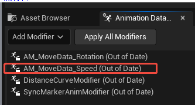
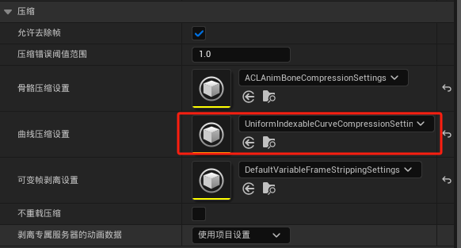

# 动画修改器

- 一般要生成这三个
1. 脚步同步
2. 旋转角度数值
3. 停下目标的距离曲线
## Locomotion动画修改器的应用
- 包含转身动作行为的要应用 Rotation 动画修改器
- 有起步停止行为的 要应用distance 动画修改器
- 所有移动都需要syncMarker同步组动画修改器
- 1D的移动动画需要应用speed动画修改器

# 曲线压缩设置

- 停止动画和急转向折返动画，因为涉及到距离匹配因此曲线压缩设置需要设成
- 