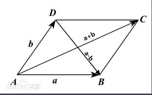
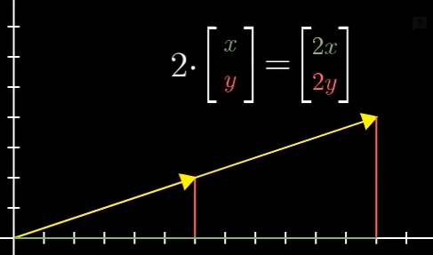

# 向量的定义
- 物理专业观点：向量是指向空间的箭头，决定一个向量的因素有两个，他的长度和他所指的方向。
- 计算机专业观点：向量是有序的数字列表。
- 数学专业观点：一般来说，具有向量间的加法（加法），常数与向量的乘法（数乘）。这两种运算规律的事物，就可以看作是向量。
- 在线性代数中：向量是以原点为起点的空间中的箭头。竖写代表向量，横写代表点。
- 向量没有位置，只有大小和方向。
$$\begin{bmatrix}
1\\
3
\end{bmatrix}$$
$$(-4, 2)$$
# 向量的运算
## 向量的长度
-3.png)
向量的长度为向量各个分量的平方和的平方根

$$
\vec{v}= \begin{bmatrix}
v_1\\
v_2\\
...\\
v_n
\end{bmatrix}
$$

$$||\vec{v}|| = \sqrt{v_1^2 + v_2^2 + ... + v_n^2}$$

长度为0的向量叫做**零向量**，记作长度等于1个单位的向量，叫做**单位向量**。
# 零向量
.png)
- 向量中所有分量均为0，零向量是一个没有方向长度为0的向量。
# 负向量
-1.png)
- 向量中的每一个分量*-1
- 向量+ 他的负向量结果为0
- 负向量和他的正向量方向相反，长度相等
- -2.png)
## 向量的加法
将各个向量依次首尾顺次相接，结果为第一个向量的起点指向最后一个向量的终点

$$\begin{bmatrix}
x_1\\
y_1
\end{bmatrix}
+\begin{bmatrix}
x_2\\
y_2
\end{bmatrix}
=\begin{bmatrix}
x_1 + y_1\\
x_2 + y_2
\end{bmatrix}$$
## 向量的减法

- 向量a-b 其实相当于 a+(-b),就是向量a加上反向的b

$$
\begin{bmatrix}
x_1\\
y_1
\end{bmatrix}
-\begin{bmatrix}
x_2\\
y_2
\end{bmatrix}
=\begin{bmatrix}
x_1 - y_1\\
x_2 - y_2
\end{bmatrix}
$$

## 向量加减法的平行四边形法则

## 向量的数乘

- 对向量进行倍数的缩放，用于缩放向量的数值被称为“标量”
$$
2 \cdot \begin{bmatrix}
x\\
y
\end{bmatrix}
=\begin{bmatrix}
2x\\
2y
\end{bmatrix}
$$


## 向量的点积
### 代数定义

- **点积**（英語：Dot Product）又称**数量积**或**标量积**（英語：Scalar Product），是一种接受两串等长的数字序列（通常是坐标向量）、返回单一数字的代数运算。
- 两个维数相同的向量点积的计算：等于他们对应分量积之和。结果为一个标量。

$$
\vec{a}= \begin{bmatrix}
a_1\\
a_2\\
...\\
a_n
\end{bmatrix}
$$

$$
\vec{b}= \begin{bmatrix}
b_1\\
b_2\\
...\\
b_n
\end{bmatrix}
$$

$$
\vec{a} \cdot \vec{b} = \sum_{i=1}^na_ib_i = a_1b_1 + a_2b_2+\cdot\cdot\cdot+ a_nb_n
$$
### 几何意义

- 可用于计算两个向量的夹角，所以当两个向量的指向大致相同时（夹角为锐角），他们的点积为正。当他们相互垂直时（夹角为直角），他们的点积就为零。两向量方向相反（夹角为钝角），此时点积会是负数。

$$\vec a \cdot \vec b = |\vec a||\vec b|\cos \theta$$
- 这里 $|\vec x|$表示的模（长度），$\theta$表示向量间的角度。

- 两个向量的点积，可看做向量$\vec a$向另一个向量$\vec b$做投影的投影长度再乘以$\vec b$的长度
- -1.png)

- $\vec a_b$为向量$\vec a$向向量$\vec b$的投影向量，$\vec b_a$为向量$\vec b$向向量$\vec a$的投影向量
$$\vec a \cdot \vec b = |\vec a_b||\vec b| = |\vec b_a||\vec a|$$
- 由此可计算投影向量或垂线向量
```python
import pymel.core as pm

# 示例向量
a = (3, 4, 0)
b = (1, 0, 0)

vec_a = pm.datatypes.Vector(a)
vec_b = pm.datatypes.Vector(b)

# 向量 a 在 b 上的投影向量
project_vec = vec_b.normal() * (vec_a.dot(vec_b) / vec_b.length())

# 向量 a 对向量 b 的垂线向量
vertical_vec = vec_a - project_vec

print("投影向量：", project_vec)
print("垂线向量：", vertical_vec)

```
## 量的叉积
-4.png)
### 代数定义

- **外积**（cross product）又称**叉积**、**叉乘**、**向量积**（vector product），结果为一个向量。

外积可以定义为：
$$\vec a \times \vec b =| \vec a ||\vec b | \sin \theta \vec n$$
其中，$\vec n$是一个与 $\vec a$、$\vec b$ 所构成的平面垂直的单位向量，方向由右手定则决定。
另有：
$$|\vec a \times \vec b| =| \vec a ||\vec b | \sin \theta $$
### 几何意义

- 对于线性无关的两个向量 $\vec a$和 $\vec b$它们的外积写作 是 $\vec a \times \vec b$，此向量是$\vec a$和 $\vec b$ 所在平面的法线向量，与$\vec a$和 $\vec b$都垂直，其方向由[右手定则](https://zh.wikipedia.org/wiki/%E5%8F%B3%E6%89%8B%E5%AE%9A%E5%89%87)决定。
- -5.png)
- [模长](https://zh.wikipedia.org/wiki/%E6%A8%A1%E9%95%BF)等于$\vec a$和 $\vec b$为边的[平行四边形](https://zh.wikipedia.org/wiki/%E5%B9%B3%E8%A1%8C%E5%9B%9B%E8%BE%B9%E5%BD%A2)的面积。如果面积接近于0，那么两个向量接近于平行或反向。
- -6.png)
- 常用于计算向量的旋转轴和平面的法线
# 代码

```python
import math


class Vector3:
    def __init__(self, x=0.0, y=0.0, z=0.0):
        # 初始化向量
        self.x = x
        self.y = y
        self.z = z

    def __repr__(self):
        # 返回向量的字符串表示
        return f"Vector3({self.x}, {self.y}, {self.z})"

    def __add__(self, other):
        # 返回两个向量的和
        return Vector3(self.x + other.x, self.y + other.y, self.z + other.z)

    def __sub__(self, other):
        # 返回两个向量的差
        return Vector3(self.x - other.x, self.y - other.y, self.z - other.z)

    def __mul__(self, scalar):
        # 向量与标量相乘
        return Vector3(self.x * scalar, self.y * scalar, self.z * scalar)

    def __truediv__(self, scalar):
        # 向量与标量相除
        return Vector3(self.x / scalar, self.y / scalar, self.z / scalar)

    def zero(self):
        # 返回零向量
        return Vector3(0, 0, 0)

    def opposite(self):
        # 返回向量的反向
        return Vector3(-self.x, -self.y, -self.z)

    def length(self):
        # 返回向量的长度
        return math.sqrt(self.x * self.x + self.y * self.y + self.z * self.z)

    def normalize(self):
        # 将向量规范化（单位化）
        len = self.length()
        if len != 0:
            return self / len
        raise ValueError("Cannot normalize a zero-length vector")

    def dot(self, other):
        # 计算两个向量的点积
        return self.x * other.x + self.y * other.y + self.z * other.z

    def cross(self, other):
        # 计算两个向量的叉积
        return Vector3(
            self.y * other.z - self.z * other.y,
            self.z * other.x - self.x * other.z,
            self.x * other.y - self.y * other.x,
        )

    def angle_radians(self, other):
        # 计算两个向量的夹角（弧度制）
        dot_product = self.dot(other)
        len_self = self.length()
        len_other = other.length()
        if len_self == 0 or len_other == 0:
            raise ValueError("Cannot compute angle with zero-length vector")
        cos_theta = dot_product / (len_self * len_other)
        return math.acos(min(1, max(cos_theta, -1)))  # 确保cos_theta在[-1, 1]之间

    def angle_degrees(self, other):
        # 计算两个向量的夹角（度制）
        return math.degrees(self.angle(other))

    def distance(self, other):
        # 计算两点之间的距离
        return math.sqrt(
            (self.x - other.x) ** 2 + (self.y - other.y) ** 2 + (self.z - other.z) ** 2
        )

    def to_list(self):
        return [self.x, self.y, self.z]

    def to_tuple(self):
        return (self.x, self.y, self.z)


if __name__ == "__main__":
    # 测试
    v1 = Vector3(1, 2, 3)
    v2 = Vector3(4, 5, 6)

    print(f"v1: {v1}")
    print(f"v2: {v2}")
    print(f"v1 + v2: {v1 + v2}")
    print(f"v1 - v2: {v1 - v2}")
    print(f"v1 * 3: {v1 * 3}")

    print(f"v1 length: {v1.length()}")
    print(f"v1 normalized: {v1.normalize()}")

    print(f"v1 zero: {v1.zero()}")
    print(f"v1 opposite: {v1.opposite()}")

```