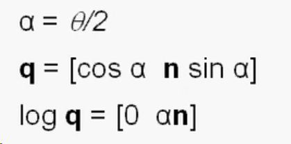
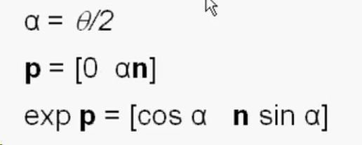
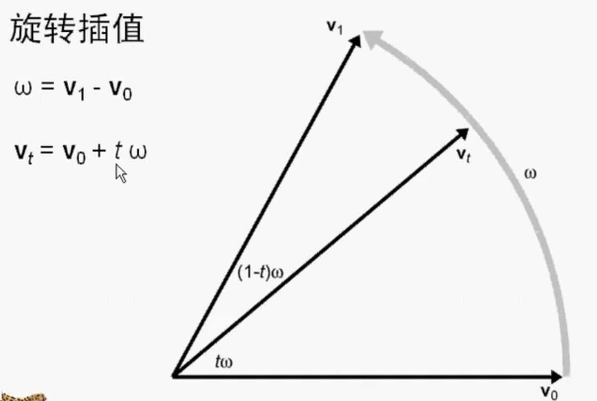
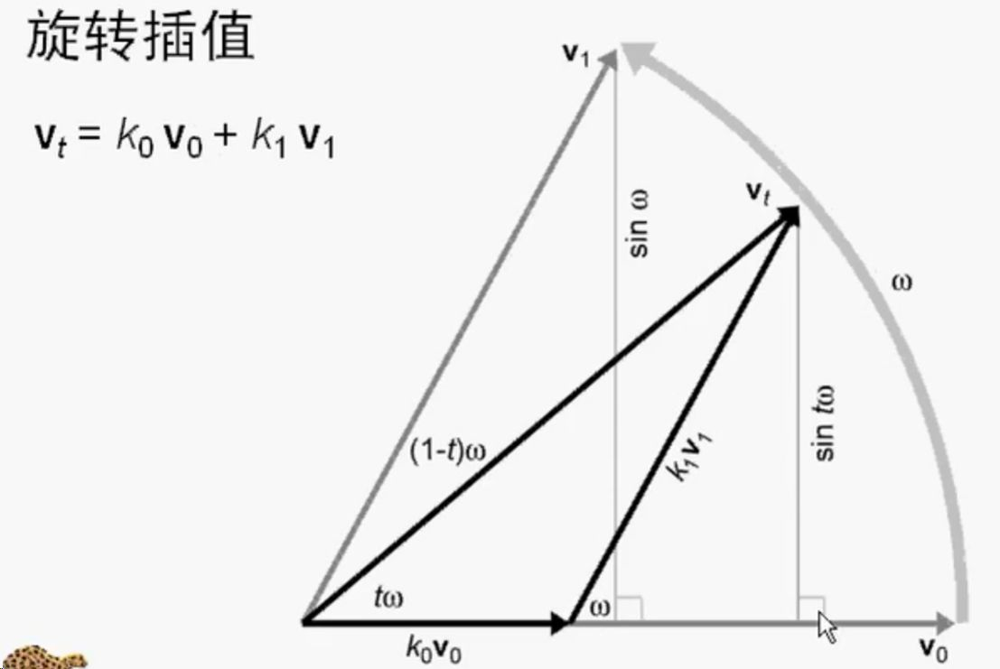
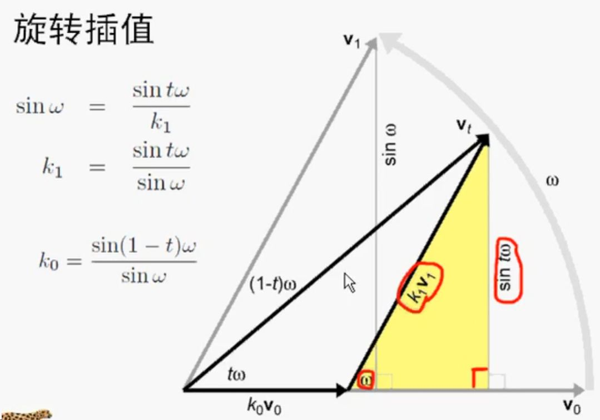
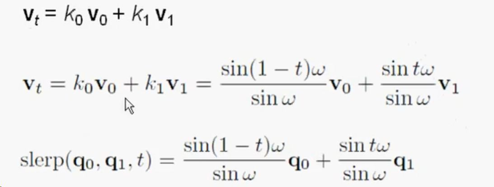

四元数（Quaternion）是一种数学工具，用于表示和处理三维空间中的旋转，广泛应用于计算机图形学、机器人学、航空航天等领域。以下是对四元数的简要介绍，涵盖其定义、性质、运算及应用。

# 1. **定义**
四元数是由威廉·罗文·汉密尔顿（William Rowan Hamilton）于1843年引入的数学对象，形式为：
$$
q = w + xi + yj + zk
$$
- 其中 $w, x, y, z \in \mathbb{R}$ 是实数，\(i, j, k\) 是虚数单位，满足：
  $$
  i^2 = j^2 = k^2 = ijk = -1
  $$
- 四元数可以表示为一个标量加一个三维向量：$q = (w, \mathbf{v})$，其中 $\mathbf{v} = (x, y, z)$。

对于表示旋转的四元数，通常是单位四元数（模长为1），即：
$$
w^2 + x^2 + y^2 + z^2 = 1
$$

# 2. **四元数的运算**
- 负四元数，将每个分量取负值
	- $q = w + xi + yj + zk$
	- $-q = -w - xi - yj - zk$
- 单位四元数
	- $q = w + xi + yj + zk$
	- 其中w = 1，xyz均为0，表示无旋转
- **加法**：两个四元数 $q_1 = w_1 + x_1i + y_1j + z_1k$, $q_2 = w_2 + x_2i + y_2j + z_2k$ 的加法为：
  $$
  q_1 + q_2 = (w_1 + w_2) + (x_1 + x_2)i + (y_1 + y_2)j + (z_1 + z_2)k
  $$

  具体计算较为复杂，通常用矩阵或向量形式简化。
- **共轭**：$q^* = w - xi - yj - zk$。
- **模长**：$\|q\| = \sqrt{w^2 + x^2 + y^2 + z^2}$。因为四元数用于旋转，一般模长为1，为规范四元数。
- **逆**：四元数的逆表示相反方向的旋转。
	- 四元数的逆等于四元数的共轭除以四元数的模：$q^{-1} = q^* / \|q\|^2$。
	- 单位四元数的逆等于四元数的共轭，$q^{-1} = q^*$；
- **乘法**：
$$
\begin{aligned}
q_aq_b&=[s_a,a][s_b,b]\\
&=(s_a+x_ai+y_aj+z_ak)(s_b+x_bi+y_bj+z_bk)\\
&=(s_as_b−x_ax_b−y_ay_b−z_az_b)\\
&+(s_ax_b+s_bx_a+y_az_b−y_bz_a)i\\
&+(s_ay_b+s_by_a+z_ax_b−z_bx_a)j\\
&+(s_az_b+s_bz_a+x_ay_b−x_by_a)k
\end{aligned}
$$
	- 化简得到四元数乘法的一般式：
$$
q_aq_b=[s_as_b−a⋅b,s_ab+s_ba+a×b]
$$
	- 其中，a⋅b为向量点乘，a×b为向量叉乘
	- 四元数乘法符合结合律不符合交换律
	- 
- 点乘：
	- 对于两个四元数  $q_1 = w_1 + x_1i + y_1j + z_1k$  和  $q_2 = w_2 + x_2i + y_2j + z_2k$，点乘定义为：
$$
q_1 \cdot q_2 = w_1 w_2 + x_1 x_2 + y_1 y_2 + z_1 z_2​
$$
	或者用标量-向量形式：
$$
q_1 \cdot q_2 = w_1 w_2 + \mathbf{v}_1 \cdot \mathbf{v}_2
$$
	其中 v1⋅v2 ​ 是虚部向量的点乘。
- 对数
	[Open: Pasted image 20250724123207.png](attachments/33b953306e02f06c6ac521db3cb57344_MD5.jpeg)

- 指数
[Open: Pasted image 20250724123220.png](attachments/078c17c099d17afb46ee36bff855319b_MD5.jpeg)

# 3. **四元数与旋转**
[【Numberphile数字狂】神奇四元数 @柚子木字幕组_哔哩哔哩_bilibili](https://www.bilibili.com/video/BV1Cs411X7kT/?spm_id_from=333.337.search-card.all.click&vd_source=0f765d25b29efef66dd4ff586509e026)
#### 旋转公式
- **旋转表示**：一个单位四元数 $q = w + xi + yj + zk$ 可以表示绕单位向量 $\mathbf{n} = (n_x, n_y, n_z)$ 旋转角度 $\theta$，其中：
  $$
  w = \cos\left(\frac{\theta}{2}\right), \quad (x, y, z) = \sin\left(\frac{\theta}{2}\right) \mathbf{n}
  $$
- 四元数q也可以写为：$q = [s, v]$，其中$s = w$，$v = (x,y,z)$向量，旋转四元数为：
$$
q=\big[cos(\frac{1}{2}θ),sin(\frac{1}{2} θ )v\big]
$$
	- 表示绕向量$v$旋转$θ$角
- **旋转操作**：对一个三维向量 $\mathbf{v}$，通过四元数$q$旋转得到的新向量为：
  $$
  \mathbf{v}' = q \mathbf{v} q^{-1}
  $$
  其中 $\mathbf{v}$ 被视为纯四元数 $(0, \mathbf{v})$，$q^{-1}$ 是 $q$ 的共轭（$q^{-1} = w - xi - yj - zk$）。
#### 连续旋转
- 将一个向量P先用a四元数进行旋转，再用b四元数进行旋转,，就等于向量P用四元数ba相乘进行旋转
$$
\begin{aligned}
p' &= b(apa^{-1})b^{-1} \\
   &= (ba)p(a^{-1}b^{-1}) \\
   &= (ba)p(ba)^{-1}
\end{aligned}
$$

# 4. **与旋转矩阵的转换**
- **四元数到旋转矩阵**：对于单位四元数 $q = w + xi + yj + zk$，对应的旋转矩阵为：
  $$
  R = \begin{bmatrix}
  1 - 2y^2 - 2z^2 & 2xy - 2wz & 2xz + 2wy \\
  2xy + 2wz & 1 - 2x^2 - 2z^2 & 2yz - 2wx \\
  2xz - 2wy & 2yz + 2wx & 1 - 2x^2 - 2y^2
  \end{bmatrix}
  $$
- **旋转矩阵到四元数**：通过矩阵元素可反推出 \(w, x, y, z\)，需考虑数值稳定性。

# 5.与欧拉角的转换

#### 四元数转换为欧拉角

##### 背景

一个单位四元数 $q = w + xi + yj + zk$ （满足  $w^2 + x^2 + y^2 + z^2 = 1$ ）可以转换为欧拉角 $(\phi, \theta, \psi)$，其中：

- ϕ：绕 X 轴旋转。
- θ：绕 Y 轴旋转。
- ψ：绕 Z 轴旋转。

##### 公式（Z-Y-X 顺序）

四元数q = (w, x, y, z) 转换为欧拉角的公式如下：
$$
\begin{aligned}
\phi &= \text{atan2}(2(w x + y z), 1 - 2(x^2 + y^2))\\
\theta &= \arcsin(2(w y - z x))\\
\psi &= \text{atan2}(2(w z + x y), 1 - 2(y^2 + z^2))\\
\end{aligned}
$$
这些公式基于四元数对应的旋转矩阵元素推导，适用于 Z-Y-X 顺序。注意：

- atan2 是反正切函数，考虑了象限，范围为$[- \pi, \pi]$。
- θ的范围为 $[- \pi/2, \pi/2]$，在极点（$\theta = \pm \pi/2$）可能出现万向锁问题。

#### 欧拉角转换为四元数

##### 背景

给定欧拉角 $(\phi, \theta, \psi)$（Z-Y-X 顺序），可以构造对应的单位四元数  $q = w + xi + yj + zk$ 。Z-Y-X 顺序意味着先绕 Z 轴旋转 $\psi$，再绕 Y 轴旋转 $\theta$，最后绕 X 轴旋转$\phi$。

##### 公式（Z-Y-X 顺序）

四元数 q=(w,x,y,z) q = (w, x, y, z) q=(w,x,y,z) 的分量为：

$$
\begin{aligned}
w = \cos(\phi/2) \cos(\theta/2) \cos(\psi/2) + \sin(\phi/2) \sin(\theta/2) \sin(\psi/2)\\
x = \sin(\phi/2) \cos(\theta/2) \cos(\psi/2) - \cos(\phi/2) \sin(\theta/2) \sin(\psi/2)\\
y = \cos(\phi/2) \sin(\theta/2) \cos(\psi/2) + \sin(\phi/2) \cos(\theta/2) \sin(\psi/2)\\
z = \cos(\phi/2) \cos(\theta/2) \sin(\psi/2) - \sin(\phi/2) \sin(\theta/2) \cos(\psi/2)\\
\end{aligned}
$$

# 6. 四元数的插值

四元数的插值是三维旋转处理中的重要技术，特别是在动画、机器人学和计算机图形学中，用于在两个旋转（由四元数表示）之间平滑过渡。常用的四元数插值方法是**球面线性插值（Spherical Linear Interpolation, SLERP）**，它确保插值路径在单位球面上保持均匀的角速度。以下是四元数插值的详细介绍，聚焦于 SLERP，包含原理、公式、步骤和代码实现。

---

### 1. 为什么需要四元数插值？

- **欧拉角插值的局限**：直接对欧拉角插值可能导致不自然的旋转路径、万向锁（gimbal lock）或非均匀的角速度。
- **旋转矩阵插值的局限**：矩阵插值可能破坏正交性，且计算复杂。
- **四元数的优势**：四元数表示旋转是紧凑的（4个数），单位四元数位于单位球面上，适合球面插值，且避免了万向锁。SLERP 提供最短的旋转路径（大圆弧）和恒定的角速度。

---

### 2. 球面线性插值（SLERP）原理

SLERP 在两个单位四元数 $q_1$ 和  $q_2$  之间插值，生成中间四元数 $q(t)$ ，其中 $t \in [0, 1]$ 是插值参数：

- t = 0 时， $q(t) = q_1$ 
- t=1 时，$q(t) = q_2$ 
- $0 < t < 1$ 时，q(t) 表示从 $q_1$ ​ 到 $q_2$ 的平滑过渡。

SLERP 确保插值路径是大圆弧（最短路径），并保持单位四元数的性质。

---

### 3. SLERP 公式
#### 原理
- 我们先来看线性插值
	- 起点为$a_0$，终点为$a_1$，他们之间的差就是两者间的距离为$a_d = a_1 - a_0$
	- 我们要计算两点之间的任意点，要使用系数t，范围(0:1)，$t * a_d$为变化量
	- 所以：$Lerp（a_0, a_1, t）= a_0 + t * a_d$
- 我们再来看四元数线性插值
	- 起点为$q_0$，终点为$q_1$，他们之间的夹角为$q_d = q_0^{-1}q_1$
	- 我们要计算两个旋转之间的任意点，要使用系数t，范围(0:1)，$(q_d)^t$为变化量，要计算四元数$q_d$的$t$次方，指数关系（t=0.5，就是四元数的0.5次方，就是一半了）。
	- 所以：
$$
slerp(q_0,q_1,t) = q_0(q_t)^{t} = q_0(q_0^{-1}q_1)^{t}
$$
	- 但是这种方法不利于编程，所以我们使用几何的计算方法。

[Open: Pasted image 20250724115942.png](attachments/47c6f99462e63070e4c4ff994b3f2790_MD5.jpeg)

- 向量$v_0$旋转到向量$v_1$，夹角为ω，t为系数(0:1)，插值$v_t = v_0 + tω$
- 我们使用几何方法
[Open: Pasted image 20250724120650.png](attachments/660c41fdd12bd60d5cda2744c9fe1dc1_MD5.jpeg)

- 向量$v_0$乘以一个系数$k_0$（<1），使其缩短
- 向量$v_1$平移并且也乘以一个系数$k_1$（<1）使其缩短
- 我们插值计算的$v_t$向量就等于$v_t = k_0v_0 + k_1v_1$
- 我们使用三角函数来计算$k_0$和$k_1$的值
[Open: Pasted image 20250724121513.png](attachments/505cf9c1705f19e81ff650e83ec1580c_MD5.jpeg)

- 将计算出的$k_1$和$k_0$代入$v_t = k_0v_0 + k_1v_1$
[Open: Pasted image 20250724121830.png](attachments/c9b4d973702dd0870265a0353e1837d1_MD5.jpeg)

给定两个单位四元数  $q_1 = (w_1, x_1, y_1, z_1)$ 和  $q_2 = (w_2, x_2, y_2, z_2)$ ，SLERP 的公式为：
$$
q(t) = \frac{\sin((1-t)\theta)}{\sin\theta} q_1 + \frac{\sin(t\theta)}{\sin\theta} q_2
$$
其中：

- $\theta$ 是 q1 ​ 和 q2  之间的夹角，计算为： 
- $cos\theta = q_1 \cdot q_2 = w_1 w_2 + x_1 x_2 + y_1 y_2 + z_1 z_2$
- ​ $\theta = \arccos(\text{clamp}(q_1 \cdot q_2, -1, 1))$
- $\text{clamp}(x, -1, 1)$ 确保点积在 $[-1, 1]$内，避免数值误差。

#### 处理特殊情况

1. **四元数双覆盖**：q2​ 和 −q2 ​ 表示相同旋转。若  $q_1 \cdot q_2 < 0$ ，使用 $-q_2$  插值可得到更短路径： 
$$
\text{if } q_1 \cdot q_2 < 0, \text{ then } q_2 \gets -q_2
$$
2. **接近重合**：若 $\theta \approx 0$（即  $q_1 \approx q_2$ ​），$\sin\theta \approx 0$ 会导致数值不稳定，此时可使用线性插值（LERP）： 
$$
q(t) = (1-t) q_1 + t q_2
$$
	然后归一化：

$$
q(t) = \frac{q(t)}{\|q(t)\|} 
$$
1. **相反旋转**：若 $\theta \approx \pi$（即 $q_1 \approx -q_2$ ​），SLERP 可能不稳定，需特殊处理（通常少见）。

---

### 4. SLERP 步骤

1. **归一化输入**：确保 $q_1$ 和 $q_2$是单位四元数。
2. **计算夹角**：
    - 计算点积  $\cos\theta = q_1 \cdot q_2$ 。
    - 若 cos⁡θ<0，取  $q_2 = -q_2$ ​，重新计算点积。
    - 计算 $\theta = \arccos(\cos\theta)$。
3. **检查特殊情况**：
    - 若 $\theta < \epsilon$（如  $10^{-6}$ ），使用归一化的线性插值。
4. **计算插值**：
    - 使用 SLERP 公式计算 $q(t)$ 。
5. **归一化输出**（可选）：确保 $q(t)$ 是单位四元数。

# 7. **四元数的优点**
- **避免万向锁**：相比欧拉角，四元数不会因特定角度组合导致自由度丢失。
- **平滑插值**：通过球面线性插值（SLERP），四元数可以实现平滑的旋转过渡，适合动画。
- **计算效率**：四元数运算比旋转矩阵更节省空间（4个数 vs 9个数），且在某些场景下计算更快。
- **数值稳定性**：四元数在连续旋转中更稳定，避免累积误差。

# 8. **应用场景**
- **计算机图形学**：在 OpenGL、Unity、Unreal Engine 中用于物体和相机的旋转。
- **机器人学**：描述机械臂或移动机器人的姿态。
- **航空航天**：控制飞行器（如无人机、卫星）的方向。
- **虚拟现实/增强现实**：实现头部跟踪和视角变换。
- **物理模拟**：处理刚体动力学中的角速度和姿态。

# 9. **注意事项**
- **单位化**：为确保旋转有效，四元数需保持单位模长，必要时需归一化。
- **双覆盖**：四元数 \(q\) 和 \(-q\) 表示相同的旋转，需在插值或比较时注意。
- **实现**：在实际编程中（如 C++、Python），四元数库（如 Eigen、glm）可简化运算。