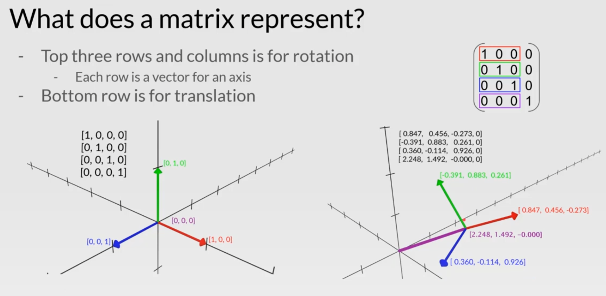
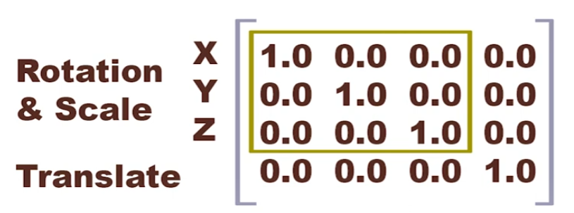
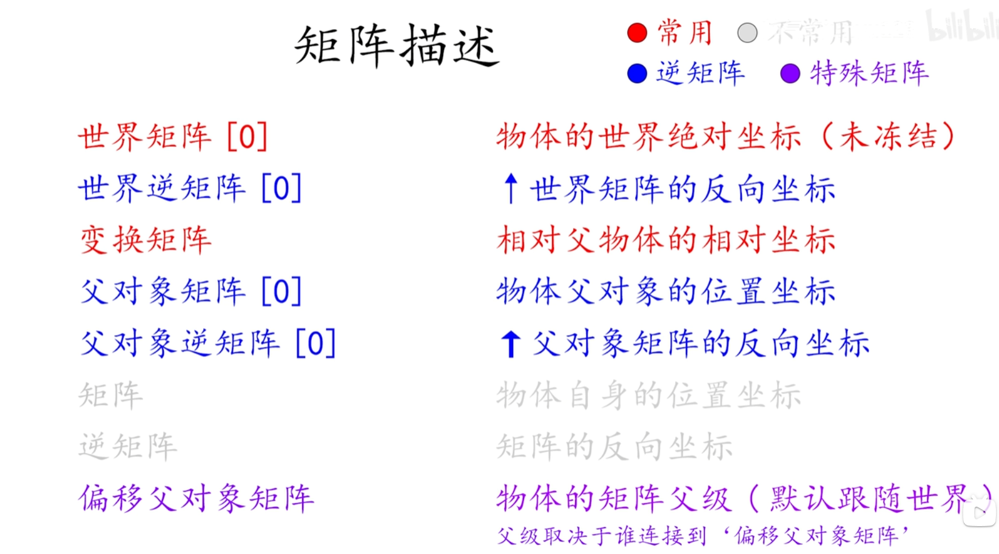

- [Maya Math](#maya-math)
  - [Vector in Maya](#vector-in-maya)
    - [python example](#python-example)
    - [在三维空间中，判断四点共面](#在三维空间中判断四点共面)
  - [Matrix In Maya](#matrix-in-maya)
    - [maya矩阵中各个元素的意义](#maya矩阵中各个元素的意义)
    - [矩阵的旋转](#矩阵的旋转)
    - [矩阵的变换顺序(Matrix transform order)](#矩阵的变换顺序matrix-transform-order)
    - [矩阵的转换](#矩阵的转换)
  - [linear interpolation(lerp)](#linear-interpolationlerp)
    - [线性插值代码案例](#线性插值代码案例)

# Maya Math

## [2.0-向量(Vector)](2.0-向量(Vector).md) in Maya

### python example

```python
import math
import pymel.core as pm
import pymel.core.datatypes as dt

# get vector
obj = pm.PyNode("locator1")
vec = obj.getTranslation(ws=True)
# get components
x = vec.x
y = vec.y
z = vec.z
print(x, y, z)
# set components
vec.x = 0
vec.y = 0
vec.z = 1
print(vec)
# add vectors
other_vec = dt.Vector(1, 0, 0)
added_vec = vec + other_vec
print(added_vec)
# subtract vectors
subtracted_vec = vec - other_vec
print(subtracted_vec)
# multiply vectors
multiplied_vec = vec * 2
print(multiplied_vec)
# get vector length
length = vec.length()
print(length)
# get vector distance
distance = vec.distanceTo(other_vec)
print(distance)
# get normalized vector
vec_normalized1 = vec.normal()  # 返回一个向量归一化副本
vec.normalize()  # 直接修改向量为归一化向量
print(vec_normalized1)
# dot product
dot_product = vec.dot(other_vec)
print(dot_product)
# cross product
cross_product1 = vec ^ other_vec
cross_product2 = vec.cross(other_vec)
print(cross_product1, cross_product2)
# get angle between vectors
angle = math.degrees(vec.angle(other_vec))  # angle（）获得两个向量之间的弧度，degrees（）将弧度转化为角度。
print(angle)
# rotate by vector
radians = dt.Vector(math.radians(90), 0, 0)  # math.radians将角度转化为弧度，得到一个弧度向量radians
rotateBy_vec_a = vec.rotateBy(radians)  # 使向量vec按照弧度向量radians旋转（x轴旋转90°）
rotateBy_vec_b = vec.rotateBy(dt.Vector.yAxis, math.radians(90))  # 也可以只选择一个轴进行旋转，YAxis意为Y轴
print(rotateBy_vec_a, rotateBy_vec_b)
# rotate to vector
rotateTo_vec = vec.rotateTo(other_vec)  # 返回的是一个四元数
```

### 在三维空间中，判断四点共面

- 假设有四个点A(x1, y1, z1), B(x2, y2, z2), C(x3, y3, z3), 和 D(x4, y4, z4)。
- 构建向量AB、AC和AD，分别表示从点A到B、C和D的向量。
- 计算向量AB和向量AC的叉乘，得到一个法向量N。
- 计算向量AD与法向量N的点积。如果点积为零，即AD·N = 0，那么这四个点共面。如果点积不为零，则这四个点不共面。

## [3.0-矩阵（Matrix ）](3.0-矩阵（Matrix%20）.md) In Maya

### maya矩阵中各个元素的意义



- Maya矩阵各个元素描述：



- Maya中的矩阵第一行前三位为X轴坐标（用于描述旋转和缩放）
- Maya中的矩阵第二行前三位为Y轴坐标（用于描述旋转和缩放）
- Maya中的矩阵第三行前三位为Z轴坐标（用于描述旋转和缩放）
- Maya中的矩阵第四行前三位为轴心位移坐标（用于描述位移）
- maya矩阵第四列通常是 (0, 0, 0, 1)，用于齐次坐标计算。

- maya单位矩阵
  $$
  \begin{bmatrix}
  1 & 0 & 0 & 0 \\
  0 & 1 & 0 & 0 \\
  0 & 0 & 1 & 0 \\
  0 & 0 & 0 & 1
  \end{bmatrix}
  $$

### 矩阵的旋转

- 如果maya中对象沿Z轴旋转30度
  $\theta = 30^\circ \cdot \frac{\pi}{180}$
- 其矩阵为
  $$
  \begin{bmatrix}
  \cos(\theta) & \sin(\theta) & 0 & 0 \\
  -\sin(\theta) & \cos(\theta) & 0 & 0 \\
  0 & 0 & 1 & 0 \\
  0 & 0 & 0 & 1
  \end{bmatrix}
  $$
- 计算可得
  $$
  \begin{bmatrix}
  0.866 & 0.5 & 0 & 0 \\
  -0.5 & 0.866 & 0 & 0 \\
  0 & 0 & 1 & 0 \\
  0 & 0 & 0 & 1
  \end{bmatrix}
  $$

### 矩阵的变换顺序(Matrix transform order)

- $[M]^{-1} = [sp] * [s] * [sh] * [sp]^{-1} * [st] * [rp] * [ar] * [ro] * [rp] * [rt] * [t]$
  - [sp] = scale  pivot  matrix

$$
  \begin{bmatrix}
  1 & 0 & 0 & 0 \\
  0 & 1 & 0 & 0 \\
  0 & 0 & 1 & 0 \\
  -spx & -spy & -spz & 0
  \end{bmatrix}
$$

```
- [s] = scale matrix
```

$$
\begin{bmatrix}
sx  &   0    &    0    &   0 \\
0   &   sy   &    0   &    0 \\
0  &    0   &     sz  &    0 \\
0   &   0     &   0  &     1 |
\end{bmatrix}
$$

```
- [sh] = shear matrix
```

$$
\begin{bmatrix}
  1   &   0    &    0    &   0 \\
  xy   &  1    &    0    &   0 \\
  xz   &  yz    &   1    &   0 \\
  0   &   0     &   0    &   1 
\end{bmatrix}
$$

$[sp]^{-1}$ = scale pivot inverse matrix

$$
\begin{bmatrix}
 1   &    0    &   0   &    0 \\
 0    &   1    &   0   &    0 \\
 0   &    0   &    1   &    0 \\
 spx   &  spy    & spz  &   1 
\end{bmatrix}
$$

[st] = scale translate matrix

$$
\begin{bmatrix}
 1    &   0   &    0    &   0 \\
 0    &   1    &   0    &   0 \\
 0   &    0     &  1    &   0 \\
 stx   &  sty   &  stz  &   1 
\end{bmatrix}
$$

[rp] = rotate pivot matrix
$$\begin{bmatrix}
  1   &    0   &    0   &    0 \\
  0     &  1    &   0    &   0 \\
  0    &   0    &   1    &   0 \\
 -rpx   & -rpy   & -rpz &    1 \\
\end{bmatrix}$$

 [ar] =  axis rotation matrix
(composite rotation,see [rx], [ry], [rz] below for details)
$$\begin{bmatrix}
\  *   &    *   &    *   &    0 \\
\  *   &   *    &   *    &   0 \\   
\  *   &    *    &   *    &   0 \\    
\  0    &  0     &  0   &    1 \\    
\end{bmatrix}$$

[rx] =  rotate X matrix
$$\begin{bmatrix}
  1   &    0   &    0   &    0 \\
  0    &   cos(x) & sin(x) & 0 \\
  0   &   -sin(x) & cos(x) & 0 \\
  0   &    0   &   0   &    1 \\
\end{bmatrix}$$

[ry] = rotate Y matrix
$$\begin{bmatrix}
  cos(y) & 0   &   -sin(y) & 0 \\
  0     &  1  &     0   &    0 \\
  sin(y) & 0   &    cos(y) & 0 \\
  0    &   0    &   0   &    1 \\
\end{bmatrix}$$

[rz] = rotate Z matrix
$$\begin{bmatrix}
  cos(z) & sin(z) & 0   &    0 \\
 -sin(z) & cos(z) & 0     &  0 \\
  0    &   0    &   1   &    0 \\
  0   &    0    &   0    &   1 \\
\end{bmatrix}$$
    - R =  RX * RY * RZ
    - $[rp]^{-1}$ = rotate pivot matrix
$$\begin{bmatrix}
  1    &   0    &   0   &    0 \\
  0   &    1   &    0   &    0 \\
  0   &    0   &    1     &  0 \\
  rpx   &  rpy  &   rpz   &  1 \\
\end{bmatrix}$$

[rt] = rotate translate matrix
$$\begin{bmatrix}
  1   &    0   &    0   &    0 \\
  0    &   1    &   0   &    0 \\
  0    &   0    &   1    &   0 \\
  rtx   &  rty   &  rtz  &   1 \\
\end{bmatrix}$$
    - [t] = translation matrix
$$\begin{bmatrix}
  1   &    0    &   0    &   0 \\
  0    &   1   &    0   &    0 \\
  0   &    0    &   1   &    0 \\
  tx   &   ty   &   tz  &    1 \\
\end{bmatrix}$$
简言之，缩放——斜切——旋转——位移，依次执行。

### 矩阵的转换
- child World Matrix     = child Local Matrix * Parent World Matrix
- child Local Matrix     = child World Matrix * Parent World Matrix.inverse()
- init Child World Matrix= offset Matrix * init Parent World Matrix 
- offset Matrix          = init Child World Matrix * init Parent World Matrix.inverse()
- child World Matrix     = offset Matrix * parent World Matrix
- child Local Matrix     = offset Matrix *parent Matrix * child Parent Matrix.inverse()
```python
import math
import pymel.core as pm
import pymel.core.datatypes as dt
# 手动设置矩阵
a = dt.Matrix([
    [3.1324578069247884, 0.29919305978615185, 0.7407371045155786, 0.0],
    [-0.19225011009577528, 3.191677834104045, -0.4761642108048981, 0.0],
    [-0.7754017282663777, 0.41734395102731425, 3.1104784267917376, 0.0],
    [-27.532081130166546, -302.4986190328789, 85.98686530544654, 1.0]
])

b = dt.Matrix(
    3.1324578069247884, 0.29919305978615185, 0.7407371045155786, 0.0,
    -0.19225011009577528, 3.191677834104045, -0.4761642108048981, 0.0,
    -0.7754017282663777, 0.41734395102731425, 3.1104784267917376, 0.0,
    -27.532081130166546, -302.4986190328789, 85.98686530544654, 1.0
)
# 获取对象矩阵
obj = pm.PyNode("locator3")
cube = pm.PyNode("pCube1")

obj_matrix = obj.getMatrix()
cube_matrix = cube.getMatrix()
# 设置对象矩阵
cube.setMatrix(obj_matrix)
# 矩阵相乘
multiply_mat = obj_matrix * cube_matrix
# 逆矩阵
inverse_matrix = obj_matrix.inverse()
# 将矩阵转化为变换矩阵
transformation_matrix = dt.TransformationMatrix(cube_matrix)
# 变换空间
Transform_space = dt.Space.kTransform
World_space = dt.Space.kWorld
# 获取变换矩阵元素
translation = transformation_matrix.getTranslation(Transform_space)  # 获取变换矩阵位移
scale = transformation_matrix.getScale(Transform_space)  # 获取变换矩阵缩放
rotation = [math.degrees(x) for x in transformation_matrix.getRotation()]  # 获取变换矩阵旋转，将弧度转化为度
shear = transformation_matrix.getShear(Transform_space)  # 获取变换矩阵斜切
# 设置变换矩阵元素
transformation_matrix.setTranslation(dt.Vector(1, 1, 1), Transform_space)  # 设置变换矩阵位移
# 设置变换矩阵旋转
transformation_matrix.setRotation(dt.Vector(30, 30, 30))
transformation_matrix.setScale(dt.Vector(1, 1, 1), Transform_space)  # 设置变换矩阵缩放
transformation_matrix.setShear(dt.Vector(1, 1, 1), Transform_space)  # 设置变换矩阵斜切
# 添加到变换矩阵元素
transformation_matrix.addTranslation(dt.Vector(2, 2, 2), Transform_space)  # 添加变换矩阵位移
# 添加变换矩阵旋转
rotation_order = dt.TransformationMatrix.RotationOrder.XYZ  # 设置旋转顺序为XYZ
# 添加变换矩阵旋转，参数1：旋转向量，参数2：旋转次序，参数3：空间。
transformation_matrix.addRotation(dt.Vector(30, 30, 30), rotation_order, Transform_space)
# 通过四元数添加旋转
transformation_matrix.rotateBy(dt.Quaternion(0, 0, 0, 1), Transform_space)
transformation_matrix.addScale(dt.Vector(1, 1, 1), Transform_space)  # 添加变换矩阵缩放
transformation_matrix.addShear(dt.Vector(1, 1, 1), Transform_space)  # 添加变换矩阵斜切

# 变换矩阵转化为矩阵
matrix_a = transformation_matrix.asMatrix()
cube.setMatrix(matrix_a)
```
## linear interpolation(lerp)
### 线性插值代码案例
```python
def lerp(a: float, b: float, t: float) -> float:
    """在给定的范围 a 到 b 上进行线性插值，使用 t 作为该范围上的插值点。

    Parameters:
    a (float): 起始值.
    b (float): 结束值.
    t (float): 差值因子.

    Returns:
    float: 插值.

    Examples
    --------
        50 == lerp(0, 100, 0.5)
        4.2 == lerp(1, 5, 0.8)
    """
    return (1 - t) * a + t * b


def inv_lerp(a: float, b: float, v: float) -> float:
    """
    逆线性插值，获取 v 所在的 a 和 b 之间的分数。

    Parameters
    ----------
    a : float
        范围的下限。
    b : float
        范围的上限。
    v : float
        要计算分数的值。

    Returns：
    float：“v”所在的“a”到“b”之间的分数

    Examples
    --------
    0.5 == inv_lerp(0, 100, 50)
    0.8 == inv_lerp(1, 5, 4.2)
    """
    return (v - a) / (b - a)


def remap(i_min: float, i_max: float, o_min: float, o_max: float, v: float) -> float:
    """
    将一个线性比例尺上的值重新映射到另一个线性比例尺上，结合了线性插值和反线性插值。

    Args:
        i_min (float): 输入比例尺的最小值。
        i_max (float): 输入比例尺的最大值。
        o_min (float): 输出比例尺的最小值。
        o_max (float): 输出比例尺的最大值。
        v (float): 需要重新映射的值。

    Returns:
        float: 重新映射后的值。

    Examples:
        45 == remap(0, 100, 40, 50, 50)
        6.2 == remap(1, 5, 3, 7, 4.2)
    """
    return lerp(o_min, o_max, inv_lerp(i_min, i_max, v))
    # return (1 - (v - i_min) / (i_max - i_min)) * o_min + (v - i_min) / (i_max - i_min) * o_max
```