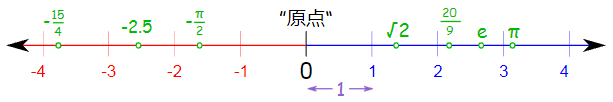
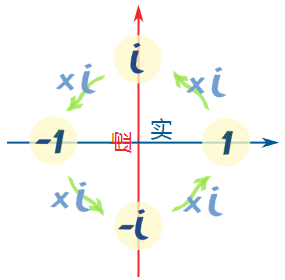
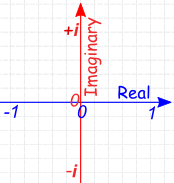
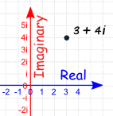
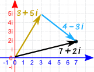
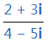
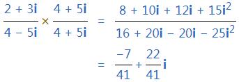
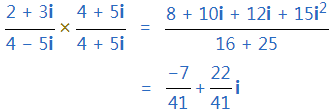
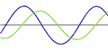

本文链接：[https://blog.csdn.net/hlzgood/article/details/110660281](https://blog.csdn.net/hlzgood/article/details/110660281)

- **实数**

- 我们想象到的数差不多都是实数。

- 实数包括：

- 整数 ： 像 0、1、2、3、-1、-2 等等。

- 有理数： 像 3/4、0.125、0.333……、1.1 等等。

- 无理数：想 π , √2 等等。

- 什么不是实数：

- 虚数： 像  √−1 。

- 无穷大

- 实数直线（用几何直线来描述实数）：

- 实数是相对虚数来说的，直到有虚数后，才把非虚数叫做实数。

- **虚数**

- 虚数的定义：虚数的平方是负数。如：

- 但是，正数的平方是正数、负数的平方也是正数，也就是一个数的平方永远是正数或零。	

- 那么虚数有什么用？可以用来做什么？

- 我们可以假设有这样的数，称之为 i：

- i * i = -1

- 两边开平方根得到

- 

- 也就是 i 是 -1 的平方根。

- 如果我们接受了 i 的存在，就可以解答很多牵涉到负数平方根的问题了。

- 例子：-9的平方根是多少？

解答： √−9  = √(9 × −1) = √(9) × √(−1) = 3 × √(−1) = 3i

所以，负数的平方根等于该数为正时的平方根乘以 i：

√(−x) = i√x

- 有了虚数后，我们就可以解开一些之前无法求解的方程。

例子：解  x^ 2  = −1。

解：

x = ± √(−1)

x = ± i

检验结果：

(−i)2 = (−i)(−i) = +i2 = −1

(+i)2 = (+i)(+i) = +i2 = −1

- 实数的“单位”是 1，虚数的“单位”是 √(−1)，在数学中用 i 表示虚数。

- 虚数的用处？

- 虚数和实数结合在一起成为了复数，复数的用途非常广大。

- 虚数有趣的属性

- 虚数单位 i  有个有趣的属性。它自乘的积在四个答案里"循环重复"：

- 结论： 虚数不是"虚"幻的，它实际存在，并且非常有用。

- **复数**

- 复数是实数和虚数的组合：

- 如： 1 + i、 39 + 3i、 0.8 − 2.2i、  −2 +  π i、  √2 + i/2

- 注意：复数是两个数加起来的，一个是实数部分，一个是虚数部分。 但这两部分都可以是  0 ，所以所有实数和虚数都是复数。

- 复数的直观解释

- 实数直线是从 左向右 的， 虚数就是从上到下， 复数平面 ：

- 

- 一个复数是在复数平面上的一点：

- 复数的加法

- (a+bi) + (c+di) = (a+c) + (b+d)i

- 例子：3 + 5i 加 4 − 3i

- 

- 复数的乘法

- (a+bi)(c+di) = ac + adi + bci + bdi^2

- 简便计算：

(a+bi)(c+di) = (ac−bd) + (ad+bc)i

- 共轭

- 复数的除法需要用到共轭。

- 共轭是把中间的正负号改变，像这样

- 

- 共轭的一般符号是上面放一条横线：

5 − 3i   =   5 + 3i

- 复数的除法

- 技巧是把 上面和下面 都乘以 下面的共轭 。

- 例子：

- 解：

- 简便计算：

(a + bi)(a − bi) = a^2 + b^2

解：

复数的用处？

1）频谱分析仪： 播放音乐时时常会看到的频谱显示就是用复数计算出来的，使用的数学技巧叫 "傅里叶变换"。

2）电学： 当我们把两个不对称的交流电合并时，计算合并后的电流是 非常困难 的。 但是，利用复数就可以使得计算简单很多。

3） 曼德勃罗特集： 美丽的曼德勃罗特集是基于复数的。

————————————————

版权声明：本文为CSDN博主「Leon.ENV」的原创文章，遵循CC 4.0 BY-SA版权协议，转载请附上原文出处链接及本声明。

原文链接：[https://blog.csdn.net/hlzgood/article/details/110660281](https://blog.csdn.net/hlzgood/article/details/110660281)