# C++程序的内存区域划分
- 在详解C + + malloc free new delete等动态内存管理前，必须要先掌握C + + 程序的内存区域划分，否则就如沙上建塔般底层不牢固，禁不起推敲。

- 程序运行时，代码、数据等都存放在不同的内存区域，这些内存区域从逻辑划分为：代码区、全局/静态存储区、栈区、堆区和常量区。如下图所示


- 上图是对于进程内部而言，对于进程与外部之间的内存区域划分如下图所示

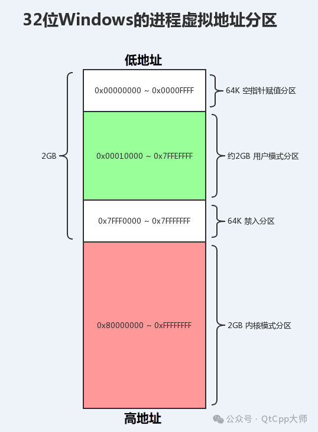

有了位置空间感，问题就不会那么抽象。任何问题的底层解法与哲学上的三个终级问题的字面意思类似：：我是谁？我从哪里来？我要到哪里去？

那么如下代码，这些变量具体存储在哪个区域？

```cpp
int nGlobalVar = 1;
static int nStaticGlobalVar = 2;

int main()
{
    static int nStaticVar = 3;
    int nLocalVar = 4;
    int nArry[5] = {1, 2, 3, 4, 5};
    char chArray[] = "1234";
    char* pStr = (char*)("1234");
    int* p1 = (int*)malloc(sizeof(int) * 4);
    int* p2 = (int*)calloc(4, sizeof(int));
    int* p3 = (int*)realloc(p1, sizeof(int) * 4);
}
}
```

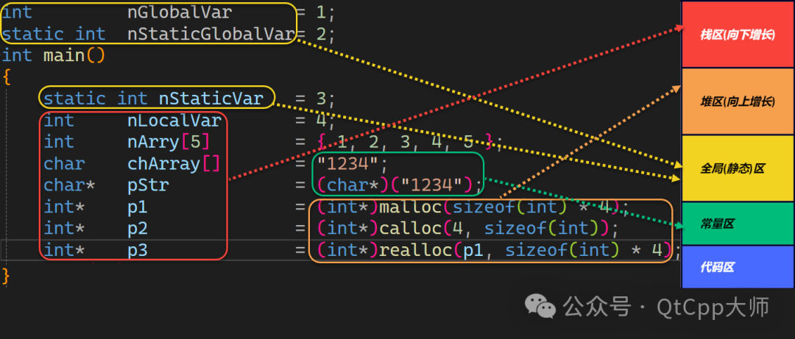

怎么验证这些变量所处区域了？把各变量的地址输出来，如下代码所示

```cpp
std::cout << "nGlobalVar addr:\t" << &nGlobalVar << std::endl;
std::cout << "nStaticGlobalVar addr:\t" << &nStaticGlobalVar << std::endl;
std::cout << "nStaticVar addr:\t" << &nStaticVar << std::endl;
std::cout << "nLocalVar addr:\t" << &nLocalVar << std::endl;
std::cout << "nArry addr:\t" << nArry << std::endl;
std::cout << "chArray addr:\t" << (void*)chArray << std::endl;
std::cout << "pStr addr:\t" << &pStr << std::endl;
std::cout << "p1 addr:\t" << &p1 << std::endl;
std::cout << "p2 addr:\t" << &p2 << std::endl;
std::cout << "p3 addr:\t" << &p3 << std::endl;
```

结合输出的地址以及使用官方提供的内存分析工具进行论证，如下图所示，说明分析是完全正确的。

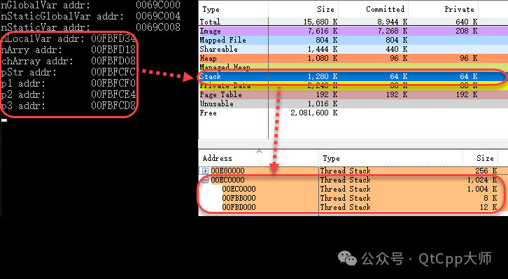

有了如上基础后，下面我们就对堆内存的malloc free new delete等动态内存管理行深度分析。

关于栈内存的深度分析，大家阅读[C++内存问题以及解决方案(四)之Stack Frame原理、应用](https://mp.weixin.qq.com/s?__biz=MzU0NTU5Njc0Mg==&mid=2247484476&idx=1&sn=f0203b52dac279057a3816d1a905592f&chksm=fb6b3015cc1cb9034d918e368a93cd52fbba98eda1d6ef69c7b924c950e14146a03f37f78efe&scene=21#wechat_redirect "C++内存问题以及解决方案(四)之Stack Frame原理、应用")文章。

# malloc

```cpp
void* malloc( size_t size );
```

分配size字节大小的内存，返回一个指向它的指针,如果申请失败，则返回NULL。

malloc开辟出的空间不初始化，如下图所示

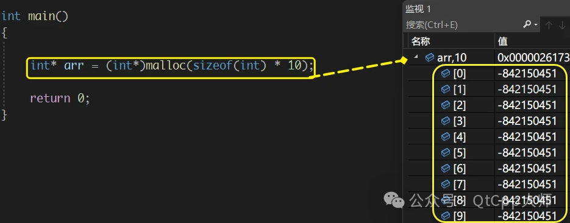

大家再深入思考：：

- •调用malloc函数时只传入需要的字节数
    
- •调用free函数时只传入所申请那块内存首地址
    
- •那么free时怎么会知道那块内存的大小了？
    

按照逻辑free函数应该如下写

```cpp
free(void *ptr，size_t size);
```

是不是在调用malloc时，由于需要记录一些其他信息，该块可能大于size个字节。

```cpp
int* arr = (int*)malloc(sizeof(int) * 10);
```

如上代码申请了40个字节的内存，在这块内存之外的某个地方是不是有个值记录该申请大小？如下图所示

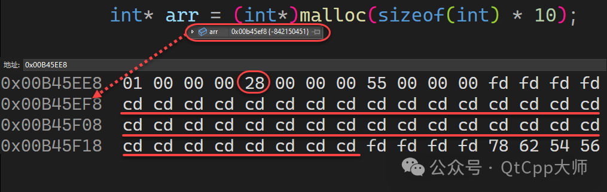

上图中的十六进制28就是十进制的40，从而说明会有额外的内存数据描述所申请的那块内容内存信息，类似元数据、消息头。

malloc源码如下，最终大小为实际大小+头部大小，并且返回地址已跳过头部。

```cpp
static void* malloc_internal(size_t size)
{
if(allocation_index == max_allocations)
{
        errno = ENOMEM;
returnNULL;
}

//实际大小+头部大小
size_t allocation_size = size +sizeof(struct allocation_header);
if(allocation_size < size)
{
        errno = ENOMEM;
returnNULL;
}

size_t index = allocation_index++;
//分配内存
void* result =mmap(NULL, allocation_size, PROT_READ | PROT_WRITE,
        MAP_PRIVATE | MAP_ANONYMOUS,-1,0);
if(result == MAP_FAILED)
returnNULL;

    allocations[index]= result;
*allocations[index]=(struct allocation_header)
{
.allocation_index = index,
.allocation_size = allocation_size
};

//返回地址，跳过头部
return allocations[index]+1;
}
```

# free

```cpp
void free(void *ptr)
```

释放由调用 malloc 、 calloc 或 realloc 所分配的内存空间，防止内存泄露。有了上述malloc的原理解析，那么free就非常好理解了，这里不做过多阐述。

需要注意一点的是free掉的内存并不是都会马上归还给系统。

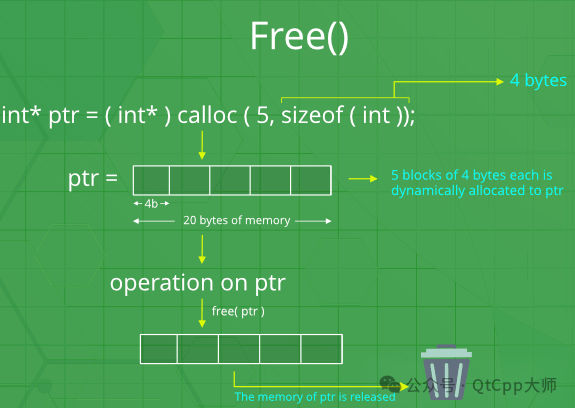

# calloc

```cpp
void *calloc(size_t number, size_t size);
```

向内存申请number个大小为size的连续可用的空间，并将每一字节初始化为0，返回指向这块空间的指针，开辟失败则返回空指针。

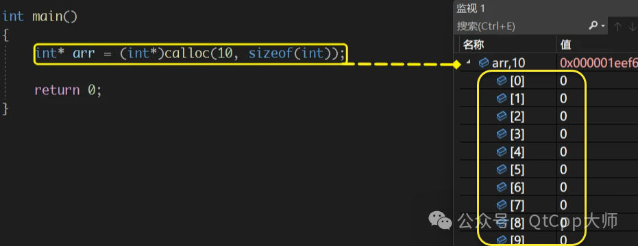

malloc 和 calloc 之间的不同点是，malloc 不会设置内存为零，而 calloc 会设置分配的内存为零。


# realloc

```cpp
void* realloc (void* ptr, size_t size);
```

重新调整之前调用 malloc 或 calloc、 realloc  所分配的 ptr 所指向的内存块的大小,如果为空指针，则会分配一个新的内存块，且函数返回一个指向它的指针。

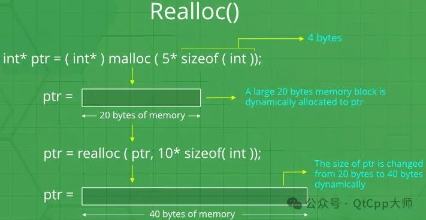

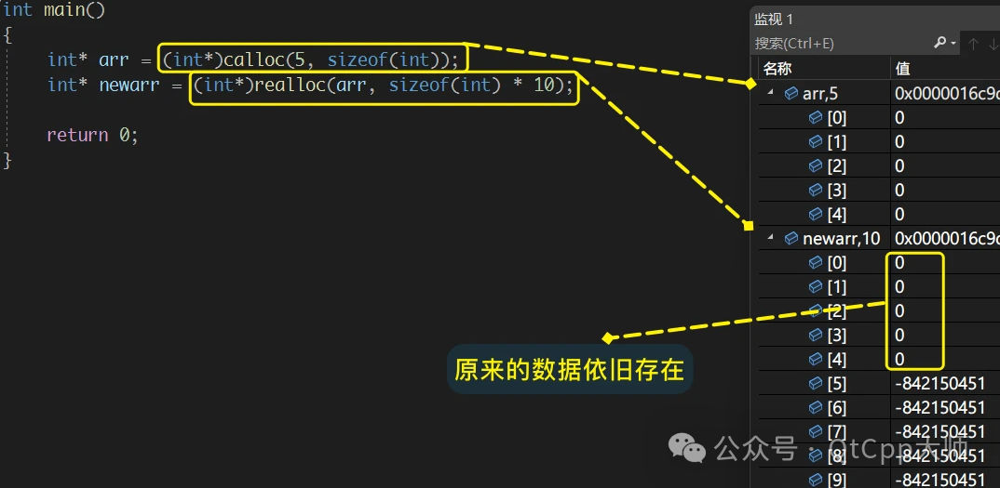

realloc 扩充空间，默认从旧空间向后扩充。

除非旧空间后的空间不够扩充了，则会完全开辟一块新的指定大小的空间，并将旧空间数据拷贝至新空间，返回新空间的地址。

# new 和 delete

C + + 增加了 new 和 delete 作为自己的动态内存管理，其底层也是最终调用 malloc 和 free ，只是在此基础上做了补充以完善C + +的内存管理。

以如下代码为例，我们来调试new与delete的内部实现

```cpp
A::A()
{
    std::cout <<"A::A"<< std::endl;
}

A::~A()
{
    std::cout <<"A::~A"<< std::endl;
}

A* pa =newA();

delete pa;
```

我们转到反汇编代码，可以看到new实际上调用了两个函数，operator new 和构造函数(A::A)。这也就说明了new 与 malloc的差别在哪里了。

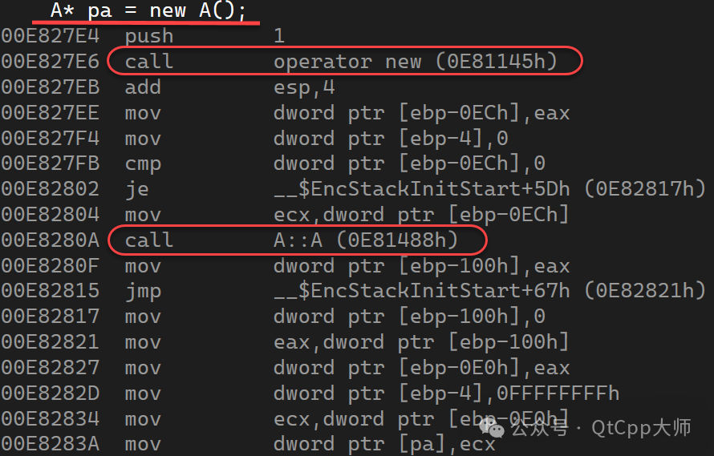

operator new和operator delete是系统提供的全局函数。

new在底层调用operator new全局函数来申请空间，delete在底层通过operator delete全局函数来释放空间。

这两个全局函数的内容其实是调用了 malloc 和 free。

我们进一步调试跟踪operator new函数的源码如下
```cpp
void* __CRTDECL operator new(size_t const size)
{
    for(;;)
    {
        if(void*const block =malloc(size))
        {
            return block;
        }

        if(_callnewh(size)==0)
        {
            if(size == SIZE_MAX)
            {

                __scrt_throw_std_bad_array_new_length();

            }
            else
            {
                __scrt_throw_std_bad_alloc();
            }
        }

    // The new handler was successful; try to allocate again...
    }
}
```

可以清晰的看到函数里的`if (void* const block = malloc(size))`语句里调用了malloc函数。

然后我们再进行delete的调试，如下图所示

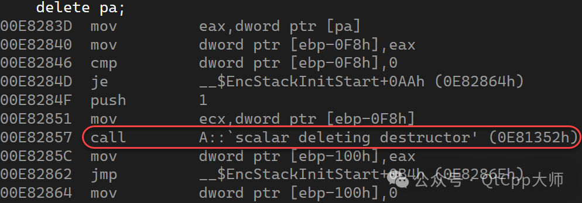

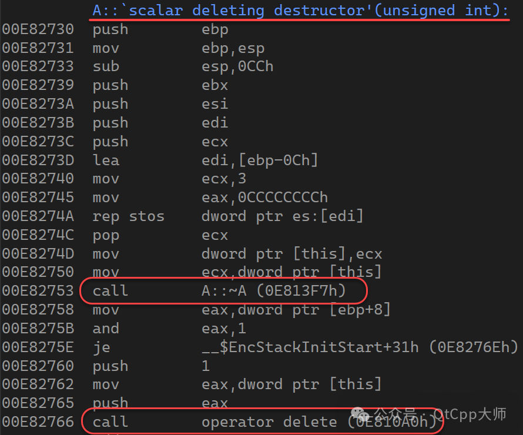

先调用了析构函数(A::~A())，再调用operator delete函数，operator delete函数源码如下

```cpp
void __CRTDECL operator delete(void* const block) noexcept
{
    #ifdef _DEBUG
    _free_dbg(block, _UNKNOWN_BLOCK);
    #else
    free(block);
    #endif
}
```

函数里最终调用了free函数。