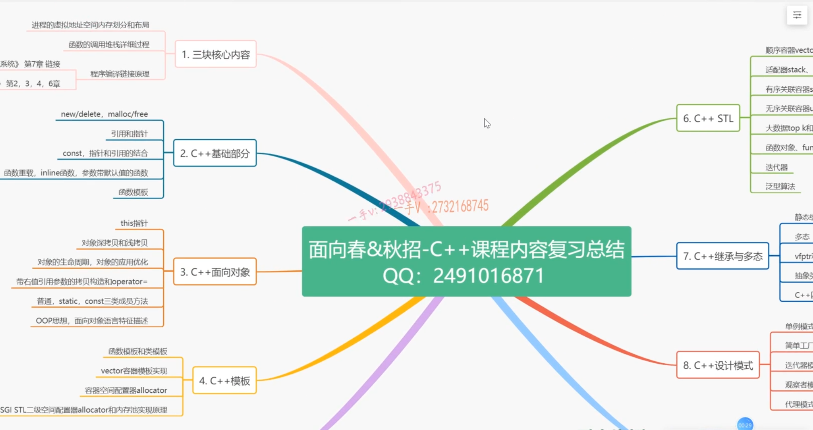
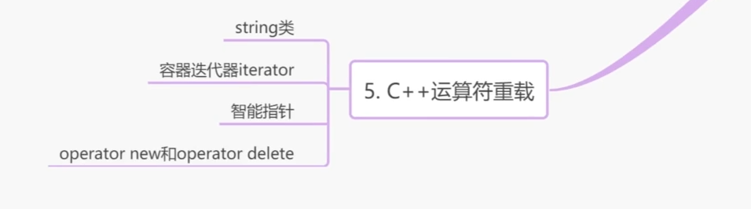
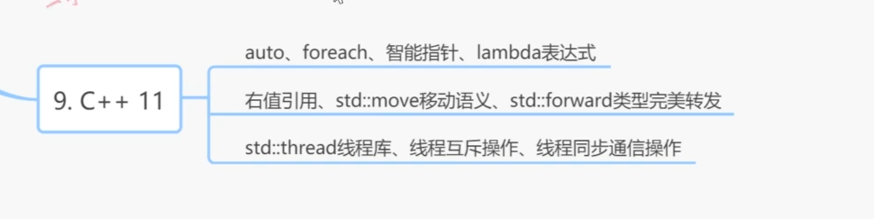

- 学习运算符重载和复数类CComplex
- 模拟实现C++的string类代码_ev
- string字符串对象的迭代器iterator实现_ev
- vector容器的迭代器iterator实现_ev
- 什么是容器的迭代器失效问题1_ev
- 深入理解new的delete的原理_ev
* new和delete重载实现的对象池应用_ev

- 继承的基本意义_ev
- 派生类的构造过程_ev(1)
- 重载、隐藏、覆盖_ev
- 虚函数、静态绑定和动态绑定_ev
- 虚析构函数_ev
- 再谈动态绑定_ev(1)
- 理解多态到底是什么_ev
- 理解抽象类
- 继承多态笔试题实战分析_ev
- 
- 理解虚基类和虚继承_ev
- 菱形继承的问题_ev
- C++的四种类型转换_ev

- STL内容学习简介_ev
- vector容器_ev
- deque容器和list容器_ev
- vector、deque、list对比_ev
- 详解容器适配器_ev
- 无序关联容器_ev
- 有序关联容器_ev
- 函数对象_ev
- 迭代器iterator_ev
- 泛型算法和绑定器_ev