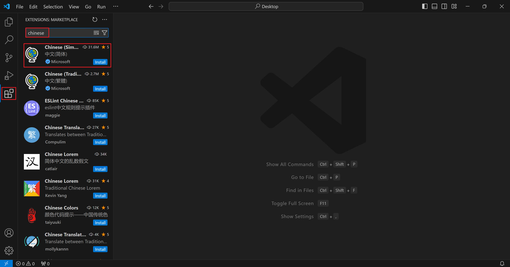
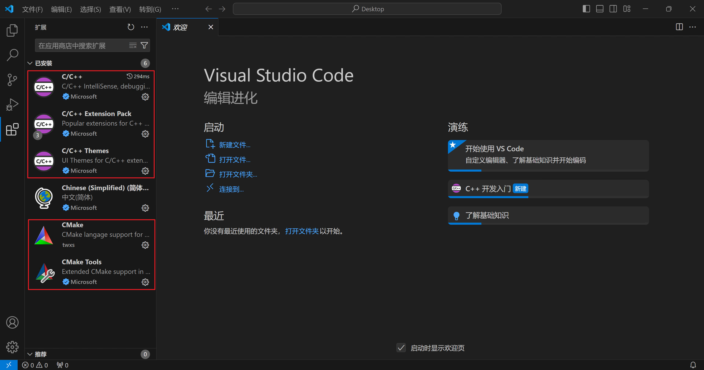
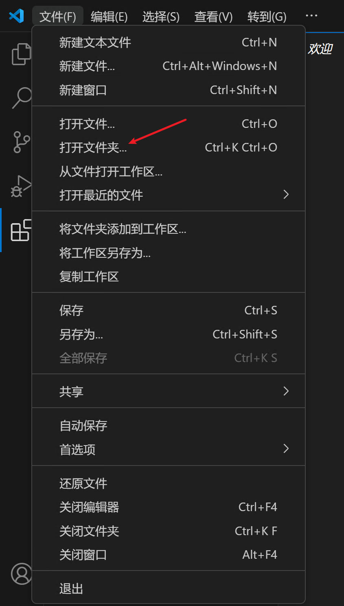
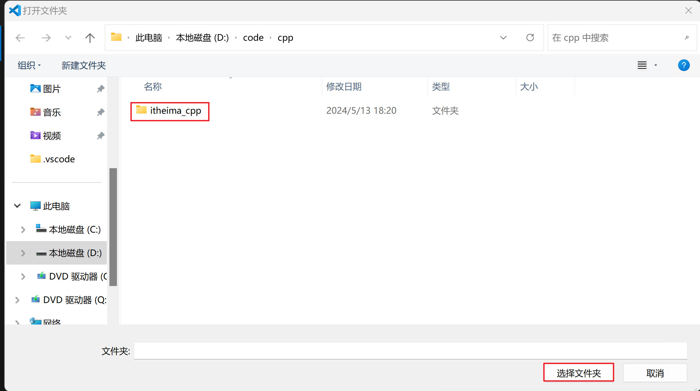
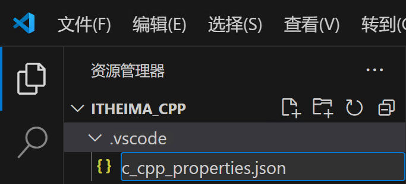
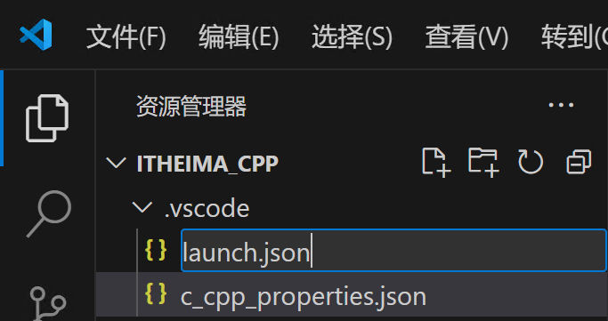
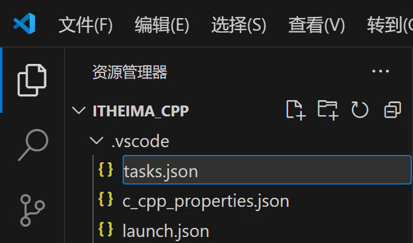
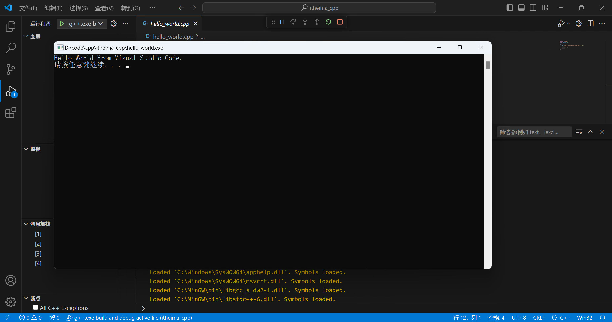

请根据操作系统，下载并安装好Visual Studio Code软件。

下载地址：[Visual Studio Code 下载地址](https://code.visualstudio.com/Download)

  

以下操作：Windows、MacOS、Linux 完全一致。

### 汉化VSCode（可选）

打开VSCode，找到插件，首先安装中文语言包，对VSCode进行汉化



  

重启VSCode


  

  

### 安装C++插件



如上图，请安装：

- C/C++
- C/C++ Extension Pack

两个插件。 其中`C/C++ Extension Pack`包含图中的：`C/C++ Themes`，`CMake`，`CMake Tools` 3个插件。

如果没有安装完全，请手动搜索插件名称进行安装。

### 配置C++插件

前提：请确保在系统内已经配置完成了`g++`编译器，请参考视频教程：[手动编译代码](手动编译代码.md)章节

通过VSCode，打开代码的工程文件夹，如果不存在请创建一个文件夹，用以后续存放代码文件（不要带上中文）

比如，我的代码全部存放在：`D:\dev\code\cpp\itheima_cpp`






  

在代码文件夹内，新建文件夹，名称：`.vscode`

  

在`.vscode`内，创建3个文件，并复制如下内容：

1. 文件1：`c_cpp_properties.json`



内容：

```json
{
    "configurations": [
        {
          "name": "Win32",
          "includePath": ["${workspaceFolder}/**"],
          "defines": ["_DEBUG", "UNICODE", "_UNICODE"],
          "windowsSdkVersion": "10.0.17763.0",
          "compilerPath": "D:\\dev\\sdk\\mingw\\bin\\g++.exe",   /*修改成自己bin目录下的g++.exe，这里的路径和电脑里复制的文件目录有一点不一样，这里是两个反斜杠\\*/
          "cStandard": "c11",
          "cppStandard": "c++17",
          "intelliSenseMode": "${default}"
        }
      ],
      "version": 4
}
```

请修改第8行`compilerPath`对应的路径，修改为自己系统中安装mingw中g++程序的位置

如：

- 我的mingw安装在：`D:\dev\sdk\mingw`
- 所以，我应该填入的配置内容是：`D:\\dev\\sdk\\mingw\\bin\\g++.exe`

注意，所有的路径符号均为：`\\`

2. 文件2：`launch.json`



内容：

```json
{
    "version": "0.2.0",
    "configurations": [
        {
            "name": "g++.exe build and debug active file",
            "type": "cppdbg",
            "request": "launch",
            "program": "${fileDirname}\\${fileBasenameNoExtension}.exe",
            "args": [],
            "stopAtEntry": false,
            "cwd": "${workspaceFolder}",
            "environment": [],
            "externalConsole": true,
            "MIMode": "gdb",
            "miDebuggerPath": "D:\\dev\\sdk\\mingw\\bin\\gdb.exe",		/*修改成自己bin目录下的gdb.exe，这里的路径和电脑里复制的文件目录有一点不一样，这里是两个反斜杠\\*/
            "setupCommands": [
                {
                    "description": "为 gdb 启用整齐打印",
                    "text": "-enable-pretty-printing",
                    "ignoreFailures": true
                }
            ],
            "preLaunchTask": "task g++"
        }
    ]
}
```

请修改第15行`miDebuggerPath`对应的路径，修改为自己系统中安装mingw中gdb.exe程序的位置

如：

- 我的mingw安装在：`D:\dev\sdk\mingw`
- 所以，我应该填入的配置内容是：`D:\\dev\\sdk\\mingw\\bin\\gdb.exe`

注意，所有的路径符号均为：`\\`

3. 文件3：`tasks.json`



内容：

```json
{
    "version": "2.0.0",
    "tasks": [
        {
        "type": "shell",
        "label": "task g++",
        "command": "D:\\dev\\sdk\\mingw\\bin\\g++.exe",	/*修改成自己bin目录下的g++.exe，这里的路径和电脑里复制的文件目录有一点不一样，这里是两个反斜杠\\*/
        "args": [
            "-g",
            "${file}",
            "-o",
            "${fileDirname}\\${fileBasenameNoExtension}.exe",
            "-I",
            "D:\\dev\\code\\cpp\\itheima_cpp",      /*修改成自己放c/c++项目的文件夹，这里的路径和电脑里复制的文件目录有一点不一样，这里是两个反斜杠\\*/
            "-std=c++17"
        ],
        "options": {
            "cwd": "D:\\dev\\sdk\\mingw\\bin"	/*修改成自己bin目录，这里的路径和电脑里复制的文件目录有一点不一样，这里是两个反斜杠\\*/
        },
        "problemMatcher":[
            "$gcc"
        ],
        "group": "build",
        
        }
    ]
}
```

- 修改第7行，`command`的值为，你电脑中g++程序的路径，请参考c_cpp_properties.json文件中的记录
- 修改第14行，填入你写代码文件夹的路径
- 修改第18行，填入`mingw`安装的路径，如上所示

注意，所有的路径符号均为：`\\`

### 测试环境是否配置成功

在代码文件夹内创建一个新的代码，如：`hello_world.cpp`

```cpp
#include "iostream"
using namespace std;

int main()
{
    cout << "Hello World From Visual Studio Code." << endl;

    system("pause");

    return 0;
}
```

请注意，在第8行额外添加了`system("pause");`代码，功能是确保程序编译并执行后不会立刻退出，否则运行结果会一闪而过。

按键盘：`F5`开始执行代码。



如上，成功。

如果黑窗口闪退，请确认是否在`return 0;`代码前添加：`system("pause");`这一行代码。