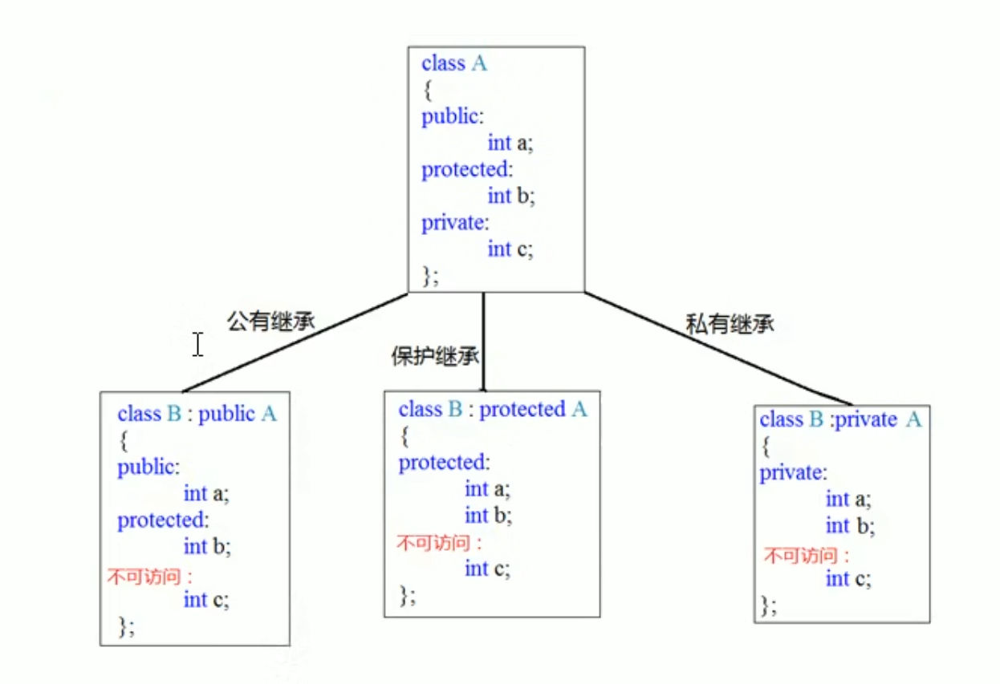

- 继承是面向对象三大特性之一
- 类的继承主要是用于减少重复代码
# 继承的基本语法
- 语法：`class 子类名 : 继承方式 父类名 {}`
- 示例
```cpp
#include<iostream>
#include<string>
using namespace std;
//类的继承特性
class Animal//动物类
{
private:
	int m_Age;
public:
	void stand()
	{
		cout << "站立" << endl;
	}
	void walk()
	{
		cout << "行走" << endl;
	}
	void run()
	{
		cout << "奔跑" << endl;
	}
	int getAge()
	{
		return m_Age;
	}
	void call()
	{
		cout << "叫声" << endl;
	}
};
//创建子类
class Dog :public Animal
{
public:
	void call()
	{
		cout << "bark" << endl;
	}
};

//测试函数
void test01()
{
	Dog dog;
	dog.call();
	dog.run();
}

//主函数
int main()
{
	test01();

	system("pause");
	return 0;
}
```
# 继承方式
继承方式一共有三种
- 公共继承
- 保护继承
- 私有继承

- 特点
	- 父类中的私有成员，子类中无论使用哪种继承方式都无法访问。
	- 如果子类的继承方式是公有继承，那么父类的公有成员和保护成员继承在子类中依然是公有成员和保护成员。
	- 如果子类的继承方式是保护继承，那么父类的公有成员和保护成员继承在子类中都会成为保护成员。
	- 如果子类的继承方式是私有继承，那么父类的公有成员和保护成员继承在子类中都会成为私有成员。
- 示例：
```cpp
#include<iostream>
#include<string>
using namespace std;
//类的继承方式
class Base1
{
public:
	int m_A;
protected:
	int m_B;
private:
	int m_C;

};
//公共继承
class Son1 :public Base1
{
public:
	void func()
	{
		m_A = 10;//基类的公共权限成员,继承到子类中依然是公共权限。
		m_B = 10;//基类的保护权限成员,继承到子类中依然是保护权限。
		//m_C = 10;//基类的私有权限成员,子类无法访问。
	}
};
//保护继承
class Son2 :protected Base1
{
public:
	void func()
	{
		m_A = 10;//基类的公共权限成员,继承到子类中变为保护权限。
		m_B = 10;//基类的保护权限成员,继承到子类中依然是保护权限。
		//m_C = 10;//基类的私有权限成员,子类无法访问。
	}
};
//私有继承
class Son3 :private Base1
{
public:
	void func()
	{
		m_A = 10;//基类的公共权限成员,继承到子类中变为私有权限。
		m_B = 10;//基类的保护权限成员,继承到子类中变为私有权限。
		//m_C = 10;//基类的私有权限成员,子类无法访问。
	}
};
//测试函数
void test01()
{
	Son2 s2;
	//s2.m_B = 1000;//保护权限类外无法访问
}

//主函数
int main()
{
	test01();

	system("pause");
	return 0;
}
```
- 类的成员的访问权限复习

| 访问权限      | 可访问范围    |
| --------- | -------- |
| public    | 类内，子类，类外 |
| protected | 类内，子类，友元 |
| privae    | 类内       |
# 继承中的对象模型
- 问题：从父类继承的成员，哪些属于子类对象中。
```cpp
#include<iostream>
#include<string>
using namespace std;
//类的继承方式
class Base
{
public:
	int m_A;
protected:
	int m_B;
private:
	int m_C;

};
//公共继承
class Son :public Base
{
public:
	int m_D;
};

//测试函数
void test01()
{
	//16 Byte,父类中所有非静态成员都会被子类继承，父类中私有属性成员遵循了封装性原则，被编译器隐藏，无法访问。
	cout << sizeof(Son) << endl;
}

//主函数
int main()
{
	test01();

	system("pause");
	return 0;
}
```
# 继承中的构造和析构顺序
子类继承父类后，当创建子类对象时也会调用父类的构造函数。那么，父类和子类的构造和析构函数谁先谁后呢？
示例：
```cpp
#include<iostream>
#include<string>
using namespace std;
//继承中的构造和析构顺序

//构建基类
class Base{
public:
	Base(){
		cout << "父类构造函数执行" << endl;
	}
	~Base(){
		cout << "父类的析构函数执行" << endl;
	}
};
//派生类
class Son :public Base{
public:
	Son(){
		cout << "子类构造函数执行" << endl;
	}
	~Son(){
		cout << "子类的析构函数执行" << endl;
	}
};

//测试函数
void test01(){
	Son s1;
}

//主函数
int main(){
	test01();

	system("pause");
	return 0;
}
```
执行结果为：
```
父类构造函数执行
子类构造函数执行
子类的析构函数执行
父类的析构函数执行
```
结论：
- 创建一个子类对象前，会先创建一个父类对象。先构造父类，再构造子类。
- 释放一个子类对象，也会释放创建的父类对象。先析构子类，再析构父类。
# 继承同名成员处理
问题：当子类与父类出现同名的成员，如何通过子类对象访问到子类或者父类中的重名成员。
如果子类中出现与父类重名的成员，子类的重名成员会覆盖父类中的重名成员，如果要访问父类中的成名成员，需要加作用域。
- 访问子类同名成员，直接访问即可
- 访问父类同名成员，需要加作用域。
```cpp
#include<iostream>
#include<string>
using namespace std;
//继承中的同名成员处理方式

//构建基类
class Base{
public:
	int m_A;

	Base(){
		m_A = 100;
	}
	//父类函数
	void func() {
		cout << "Base::func()函数调用" << endl;
	}
	//父类函数重载
	void func(int a) {
		cout << "Base::func(int a)函数调用" << endl;
	}
};
//派生类
class Son :public Base{
public:
	int m_A;

	Son(){
		m_A = 1000;
	}
	void func() {
		cout << "Son::func()函数调用" << endl;
	}
};

//测试函数
void test01(){
	Son s1;
	//输出子类的同名属性
	cout << "Son::m_A = " << s1.m_A << endl;
	//输出子类中继承的父类重名属性，需要加作用域
	cout << "Base::m_A =" << s1.Base::m_A << endl;
	//执行子类中的同名方法
	s1.func();
	//执行父类中的重名方法，需要加作用域
	s1.Base::func();
	//执行父类中的重名函数重载func(int a)，需要加作用域
	s1.Base::func(100);
}

//主函数
int main(){
	test01();

	system("pause");
	return 0;
}
```
# 继承同名静态成员的处理
问题：继承中同名的静态成员在子类对象上如何访问。
静态成员和非静态成员一样，处理方式一致
- 访问子类同名成员，直接访问即可
- 访问父类同名成员，需要加作用域。
另外，子类可通过`::`访问父类中的静态重名成员，例如
```cpp
//通过类名访问父类下的成员
Son::Base::m_A;
Son::Base::func();
```
# 多继承语法
C++ 允许一个类继承多个类
- 语法：`class 子类 : 继承方式 父类1， 继承方式 父类2...`
- 注意：多继承可能会引发父类中同名成员出现，需要加作用域区分，在实际开发中不建议使用多继承
```cpp
#include<iostream>
#include<string>
using namespace std;
//多继承语法

//构建基类
class Base1{
public:
	int m_A;

	Base1(){
		m_A = 100;
	}

};
class Base2 {
public:
	int m_A;

	Base2() {
		m_A = 200;
	}

};
//派生类
class Son :public Base1, public Base2 {
public:
	int m_C;
	int m_D;

	Son(){
		m_C = 1000;
		m_D = 2000;
	}

};

//测试函数
void test01(){
	Son s1;
	cout << "sizeof s1 = " << sizeof(s1) << endl;
	//使用作用域获得每个父类中的同名属性
	cout << "Base1::m_A =  " << s1.Base1::m_A << endl;
	cout << "Base2::m_A =  " << s1.Base2::m_A << endl;
}

//主函数
int main(){
	test01();

	system("pause");
	return 0;
}
```