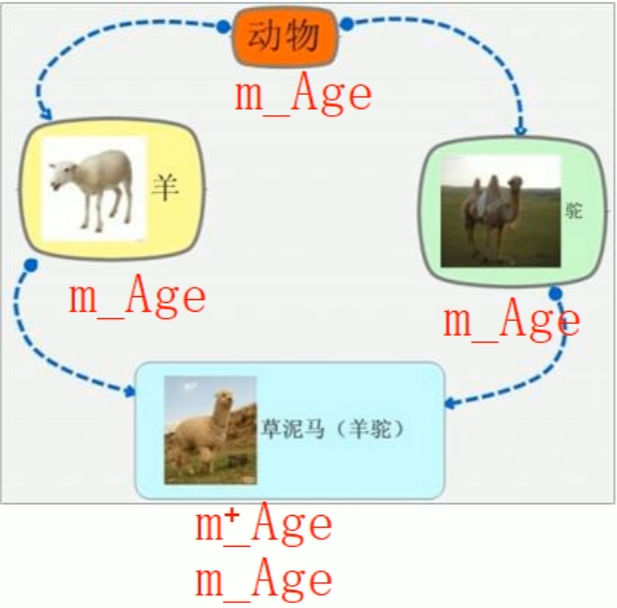

菱形继承的概念：
- 两个派生类继承同一个基类
- 又有某个类同时继承这两个派生类
- 这种继承被称为菱形继承或者钻石继承

菱形继承的问题:
- 羊继承了动物的数据，驼同样继承了动物的数据，当羊驼使用数据时就会产生二义性。
- 羊驼继承自动物的数据继承了两份，而我们知道动物的数据继承一份就可以。
```cpp
#include<iostream>
#include<string>
using namespace std;
//菱形继承

//构建基类
class Animal{
public:
	int m_Age;
};
//利用虚继承(virtual)解决菱形继承问题
//继承之前加上关键字virtual，变为虚继承
//Animal类被称为虚基类

//构建子类
class Sheep:virtual public Animal {};
class Canmel :virtual public Animal {};
//构建孙类
class Alpaca :public Sheep, public Canmel {};

//测试函数
void test01(){
	Alpaca alpaca1;
	alpaca1.Sheep::m_Age = 7;
	alpaca1.Canmel::m_Age = 4;
	//当出现菱形继承的时候,父类数据继承两次，需要加以作用域区分，利用虚继承两份数据合二为一。
	cout << "alpaca1.Sheep::m_Age = " << alpaca1.Sheep::m_Age << endl;
	cout << "alpaca1.Canmel::m_Age = " << alpaca1.Canmel::m_Age << endl;
	cout << "alpaca1.m_Age = " << alpaca1.m_Age << endl;
}

//主函数
int main(){
	test01();

	system("pause");
	return 0;
}
```
## 虚继承
语法：`class 子类 : virtual 继承方式 父类 {}`
概念：继承之前加上关键字virtual，变为虚继承。虚继承(virtual)解决菱形继承问题，利用虚继承使两份父类数据合二为一。虚继承的基类被称为虚基类。
原理：虚继承的实现机制比较复杂，涉及到虚函数表（vtable）的调整。在普通继承中，子类会继承父类的虚函数表，并在其中加入自己的虚函数实现。而在虚继承中，子类会共享虚基类的虚函数表，并通过虚基类指针来访问虚基类的虚函数。
注意事项：
- 虚继承只能用于多继承
- 虚继承会影响类的内存布局
- 虚继承可能会导致虚函数的动态分派异常