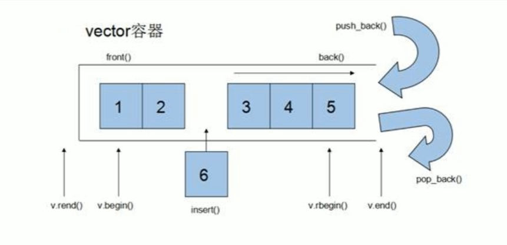

# vector基本概念
## 功能
- vector数据结构和数组非常相似，也成为单端数组
## vector与普通数组的区别
- 不同之处在于数组是静态空间，而vector可以动态扩展
## 动态扩展
- 动态扩展并不是在原空间之后续接新空间，而是找到更大空间，然后将原数据拷贝到新空间，释放原空间。

# 构造函数
## 功能描述
- 创建vector容器
## 函数原型
- `vector(T) v;`//采用模板实现类实现，默认构造函数
- `vrctor(v.begin(), v.end());`//将`v[v.begin(), v.end())`区间中的元素拷贝给本身
- `vector(n, elem);`//构造函数将n个element拷贝给本身
- `vector(const vector& vec）`//拷贝构造函数
## 示例
```cpp
#include <iostream>
#include <vector>
using namespace std;

//vector构造函数

//打印函数
void print_vec(vector<int>& v)
{
	//通过迭代器遍历并打印vector
	for (vector<int>::iterator it = v.begin(); it != v.end(); it++)
	{
		cout << *it << " ";//*it可获取迭代器指向的值
	}
	cout << endl;
}

void test01()
{
	//默认构造，无参构造
	vector<int> v1;
	for (int i = 0; i < 10; i++)
	{
		v1.push_back(i + 1);
	}
	print_vec(v1);
	//通过区间的形式进行构造,获取索引3到索引7之间的数值生成新vector
	int start_index = 3;
	int end_index = 7;
	vector<int>v2(v1.begin() + start_index, v1.begin() + end_index +1);
	print_vec(v2);
	//n个element的方式来构造
	vector<int> v3(10, 100);
	print_vec(v3);
	//拷贝构造函数
	vector<int> v4(v3);
	print_vec(v4);
}

// 主函数
int main()
{
	test01();
	// 按任意键继续
	system("Pause");
	return 0;
}
```
# vector 赋值操作
## 功能描述
- 给vector容器进行赋值
## 函数原型
- `vector& operator=(const vector& vec);`//重载等号运算符
- `assign(begin, end);`//将`[begin, end)`区间中的数据拷贝值给本身
- `asssign(n, elem);`//将n个element拷贝赋值给本身
## 示例
```cpp
#include <iostream>
#include <vector>
using namespace std;

//vector赋值操作

//打印函数
void print_vec(vector<int>& v)
{
	//通过迭代器遍历并打印vector
	for (vector<int>::iterator it = v.begin(); it != v.end(); it++)
	{
		cout << *it << " ";//*it可获取迭代器指向的值
	}
	cout << endl;
}
//测试函数
void test01()
{
	vector<int> v1;
	for (int i = 0; i < 10; i++)
	{
		v1.push_back(i + 1);
	}
	print_vec(v1);
	//等号赋值
	vector<int> v2 = v1;
	print_vec(v2);
	//assign赋值,将索引1到索引6的值赋值给新容器
	vector<int> v3;
	v3.assign(v1.begin() + 1, v1.begin() + 7);//区间前闭后开
	print_vec(v3);
	//assign赋值，n个element赋值
	vector<int> v4;
	v4.assign(3, 99);
	print_vec(v4);
}

// 主函数
int main()
{
	test01();
	// 按任意键继续
	system("Pause");
	return 0;
}
```
# vector 容量和大小
## 功能描述
- 对`vector`容器的容量和大小操作
## 函数原型
- `empty();` //判断容器是否为空
- `capacity();` //容器的容量
- `size();` // 返回容器中元素的个数
- `resize(int num);`//重新制定容器的长度为`num`，若容器变长则以默认值`0`填充新位置。
	                //若容器变短，则末尾超出容器长度的元素被删除。
- `resize(int num, elem);`//重新制定容器的长度为`num`，若容器变长则以`elem`填充新位置。
	                //若容器变短，则末尾超出容器长度的元素被删除。
## 示例
```cpp
#include <iostream>
#include <vector>
using namespace std;

//vector容量和大小

//打印函数
void print_vec(vector<int>& v)
{
	//通过迭代器遍历并打印vector
	for (vector<int>::iterator it = v.begin(); it != v.end(); it++)
	{
		cout << *it << " ";//*it可获取迭代器指向的值
	}
	cout << endl;
}
//测试函数
void test01()
{
	vector<int> v1;
	for (int i = 0; i < 10; i++)
	{
		v1.push_back(i + 1);
	}
	print_vec(v1);
	//判断容量和个数
	if (v1.empty())
	{
		cout << "v1容器为空" << endl;
	}
	else
	{
		cout << "v1容器不为空" << endl;
		cout << "v1容器容量为：" << v1.capacity() << endl;
		cout << "v1容器个数为：" << v1.size() << endl;
	}
	//重新指定元素个数
	v1.resize(15, 7);//若容器变长则以默认值`7`填充新位置。若不指定填充值默认为0.
	print_vec(v1);
	v1.resize(5);
	print_vec(v1);//若容器变短，则末尾超出容器长度的元素被删除。

}

// 主函数
int main()
{
	test01();
	// 按任意键继续
	system("Pause");
	return 0;
}
```
# vector 插入和删除
## 功能描述
- 对vector容器进行插入和删除操作
## 函数原型
- `push_back(elem);`//尾部插入元素elem
- `pop_back();` //删除最后一个元素
- `insert(const_ierator pos, elem);`//迭代器指向位置`pos`插入元素`elem`
- `insert(const_iterator pos, int count, elem);`//迭代器指向位置`pos`插入`count`个元素`elem`
- `erase(const_iterator pos);`//删除迭代器指向元素
- `erase(const_iterator start, const_iterator end);`//删除迭代器从start到end之间的元素
- `clear();`//删除容器中所有元素
## 示例
```cpp
#include <iostream>
#include <vector>
using namespace std;

//vector插入和删除

//打印函数
void print_vec(vector<int>& v)
{
	//通过迭代器遍历并打印vector
	for (vector<int>::iterator it = v.begin(); it != v.end(); it++)
	{
		cout << *it << " ";//*it可获取迭代器指向的值
	}
	cout << endl;
}
//测试函数
void test01()
{
	vector<int> v1;
	//尾插法插入元素
	for (int i = 0; i < 10; i++)
	{
		v1.push_back(i + 1);
	}
	print_vec(v1);
	//移除最后一项元素
	v1.pop_back();
	print_vec(v1);
	//插入,在索引0的位置插入三个666
	v1.insert(v1.begin(), 3, 666);
	print_vec(v1);
	//删除
	v1.erase(v1.begin());//移除迭代器指向的元素
	v1.erase(v1.begin(), v1.begin() + 2);//移除迭代器指定区间元素
	print_vec(v1);
	//清空
	v1.clear();
	print_vec(v1);
}

// 主函数
int main()
{
	test01();
	// 按任意键继续
	system("Pause");
	return 0;
}
```
# 数据存取
## 功能描述
- 对vector进行数据存取
## 函数原型
- `at(int index);`//返回索引所指的数据
- `operator[];`//返回索引所指数据
- `front();`//返回容器中第一个数据元素
- `back();`//返回容器中最后一个数据元素
## 示例
```cpp
#include <iostream>
#include <vector>
using namespace std;

//vector数据存取

//打印函数
void print_vec(vector<int>& v)
{
	//通过迭代器遍历并打印vector
	for (vector<int>::iterator it = v.begin(); it != v.end(); it++)
	{
		cout << *it << " ";//*it可获取迭代器指向的值
	}
	cout << endl;
}
//测试函数
void test01()
{
	vector<int> v1;
	//尾插法插入元素
	for (int i = 0; i < 10; i++)
	{
		v1.push_back(i + 1);
	}
	//[]获取元素
	for (int i = 0; i < v1.size(); i++)
	{
		cout << v1[i] << " ";
	}
	cout << endl;
	//at访问元素
	for (int i = 0; i < v1.size(); i++)
	{
		cout << v1.at(i) << " ";
	}
	cout << endl;
	//获取第一个元素
	cout << "First element is: " << v1.front() << endl;
	//获取最后一个元素
	cout << "Last element is :" << v1.back() << endl;
}

// 主函数
int main()
{
	test01();
	// 按任意键继续
	system("Pause");
	return 0;
}
```
# vector 容器互换
## 功能描述
- 实现两个容器元素互换
## 函数原型
- `swap(vec);`//将vec与本身元素互换
## 示例
```cpp
#include <iostream>
#include <vector>
using namespace std;

//vector数据互换

//打印函数
void print_vec(vector<int>& v)
{
	//通过迭代器遍历并打印vector
	for (vector<int>::iterator it = v.begin(); it != v.end(); it++)
	{
		cout << *it << " ";//*it可获取迭代器指向的值
	}
	cout << endl;
}
//测试函数
void test01()
{
	//容器1
	vector<int> v1;
	for (int i = 0; i < 10; i++)
	{
		v1.push_back(i + 1);
	}
	print_vec(v1);
	//容器2
	vector<int> v2;
	for (int i = 10; i > 0; i--)
	{
		v2.push_back(i);
	}
	print_vec(v2);
	//元素互换
	v1.swap(v2);
	print_vec(v1);
	print_vec(v2);
}
//实际用途，巧用swap可以收缩内存空间
void test02()
{
	//创建一个十万元素的vector
	vector<int> v;
	for (int i = 0; i < 100000; i++)
	{
		v.push_back(i + 1);
	}
	cout << "v的容量为：" << v.capacity() << endl;
	cout << "v的元素数量为：" << v.size() << endl;
	//重新指定元素数量为3，但是容量仍为十万
	v.resize(3);
	cout << "v的容量为：" << v.capacity() << endl;
	cout << "v的元素数量为：" << v.size() << endl;
	//巧用swap收缩内存空间
	vector<int>(v).swap(v);//利用拷贝构造函数创建匿名对象(此时匿名对象数量为3，容量为3)，并与v互换元素
	cout << "v的容量为：" << v.capacity() << endl;
	cout << "v的元素数量为：" << v.size() << endl;
}
// 主函数
int main()
{
	test01();
	test02();
	// 按任意键继续
	system("Pause");
	return 0;
}
```
# vector预留空间
## 功能描述
- 减少vector在动态扩展容量时的扩展次数
## 函数原型
- `reserve(int len);` //容器预留len个元素长度，预留位置不初始化，元素不可访问
## 示例
```cpp
#include <iostream>
#include <vector>
using namespace std;

//vector预留空间

//打印函数
void print_vec(vector<int>& v)
{
	//通过迭代器遍历并打印vector
	for (vector<int>::iterator it = v.begin(); it != v.end(); it++)
	{
		cout << *it << " ";//*it可获取迭代器指向的值
	}
	cout << endl;
}
//测试函数
void test01()
{
	//容器1
	vector<int> v;
	//利用reserve预留空间
	v.reserve(100000);

	int num = 0;//统计开辟内存次数
	int* p = NULL;//创建首元素指针

	for (int i = 0; i < 100000; i++)
	{
		v.push_back(i + 1);
		if (p != &v[0])
		{
			p = &v[0];
			num++;
		}
	}
	cout << "num = :" << num << endl;
}

// 主函数
int main()
{
	test01();
	// 按任意键继续
	system("Pause");
	return 0;
}
```