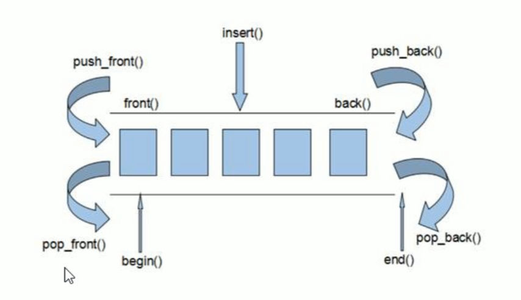
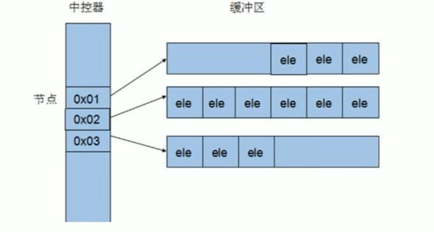

# deque容器的基本概念
## 功能
- 双端数组，可以对头端进行插入删除操作
## deque和vector的区别
- vector对于头端插入删除需要移动后面的元素，效率较低，数据量越大，效率越低
- deque相对而言，对头部的插入删除速度会比vector要快
- vector访问元素的速度会比deque快，这和两者内部实现有关

## deque的内部工作原理
- deque内部有个中控器，维护每段缓冲区中的内容，缓冲区中存放真实内存数据。
- 中控器维护的是每个缓冲区的地址，使得使用deque时向一片连续的内存空间。
- deque的迭代器也是支持随机访问的

# deque的构造函数
## 功能描述
- deque容器的构造
## 函数原型
- `deque<T> deqT;`//默认构造
- `deque(begin, end);`//构造函数将`[begin, end)`区间中的元素拷贝给本身
- `deque(n, elem);`//构造函数将n个element拷贝给本身
- `deque(const deque &deq);`//拷贝构造函数调用
## 示例
```cpp
#include <iostream>
#include <deque>
using namespace std;

//deque容器构造

//打印函数,如果输入参数是一个静态参数`const deque<int>& d`，那么要使用静态迭代器`const_iterator`
void print_deq(const deque<int>& d)
{
	//通过迭代器遍历并打印vector
	for (deque<int>::const_iterator it = d.begin(); it != d.end(); it++)
	{
		cout << *it << " ";//*it可获取迭代器指向的值
	}
	cout << endl;
}
//测试函数
void test01()
{
	//默认构造
	deque<int> d1;
	for (int i = 0; i < 10; i++)
	{
		d1.push_back(i + 1);
	}
	print_deq(d1);
	//区间方式构造
	deque<int> d2(d1.begin(), d1.end());
	print_deq(d2);
	//n个element的方式构造
	deque<int> d3(3, 100);
	print_deq(d3);
	//拷贝构造的方式构造
	deque<int> d4(d3);
	print_deq(d4);
}

// 主函数
int main()
{
	test01();
	// 按任意键继续
	system("Pause");
	return 0;
}
```
# deque的赋值操作
## 功能描述
- 给deque容器进行赋值
## 函数原型
- `deque& operator=(const deque& deq);`//重载等号运算符
- `assign(begin, end);`//将`[begin, end)`区间中的数据拷贝值给本身
- `asssign(n, elem);`//将n个element拷贝赋值给本身
## 示例
```cpp
#include <iostream>
#include <deque>
using namespace std;

//deque容器赋值

//打印函数,如果输入参数是一个静态参数`const deque<int>& d`，那么要使用静态迭代器`const_iterator`
void print_deq(const deque<int>& d)
{
	//通过迭代器遍历并打印vector
	for (deque<int>::const_iterator it = d.begin(); it != d.end(); it++)
	{
		cout << *it << " ";//*it可获取迭代器指向的值
	}
	cout << endl;
}
//测试函数
void test01()
{
	//尾插法赋值
	deque<int> d1;
	for (int i = 0; i < 10; i++)
	{
		d1.push_back(i + 1);
	}
	print_deq(d1);
	//等号赋值
	deque<int> d2;
	d2 = d1;
	print_deq(d2);
	//assign区间赋值
	deque<int> d3(d1.begin(), d1.end());
	print_deq(d3);
	//assign赋值n个element
	deque<int> d4(3, 999);
	print_deq(d4);

}

// 主函数
int main()
{
	test01();
	// 按任意键继续
	system("Pause");
	return 0;
}
```
# deque容器的大小操作
## 功能描述
- 对deque容器的大小进行操作
## 函数原型
- `deque.empty();`//判断容器是否为空
- `deque.size();`//返回容器中的元素个数
- `deque.resize(num);`//重新制定容器长度为num，若容器变长则用默认值0填充新位置，若容器变短，则移除多余元素
- `deque.resize(num, element);`//重新制定容器长度为num，若容器变长则用默认值element填充新位置，若容器变短，则移除多余元素
示例：
```cpp
#include <iostream>
#include <deque>
using namespace std;

//deque容器大小操作

//打印函数,如果输入参数是一个静态参数`const deque<int>& d`，那么要使用静态迭代器`const_iterator`
void print_deq(const deque<int>& d)
{
	//通过迭代器遍历并打印vector
	for (deque<int>::const_iterator it = d.begin(); it != d.end(); it++)
	{
		cout << *it << " ";//*it可获取迭代器指向的值
	}
	cout << endl;
}
//测试函数
void test01()
{
	//首插法赋值
	deque<int> d1;
	for (int i = 0; i < 10; i++)
	{
		d1.push_front(i + 1);
	}
	print_deq(d1);
	//判断容器是否为空,以及元素数量，deque容器没有容量属性capacity，这与他的内部结构有关。
	if (d1.empty()){
		cout << "deque 容器为空" << endl;
	}
	else {
		cout << "deque 容器不为空" << endl;
		cout << "deque容器大小为： " << d1.size() << endl;
	}
	//重新指定容器大小,多出元素由1填充
	d1.resize(15, 1);
	print_deq(d1);
	//重新指定容器大小,多出元素移除
	d1.resize(5);
	print_deq(d1);
}

// 主函数
int main()
{
	test01();
	// 按任意键继续
	system("Pause");
	return 0;
}
```

>[!INFO] 信息
> deque容器没有容量属性capacity，这与他的内部结构有关。
# deque容器插入和删除
## 功能描述
- 向deque容器中插入和删除元素
## 函数原型
### 两端插入操作
- `push_back(elem);`//在容器尾部插入一个元素
- `push_front(elem);`//在容器头部插入一个元素
- `pop_back();`//移除容器最后一个元素
- `pop_front();`//移除容器第一个元素
### 指定位置操作
- `insert(pos, elem);`//在pos位置插入一个elem元素的拷贝，返回新数据的位置
- `insert(pos, n, elem);`//在pos位置插入n个elem元素，无返回值
- `insert(pos, begin, end);`//在pos位置插入`[begin, end)`区间的元素，无返回值
- `clear();`//清空容器元素
- `erase(begin, end);`//移除`[begin, end)`区间的元素，返回下一个元素的索引
- `erase(pos);`//移除pos位置的元素，返回下一个元素的索引
## 示例
```cpp
#include <iostream>
#include <deque>
using namespace std;

//deque容器插入和删除

//打印函数,如果输入参数是一个静态参数`const deque<int>& d`，那么要使用静态迭代器`const_iterator`
void print_deq(const deque<int>& d)
{
	//通过迭代器遍历并打印vector
	for (deque<int>::const_iterator it = d.begin(); it != d.end(); it++)
	{
		cout << *it << " ";//*it可获取迭代器指向的值
	}
	cout << endl;
}
//测试函数
void test01()
{
	//首尾插入
	deque<int> d1;
	d1.push_back(10);
	d1.push_back(20);

	d1.push_front(1);
	d1.push_front(2);
	print_deq(d1);
	//首尾删除
	d1.pop_back();
	d1.pop_front();
	print_deq(d1);
	//指定位置插入
	d1.insert(d1.begin(), 3, 6);//在首位插入3个6
	print_deq(d1);
	//区间插入
	deque<int> d2 = { 1, 2, 3, 4, 6, 5 };
	print_deq(d2);
	//在d1的索引1位置插入d2的0-2索引
	d1.insert(d1.begin() +1, d2.begin(), d2.begin() + 3);
	print_deq(d1);
	//移除元素
	d1.erase(d1.begin(), d1.begin() + 2);//移除前两个元素
	print_deq(d1);
	//清空元素
	d1.clear();
	print_deq(d1);
}

// 主函数
int main()
{
	test01();
	// 按任意键继续
	system("Pause");
	return 0;
}
```
# deque容器数据存取
## 功能描述
- 对deque容器中的数据存取操作
## 函数原型
- `at(int index);`//返回索引`index`所指的元素
- `operator[];`//返回索引`index`所指的元素
- `front();`//返回首元素
- `back();`//返回末元素
## 示例
```cpp
#include <iostream>
#include <deque>
using namespace std;

//deque容器元素访问

//打印函数,如果输入参数是一个静态参数`const deque<int>& d`，那么要使用静态迭代器`const_iterator`
void print_deq(const deque<int>& d)
{
	//通过迭代器遍历并打印vector
	for (deque<int>::const_iterator it = d.begin(); it != d.end(); it++)
	{
		cout << *it << " ";//*it可获取迭代器指向的值
	}
	cout << endl;
}
//测试函数
void test01()
{
	//首尾插入
	deque<int> d1;
	d1.push_back(10);
	d1.push_back(20);

	d1.push_front(1);
	d1.push_front(2);
	//访问元素,`d1.at(i)`或者`d1[i]`;
	for (int i = 0; i < d1.size(); i++) {
		cout << d1[i] << " ";
	}
	cout << endl;
	//访问首尾元素
	cout << "First element is： " << d1.front() << endl;
	cout << "Last element is： " << d1.back() << endl;
}

// 主函数
int main()
{
	test01();
	// 按任意键继续
	system("Pause");
	return 0;
}
```
# deque容器排序操作
## 功能描述
- 利用算法对deque容器进行排序
## 算法
- `sort(iterator begin, interator end);`//对`[begin, end]`区间内元素进行排序
## 示例
```cpp
#include <iostream>
#include <deque>
#include <algorithm>
using namespace std;

//deque容器元素排序

//打印函数,如果输入参数是一个静态参数`const deque<int>& d`，那么要使用静态迭代器`const_iterator`
void print_deq(const deque<int>& d)
{
	//通过迭代器遍历并打印vector
	for (deque<int>::const_iterator it = d.begin(); it != d.end(); it++)
	{
		cout << *it << " ";//*it可获取迭代器指向的值
	}
	cout << endl;
}
//测试函数
void test01()
{
	//首尾插入
	deque<int> d1 = { 1, 8, 7, 9, 6, 4, 5, 2, 3, 1, 4 };
	print_deq(d1);
	//排序算法,从小到大.
	//对于支持随机访问迭代器的容器，例如vector，都可以利用sort算法进行排序。
	sort(d1.begin(), d1.end());
	print_deq(d1);
}

// 主函数
int main()
{
	test01();
	// 按任意键继续
	system("Pause");
	return 0;
}
```
