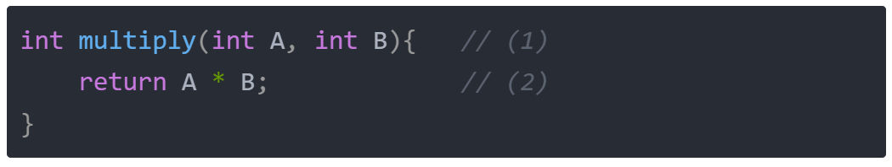
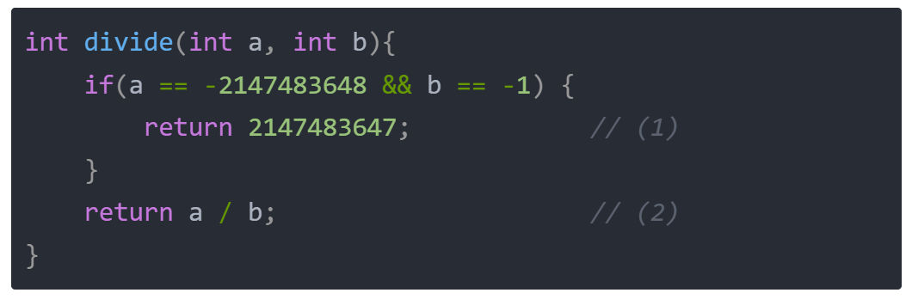
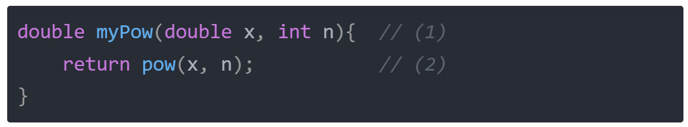
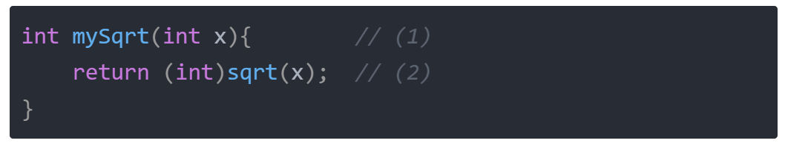
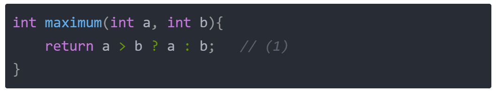

# **题目分析**
**1、整数乘法**


**2、整数除法**



仔细思考一下，只有当 a == -2147483648 且 b == -1 时，除法结果为 2147483648 会溢出，其它情况都不会溢出，所以这种情况下，根据题目要求，直接返回 2147483647 ； 不溢出的情况，直接返回a/b即可，C语言会自己做向下取整；
**3、次幂函数**


- (1) double是C/C++中的双精度浮点数，即小数；
- (2) 不好意思，C语言有现成的求幂函数 pow(x,n) 就是求 x 的 n 次幂；

**4、开方函数**


(1) 返回值是传参的算术平方根的取整；
(2) 不好意思，这题本来是二分查找，又被水过去了。C语言有取平方根的函数 sqrt，记得(int)进行强制转换，不强转估计也没事（会在返回的时候进行自动转换）；
**5、最值函数**


这题考察的是C语言中唯一的三目运算符：条件运算符;
# **课后习题**
## 不用运算符求两数之和
#### 一、题目链接

[面试题 17.01. 不用加号的加法](https://leetcode.cn/problems/add-without-plus-lcci/)
## 二、题目简介

> 设计一个函数把两个数字相加。不得使用 + 或者其他算术运算符。

## 三、涉及知识点

这道题涉及的知识点如下：

递归、[位与](https://t.zsxq.com/0eJVOtg45)、[异或](https://t.zsxq.com/0e5DmzYP2)、[左移](https://t.zsxq.com/0eElnsCox)。

如果都已经掌握，请自行将这道题过掉；如果没有掌握，请务必先将这些知识点进行掌握。
## 四、算法分析

将 a 和 b 都转化成二进制以后，执行相加，举个简单的例子，假设 a 是 21（二进制是 10101），b 是 12（二进制是 1100） ，它们两个相加的值应该是 33。

我们把它们按照竖式列出来，如下：
```
10101  =21
+
01100  =12
-------------------
100001 =33
```
1. 对于两个数对应位相加，如果不产生进位，那么就是异或的结果。
	- 比如说： 1 和 0 相加，结果是 1，异或结果也是 1； 0 和 0 相加，结果是 0，异或结果也是 0； 0 和 1 相加，结果是 1，异或结果也是 1；进一步验证了 **上述观点**。
2. 唯一没有提到的，就是 1 和 1 相加的情况，这种情况，会产生进位，所以异或结果并不等于相加的结果，但是**异或的结果等于相加后低位的值**。换言之，1 + 1 等于 10，异或结果等于 0。
3. 基于上述观点，如果两个数二进制位在相加的过程中，都没有出现 1 和 1 的情况，那么 加法 就等于 两个数的异或。如果有进位，那么就要把进位的那部分单独拎出来。
4. 什么时候有进位呢？当两个位都为1的时候，也就是两个位 **位与&** 为1的时候。所以，我们可以把 a + b 拆成两部分：
```math
a ^ b 和 a & b
```
而 a & b << 1 就代表了进位的部分，所以 异或的部分 + 进位的部分，就构成了 a 和 b 的和。所以：
```
a + b = (a^b) + ((a&b)<<1)
```
递归求解。
## 五、源码讲解

  
```
int add(int a, int b)
{
	if(b == 0) 
	{                                             (1)
	return a;
	}
	return add(a^b, ((unsigned int)(a&b))<<1);    (2)
}
```
(1) 当 b 等于 0 的时候，很明显结果就是 a + 0，也即是返回 a 即可；

(2) 按照上文的分析，直接递归返回即可；需要注意的是，a 和 b 位与的结果可能是负数，负数在力扣不支持左移，所以需要转换成 无符号整型 unsigned int。