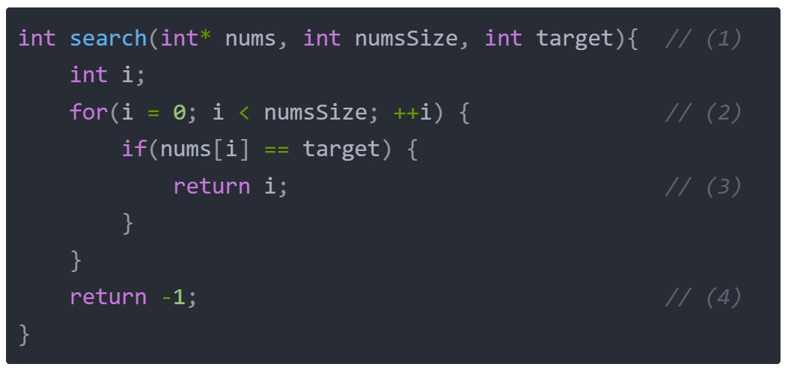
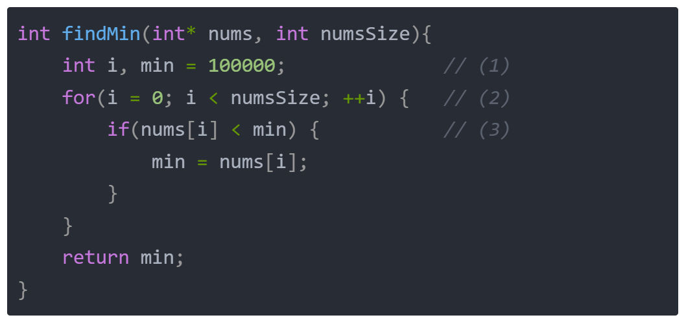

# 题目分析
## 数组的查找


- (1) 传入参数 int * nums 代表一个整型数组，int numsSize 代表数组长度，target 则表示要查找的数；
- (2) 遍历数组的每个元素；
- (3) 如果找到某个元素和传入参数 target 相等，则直接返回下标 i；
- (4) 如果一直没找到，则返回 -1；

## 数组的最小值



- (1) 定义一个全局最小值；
- (2) 遍历数组所有元素；
- (3) 如果数组元素nums[i]比全局最小值小，则更新全局最小值。

## 斐波那契数列

```c
int f[31];
int fib(int n){
    f[0] = 0;
    f[1] = 1;
    for (int i = 2; i <= n; ++i)
    {
        f[i] = f[i-1] + f[i-2];
    }
    return f[n];
}
```
- (1) 定义一个全局的辅助数组；
- (2) 初始化方案为 1；
- (3) 你可以从 i-1 层爬过来，也可以从 i-2 层爬过来，所以两个方案数加和即可；
- (4) 返回到达第 n 层的方案数；

## 绝对值为 k 的数对

```c
int countKDifference(int* nums, int numsSize, int k) 
{
    int i, j;
    int ans = 0;
    for (i = 0; i < numsSize; ++i)
    {
        for (j = i + 1; j < numsSize; ++j)
        {
            if (abs(nums[i] - nums[j]) == k)
            {
                ++ans;
            }
        }
    }
    return ans;
}
```
- (1) 先枚举一个 i；
- (2) 再枚举一个 j；
- (3) 然后计算两个数组元素的差的绝对值，判断是否等于 ，如果等于 k，计数器加一；
- (4) 最后返回计数器；

## [LCP 01. 猜数字](https://leetcode.cn/problems/guess-numbers/)

小A 和 小B 在玩猜数字。小B 每次从 1, 2, 3 中随机选择一个，小A 每次也从 1, 2, 3 中选择一个猜。他们一共进行三次这个游戏，请返回 小A 猜对了几次？

输入的`guess`数组为 小A 每次的猜测，`answer`数组为 小B 每次的选择。`guess`和`answer`的长度都等于3。

**示例 1：**

**输入：**guess = [1,2,3], answer = [1,2,3]
**输出：**3
**解释：**小A 每次都猜对了。

**示例 2：**

**输入：**guess = [2,2,3], answer = [3,2,1]
**输出：**1
**解释：**小A 只猜对了第二次。

**限制：**

1. `guess` 的长度 = 3
2. `answer` 的长度 = 3
3. `guess` 的元素取值为 `{1, 2, 3}` 之一。
4. `answer` 的元素取值为 `{1, 2, 3}` 之一。
```c
int game(int* guess, int guessSize, int* answer, int answerSize)
{
    int ans = 0;
    for (int i = 0; i < guessSize; ++i)
    {
        if (guess[i] == answer[i])
        {
            ++ans;
        }
    }
    return ans;
}

```
- (1) 分别取两个数组中对应的元素进行判断，如果相等则计数器加一，否则加零（即不加）；

## [LCP 06. 拿硬币](https://leetcode.cn/problems/na-ying-bi/)

桌上有 `n` 堆力扣币，每堆的数量保存在数组 `coins` 中。我们每次可以选择任意一堆，拿走其中的一枚或者两枚，求拿完所有力扣币的最少次数。

**示例 1：**

> 输入：`[4,2,1]`
> 
> 输出：`4`
> 
> 解释：第一堆力扣币最少需要拿 2 次，第二堆最少需要拿 1 次，第三堆最少需要拿 1 次，总共 4 次即可拿完。

**示例 2：**

> 输入：`[2,3,10]`
> 
> 输出：`8`

**限制：**

- `1 <= n <= 4`
- `1 <= coins[i] <= 10`

```c

int minCount(int* coins, int coinsSize)
{
    int ans = 0;
    for (int i = 0; i < coinsSize; ++i)
    {
        //此堆硬币为奇数
        if (coins[i] % 2)
        {
            ans += (coins[i] + 1) / 2;
        }
        //此堆硬币为偶数
        else
        {
            ans += coins[i]  / 2;
        }
    }
    return ans;
}

```
- (1) 这个问题其实就是奇数 和 偶数 的情况分别处理即可，考虑一个数 x，如果是奇数，就要返回 (x+1)/2；如果是偶数，则返回 x/2。当然也可以合并，利用 C语言整数除法是取下整的性质，可以都用 (x+1)/2。
## [70. 爬楼梯](https://leetcode.cn/problems/climbing-stairs/)

提示

假设你正在爬楼梯。需要 `n` 阶你才能到达楼顶。

每次你可以爬 `1` 或 `2` 个台阶。你有多少种不同的方法可以爬到楼顶呢？

**示例 1：**

**输入：**n = 2
**输出：**2
**解释：**有两种方法可以爬到楼顶。
1. 1 阶 + 1 阶
2. 2 阶

**示例 2：**

**输入：**n = 3
**输出：**3
**解释：**有三种方法可以爬到楼顶。
1. 1 阶 + 1 阶 + 1 阶
2. 1 阶 + 2 阶
3. 2 阶 + 1 阶

**提示：**

- `1 <= n <= 45`
代码:
- 这是一个斐波那契数列问题
```c
int climbStairs(int n) 
{
    int f[46]; //定义一个全局的辅助数组
    f[0] = 1; //爬到第0层的方案数是1
    f[1] = 1;//爬到第1层的方案数是1
    //f[2] = f[1] + f[0];//爬到第2层的方案数,可以从第1层爬过来，也可以从第0层爬过来
    //f[3] = f[2] + f[1];//爬到第3层的方案数,可以从第2层爬过来，也可以从第1层爬过来
    //f[i] = f[i-1] + f[i-2];//爬到第i层的方案数,就是i-1层的方案数加上i-2层的方案数
    for (int i = 2; i <= n; ++i)
    {
        f[i] = f[i-1] + f[i-2];
    }
    return f[n];
}
```

## [LCR 069. 山脉数组的峰顶索引](https://leetcode.cn/problems/B1IidL/)

符合下列属性的数组 `arr` 称为 **山峰数组**（**山脉数组）** ：

- `arr.length >= 3`
- 存在 `i`（`0 < i < arr.length - 1`）使得：
    - `arr[0] < arr[1] < ... arr[i-1] < arr[i]`
    - `arr[i] > arr[i+1] > ... > arr[arr.length - 1]`

给定由整数组成的山峰数组 `arr` ，返回任何满足 `arr[0] < arr[1] < ... arr[i - 1] < arr[i] > arr[i + 1] > ... > arr[arr.length - 1]` 的下标 `i` ，即山峰顶部。

**示例 1：**

**输入：**arr = [0,1,0]
**输出：**1

**示例 2：**

**输入：**arr = [1,3,5,4,2]
**输出：2**

**示例 3：**

**输入：**arr = [0,10,5,2]
**输出：**1

**示例 4：**

**输入：**arr = [3,4,5,1]
**输出：**2

**示例 5：**

**输入：**arr = [24,69,100,99,79,78,67,36,26,19]
**输出：**2

**提示：**

- `3 <= arr.length <= 104`
- `0 <= arr[i] <= 106`
- 题目数据保证 `arr` 是一个山脉数组
代码：
```c
int peakIndexInMountainArray(int* arr, int arrSize)
{
    for (int i =1; i < arrSize - 1; ++i)
    {
	    //如果此元素大于前面的元素且小于后面的元素，则返回索引
        if (arr[i] > arr[i - 1] && arr[i] > arr[i + 1])
        {
            return i;
        }
    }
    return -1;
}
```