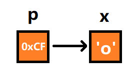
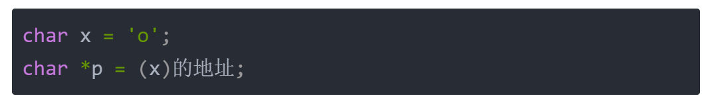
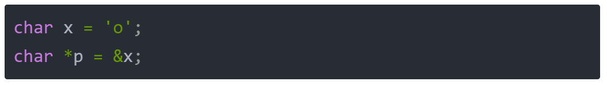
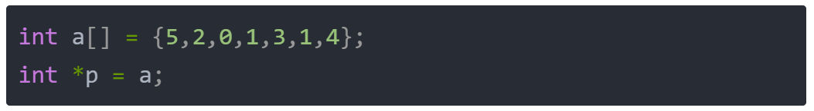
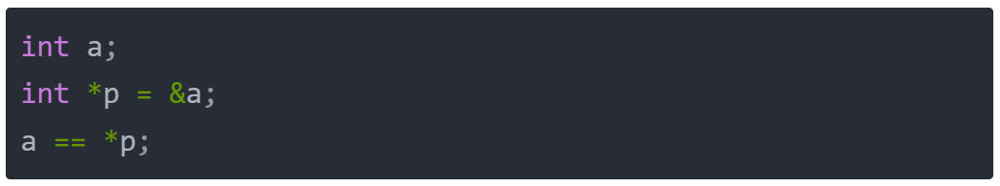
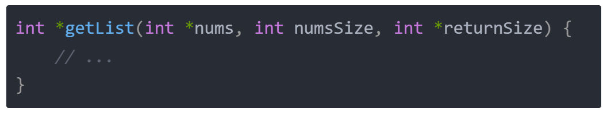
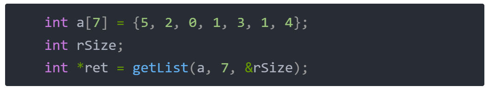
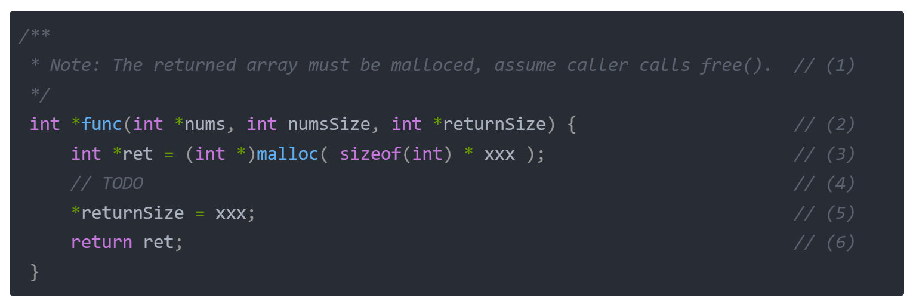

# 概念定义

  

**1、指针即地址**

计算机中所有的数据都必须放置在内存中，不同类型的数据占用的字节数也不一样，例如 32位整型int占据 4 个字节，64位整型long long占据 8 个字节，字符型char占据 1 个字节。 为了能够正确地访问这些数据，必须为每个字节都编上编号，每个字节的编号是唯一的。 我们把内存中字节的编号称为 **地址** 或 **指针**。地址从 0 开始依次递增，对于 32 位环境下，程序能够使用的内存为 4GB，最小的地址为 0，最大的地址为 0XFFFFFFFF。

  

**2、指针的定义**

在C语言中，可以用一个变量来存放指针，这种变量称为指针变量。指针变量的值，通俗来说就是某一个变量的地址。 现在假设有一个char·类型的变量x，它存储了字符'o'，并占用了地址为0xCF的内存（地址通常用十六进制表示）。另外有一个指针变量p，它的值为0xCF，正好等于变量x的地址，这种情况我们就称p指向了x，或者说p是指向变量x的指针。



其中 p 是指针变量名，x 是被指向的变量的变量名；0xCF是 指针变量 p 的值，也是 x 的地址；'o'是 x 的值。

  

**3、定义指针变量**

  

定义指针变量和普通变量类似，只不过在变量名前面加上一个星号*即可。C语言实现如下：

  
```
DataType *dataName;
```
  

我们用到最多的指针变量类型为整型，可以这么写：`int *p;`

  

对于字符类型的指针变量，可以这么写：`char *p;`

  

**4、取地址**

  

我们回到上面的问题，假设 是一个字符型变量，p 是 x 的地址，那么伪代码应该是这样的：



而实际写代码的时候，我们通过 & 来表示取地址符号，也就是代码可以写成（这是一个语法糖，一定要记住）：



**5、数组的地址**

  

对于数组而言，其中的元素的地址都是连续的，数组第一个元素的地址可以用数组名来表示，实现如下：

  



  

简而言之，p 指向数组第一个元素的地址，a 也是数组第一个元素的地址。

  

**6、解引用**

  

解引用是取地址的逆操作，即根据给定的地址，获取它的值。用 * 运算符来实现，如下：

  



一句话解释，p 代表 a 的地址，*p 代表 a 的值；

  

**7、内存申请**

  

C语言中，利用函数malloc来申请内存，传入参数为申请内存的字节数，返回值为申请到的内存的首地址，是什么类型的地址，就要强转成什么类型，如下：

  


  

p 代表的是申请到的内存，并且有效内存字节数为 1024。 如果我们要申请一个长度为 n 的整型数组的内存，可以这么写：


  

其中 sizeof(int) 表示的是一个 int 占用的字节数，那么一个长度为 n 的 int 类型的数组，需要的字节数自然就是 sizeof(int) * n。

  

**8、返回数组**

  

一般在刷题的时候，要求返回一个数组，这就比较尴尬，尴尬在哪里呢？ 因为函数只能有一个返回值，而数组除了需要知道数组的首地址，还需要知道数组元素的个数。 所以，一般做法是，通过函数的参数传递一个指针变量进来，然后让调用者去填充这个指针变量，如下：

  



  

这里的 returnSize 是一个指针，它指向的就是一个代表数组长度的变量，它是没有赋值的，需要我们通过解引用对它进行赋值。 函数的调用方，其实是这么调用的：

  



  

这里的 &rSize 含义就是取了 rSize 的地址，传递给 returnSize 时，自然就成了指针。这样，在函数内部对*returnSize 进行修改，自然就改了 rSize 的值，调用函数的一方自然就知道这个数组的长度了。 好了，今天的内容比较难，如果不懂，一定要在评论区留言告诉我，我会不断改善这块内容，争取能让更多的人听懂。

  

**9、范式**

所谓范式，就是规范写法的意思。就是按照这种规范写法写，能解决大部分问题。有关返回一维数组的问题，我们有通用范式，如下：

  



  

- (1) 这一句话一般是系统提示你，需要申请内存，并且返回申请内存的首地址；
- (2) 这里会有两个返回值，一个是数组首地址（体现在返回值上），一个是数组大小（体现在指针传参上）；
- (3) 利用 malloc 申请一块自定义大小的内存；
- (4) 做你要做的事情；
- (5) 利用解引用，将需要返回的数组的长度告诉调用者；
- (6) 返回申请的数组内存的数组首地址；
# 题目分析
## [1470. 重新排列数组](https://leetcode.cn/problems/shuffle-the-array/)

给你一个数组 `nums` ，数组中有 `2n` 个元素，按 `[x1,x2,...,xn,y1,y2,...,yn]` 的格式排列。
请你将数组按 `[x1,y1,x2,y2,...,xn,yn]` 格式重新排列，返回重排后的数组。

**示例 1：**

**输入：**nums = [2,5,1,3,4,7], n = 3
**输出：**[2,3,5,4,1,7] 
**解释：**由于 x1=2, x2=5, x3=1, y1=3, y2=4, y3=7 ，所以答案为 [2,3,5,4,1,7]

**示例 2：**

**输入：**nums = [1,2,3,4,4,3,2,1], n = 4
**输出：**[1,4,2,3,3,2,4,1]

**示例 3：**

**输入：**nums = [1,1,2,2], n = 2
**输出：**[1,2,1,2]

**提示：**

- `1 <= n <= 500`
- `nums.length == 2n`
- `1 <= nums[i] <= 10^3`
代码：
函数声明:

```c
/*
 * Note: The returned array must be malloced, assume caller calls free().(1)
 */
int* shuffle(int* nums, int numsSize, int n, int* returnSize)//(2)
{
    //开辟内存空间
    int* ret = (int*)malloc(sizeof(int) * numsSize);//(3)
    //将数组前一半放在新数组偶数位
    for (int i = 0; i < n; ++i)//(4)
    {
        ret[2 * i] = nums[i];
    }
    //将数组后一半放在新数组奇数位
    for (int i = n; i < numsSize; ++i)
    {
        ret[2 * (i - n) + 1] = nums[i];
    }
    //赋值返回值数组个数
    *returnSize = numsSize;//(5) 
    //返回数组
    return ret;//(6)
}
```

- (1) 这句话是核心，返回的数组必须是通过malloc进行内存分配的，因为调用者会对它进行free的清理操作；
- (2) 这个函数的返回值是int*，即返回的是一个数组的首地址，但是数组的大小也需要让调用者知道，所以通过一个传参returnSize来传递出去；
- (3) 申请一个长度为numsSize的数组，首地址为ret；
- (4) 根据题目要求，将nums的数据填充到ret中；
- (5) 最后，别忘了利用解引用，将需要返回的数组的长度告诉调用者；
- (6) 返回你申请的数组的首地址；

 函数调用:
```c
int main() {
    int nums[] = {1, 2, 3, 4, 5, 6};
    int numsSize = sizeof(nums) / sizeof(nums[0]);
    int n = numsSize / 2;
    int returnSize;
    
    // 调用 shuffle 函数
    int* shuffledArray = shuffle(nums, numsSize, n, &returnSize);
    
    // 输出新数组
    for (int i = 0; i < returnSize; i++) {
        printf("%d ", shuffledArray[i]);
    }
    printf("\n");
    
    // 释放内存
    free(shuffledArray);
    
    return 0;
}
```
  - 通常，`returnSize` 的用途是在调用 `shuffle` 函数的地方用于接收新数组的大小。这在使用 C 语言进行动态内存分配和返回数组时是一个常见的做法。

## [1929. 数组串联](https://leetcode.cn/problems/concatenation-of-array/)

给你一个长度为 `n` 的整数数组 `nums` 。请你构建一个长度为 `2n` 的答案数组 `ans` ，数组下标 **从 0 开始计数** ，对于所有 `0 <= i < n` 的 `i` ，满足下述所有要求：

- `ans[i] == nums[i]`
- `ans[i + n] == nums[i]`

具体而言，`ans` 由两个 `nums` 数组 **串联** 形成。

返回数组 `ans` 。

**示例 1：**

**输入：**nums = [1,2,1]
**输出：**[1,2,1,1,2,1]
**解释：**数组 ans 按下述方式形成：
- ans = [nums[0],nums[1],nums[2],nums[0],nums[1],nums[2]]
- ans = [1,2,1,1,2,1]

**示例 2：**

**输入：**nums = [1,3,2,1]
**输出：**[1,3,2,1,1,3,2,1]
**解释：**数组 ans 按下述方式形成：
- ans = [nums[0],nums[1],nums[2],nums[3],nums[0],nums[1],nums[2],nums[3]]
- ans = [1,3,2,1,1,3,2,1]

**提示：**

- `n == nums.length`
- `1 <= n <= 1000`
- `1 <= nums[i] <= 1000`
代码：
```c
/**
 * Note: The returned array must be malloced, assume caller calls free().
 */
int* getConcatenation(int* nums, int numsSize, int* returnSize) 
{
    int* ret = (int*)malloc(sizeof(int) * numsSize * 2);
    for (int i = 0; i < numsSize; ++i)
    {
        ret[i] = ret[i+numsSize] = nums[i];
    }
    *returnSize = numsSize * 2;

    return ret;
}
```
- (1) 这题和上题的不同之处在于：申请一个长度为 2 * numsSize 的数组，首地址为 ret；
- (2) 根据题目要求，将 nums 的数据填充到 ret 中；
- (3) 别忘了利用解引用，将需要返回的数组的长度告诉调用者；
- (4) 返回你申请的数组的首地址；

  

## [1920. 基于排列构建数组](https://leetcode.cn/problems/build-array-from-permutation/)

给你一个 **从 0 开始的排列** `nums`（**下标也从 0 开始**）。请你构建一个 **同样长度** 的数组 `ans` ，其中，对于每个 `i`（`0 <= i < nums.length`），都满足 `ans[i] = nums[nums[i]]` 。返回构建好的数组 `ans` 。

**从 0 开始的排列** `nums` 是一个由 `0` 到 `nums.length - 1`（`0` 和 `nums.length - 1` 也包含在内）的不同整数组成的数组。

**示例 1：**

**输入：**nums = [0,2,1,5,3,4]
**输出：**[0,1,2,4,5,3]
**解释：**数组 ans 构建如下：
ans = [nums[nums[0]], nums[nums[1]], nums[nums[2]], nums[nums[3]], nums[nums[4]], nums[nums[5]]]
    = [nums[0], nums[2], nums[1], nums[5], nums[3], nums[4]]
    = [0,1,2,4,5,3]

**示例 2：**

**输入：**nums = [5,0,1,2,3,4]
**输出：**[4,5,0,1,2,3]
**解释：**数组 ans 构建如下：
ans = [nums[nums[0]], nums[nums[1]], nums[nums[2]], nums[nums[3]], nums[nums[4]], nums[nums[5]]]
    = [nums[5], nums[0], nums[1], nums[2], nums[3], nums[4]]
    = [4,5,0,1,2,3]

**提示：**

- `1 <= nums.length <= 1000`
- `0 <= nums[i] < nums.length`
- `nums` 中的元素 **互不相同**
代码：
```c
/**
 * Note: The returned array must be malloced, assume caller calls free().
 */
int* buildArray(int* nums, int numsSize, int* returnSize) 
{
    int* ans = (int*)malloc(sizeof(int) * numsSize);//开辟内存空间
    *returnSize = numsSize;//赋值返回数组长度

    for (int i = 0; i < numsSize; ++i)
    {
        ans[i] = nums[nums[i]];
    }

    return ans;
}
```

  
## [1480. 一维数组的动态和](https://leetcode.cn/problems/running-sum-of-1d-array/)

给你一个数组 `nums` 。数组「动态和」的计算公式为：`runningSum[i] = sum(nums[0]…nums[i])` 。
请返回 `nums` 的动态和。

**示例 1：**

**输入：**nums = [1,2,3,4]
**输出：**[1,3,6,10]
**解释：**动态和计算过程为 [1, 1+2, 1+2+3, 1+2+3+4] 。

**示例 2：**

**输入：**nums = [1,1,1,1,1]
**输出：**[1,2,3,4,5]
**解释：**动态和计算过程为 [1, 1+1, 1+1+1, 1+1+1+1, 1+1+1+1+1] 。

**示例 3：**

**输入：**nums = [3,1,2,10,1]
**输出：**[3,4,6,16,17]

**提示：**

- `1 <= nums.length <= 1000`
- `-10^6 <= nums[i] <= 10^6`
代码：
```c
/**
 * Note: The returned array must be malloced, assume caller calls free().
 */
int* runningSum(int* nums, int numsSize, int* returnSize)
{
    int* ret = (int*)malloc(sizeof(int) * numsSize);
    *returnSize = numsSize;

    for (int i = 0; i < numsSize; ++i)
    {
        if (i == 0)
        {
            ret[i] = nums[i];
        }
        else
        {
            ret[i] = ret[i - 1] + nums[i];
        }
    }
    return ret;
}
```
- (1) 当 i=0 时， ret[0] = nums[0]；当 i > 0 时, ret[i] = ret[i−1] + nums[i]，O(1) 的时间复杂度计算每个元素的动态和。

## [LCR 182. 动态口令](https://leetcode.cn/problems/zuo-xuan-zhuan-zi-fu-chuan-lcof/)

某公司门禁密码使用动态口令技术。初始密码为字符串 `password`，密码更新均遵循以下步骤：

- 设定一个正整数目标值 `target`
- 将 `password` 前 `target` 个字符按原顺序移动至字符串末尾

请返回更新后的密码字符串。

**示例 1：**

**输入:** password = "s3cur1tyC0d3", target = 4
**输出:** "r1tyC0d3s3cu"

**示例 2：**

**输入:** password = "lrloseumgh", target = 6
**输出:** "umghlrlose"

**提示：**

- `1 <= target < password.length <= 10000`
代码：
```c
char* dynamicPassword(char* password, int target) 
{
    int n = strlen(password);//获取字符串长度
    char* ret = (char*)malloc(sizeof(char) * (n + 1));//开辟内存空间，C语言字符串末尾要加'\0'，所以是n+1

    //遍历数组，通过取模的方式实现循环字符串
    for (int i = 0; i < n; ++i)
    {
        int x = (i + target) % n;
        ret[i] = password[x];
    }
    ret[n] = '\0';//C语言字符串末尾要加'\0'

    return ret;
}
```
- (1) 注意，字符串需要多申请一个自己的内存，用来存放结尾标记\0；
- (2) 把字符串首位相接，循环取模；
- (3) 加上结尾标记以后，调用者就不需要知道实际字符串有多长，可以通过strlen来获取了；
举例:

假设输入字符串 `password = "abcdef"` 和 `target = 2`：

- `n = 6`（字符串长度）。
- 循环移动：
    - `i = 0`: `(0 + 2) % 6 = 2`，`ret[0] = password[2] = 'c'`
    - `i = 1`: `(1 + 2) % 6 = 3`，`ret[1] = password[3] = 'd'`
    - `i = 2`: `(2 + 2) % 6 = 4`，`ret[2] = password[4] = 'e'`
    - `i = 3`: `(3 + 2) % 6 = 5`，`ret[3] = password[5] = 'f'`
    - `i = 4`: `(4 + 2) % 6 = 0`，`ret[4] = password[0] = 'a'`
    - `i = 5`: `(5 + 2) % 6 = 1`，`ret[5] = password[1] = 'b'`
- 新字符串 `ret = "cdefab"`
  
## [1108. IP 地址无效化](https://leetcode.cn/problems/defanging-an-ip-address/)


给你一个有效的 [IPv4](https://baike.baidu.com/item/IPv4) 地址 `address`，返回这个 IP 地址的无效化版本。

所谓无效化 IP 地址，其实就是用 `"[.]"` 代替了每个 `"."`。

**示例 1：**

**输入：**address = "1.1.1.1"
**输出：**"1[.]1[.]1[.]1"

**示例 2：**

**输入：**address = "255.100.50.0"
**输出：**"255[.]100[.]50[.]0"

**提示：**

- 给出的 `address` 是一个有效的 IPv4 地址
代码：
```c
char * defangIPaddr(char * address)
{
    int n = strlen(address);//获取字符串长度
    //开辟内存空间，新增了3对[]，再加上'\0'，所以是n+6 +1
    char* ret = (char*)malloc(sizeof(char) * (n + 6 + 1));

    int size = 0;
    for (int i = 0; i < n; ++i)
    {
        if (address[i] == '.')
        {
            ret[size++] = '[';
            ret[size++] = '.';
            ret[size++] = ']';
        }
        else
        {
            ret[size++] = address[i];
        }
    }
    ret[size] = '\0';

    return ret;
}
```
- (1) 直接在原字符串代替不好做，所以我们可以申请一个新的字符串，长度可以定长一点关系不大；
- (2) 然后遇到'.'字符，我们就在返回的字符串上加上三个字符：'['、'.'、']'，否则添加原字符；其中循环中的 address[i] 等价于 address[i] != '\0'
- (3) 最后，在字符串末尾添加一个'\0'表示字符串结尾；

## [LCR 122. 路径加密](https://leetcode.cn/problems/ti-huan-kong-ge-lcof/)

假定一段路径记作字符串 `path`，其中以 "`.`" 作为分隔符。现需将路径加密，加密方法为将 `path` 中的分隔符替换为空格 " "，请返回加密后的字符串。

**示例 1：**

**输入：**path = "a.aef.qerf.bb"

**输出：**"a aef qerf bb"

**限制：**

`0 <= path.length <= 10000`

代码：
```c
char* pathEncryption(char* path) 
{
    int n = strlen(path);
    char* ret = (char*)malloc(sizeof(char) * (n + 1));
    for (int i = 0; i < n; ++i)
    {
        if(path[i] == '.')
        {
            ret[i] = ' ';
        }
        else
        {
            ret[i] = path[i];
        }
    }
    ret[n] = 0;

    return ret;
}
```