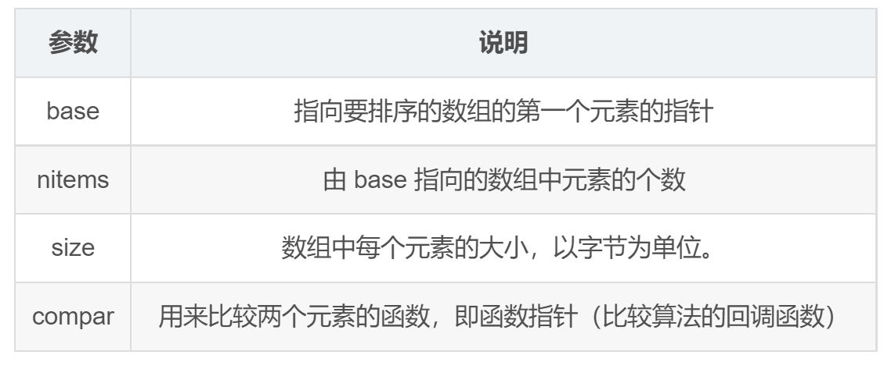
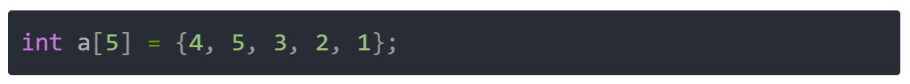
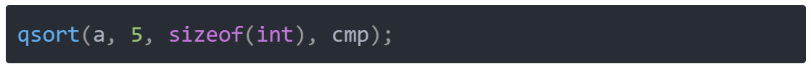
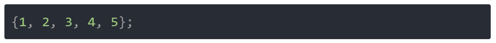
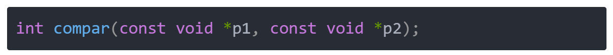
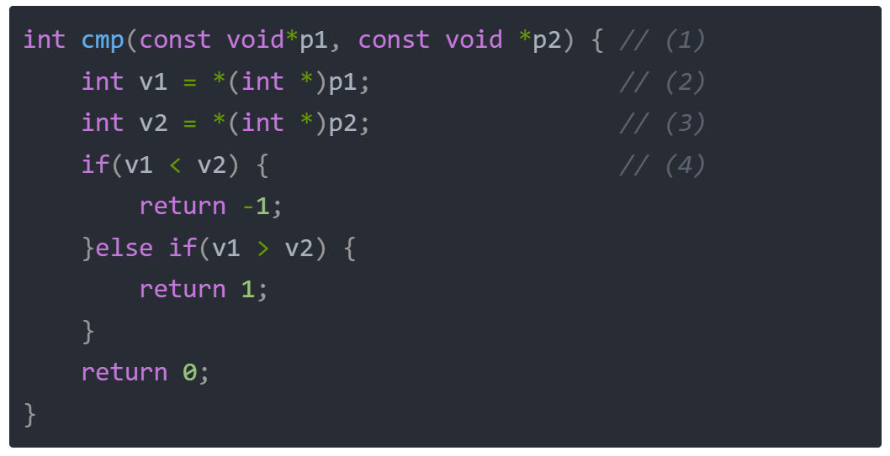
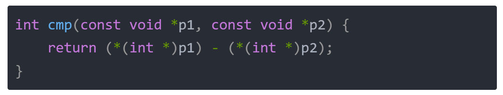
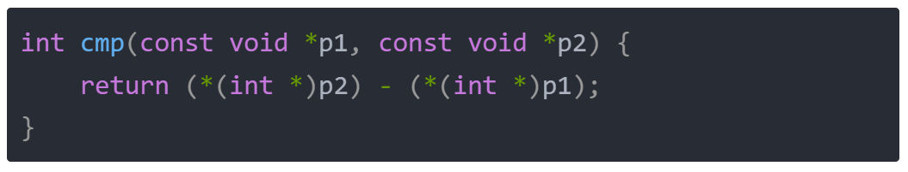
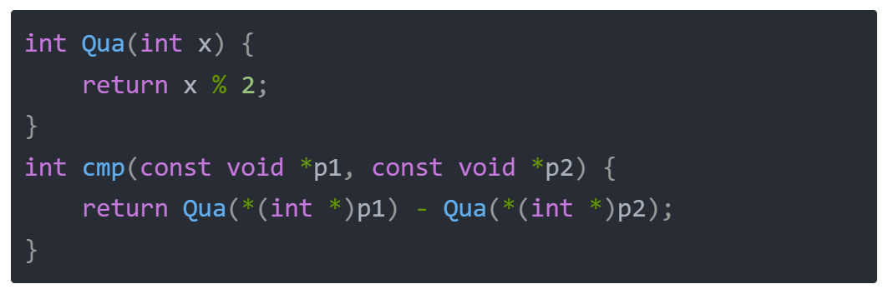

# 概念定义

## 排序简介

你或许对排序略有耳闻，排序的各种算法或许也曾经困扰着你，几个实现比较简单，但是时间效率较低的排序，如：冒泡排序、选择排序、插入排序；以及实现相对较复杂，但是效率较高的排序，如 归并排序、快速排序、希尔排序 等等；还有一些非比较排序，如 基数排序、计数排序、桶排序。 然而今天的内容，我们不需要了解任何排序的算法原理，就能把所有关于排序的题给做了。用到的就是 C语言 提供的排序 API —— qsort。

## qsort 简介

排序 API 的作用就是传入一个数组，并且对数组按照给定的规则进行就地排序。它的声明如下：

**void** **qsort**(**void** *base, **size_t** nitems, **size_t** size, **int** (*compar)(**const** **void** *, **const** **void***));



## qsort 调用

例如，我们对如下无序数组调用排序 API：


就可以这么写：

这样，a数组的值就会变成：



其中 sizeof(int) 就代表了单个数组元素的字节数，5 则代表了数组的大小，总的字节数就是两者的乘积。而cmp是一个比较函数，是需要我们自己实现的，它决定了数组是递增排序 还是 递减排序，还是其它的排序方式（比如奇数排前面，偶数排后面，等等）。接下来，我们来看看cmp函数的实现方式。

## 比较函数

### **1）函数原型**

  

对于 比较函数 的原型，如下所示：



如果compar返回值小于0，则p1所指向元素会被排在p2所指向元素的左面；

如果compar返回值等于0，则p1所指向元素与p2所指向元素的顺序不确定；

如果compar返回值大于0，则p1所指向元素会被排在p2所指向元素的右面。

  

### **2）函数定义**

  

如果我们要写一个递增排序，那么可以这么写：



(1) 要和系统给定的函数原型保持一致，由于需要适配任何类型，所以用空指针 void * 做为参数类型；

(2) p1强制转换成数组元素的指针类型，然后再解引用 变成数组元素的值；

(3) p2强制转换成数组元素的指针类型，然后再解引用 变成数组元素的值；

(4) 根据上面的规则进行实际的函数返回，有关解引用相关的内容可以参考 九日集训第四天 的文章。

  

### **3）简化写法**

  

当然，如果你确保数组的数据相减不会超过32位整型，那你可以这么写：

  



  

## 更多比较函数

  

当然，我们也可以实现递减的比较函数，如下（可以直接交换p1和p2的位置即可，自行思考）：

  



  

如果要求偶数排前面，奇数排后面，可以这么写：

  



那么接下来，让我们做几道例题，来巩固一下排序的概念。

  

# 题目分析

## [912. 排序数组](https://leetcode.cn/problems/sort-an-array/)

给你一个整数数组 `nums`，请你将该数组升序排列。

**示例 1：**

**输入：**nums = [5,2,3,1]
**输出：**[1,2,3,5]

**示例 2：**

**输入：**nums = [5,1,1,2,0,0]
**输出：**[0,0,1,1,2,5]

**提示：**

- `1 <= nums.length <= 5 * 104`
- `-5 * 104 <= nums[i] <= 5 * 104`
代码：
```c
//比较回调函数
int cmp(const void *a, const void *b)//(1)
{
    int val_a = *(int *)a;
    int val_b = *(int *)b;

    return val_a - val_b;//升序排列
}

int* sortArray(int* nums, int numsSize, int* returnSize) 
{
    qsort(nums, numsSize, sizeof(int), cmp);//(2) 
    *returnSize = numsSize;//(3)

    return nums;//(4)
}
```
- (1) 上文提到的比较函数；
- (2) 调用排序 API；
- (3) 告诉调用者排序后的元素个数；
- (4) 返回排序后的数组首地址；

  

## [169. 多数元素](https://leetcode.cn/problems/majority-element/)

给定一个大小为 `n` 的数组 `nums` ，返回其中的多数元素。多数元素是指在数组中出现次数 **大于** `⌊ n/2 ⌋` 的元素。

你可以假设数组是非空的，并且给定的数组总是存在多数元素。

**示例 1：**

**输入：**nums = [3,2,3]
**输出：**3

**示例 2：**

**输入：**nums = [2,2,1,1,1,2,2]
**输出：**2

**提示：**

- `n == nums.length`
- `1 <= n <= 5 * 104`
- `-109 <= nums[i] <= 109`
代码：
```c
//比较回调函数
int cmp(const void *a, const void *b)
{
    return *(int *)a - *(int *)b;
}
//获得多数元素的值
int majorityElement(int* nums, int numsSize)
{
    qsort(nums, numsSize, sizeof(int), cmp);//数组排序

    int cur_cnt = 1;//当前元素出现次数
    int max_val = nums[0];//出现次数最多元素
    int max_cnt = 1;//出现次数最多元素个数
    //遍历数组
    for(int i = 1; i < numsSize; ++i)
    {
        //如果当前元素和前一个元素相等
        if(nums[i] == nums[i - 1])
        {
            cur_cnt++;//当前元素出现次数自增
            //如果当前元素出现次数大于最多元素个数
            if(cur_cnt > max_cnt)
            {
                max_cnt = cur_cnt;//赋值最多元素个数
                max_val = nums[i];//赋值出现次数最多元素
            }
        }
        //如果不相等
        else
        {
            cur_cnt = 1;////当前元素出现次数为1
        }
    }
    return max_val;
}
```
  

## [217. 存在重复元素](https://leetcode.cn/problems/contains-duplicate/)

给你一个整数数组 `nums` 。如果任一值在数组中出现 **至少两次** ，返回 `true` ；如果数组中每个元素互不相同，返回 `false` 。

**示例 1：**

**输入：**nums = [1,2,3,1]
**输出：**true

**示例 2：**

**输入：**nums = [1,2,3,4]
**输出：**false

**示例 3：**

**输入：**nums = [1,1,1,3,3,4,3,2,4,2]
**输出：**true

**提示：**

- `1 <= nums.length <= 105`
- `-109 <= nums[i] <= 109`
代码：
```c
int cmp(const void *a, const void *b)
{
    return *(int *)a - *(int *)b;
}


bool containsDuplicate(int* nums, int numsSize) 
{
    qsort(nums, numsSize, sizeof(int), cmp);
    for(int i = 1; i < numsSize; ++i)
    {
        if(nums[i] == nums[i-1])
        {
            return true;
        }
    }
    return false;
}
```
- (1) 如果存在重复元素，排序完毕，必然相邻；

  

## [164. 最大间距](https://leetcode.cn/problems/maximum-gap/)

给定一个无序的数组 `nums`，返回 _数组在排序之后，相邻元素之间最大的差值_ 。如果数组元素个数小于 2，则返回 `0` 。
您必须编写一个在「线性时间」内运行并使用「线性额外空间」的算法。

**示例 1:**

**输入:** nums = [3,6,9,1]
**输出:** 3
**解释:** 排序后的数组是 [1,3,6,9]**_,_** 其中相邻元素 (3,6) 和 (6,9) 之间都存在最大差值 3。

**示例 2:**

**输入:** nums = [10]
**输出:** 0
**解释:** 数组元素个数小于 2，因此返回 0。

**提示:**

- `1 <= nums.length <= 105`
- `0 <= nums[i] <= 109`
代码：
```c
int cmp(const void *a, const void *b)
{
    return *(int *)a - *(int *)b;
}
int maximumGap(int* nums, int numsSize) 
{
    qsort(nums, numsSize, sizeof(int), cmp);

    int max_gap = 0;
    for(int i = 1; i < numsSize; ++i)
    {
        if(nums[i] - nums[i - 1] > max_gap)
        {
            max_gap = nums[i] - nums[i - 1];
        }
    }
    return max_gap;
}
```
- (1) 排序完毕，取相邻元素差值中的最大值；

  

## [905. 按奇偶排序数组](https://leetcode.cn/problems/sort-array-by-parity/)

给你一个整数数组 `nums`，将 `nums` 中的的所有偶数元素移动到数组的前面，后跟所有奇数元素。
返回满足此条件的 **任一数组** 作为答案。

**示例 1：**

**输入：**nums = [3,1,2,4]
**输出：**[2,4,3,1]
**解释：**[4,2,3,1]、[2,4,1,3] 和 [4,2,1,3] 也会被视作正确答案。

**示例 2：**

**输入：**nums = [0]
**输出：**[0]

**提示：**

- `1 <= nums.length <= 5000`
- `0 <= nums[i] <= 5000`
** 代码：**
```c
//奇偶分离回调函数，偶数元素在前面，奇数元素在后面
 int cmp(const void *a, const void *b)
 {
    int val_a = *(int *)a;
    int val_b = *(int *)b;
    return val_a % 2 - val_b % 2;//（1）
 }
 //利用排序实现奇偶分离
int* sortArrayByParity(int* nums, int numsSize, int* returnSize) 
{
    qsort(nums, numsSize, sizeof(int), cmp);
    *returnSize = numsSize;

    return nums;
}
```
- （1）`return val_a % 2 - val_b % 2;` 返回 `val_a` 和 `val_b` 的模2结果的差值。这将根据以下规则进行排序：
	- 如果 `val_a` 是偶数且 `val_b` 是奇数，结果为负数，表示 `val_a` 应在 `val_b` 前面。
	- 如果 `val_a` 是奇数且 `val_b` 是偶数，结果为正数，表示 `val_a` 应在 `val_b` 后面。
	- 如果两者都是偶数或都是奇数，结果为零，不改变它们的相对顺序。
## [539. 最小时间差](https://leetcode.cn/problems/minimum-time-difference/)

给定一个 24 小时制（小时:分钟 **"HH:MM"**）的时间列表，找出列表中任意两个时间的最小时间差并以分钟数表示。

**示例 1：**

**输入：**timePoints = ["23:59","00:00"]
**输出：**1

**示例 2：**

**输入：**timePoints = ["00:00","23:59","00:00"]
**输出：**0

**提示：**

- `2 <= timePoints.length <= 2 * 104`
- `timePoints[i]` 格式为 **"HH:MM"**
**代码：**
```c
//回调函数，用于将数组升序排列
int cmp(const void *a, const void *b)
{
    return *(int *)a - *(int *)b;
}
//解题函数
int findMinDifference(char** timePoints, int timePointsSize) 
{
	//分配一个整数数组来存储每个时间点转换为的总分钟数。
    int *ret = (int *)malloc(sizeof(int) * timePointsSize);
    //遍历数组，将小时转化为分钟填入新数组
    for(int i = 0; i < timePointsSize; ++i)
    {
        //分解数组
        int h1 = timePoints[i][0];//十位小时
        int h2 = timePoints[i][1];//个位小时
        int m1 = timePoints[i][3];//十位分钟
        int m2 = timePoints[i][4];//个位分钟

        int h = h1 * 10 + h2;//小时数
        int m = m1 * 10 + m2;//分钟数

        int total_minutes = h * 60 + m;//小时转化为分钟
        ret[i] = total_minutes;//分钟写入数组
    }
    //对分钟数组排序
    qsort(ret, timePointsSize, sizeof(int), cmp);

	//计算从一天的最后一个时间点到第二天的第一个时间点之间的时间差，作为初始最小时间差。
    int min_gap = 24 * 60 - ret[timePointsSize - 1] + ret[0];//(1)
    //遍历分钟数组
    for(int i = 1; i < timePointsSize; ++i)
    {
        if(ret[i] - ret[i - 1] < min_gap)
        {
            min_gap = ret[i] - ret[i - 1];
        }
    }
    return min_gap;
}
```
(1)这句代码：

```c
int min_gap = 24 * 60 - ret[timePointsSize - 1] + ret[0];
```

用来计算从一天的最后一个时间点到第二天的第一个时间点之间的时间差。让我们分步详细解释：

### 解释各部分

1. **24 * 60**
   - 计算一天的总分钟数。
   - 24小时 * 60分钟/小时 = 1440分钟。

2. **ret[timePointsSize - 1]**
   - 这是排序后时间数组的最后一个元素，即一天中最晚的时间点的分钟数。

3. **ret[0]**
   - 这是排序后时间数组的第一个元素，即一天中最早的时间点的分钟数。

### 计算逻辑

```c
int min_gap = 24 * 60 - ret[timePointsSize - 1] + ret[0];
```

#### 具体含义

1. **24 * 60 - ret[timePointsSize - 1]**
   - 计算从最后一个时间点到午夜（即第二天的开始）的时间差。
   - 例如，如果最后一个时间点是23:00，则 `ret[timePointsSize - 1]` 是 1380（23*60）。
   - `24 * 60 - 1380` = 1440 - 1380 = 60分钟。

2. **+ ret[0]**
   - 计算从午夜到第二天第一个时间点的时间差。
   - 例如，如果第一个时间点是01:00，则 `ret[0]` 是 60。
   - 因此总时间差是 60 + 60 = 120分钟。

### 整体含义

这句代码的目的是在开始时计算一种特殊情况，即跨越午夜的时间差。通过这种方式，我们确保考虑到所有可能的时间差情况。这样，如果最小时间差出现在跨越午夜的两个时间点之间，这段代码会正确计算出这个时间差。

### 示例

假设我们有时间点：`["23:55", "00:05"]`，转换成分钟数组并排序后为 `[5, 1435]`。

```c
int min_gap = 24 * 60 - ret[1] + ret[0];
```

计算过程：

1. `24 * 60 - 1435` = 1440 - 1435 = 5。
2. `5 + 5` = 10分钟。

这个例子说明，从23:55到00:05的时间差是10分钟。