**一、概念定义**

**1、矩阵的定义**
矩阵 An×m 的定义是按照长方阵列排列的复数或实数集合，其中 n 代表行数， m 代表列数。如下所示，代表的是一个 4×3 的矩阵

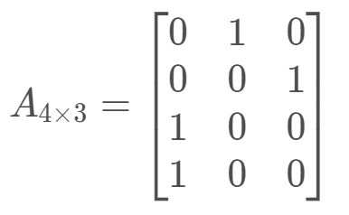

在C语言中，我们可以用 A[n][m] 来代表一个 n×m 的矩阵，其中 A[i][j] 代表矩阵第 i 行，第 j 列的值。

**2、矩阵的水平翻转**

矩阵的水平翻转，就是将矩阵的每一行的元素进行逆序，矩阵 A4×3 水平翻转后的结果如下所示：

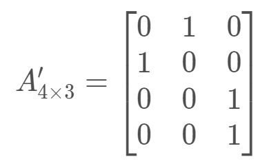

**3、矩阵的垂直翻转**

矩阵的垂直翻转，就是将矩阵的每一列的元素进行逆序，矩阵 A4×3 水垂直翻转后的结果如下所示：

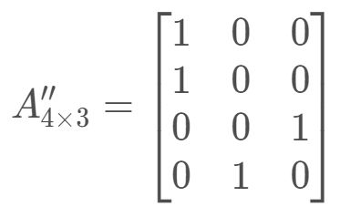

**4、矩阵的顺时针旋转**

矩阵的顺时针旋转 90 度，顾名思义，就是绕着垂直屏幕向里的方向，对矩阵进行 90度旋转，这时候行列会交换，所以矩阵 A4×3 顺时针90度旋转后的结果如下所示：

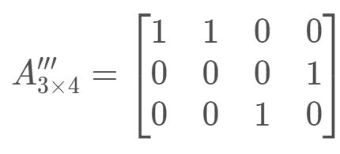

**5、矩阵的逆时针旋转**

矩阵的逆时针旋转 90 度，我们可以理解成 顺时针旋转 270 度，所以就是做 3 次顺时针旋转 90 度的操作。

**6、矩阵的转置**

矩阵的转置，就是对矩阵的主对角线对称的元素进行交换的操作，矩阵 A4×3 转置的结果如下：

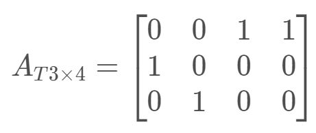

**7、二维数组**

C语言中，二维数组可以用来描述矩阵，定义如下（3 行 4 列）：

  
```
int a[3][4];
```
  

我们也可以将二维数组的元素进行初始化，如下：

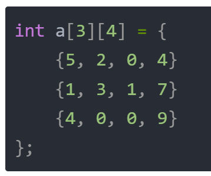

由于编译器能够通过后面的初始化列表知道到底有多少个数据元素，所以第一个中括号中的数字可以省略（但是第二个不能省略），如下：

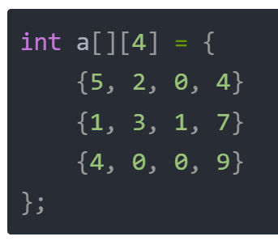

当然，我们还可以定义一个大数组，但是只初始化其中几行元素：

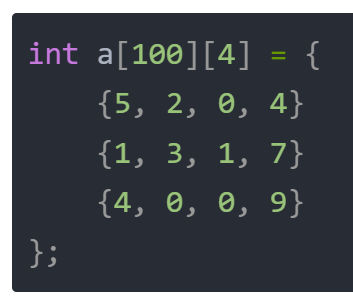

本质上，你可以把二维数组理解成一个一维数组。只不过一维数组的每一个元素，也是一个一维数组。

**8、二维数组的索引**

C语言中数组下标从 0 开始，那么，如果要取得数组a的 i 行 j 列的元素，可以通过a[i][j]进行获取。

**9、二维数组的函数传参**

如果你已经了解了一维数组的传参，那么大概应该能猜出二维数组的传参。 我们来回顾一下一维数组的传参，用的是一个*，如下：

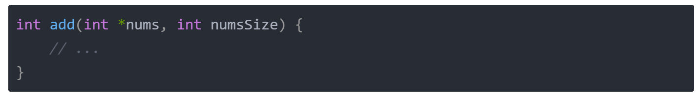

那么二维数组的传参，用的就是两个*了，如下：

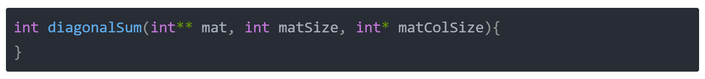

其中matSize代表二维数组第一维的大小，也就是可以理解成有多少行；int* matColSize是一个一维数组，代表每一行有多少列，即`matColSize[0]`代表第 0 行有`matColSize[0]`列，matColSize`[1]`代表第 1 行有`matColSize[1]`列，`matColSize[i]`代表第 行有`matColSize[i]`列，以此类推。 由于矩阵的每一列元素都是一样的，所以这类题目中，我们一般可以初始化这么写：

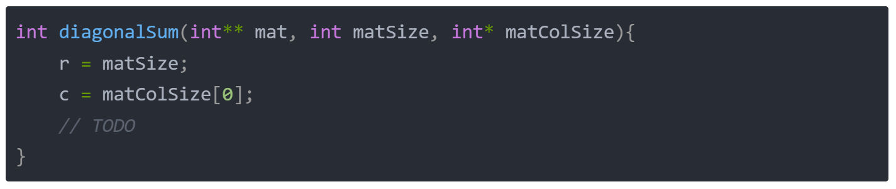

这样写的好处是把变量命名简单化，后续使用的时候不容易出错，让代码更加易读。 那么接下来，让我们做几道例题，来真正了解一下二维数组。

**二、题目分析**

## [1351. 统计有序矩阵中的负数](https://leetcode.cn/problems/count-negative-numbers-in-a-sorted-matrix/)

给你一个 `m * n` 的矩阵 `grid`，矩阵中的元素无论是按行还是按列，都以非严格递减顺序排列。 请你统计并返回 `grid` 中 **负数** 的数目。

**示例 1：**

输入：`grid = [[4,3,2,-1],[3,2,1,-1],[1,1,-1,-2],[-1,-1,-2,-3]]`
输出：8
解释：矩阵中共有 8 个负数。

**示例 2：**

输入：`grid = [[3,2],[1,0]]`
输出：0

**提示：**

- `m == grid.length`
- `n == grid[i].length`
- `1 <= m, n <= 100`
- `-100 <= grid[i][j] <= 100`
代码：
```c
int countNegatives(int** grid, int gridSize, int* gridColSize) 
{
    int m = gridSize;//矩阵行数
    int n = gridColSize[0];//矩阵列数
    int ans = 0;//负数计数
    //遍历矩阵
    for(int i = 0; i < m; ++i)
    {
        for(int j = 0; j < n; ++j)
        {
            //如果元素小于零计数自增
            if(grid[i][j] < 0)
            {
                ++ans;
            }
        }
    }
    return ans;
}
```
- (1) 初始化矩阵的行列信息；
- (2) 遍历矩阵中的每个元素，对负数进行计数累加；

## [1572. 矩阵对角线元素的和](https://leetcode.cn/problems/matrix-diagonal-sum/)

给你一个正方形矩阵 `mat`，请你返回矩阵对角线元素的和。

请你返回在矩阵主对角线上的元素和副对角线上且不在主对角线上元素的和。

**示例  1：**

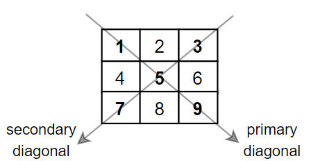

输入：`mat = [[1,2,3], [4,5,6],[7,8,9]]`
输出：25
解释：对角线的和为：`1 + 5 + 9 + 3 + 7 = 25`
请注意，元素 `mat[1][1] = 5` 只会被计算一次。

**示例  2：**
输入：`mat = [[1,1,1,1],[1,1,1,1],[1,1,1,1],[1,1,1,1]]`
输出：8

**示例 3：**

输入：`mat = [[5]]`
输出：5

**提示：**

- `n == mat.length == mat[i].length`
- `1 <= n <= 100`
- `1 <= mat[i][j] <= 100`
代码：
```c
int diagonalSum(int** mat, int matSize, int* matColSize)
{
    int m = matSize;
    int n = matColSize[0];
    int ans = 0;
    for(int i = 0; i < m; ++i)
    {
        for(int j = 0; j < n; ++j)
        {
            //i == j的情况为主对角线元素，i + j == n - 1的情况为副对角线，或运算||会剔除重复元素
            if(i == j || i + j == n - 1)
            {
                ans += mat[i][j];
            }
        }
    }
    return ans;
}
```
 
这个函数计算并返回矩阵主对角线和副对角线元素之和。主对角线元素是那些行索引和列索引相同的元素，而副对角线元素是那些行索引和列索引之和等于 `n-1` 的元素。

## [1672. 最富有客户的资产总量](https://leetcode.cn/problems/richest-customer-wealth/)

给你一个 `m x n` 的整数网格 `accounts` ，其中 `accounts[i][j]` 是第 `i​​​​​​​​​​​​` 位客户在第 `j` 家银行托管的资产数量。返回最富有客户所拥有的 **资产总量** 。

客户的 **资产总量** 就是他们在各家银行托管的资产数量之和。最富有客户就是 **资产总量** 最大的客户。

**示例 1：**

**输入：**accounts = [[1,2,3],[3,2,1]]
**输出：**6
**解释：**
`第 1 位客户的资产总量 = 1 + 2 + 3 = 6 第 2 位客户的资产总量 = 3 + 2 + 1 = 6`
两位客户都是最富有的，资产总量都是 6 ，所以返回 6 。

**示例 2：**

**输入：**accounts = [[1,5],[7,3],[3,5]]
**输出：**10
**解释：**
`第 1 位客户的资产总量` = 6
`第 2 位客户的资产总量` = 10 
`第 3 位客户的资产总量` = 8
第 2 位客户是最富有的，资产总量是 10

**示例 3：**

**输入：**accounts = [[2,8,7],[7,1,3],[1,9,5]]
**输出：**17

**提示：**

- `m == accounts.length`
- `n == accounts[i].length`
- `1 <= m, n <= 50`
- `1 <= accounts[i][j] <= 100`
代码：
```c
int maximumWealth(int** accounts, int accountsSize, int* accountsColSize) 
{
    int m = accountsSize;
    int n = accountsColSize[0];
    int max = 0;
    for(int i  = 0; i < m; ++i)
    {
        int sum = 0;
        for(int j = 0; j < n; ++j)
        {
            sum += accounts[i][j];
        }
        if(sum > max)
        {
            max = sum;
        }
    }
    return max;
}
```
  

## [766. 托普利茨矩阵](https://leetcode.cn/problems/toeplitz-matrix/)

给你一个 `m x n` 的矩阵 `matrix` 。如果这个矩阵是托普利茨矩阵，返回 `true` ；否则，返回 `false` _。_

如果矩阵上每一条由左上到右下的对角线上的元素都相同，那么这个矩阵是 **托普利茨矩阵** 。

**示例 1：**


**输入：**`matrix = [[1,2,3,4],[5,1,2,3],[9,5,1,2]]`
**输出：**true
**解释：**
在上述矩阵中, 其对角线为: 
`"[9]", "[5, 5]", "[1, 1, 1]", "[2, 2, 2]", "[3, 3]", "[4]"`。 
各条对角线上的所有元素均相同, 因此答案是 True 。

**示例 2：**

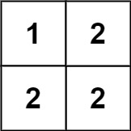

**输入：**`matrix = [[1,2],[2,2]]`
**输出：**false
**解释：**
对角线 "`[1, 2]`" 上的元素不同。

**提示：**

- `m == matrix.length`
- `n == matrix[i].length`
- `1 <= m, n <= 20`
- `0 <= matrix[i][j] <= 99`
代码：
```c
bool isToeplitzMatrix(int** matrix, int matrixSize, int* matrixColSize) 
{
    int m = matrixSize;
    int n = matrixColSize[0];
    for(int i = 1; i < m; ++i)
    {
        for(int j = 1; j < n; ++j)
        {
            //遍历该矩阵，将每一个元素和它左上角的元素相比对即可。
            if(matrix[i][j] != matrix[i - 1][j - 1])
            {
                return false;
            }
        }
    }
    return true;
}
```

## [1380. 矩阵中的幸运数](https://leetcode.cn/problems/lucky-numbers-in-a-matrix/)

给你一个 `m * n` 的矩阵，矩阵中的数字 **各不相同** 。请你按 **任意** 顺序返回矩阵中的所有幸运数。

**幸运数** 是指矩阵中满足同时下列两个条件的元素：

- 在同一行的所有元素中最小
- 在同一列的所有元素中最大

**示例 1：**

**输入：**matrix = [[3,7,8],[9,11,13],[15,16,17]]
**输出：**[15]
**解释：**15 是唯一的幸运数，因为它是其所在行中的最小值，也是所在列中的最大值。

**示例 2：**

**输入：**matrix = [[1,10,4,2],[9,3,8,7],[15,16,17,12]]
**输出：**[12]
**解释：**12 是唯一的幸运数，因为它是其所在行中的最小值，也是所在列中的最大值。

**示例 3：**

**输入：**matrix = [[7,8],[1,2]]
**输出：**[7]
**解释：**7是唯一的幸运数字，因为它是行中的最小值，列中的最大值。

**提示：**

- `m == mat.length`
- `n == mat[i].length`
- `1 <= n, m <= 50`
- `1 <= matrix[i][j] <= 10^5`
- 矩阵中的所有元素都是不同的
代码：
```c
int* luckyNumbers(int** matrix, int matrixSize, int* matrixColSize, int* returnSize) {
    int* ret = (int*)malloc(sizeof(int) * matrixSize * matrixColSize[0]);
    int retSize = 0;
    //通过双重循环遍历矩阵的每个元素,isMin和isMax布尔变量用于检查当前元素是否是其所在行的最小值以及所在列的最大值。
    for (int i = 0; i < matrixSize; i++) {
        for (int j = 0; j < matrixColSize[0]; j++) {
            bool isMin = true, isMax = true;

            // 内层循环遍历当前行，检查matrix[i][j]是否是当前行的最小值。
            // 如果找到比matrix[i][j]更小的值，则isMin置为false，并跳出循环。
            for (int k = 0; k < matrixColSize[0]; k++) {
                if (matrix[i][k] < matrix[i][j]) {
                    isMin = false;
                    break;
                }
            }
            //如果matrix[i][j]不是最小值，跳过后面的检查，继续检查下一个元素。
            if (!isMin) {
                continue;
            }

            // 内层循环遍历当前列，检查matrix[i][j]是否是当前列的最大值。
            // 如果找到比matrix[i][j]更大的值，则isMax置为false，并跳出循环。
            for (int k = 0; k < matrixSize; k++) {
                if (matrix[k][j] > matrix[i][j]) {
                    isMax = false;
                    break;
                }
            }
            //如果matrix[i][j]是最小值且是最大值，则将其添加到结果数组中。
            if (isMax) {
                ret[retSize++] = matrix[i][j];
            }
        }
    }
    //将返回数组的大小设置为实际找到的幸运数的个数，并返回结果数组。
    *returnSize = retSize;
    return ret;
}

```
## [1582. 二进制矩阵中的特殊位置](https://leetcode.cn/problems/special-positions-in-a-binary-matrix/)

给定一个 `m x n` 的二进制矩阵 `mat`，返回矩阵 `mat` 中特殊位置的数量。

如果位置 `(i, j)` 满足 `mat[i][j] == 1` 并且行 `i` 与列 `j` 中的所有其他元素都是 `0`（行和列的下标从 **0** 开始计数），那么它被称为 **特殊** 位置。

**示例 1：**

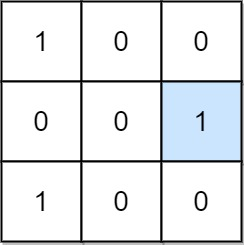

**输入：**mat = [[1,0,0],[0,0,1],[1,0,0]]
**输出：**1
**解释：**位置 (1, 2) 是一个特殊位置，因为 mat[1][2] == 1 且第 1 行和第 2 列的其他所有元素都是 0。

**示例 2：**


**输入：**mat = [[1,0,0],[0,1,0],[0,0,1]]
**输出：**3
**解释：**位置 (0, 0)，(1, 1) 和 (2, 2) 都是特殊位置。

**提示：**

- `m == mat.length`
- `n == mat[i].length`
- `1 <= m, n <= 100`
- `mat[i][j]` 是 `0` 或 `1`。
代码：
```c
int numSpecial(int** mat, int matSize, int* matColSize) {
    int specialCount = 0;//用于记录特殊位置的数量
    int rows = matSize;//行数
    int cols = matColSize[0];//列数
    
    // 数组：用于存储每一行和每一列中1的数量
    int rowSum[rows];
    int colSum[cols];
    
    // 使用循环将rowSum和colSum数组初始化为0。
    for (int i = 0; i < rows; i++) rowSum[i] = 0;
    for (int i = 0; i < cols; i++) colSum[i] = 0;
    
    // 双重循环遍历矩阵中的每个元素。
    //如果元素值为1，则增加对应行和列的计数。
    for (int i = 0; i < rows; i++) {
        for (int j = 0; j < cols; j++) {
            if (mat[i][j] == 1) {
                rowSum[i]++;
                colSum[j]++;
            }
        }
    }
    
    //再次遍历矩阵中的每个元素。
    //如果元素值为1，并且所在行和列中1的数量都是1，则这是一个特殊位置，增加specialCount。
    for (int i = 0; i < rows; i++) {
        for (int j = 0; j < cols; j++) {
            if (mat[i][j] == 1 && rowSum[i] == 1 && colSum[j] == 1) {
                specialCount++;
            }
        }
    }
    
    return specialCount;
}
```
## [463. 岛屿的周长](https://leetcode.cn/problems/island-perimeter/)

给定一个 `row x col` 的二维网格地图 `grid` ，其中：`grid[i][j] = 1` 表示陆地， `grid[i][j] = 0` 表示水域。

网格中的格子 **水平和垂直** 方向相连（对角线方向不相连）。整个网格被水完全包围，但其中恰好有一个岛屿（或者说，一个或多个表示陆地的格子相连组成的岛屿）。

岛屿中没有“湖”（“湖” 指水域在岛屿内部且不和岛屿周围的水相连）。格子是边长为 1 的正方形。网格为长方形，且宽度和高度均不超过 100 。计算这个岛屿的周长。

**示例 1：**

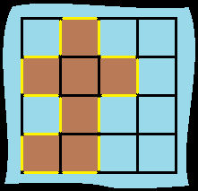

**输入：**grid = [[0,1,0,0],[1,1,1,0],[0,1,0,0],[1,1,0,0]]
**输出：**16
**解释：**它的周长是上面图片中的 16 个黄色的边

**示例 2：**

**输入：**grid = [[1]]
**输出：**4

**示例 3：**

**输入：**grid = [[1,0]]
**输出：**4

**提示：**

- `row == grid.length`
- `col == grid[i].length`
- `1 <= row, col <= 100`
- `grid[i][j]` 为 `0` 或 `1`
代码1：
```c
int islandPerimeter(int** grid, int gridSize, int* gridColSize){
    int perimeter = 0;//用于存储计算出的周长。
    //嵌套的 for 循环遍历每个格子
    for (int i = 0; i < gridSize; i++) {
        for (int j = 0; j < gridColSize[i]; j++) {
            //如果格子的值是 1（表示陆地），则继续计算其周长。
            /*
            * 对于每个陆地格子，检查它的四个方向（上、下、左、右）。
            * 如果方向上是水域（值为 0）或者是边界（超出网格范围），则周长加一。
            */
            if (grid[i][j] == 1) {
                // Check top
                if (i == 0 || grid[i-1][j] == 0) {
                    perimeter++;
                }
                // Check bottom
                if (i == gridSize-1 || grid[i+1][j] == 0) {
                    perimeter++;
                }
                // Check left
                if (j == 0 || grid[i][j-1] == 0) {
                    perimeter++;
                }
                // Check right
                if (j == gridColSize[i]-1 || grid[i][j+1] == 0) {
                    perimeter++;
                }
                /*
                *检查上边界：如果当前格子在最上面一行（i == 0）或者上面的格子是水域（grid[i-1][j] == 0），则周长加一。
                *检查下边界：如果当前格子在最下面一行（i == gridSize-1）或者下面的格子是水域（grid[i+1][j] == 0），则周长加一。
                *检查左边界：如果当前格子在最左边一列（j == 0）或者左边的格子是水域（grid[i][j-1] == 0），则周长加一。
                *检查右边界：如果当前格子在最右边一列（j == gridColSize[i]-1）或者右边的格子是水域（grid[i][j+1] == 0），则周长加一。
                */
            }
        }
    }
    
    return perimeter;
}
```