# 概念定义

  

## 二级指针

指针变量也是一种变量，也会占用存储空间，也可以使用&获取它的地址。 如果一个指针指向另外一个指针，我们就称它为“二级指针”或者“双重指针”，或者指向指针的指针。用C语言描述如下：

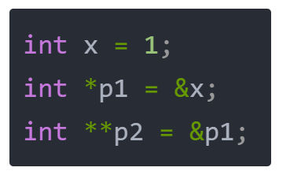

当然，还有三级指针，四级指针，几乎很少用到，这里不再累述。大概是这幅样子：

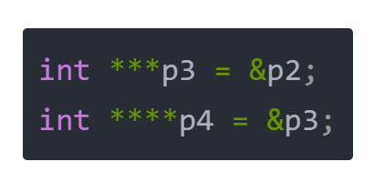

## 解引用

  

在学习一级指针的时候，我们用过 * 进行解引用。一级指针经过一次解引用，变成普通变量。二级指针经过一次解引用，变成一级指针。


  

## 二级指针的应用

  

我们在选择 C语言 进行问题求解时，往往出现如下的情况，这是什么意思呢？

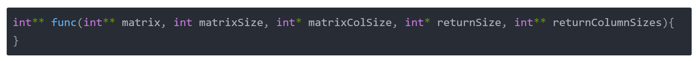

  

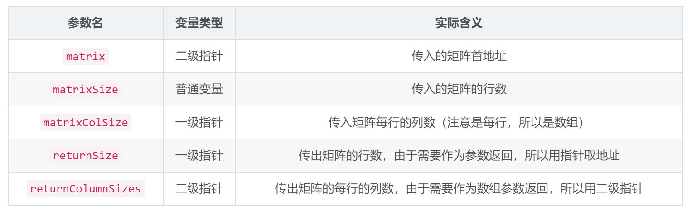

对于returnColumnSizes这个参数，补充几点：

1）它是一个 指向数组 的 指针，这里数组是行数组；

2）*returnColumnSizes是实际的那个数组，并且数组的每个元素是 (*returnColumnSizes)[i]代表的是列数；

3）return是个前缀，代表这个参数的意思是 **返回值**，而不是 **函数传参**；

  

## 内存申请模板

  

所谓模板，就是写完以后，每个题目都能套着用，今天我们就来提炼一个有关于二维数组的内存申请的模板。大致声明如下：

```c
int **my_matrix(int r, int c, int* returnSize, int** returnColumnSizes);
```
其中，返回值代表申请的二维数组的首地址，为了方便理解，我们把二维数组叫做矩阵吧。 r 和 c 代表矩阵的行和列，returnSize 是需要返回给调用方的，实际的矩阵的行，我们会在函数内部将它赋值为r，而returnColumnSizes也是需要返回给调用方的，只不过需要返回的是一个数组。所以需要用二级指针。 这个函数就可以作为我们的内存申请的模板函数：

```c
int **my_matrix(int r, int c, int* returnSize, int** returnColumnSizes)
{
     //分配一个二维数组用于存储翻转和反转后的矩阵。
    int **ret = (int **)malloc(sizeof(int *) * r );//(1)
    //设置返回矩阵的行数
    *returnSize = r;//(3)
    //分配内存用于存储每行的列数。
    *returnColumnSizes = (int *)malloc(sizeof(int) * r);//(2)
    //分配每行的内存
    for(int i = 0; i < r; ++i)
    {
        //逐行分配内存用于存储每行的像素。
        ret[i] = (int *)malloc(sizeof(int) * c);//(4)
        //设置每行的列数。
        (*returnColumnSizes)[i] = c;//(5)
    }
    return ret;
}
```

- (1) 这句话代表申请一个矩阵的内存，行数为 r，首地址为ret，二维数组的类型为int **，二维数组中每个元素的类型为一级指针（一维数组），即 int *，对应 sizeof(int *) 这个表达式，再乘上 r，代表总共 r 行；
- (2) 这句话代表为这个矩阵的列，申请一个数组来记录它每一行的列数，所以这个列数组的长度应该是行数r，由于需要作为参数返回给调用方，所以这里调用了一次解引用；
- (3) 这句话 *returnSize 是需要返回的矩阵的行数，调用者不知道这个函数，返回的矩阵有多少行，需要实现者告诉他，同样调用一次解引用；
- (4) 这句话，则申请矩阵每一行的内存空间；
- (5) 矩阵每一行的列数为 c，直接赋值即可，每一行的列数长度需要作为返回值返回， 所以需要先解引用再索引到行号，即给(*returnColumnSizes)进行赋值；
## 二维数组的内查模型
在C语言中，动态分配二维数组的内存涉及到多级指针。下面是代码中分配的二维数组的内存结构的详细介绍。

### 内存分配

代码中使用了两次`malloc`函数来分配二维数组的内存：

```c
int **ret = (int **)malloc(sizeof(int *) * r);
*returnColumnSizes = (int *)malloc(sizeof(int) * r);
```

- `ret`：这是一个指向指针的指针，它存储的是每一行的指针。
- `*returnColumnSizes`：这是一个一维数组，用来存储每一行的列数。

### 每行内存分配

接下来，为每一行分配内存：

```c
for(int i = 0; i < r; ++i)
{
    ret[i] = (int *)malloc(sizeof(int) * c);
    (*returnColumnSizes)[i] = c;
}
```

- `ret[i]`：为每一行分配一个一维数组的内存，大小为`c`。

### 内存结构

1. **一级指针数组（指向每行的指针）**

   分配的第一个内存块`int **ret`存储了`r`个指向`int`类型指针的地址。这是一个指针数组，每个元素都是一个指向`int`类型的指针。

   - 内存结构：
     ```
     ret -> [ptr1, ptr2, ptr3, ..., ptrR]
     ```

2. **每行的指针**

   每一个`ret[i]`指向一个含有`c`个`int`元素的数组。

   - 内存结构：
     ```
     ptr1 -> [int, int, int, ..., int]
     ptr2 -> [int, int, int, ..., int]
     ...
     ptrR -> [int, int, int, ..., int]
     ```

### 内存布局示意图

假设有一个2x3的二维数组：

```
image = [ [1, 0, 1],
          [0, 1, 0] ]
```

内存分配过程如下：

1. 分配指针数组`ret`：

   ```
   ret (指向第一级指针数组) -> | ptr1 | ptr2 |
                              0x100 0x104
   ```

2. 分配每行的内存：

   ```
   ptr1 (指向第1行) -> | 1 | 0 | 1 |
                      0x200 0x204 0x208
   ptr2 (指向第2行) -> | 0 | 1 | 0 |
                      0x300 0x304 0x308
   ```

3. 每个`ptr`的地址存储在`ret`中：

   ```
   ret[0] = ptr1 -> 0x200
   ret[1] = ptr2 -> 0x300
   ```

### 清理内存

在使用动态分配的内存时，确保在不再需要它们时释放它们，以防内存泄漏：

```c
for(int i = 0; i < r; ++i)
{
    free(ret[i]);
}
free(ret);
free(*returnColumnSizes);
```

- 逐行释放分配的内存：`free(ret[i])`
- 释放指针数组的内存：`free(ret)`
- 释放`returnColumnSizes`的内存：`free(*returnColumnSizes)`

### 总结

动态分配的二维数组实际上是一个指向指针的指针，通过两次`malloc`来分配内存。第一次分配一个存储每行指针的数组，第二次为每一行分配一个一维数组的内存。使用完毕后，必须逐行释放内存，然后释放指针数组，以避免内存泄漏。
    

  

# 题目分析

  

## [832. 翻转图像](https://leetcode.cn/problems/flipping-an-image/)

给定一个 `n x n` 的二进制矩阵 `image` ，先 **水平** 翻转图像，然后 **反转** 图像并返回 _结果_ 。

**水平**翻转图片就是将图片的每一行都进行翻转，即逆序。

- 例如，水平翻转 `[1,1,0]` 的结果是 `[0,1,1]`。

**反转**图片的意思是图片中的 `0` 全部被 `1` 替换， `1` 全部被 `0` 替换。

- 例如，反转 `[0,1,1]` 的结果是 `[1,0,0]`。

**示例 1：**

**输入：**image = [[1,1,0],[1,0,1],[0,0,0]]
**输出：**[[1,0,0],[0,1,0],[1,1,1]]
**解释：**首先翻转每一行: [[0,1,1],[1,0,1],[0,0,0]]；
     然后反转图片: [[1,0,0],[0,1,0],[1,1,1]]

**示例 2：**

**输入：**image = [[1,1,0,0],[1,0,0,1],[0,1,1,1],[1,0,1,0]]
**输出：**[[1,1,0,0],[0,1,1,0],[0,0,0,1],[1,0,1,0]]
**解释：**首先翻转每一行: [[0,0,1,1],[1,0,0,1],[1,1,1,0],[0,1,0,1]]；
     然后反转图片: [[1,1,0,0],[0,1,1,0],[0,0,0,1],[1,0,1,0]]

**提示：**

- `n == image.length`
- `n == image[i].length`
- `1 <= n <= 20`
- `images[i][j]` == `0` 或 `1`.
## 代码：
```c
int** flipAndInvertImage(int** image, int imageSize, int* imageColSize, int* returnSize, int** returnColumnSizes) 
{
    int r = imageSize;//行数
    int c = imageColSize[0];//列数
    //分配一个二维数组用于存储翻转和反转后的矩阵。
    int **ret = (int **)malloc(sizeof(int *) * r );
    //设置返回矩阵的行数
    *returnSize = r;
    //分配内存用于存储每行的列数。
    (*returnColumnSizes) = (int *)malloc(sizeof(int) * r);
    //分配每行的内存
    for(int i = 0; i < r; ++i)
    {
        //逐行分配内存用于存储每行的像素。
        ret[i] = (int *)malloc(sizeof(int) * c);
        //设置每行的列数。
        (*returnColumnSizes)[i] = c;
    }
    //进行翻转和反转操作
    for(int i = 0; i < r; ++i)
    {
        for(int j = 0; j < c; ++j)
        {
            //c - 1 - j：从右向左访问列。1 - image[i][c - 1 - j]：反转像素（0变1，1变0）。
            ret[i][j] = 1 - image[i][c - 1 - j];
        }
    }
    return ret;
}
```
  让我们更详细地解释一下`c - 1 - j`的用法，它在数组操作中用于从右向左访问列。
### 原理

假设我们有一个二维数组`image`，每一行有`c`列。为了水平翻转这行，我们需要从最右边的元素开始读取，依次向左读取并将其赋值到新数组的相应位置。

### 例子

假设我们有如下图像（二维数组），`c`为5：
```
image = [ [1, 0, 0, 1, 0] ]
```

### 水平翻转操作

目标是将每行从右向左访问，将其放入新数组的相应位置。
- `j = 0`时，`c - 1 - j = 5 - 1 - 0 = 4`，访问`image[i][4]`，得到`0`
- `j = 1`时，`c - 1 - j = 5 - 1 - 1 = 3`，访问`image[i][3]`，得到`1`
- `j = 2`时，`c - 1 - j = 5 - 1 - 2 = 2`，访问`image[i][2]`，得到`0`
- `j = 3`时，`c - 1 - j = 5 - 1 - 3 = 1`，访问`image[i][1]`，得到`0`
- `j = 4`时，`c - 1 - j = 5 - 1 - 4 = 0`，访问`image[i][0]`，得到`1`

将这些值放入新数组`ret`中，就得到了水平翻转后的结果：
```
ret = [ [0, 1, 0, 0, 1] ]
```

### 完整过程

原始数组 `image[i][j]` 转换到 `ret[i][j]` 的过程如下：
- `ret[i][0] = image[i][4]`
- `ret[i][1] = image[i][3]`
- `ret[i][2] = image[i][2]`
- `ret[i][3] = image[i][1]`
- `ret[i][4] = image[i][0]`

通过这种方式，`c - 1 - j`的计算能够使得我们从右向左遍历原始数组，从而实现水平翻转。

### 反转操作

在水平翻转的同时，我们还进行了反转操作`1 - image[i][c - 1 - j]`，将`0`变成`1`，`1`变成`0`。

### 总结

`c - 1 - j`确保了我们从右向左访问原数组中的元素。结合这个访问方式，我们对这些元素进行反转操作并存入新数组中，从而实现了水平翻转和反转的效果。

## [867. 转置矩阵](https://leetcode.cn/problems/transpose-matrix/)

给你一个二维整数数组 `matrix`， 返回 `matrix` 的 **转置矩阵** 。

矩阵的 **转置** 是指将矩阵的主对角线翻转，交换矩阵的行索引与列索引。

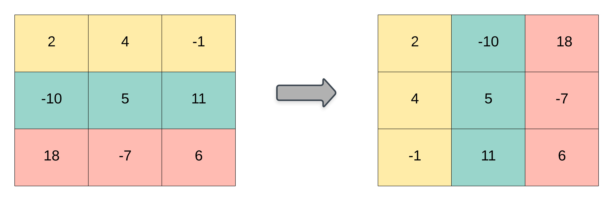

**示例 1：**

**输入：**matrix = [[1,2,3],[4,5,6],[7,8,9]]
**输出：**[[1,4,7],[2,5,8],[3,6,9]]

**示例 2：**

**输入：**matrix = [[1,2,3],[4,5,6]]
**输出：**[[1,4],[2,5],[3,6]]

**提示：**

- `m == matrix.length`
- `n == matrix[i].length`
- `1 <= m, n <= 1000`
- `1 <= m * n <= 105`
- `-109 <= matrix[i][j] <= 109`
代码：
```c
//构建矩阵函数
int **my_matrix(int r, int c, int *returnSize, int **returnColumnSizes)
{
    int **ret = (int **)malloc(sizeof(int *) * r);
    *returnSize = r;
    (*returnColumnSizes) = (int *)malloc(sizeof(int) * r);
    for(int i = 0; i < r; ++i)
    {
        ret[i] = (int *)malloc(sizeof(int) * c);
        (*returnColumnSizes)[i] = c;
    }
    return ret;
}
int** transpose(int** matrix, int matrixSize, int* matrixColSize, int* returnSize, int** returnColumnSizes) 
{
    int m = matrixSize;
    int n = matrixColSize[0];
    int **ret = my_matrix(n, m, returnSize, returnColumnSizes);//m * n矩阵转置后为n * m
    for(int i = 0; i < n; ++i)
    {
        for(int j = 0; j < m; ++j)
        {
            ret[i][j] = matrix[j][i];//转置操作，对角线反转
        }
    }
    return ret;
}
```
  

## [566. 重塑矩阵](https://leetcode.cn/problems/reshape-the-matrix/)

在 MATLAB 中，有一个非常有用的函数 `reshape` ，它可以将一个 `m x n` 矩阵重塑为另一个大小不同（`r x c`）的新矩阵，但保留其原始数据。

给你一个由二维数组 `mat` 表示的 `m x n` 矩阵，以及两个正整数 `r` 和 `c` ，分别表示想要的重构的矩阵的行数和列数。

重构后的矩阵需要将原始矩阵的所有元素以相同的 **行遍历顺序** 填充。

如果具有给定参数的 `reshape` 操作是可行且合理的，则输出新的重塑矩阵；否则，输出原始矩阵。

**示例 1：**

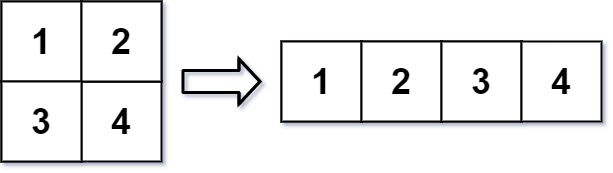

**输入：**mat = [[1,2],[3,4]], r = 1, c = 4
**输出：**[[1,2,3,4]]

**示例 2：**

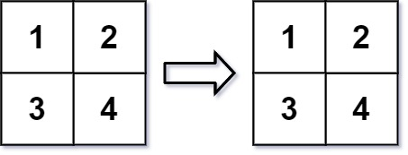

**输入：**mat = [[1,2],[3,4]], r = 2, c = 4
**输出：**[[1,2],[3,4]]

**提示：**

- `m == mat.length`
- `n == mat[i].length`
- `1 <= m, n <= 100`
- `-1000 <= mat[i][j] <= 1000`
- `1 <= r, c <= 300` 
代码：
```c
int **myMatrix(int row, int col, int *returnSize, int ** returnColumnSizes)
{
    int **ret = (int **)malloc(sizeof(int *) * row);
    *returnSize = row;
    *returnColumnSizes = (int *)malloc(sizeof(int) * row);
    for(int i = 0; i < row; ++i)
    {
        ret[i] = (int*)malloc(sizeof(int) * col);
        (*returnColumnSizes)[i] = col;
    }
    return ret;
}
int** matrixReshape(int** mat, int matSize, int* matColSize, int r, int c, int* returnSize, int** returnColumnSizes) 
{
    int m = matSize;
    int n = matColSize[0];

    int **ret = myMatrix(r, c, returnSize, returnColumnSizes);
    //给定参数的 reshape 操作不可行，输出原始矩阵;
    if(m * n != r * c)
    {
        *returnSize = m;
        for(int i = 0; i < m; ++i)
        {
            (*returnColumnSizes)[i] = n;
        }
        return mat;
    }
    //给定参数的 reshape 操作可行，输出新的重塑矩阵；
    for(int i = 0; i < r; ++i)
    {
        for(int j = 0; j < c; ++j)
        {
	        //执行线性索引操作
            int index = i * c + j;
            int x = mat[index / n][index % n];
            ret[i][j] = x;
        }
    }
    return ret;
}
```
此算法的核心是**线性索引**，即将多维数组的索引影射为一维数组索引，然后将一维数组索引再影射回多维数组
## 线性索引
线性索引（linear indexing）是将多维数组（例如二维矩阵）的元素映射到一维数组中的一种方法。这种技术在许多编程场景中都非常有用，尤其是当你需要在内存中连续存储数组数据或者在矩阵重塑等操作中使用时。

### 线性索引的概念

线性索引是一种将多维数组的元素按行或按列顺序排列成一维数组的方式。对于一个二维数组（矩阵），我们可以将其元素依次排列成一维数组。线性索引允许我们通过一个单一的整数索引来访问原本需要多个索引才能访问的元素。

#### 二维矩阵的线性索引

假设我们有一个 `m` 行 `n` 列的二维矩阵：

```
A = [[a00, a01, a02],
     [a10, a11, a12],
     [a20, a21, a22]]
```

这个矩阵可以看作一个一维数组 `B`，按行优先顺序排列：

```
B = [a00, a01, a02, a10, a11, a12, a20, a21, a22]
```

在这种情况下：
- `B[0]` 对应 `A[0][0]`
- `B[1]` 对应 `A[0][1]`
- `B[2]` 对应 `A[0][2]`
- `B[3]` 对应 `A[1][0]`
- `B[4]` 对应 `A[1][1]`
- `B[5]` 对应 `A[1][2]`
- `B[6]` 对应 `A[2][0]`
- `B[7]` 对应 `A[2][1]`
- `B[8]` 对应 `A[2][2]`

### 线性索引的计算

对于一个大小为 `m x n` 的矩阵，给定元素 `A[i][j]` 在线性数组中的索引 `index` 可以通过以下公式计算：

```c
index = i * n + j
```

其中：
- `i` 是元素所在的行索引
- `j` 是元素所在的列索引
- `n` 是矩阵的总列数

### 线性索引的反向计算

从线性索引到矩阵索引的转换可以使用以下公式：
```c
row = index / n
col = index % n
```
其中：
- `row` 是计算得到的行索引
- `col` 是计算得到的列索引
- `index` 是一维数组中的位置
- `n` 是矩阵的总列数

### 代码示例

假设我们有一个 2x3 的矩阵 `A`，我们希望通过线性索引访问它的元素：

```c
#include <stdio.h>

int main() {
    int A[2][3] = {{1, 2, 3},
                   {4, 5, 6}};
    int m = 2, n = 3;

    // 线性索引
    for (int i = 0; i < m; ++i) {
        for (int j = 0; j < n; ++j) {
            int index = i * n + j;
            printf("A[%d][%d] = %d -> B[%d] = %d\n", i, j, A[i][j], index, A[i][j]);
        }
    }

    // 从线性索引回到矩阵索引
    int B[6] = {1, 2, 3, 4, 5, 6};
    for (int index = 0; index < 6; ++index) {
        int row = index / n;
        int col = index % n;
        printf("B[%d] = %d -> A[%d][%d] = %d\n", index, B[index], row, col, B[index]);
    }

    return 0;
}
```

### 输出结果

```
A[0][0] = 1 -> B[0] = 1
A[0][1] = 2 -> B[1] = 2
A[0][2] = 3 -> B[2] = 3
A[1][0] = 4 -> B[3] = 4
A[1][1] = 5 -> B[4] = 5
A[1][2] = 6 -> B[5] = 6
B[0] = 1 -> A[0][0] = 1
B[1] = 2 -> A[0][1] = 2
B[2] = 3 -> A[0][2] = 3
B[3] = 4 -> A[1][0] = 4
B[4] = 5 -> A[1][1] = 5
B[5] = 6 -> A[1][2] = 6
```

### 应用场景

- **矩阵重塑**：将一个矩阵转换为另一种形状。
- **图像处理**：将图像的像素矩阵线性化以进行处理。
- **内存优化**：在内存中连续存储数组数据，以提高访问效率。

通过理解线性索引的概念，你可以更好地处理多维数组的数据转换和重塑操作。
## [2022. 将一维数组转变成二维数组](https://leetcode.cn/problems/convert-1d-array-into-2d-array/)

给你一个下标从 **0** 开始的一维整数数组 `original` 和两个整数 `m` 和  `n` 。你需要使用 `original` 中 **所有** 元素创建一个 `m` 行 `n` 列的二维数组。

`original` 中下标从 `0` 到 `n - 1` （都 **包含** ）的元素构成二维数组的第一行，下标从 `n` 到 `2 * n - 1` （都 **包含** ）的元素构成二维数组的第二行，依此类推。

请你根据上述过程返回一个 `m x n` 的二维数组。如果无法构成这样的二维数组，请你返回一个空的二维数组。

**示例 1：**

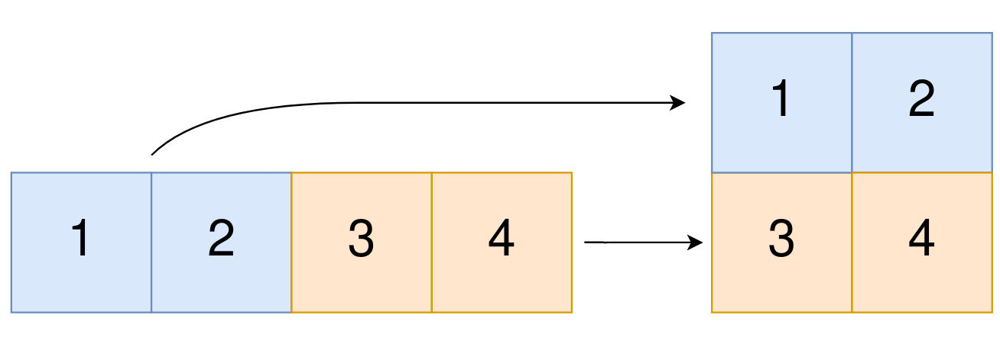

**输入：**original = [1,2,3,4], m = 2, n = 2
**输出：**[[1,2],[3,4]]
**解释：**
构造出的二维数组应该包含 2 行 2 列。
original 中第一个 n=2 的部分为 [1,2] ，构成二维数组的第一行。
original 中第二个 n=2 的部分为 [3,4] ，构成二维数组的第二行。

**示例 2：**

**输入：**original = [1,2,3], m = 1, n = 3
**输出：**[[1,2,3]]
**解释：**
构造出的二维数组应该包含 1 行 3 列。
将 original 中所有三个元素放入第一行中，构成要求的二维数组。

**示例 3：**

**输入：**original = [1,2], m = 1, n = 1
**输出：**[]
**解释：**
original 中有 2 个元素。
无法将 2 个元素放入到一个 1x1 的二维数组中，所以返回一个空的二维数组。

**示例 4：**

**输入：**original = [3], m = 1, n = 2
**输出：**[]
**解释：**
original 中只有 1 个元素。
无法将 1 个元素放满一个 1x2 的二维数组，所以返回一个空的二维数组。

**提示：**

- `1 <= original.length <= 5 * 104`
- `1 <= original[i] <= 105`
- `1 <= m, n <= 4 * 104`
代码：
```c
int **myMatrix(int row, int col, int *returnSize, int ** returnColumnSizes)
{
    int **ret = (int **)malloc(sizeof(int *) * row);
    *returnSize = row;
    *returnColumnSizes = (int *)malloc(sizeof(int) * row);
    for(int i = 0; i < row; ++i)
    {
        ret[i] = (int*)malloc(sizeof(int) * col);
        (*returnColumnSizes)[i] = col;
    }
    return ret;
}
int** construct2DArray(int* original, int originalSize, int m, int n, int* returnSize, int** returnColumnSizes) 
{
    int **ret = myMatrix(m, n, returnSize, returnColumnSizes);
    //如果无法构成这样的二维数组，返回空的二维数组。
    if(originalSize != m * n)
    {
        *returnSize = 0;
        return ret;
    }
    //转变数组
    for(int i = 0; i < m; ++i)
    {
        for(int j = 0; j < n; ++j)
        {
            //将二维数组索引影射为一维数组索引
            int index = i * n + j;
            //将一维数组索引影射为二维数组索引
            ret[i][j] = original[index];
        }
    }
    return ret;
}
```
## [1260. 二维网格迁移](https://leetcode.cn/problems/shift-2d-grid/)
给你一个 `m` 行 `n` 列的二维网格 `grid` 和一个整数 `k`。你需要将 `grid` 迁移 `k` 次。

每次「迁移」操作将会引发下述活动：

- 位于 `grid[i][j]` 的元素将会移动到 `grid[i][j + 1]`。
- 位于 `grid[i][n - 1]` 的元素将会移动到 `grid[i + 1][0]`。
- 位于 `grid[m - 1][n - 1]` 的元素将会移动到 `grid[0][0]`。

请你返回 `k` 次迁移操作后最终得到的 **二维网格**。

**示例 1：**

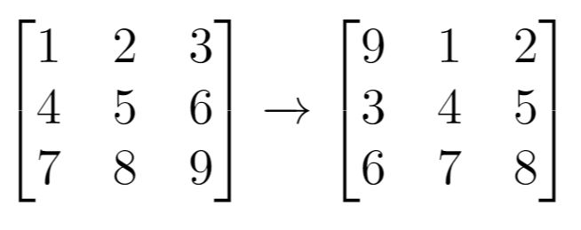

```
输入：grid
```

**示例 2：**

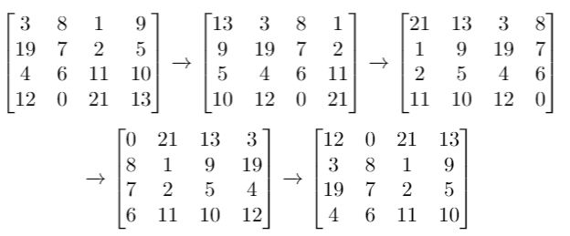

```
输入：grid
```

**示例 3：**

```
输入：grid
```

**提示：**

- `m == grid.length`
- `n == grid[i].length`
- `1 <= m <= 50`
- `1 <= n <= 50`
- `-1000 <= grid[i][j] <= 1000`
- `0 <= k <= 100`
代码：
```c
int **myMatrix(int row, int col, int *returnSize, int **returnColumnSizes)
{
    int **ret = (int **)malloc(sizeof(int *) * row);
    *returnSize = row;
    *returnColumnSizes = (int *)malloc(sizeof(int) * row);
    for(int i = 0; i < row; ++i)
    {
        ret[i] = (int *)malloc(sizeof(int) * col);
        (*returnColumnSizes)[i] = col;
    }
    return ret;
}
int** shiftGrid(int** grid, int gridSize, int* gridColSize, int k, int* returnSize, int** returnColumnSizes)
{
    int m = gridSize;
    int n = gridColSize[0];
    int **ret = myMatrix(m, n, returnSize, returnColumnSizes);

    for(int i = 0; i < m; ++i)
    {
        for(int j = 0; j < n; ++j)
        {
            //将二维数组索引映射为一维数组索引,并进行循环偏移
            int index = (i * n + j + k) % (m * n);
            //将偏移后的一维数组索引影射回二维数组索引
            ret[index / n][index % n] = grid[i][j];
        }
    }
    return ret;
}
```
解题原理：
设 m 和 n 分别为网格的行列数，我们将网格 grid 想象成由多个一维数组` {grid[i];0≤i<n} `按顺序拼接而成的一维数组，那么元素 `grid[i][j] `在该一维数组的下标为` index=i×n+j`。
每次迁移操作都相当于将该一维数组向右循环移动一次，那么 k 次迁移操作之后，元素` grid[i][j] `在该一维数组的下标变为 `index1=(index+k)mod(m×n)`，在网格的位置变为 `grid[ nindex1 / n][index1 % n]`。

## [661. 图片平滑器](https://leetcode.cn/problems/image-smoother/)

**图像平滑器** 是大小为 `3 x 3` 的过滤器，用于对图像的每个单元格平滑处理，平滑处理后单元格的值为该单元格的平均灰度。

每个单元格的  **平均灰度** 定义为：该单元格自身及其周围的 8 个单元格的平均值，结果需向下取整。（即，需要计算蓝色平滑器中 9 个单元格的平均值）。

如果一个单元格周围存在单元格缺失的情况，则计算平均灰度时不考虑缺失的单元格（即，需要计算红色平滑器中 4 个单元格的平均值）。

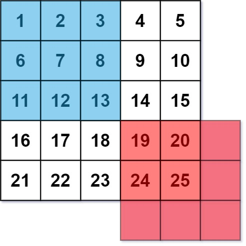

给你一个表示图像灰度的 `m x n` 整数矩阵 `img` ，返回对图像的每个单元格平滑处理后的图像 。

**示例 1:**

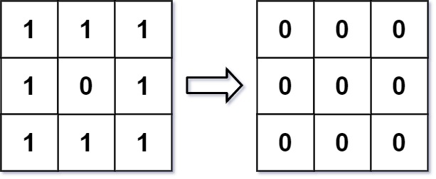

**输入:**`img = [[1,1,1],[1,0,1],[1,1,1]]`
**输出:`[[0, 0, 0],[0, 0, 0], [0, 0, 0]]`
**解释:**
对于点 (0,0), (0,2), (2,0), (2,2): 平均(3/4) = 平均(0.75) = 0
对于点 (0,1), (1,0), (1,2), (2,1): 平均(5/6) = 平均(0.83333333) = 0
对于点 (1,1): 平均(8/9) = 平均(0.88888889) = 0

**示例 2:**

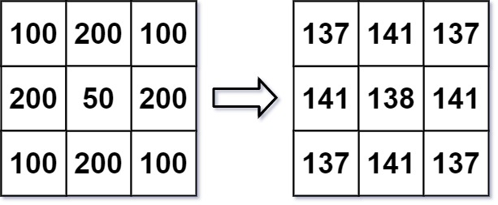

**输入:** `img = [[100,200,100],[200,50,200],[100,200,100]]`
**输出:** `[[137,141,137],[141,138,141],[137,141,137]]`
**解释:**
对于点 (0,0), (0,2), (2,0), (2,2): floor((100+200+200+50)/4) = floor(137.5) = 137
对于点 (0,1), (1,0), (1,2), (2,1): floor((200+200+50+200+100+100)/6) = floor(141.666667) = 141
对于点 (1,1): floor((50+200+200+200+200+100+100+100+100)/9) = floor(138.888889) = 138

**提示:**

- `m == img.length`
- `n == img[i].length`
- `1 <= m, n <= 200`
- `0 <= img[i][j] <= 255`
代码：
```c
//构建矩阵函数
int **myMatrix(int row, int col, int *returnSize, int **returnColumnSizes)
{
    int **ret = (int **)malloc(sizeof(int *) * row);
    *returnSize = row;
    *returnColumnSizes = (int *)malloc(sizeof(int) * row);
    for(int i = 0; i < row; ++i)
    {
        ret[i] = (int *)malloc(sizeof(int) * col);
        (*returnColumnSizes)[i] = col;
    }
    return ret;
}
//定义九宫格偏移变量
int dir[9][2] = {
    {-1, -1}, {-1, 0}, {-1, 1},
    {0, -1}, {0, 0}, {0, 1},
    {1, -1}, {1, 0}, {1, 1}
};

int** imageSmoother(int** img, int imgSize, int* imgColSize, int* returnSize, int** returnColumnSizes) 
{
    int m = imgSize;
    int n = imgColSize[0];
    int **ret = myMatrix(m, n, returnSize, returnColumnSizes);

    for(int i = 0; i < m; ++i)
    {
        for(int j = 0; j < n; ++j)
        {
            int up = 0, down = 0;//定义分子分母变量
            //遍历九个位置
            for(int k = 0; k < 9; ++k)
            {
                //定义偏移索引变量 ti, tj.
                int ti = i + dir[k][0];
                int tj = j + dir[k][1];
                //如果符合规定，数组不越界
                if(ti >= 0 && ti < m && tj >= 0 && tj < n)
                {
                    up += img[ti][tj];//分子为值的和
                    down += 1;//分母为值的个数
                }
            }
            ret[i][j] = up / down;//计算平均值
        }
    }
    return ret;
}
```