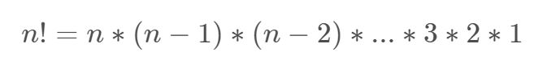
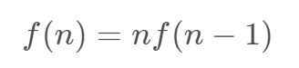
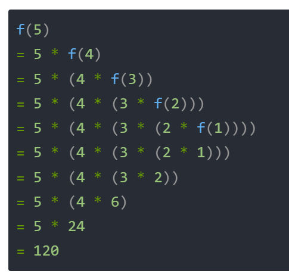
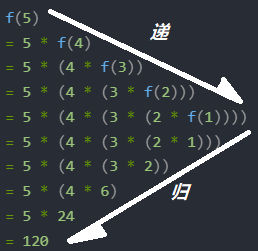
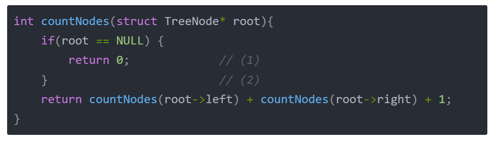
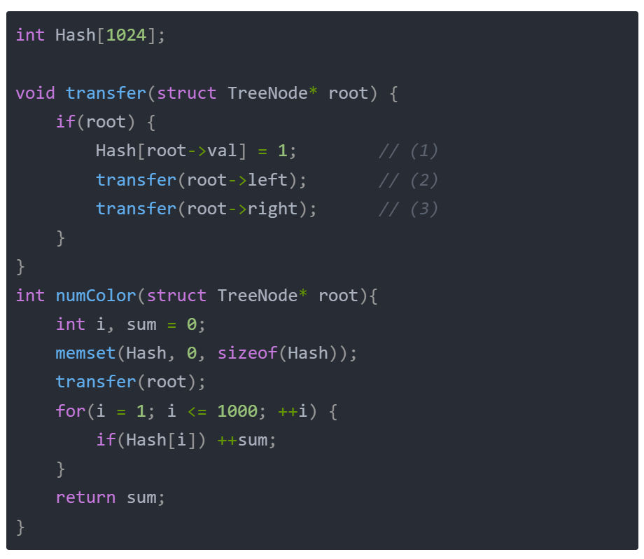

# 概念定义

**1、递归的含义**
递归就是函数自己调自己。

**2、递归调用阶乘**

我们知道，阶乘即



光知道这个，我们是无法将它进行递归计算的，我们需要将它转换成递推式，如下：


这时候，我们令 f(n) = n!，则有：



这就是阶乘的递推式。 然后，我们根据上面提到的三个点，进行如下套用：

**1）实现一个函数**

这个函数叫JieCheng，它的参数是一个整数，返回值也是一个整数，实现如下：

  
```c
int JieCheng(int n){}
```


**2）递归出口**

  

当 n 等于 0 或 1 的时候， 的值都为 1，所以递归出口如下：

  
```c
int JieCheng(int n)
{
	if(n<=1)
	{
		return 1;
	}
}
```

**3）递推关系**

  

最后，我们将递推关系补充完毕，这样，一个递归函数就实现完毕了。

  
```c
int JieCheng(int n)
{
	if(n<=1)
	{
		return 1;
	}
	return n * JieCheng(n-1);
}

```
**3、为什么叫递归**

  

我们按照递推式，将递归调用展开如下：

  



这时候我们就会发现，它是两个过程：递推 和 回归（又叫回溯）。如下图所示：



  

**二、题目分析**

  

## [172. 阶乘后的零](https://leetcode.cn/problems/factorial-trailing-zeroes/)

给定一个整数 `n` ，返回 `n!` 结果中尾随零的数量。

提示 `n! = n * (n - 1) * (n - 2) * ... * 3 * 2 * 1`

**示例 1：**

**输入：**n = 3
**输出：**0
**解释：**3! = 6 ，不含尾随 0

**示例 2：**

**输入：**n = 5
**输出：**1
**解释：**5! = 120 ，有一个尾随 0

**示例 3：**

**输入：**n = 0
**输出：**0

**提示：**

- `0 <= n <= 104`
代码：
```c
int trailingZeroes(int n) 
{
    int count = 0;// 用于存储零的数量
    // 当 n 大于等于 5 时继续循环
    while(n >= 5)
    {
        n /= 5;// 每次将 n 除以 5，更新 n。
        count += n;//将更新后的 n 累加到 count 中，这表示在当前步骤中包含的 5 的倍数的数量。
    }
    return count;// 返回最终计算出的零的数量
}
```
算法详解：
- 在计算阶乘 n! 结果尾数中零的数量时，我们要找到阶乘中因子 10 的数量。
- 因为 10 可以分解为 2 和 5 的乘积，而在阶乘中，因子 2 的数量远多于因子 5 的数量，
- 所以问题简化为计算因子 5 的数量。

## [1342. 将数字变成 0 的操作次数](https://leetcode.cn/problems/number-of-steps-to-reduce-a-number-to-zero/)

给你一个非负整数 `num` ，请你返回将它变成 0 所需要的步数。 如果当前数字是偶数，你需要把它除以 2 ；否则，减去 1 。

**示例 1：**

**输入：**num = 14
**输出：**6
**解释：**
步骤 1) 14 是偶数，除以 2 得到 7 。
步骤 2） 7 是奇数，减 1 得到 6 。
步骤 3） 6 是偶数，除以 2 得到 3 。
步骤 4） 3 是奇数，减 1 得到 2 。
步骤 5） 2 是偶数，除以 2 得到 1 。
步骤 6） 1 是奇数，减 1 得到 0 。

**示例 2：**

**输入：**num = 8
**输出：**4
**解释：**
步骤 1） 8 是偶数，除以 2 得到 4 。
步骤 2） 4 是偶数，除以 2 得到 2 。
步骤 3） 2 是偶数，除以 2 得到 1 。
步骤 4） 1 是奇数，减 1 得到 0 。

**示例 3：**

**输入：**num = 123
**输出：**12

**提示：**

- `0 <= num <= 10^6`
代码：
```c
int numberOfSteps(int num) 
{
    if(num == 0)
    {
        return 0;
    }
    if(num % 2)
    {
        return numberOfSteps(num - 1) + 1;
    }
    return numberOfSteps(num / 2) + 1;

}
```
## 算法详解
好的，让我们详细解释一下这个递归算法是如何工作的。

### 题目要求
给定一个非负整数`num`，计算将其减少到0所需的步骤数。在每一步中，如果当前数是偶数，你需要将其除以2；如果是奇数，则减去1。

### 递归算法思路
递归算法是一种通过调用自身来解决问题的方法。在这个问题中，我们可以通过递归调用来逐步减少数字，直到它变为0。我们可以根据当前数字的奇偶性来决定每一步如何操作：

1. **基准情况**：如果数字是0，直接返回0步，因为已经是0了。
2. **递归情况**：
   - 如果数字是偶数，递归调用函数处理数字的一半，并加上1步（因为我们进行了除以2的操作）。
   - 如果数字是奇数，递归调用函数处理数字减1的结果，并加上1步（因为我们进行了减1的操作）。

### 具体算法
以下是算法的步骤：
1. 检查`num`是否为0。如果是，返回0。
2. 如果`num`是偶数，计算`num / 2`所需的步骤数，然后加1。
3. 如果`num`是奇数，计算`num - 1`所需的步骤数，然后加1。

### 代码详解

```c
#include <stdio.h>

// 定义递归函数 numberOfSteps
int numberOfSteps(int num) {
    // 基准情况：如果 num 为 0，返回 0 步
    if (num == 0) {
        return 0;
    }
    // 递归情况：如果 num 是偶数，处理 num / 2 并加 1 步
    else if (num % 2 == 0) {
        return 1 + numberOfSteps(num / 2);
    }
    // 递归情况：如果 num 是奇数，处理 num - 1 并加 1 步
    else {
        return 1 + numberOfSteps(num - 1);
    }
}

int main() {
    int num = 14; // 示例输入
    int steps = numberOfSteps(num); // 计算步骤数
    printf("将数字 %d 减少到零需要 %d 步\n", num, steps); // 输出结果
    return 0;
}
```

### 示例解析
以`num = 14`为例，详细分析每一步骤：

1. `num = 14`，偶数，递归调用`numberOfSteps(14 / 2)`，即`numberOfSteps(7)`，并加上1步。
2. `num = 7`，奇数，递归调用`numberOfSteps(7 - 1)`，即`numberOfSteps(6)`，并加上1步。
3. `num = 6`，偶数，递归调用`numberOfSteps(6 / 2)`，即`numberOfSteps(3)`，并加上1步。
4. `num = 3`，奇数，递归调用`numberOfSteps(3 - 1)`，即`numberOfSteps(2)`，并加上1步。
5. `num = 2`，偶数，递归调用`numberOfSteps(2 / 2)`，即`numberOfSteps(1)`，并加上1步。
6. `num = 1`，奇数，递归调用`numberOfSteps(1 - 1)`，即`numberOfSteps(0)`，并加上1步。
7. `num = 0`，基准情况，返回0步。

合并各步的结果：
1 + 1 + 1 + 1 + 1 + 1 = 6 步。

所以，将数字14减少到零需要6步。通过递归，算法正确计算了每一步骤所需的操作次数。

希望这个详细的解释能帮助你理解递归算法的工作原理。如果还有任何问题，请随时告诉我！
**3、完全二叉树的节点个数**

  

  



  

- (1) 空树的结点数为 0；
- (2) 非空树的结点数为 左子树个数 + 右子树个数 + 1；

  

**4、开幕式**

  

  



- (1) 将二叉树的当前结点标记；
- (2) 递归遍历左子树；
- (3) 递归遍历右子树；