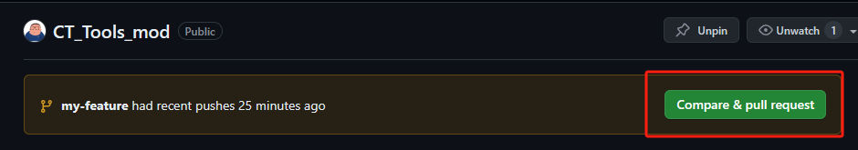
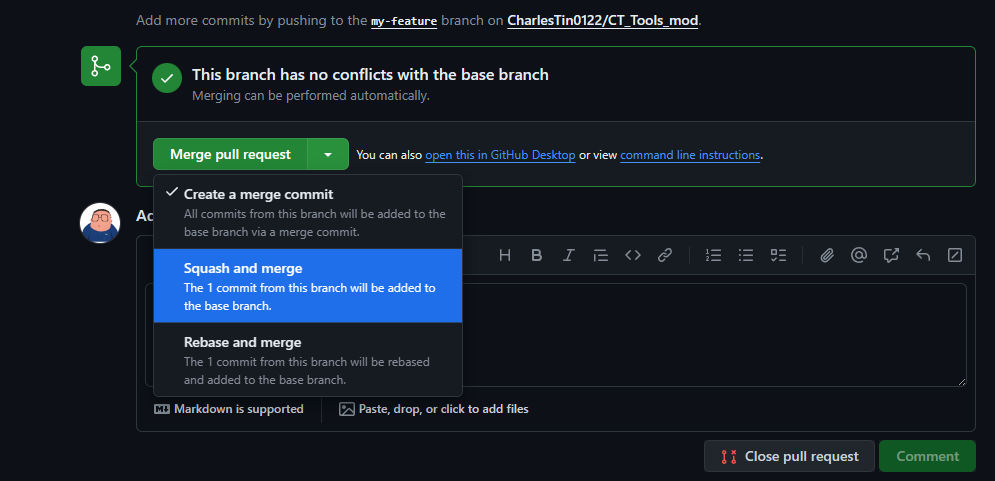

## 设置用户名和邮箱
```bash
git config --global user.name "CharlesTin0122"

git config --global user.email tianchao0533@gmail.com
```
  
### 检查是否配置成功
```bash
git config --global --list
```
## 设置代理

> [!warning]
>注意：这是全局代理，且clash的端口是7890，v2rayN的端口是10808

^ec11be

  

### clash 代理端口
```bash
git config --global http.proxy socks5://127.0.0.1:7890

git config --global https.proxy socks5://127.0.0.1:7890
```
  

### v2rayN代理端口
```bash
git config --global http.proxy socks5://127.0.0.1:10808

git config --global https.proxy socks5://127.0.0.1:10808
```

### 检查代理是否生效：

  
```bash
git config --global --get http.proxy

git config --global --get https.proxy
  
```

### 取消使用代理：

  
```bash
git config --global --unset http.proxy

git config --global --unset https.proxy
```
### 查看git版本
```
git version
```
### Git版本更新
```
git update
git update-git-for-windows
```
### 开启大小写敏感

查询是否开启忽略大小写:

```text
git config --get core.ignorecase
```

关闭忽略大小写

```text
git config core.ignorecase false
```

或

```text
git config --global core.ignorecase false
```

# 开启中文适配
- 避免中文变数字:

```text
git config --global core.quotepath false
```
## 使用Git
### 创建仓库
```shell
git init
```
### 检出仓库
```bash
# 执行如下命令以创建一个本地仓库的克隆版本：
git clone /path/to/repository
# 如果是远端服务器上的仓库，你的命令会是这个样子：
git clone username@host:/path/to/repository
```
### 工作流
你的本地仓库由 git 维护的三棵“树”组成。
1. 第一个是你的 `工作目录`，它持有实际文件；
2. 第二个是 `暂存区（Index）`，它像个缓存区域，临时保存你的改动；
3. 第三个是 `HEAD`，它指向你最后一次提交的结果。

### 添加和提交

你可以提出更改（把它们添加到暂存区），使用如下命令：  
```
git add <filename>
git add *
```
这是 git 基本工作流程的第一步；使用如下命令以实际提交改动：  
```
git commit -m "代码提交信息"  
```
现在，你的改动已经提交到了 **HEAD**，但是还没到你的远端仓库。
### 推送改动

* 你的改动现在已经在本地仓库的 **HEAD** 中了。执行如下命令以将这些改动提交到远端仓库：  
```
git push origin master
```
可以把 _master_ 换成你想要推送的任何分支。  
  
- 如果你还没有克隆现有仓库，并欲将你的仓库连接到某个远程服务器，你可以使用如下命令添加：  
```
git remote add origin <server>
```
如此你就能够将你的改动推送到所添加的服务器上去了。
### 分支

分支是用来将特性开发绝缘开来的。在你创建仓库的时候，_master_ 是“默认的”分支。在其他分支上进行开发，完成后再将它们合并到主分支上。


- 创建一个叫做“feature_x”的分支，并切换过去：  
```
git checkout -b feature_x 
```
- 修改分支完成后，查看分支变化，`q`键退出。
```
 git diff
```
- 修改文件放入暂存区,告知git你的修改
```
git add <changed_file>
```
- 提交文件到git仓库
```
git commit
```
- 切换回主分支：  
```
git checkout master 
```
- 再把新建的分支删掉：  
```
git branch -d feature_x  
```
- 除非你将分支推送到远端仓库，不然该分支就是 _不为他人所见的_：  
```
git push origin <branch>
```
### 更新与合并

- 要更新你的本地仓库至最新改动，执行：  
```
git pull origin <branch>
```  
- 把我的修改先放一边，将main最新的修改拿过来，接着在这个最新修改的基础之上，尝试增加我的修改。
```
git rebase main
```
- 遗憾的是，这可能并非每次都成功，并可能出现_冲突（conflicts）。 这时候就需要你修改这些文件来手动合并这些冲突。改完之后，你需要执行如下命令以将它们标记为合并成功：  
```
git add <filename>  
```
- 在合并改动之前，你可以使用如下命令预览差异：  
```
git diff <source_branch> <target_branch>
```
- 推送rebase后的分支,由于分支经过rebase，所以推送时使用-f,意为force强制。
```
git push -f origin <branch>
```
- 把我们提交的分支代码合并到main branch里叫做 pull request(拉取请求)，主分支拉取功能分支的提交请求。在GitHub中可以很轻松的提交pull request，要求main branch 把你的my-feature branch上的改动pull进去。 
- 主分支维护者可以Merge pull request(合并拉取请求)，或者Squash and merge（积压合并，将提交信息合并为一个并合并）

- 然后可以在GitHub删除已合并的功能分支。
- 然后本地切换到main branch 执行 删除本地分支。
- 要合并其他分支到你的当前分支（例如 master），执行：  
```
git merge <branch>  
```

## SSH Key
### 生成SSH Key
```bash
ssh-keygen -t rsa -C "tianchao0533@gmail.com"
```
### 显示生成的公钥，将其复制出来备用
```bash
cat ~/.ssh/id_rsa.pub
```

### 上传 SSH 公钥
- 对于 Gitee：点击导航栏右上角头像，选择「设置」，然后在侧边栏菜单选择「SSH 公钥」，填入上一步保存的公钥内容并保存确认。
- 对于 GitHub：点击导航栏右上角头像，选择「Settings」，然后在侧边栏菜单选择「SSH and GPG keys」，填入上一步保存的公钥内容并保存确认。
- [Open: Pasted image 20231207152534.png](Notes/attachments/2e0643190b0bf288769cb35640671368_MD5.jpeg)
