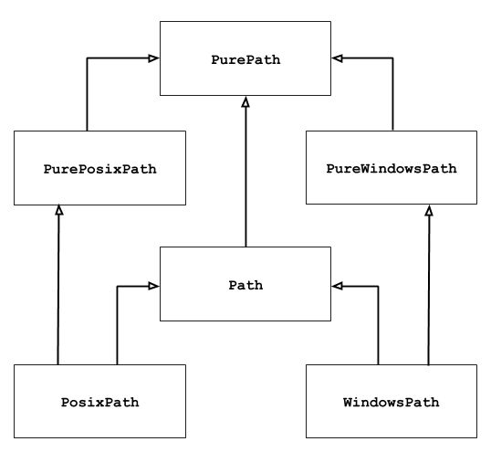

# python-pathlib库

pathlib是跨平台的、面向对象的路径操作模块，可适用于不同的操作系统，其操作对象是各种操作系统中使用的路径（包括绝对路径和相对路径），pathlib有两个主要的类，分别为PurePath和Path。

此模块提供表示具有语义的文件系统路径的类 适用于不同的操作系统。路径类被划分[_在纯路径_](https://pathlib.readthedocs.io/en/pep428/#pure-paths)之间，提供纯计算 没有 I/O 的操作和[_具体路径_](https://pathlib.readthedocs.io/en/pep428/#concrete-paths)，其中 从纯路径继承，但也提供 I/O 操作。



[官方文档](https://pathlib.readthedocs.io/en/pep428/)

## pathlib简介

| 类                     | 介绍                                                                                                                                                                                                                                                                                                               |
| --------------------- | ---------------------------------------------------------------------------------------------------------------------------------------------------------------------------------------------------------------------------------------------------------------------------------------------------------------- |
| PurePath              | PurePath访问实际文件系统的“纯路径”，只负责对路径字符串执行操作。  <br>PurePath有两个子类，即PurePosixPath和PathWindowsPath，前者用于操作UNIX（包括 Mac OS X）风格的路径，后者用于操作Windows风格的路径。                                                                                                                                                                         |
| Path                  | Path访问实际文件系统的“真正路径”，Path对象可用于判断对应的文件是否存在、是否为文件、是否为目录等。  <br>有两个子类，即PosixPath和WindowsPath，前者用于操作UNIX（包括 Mac OS X）风格的路径，后者用于操作Windows风格的路径。  <br>考虑到操作系统的不同，Path 类的使用同 PurePath 类。                                                                                                                                 |
| PurePath和Path的区别      | Path 是 PurePath 的子类，除了支持 PurePath 的各种操作、属性和方法之外，还会真正访问底层的文件系统，包括判断 Path 对应的路径是否存在，获取 Path 对应路径的各种属性（如是否只读、是文件还是文件夹等），甚至可以对文件进行读写。  <br>PurePath 和 Path 最根本的区别在于，PurePath 处理的仅是字符串，而 Path 则会真正访问底层的文件路径，因此它提供了属性和方法来访问底层的文件系统。                                                                                    |
| UNIX 和 Windows 风格路径区别 | UNIX 风格的路径和 Windows 风格路径的主要区别在于根路径和路径分隔符，UNIX 风格路径的根路径是斜杠（/），而 Windows 风格路径的根路径是盘符（c:）；UNIX 风格的路径的分隔符是斜杠（/），而 Windows 风格路径的分隔符是反斜杠（\）。  <br>考虑到操作系统的不同，在使用 PurePath 类时，如果在 UNIX 或 Mac OS X 系统上使用 PurePath 创建对象，该类的构造方法实际返回的是 PurePosixPath 对象；反之，如果在 Windows 系统上使用 PurePath 创建对象，该类的构造方法返回的是 PureWindowsPath 对象。 |

Python的pathlib模块提供了一种面向对象的方式来操作文件系统路径，使得路径操作更加直观和易于使用。下面是pathlib模块的所有方法介绍：

- Path.cwd()：返回当前工作目录的路径对象。
- Path.home()：返回用户主目录的路径对象。
- Path.resolve()：返回绝对路径的路径对象。
- Path.is_absolute()：检查路径是否为绝对路径，返回布尔值。
- Path.exists()：检查路径所代表的文件或目录是否存在，返回布尔值。
- Path.is_dir()：检查路径是否是一个目录，返回布尔值。
- Path.is_file()：检查路径是否是一个文件，返回布尔值。
- Path.parts：返回路径中所有部分的元组。
- Path.drive：返回路径中的驱动器部分。
- Path.root：返回路径中的根部分。
- Path.name：返回路径中的文件或目录名。
- Path.stem：返回路径中的文件或目录名（不包含扩展名）。
- Path.suffix：返回路径中的扩展名（包括点号）。
- Path.with_name(name)：返回一个新的路径对象，其文件或目录名为指定的名称。
- Path.with_suffix(suffix)：返回一个新的路径对象，其扩展名为指定的后缀。
- Path.joinpath(*args)：将当前路径与给定的路径连接，返回一个新的路径对象。
- Path.mkdir(mode=0o777, parents=False, exist_ok=False)：创建目录。
- Path.rmdir()：删除空目录。
- Path.rename(target)：将路径重命名为目标路径。
- Path.unlink()：删除文件或符号链接。
- Path.glob(pattern)：返回与给定模式匹配的路径对象的生成器。
- Path.iterdir()：返回目录中所有文件和子目录的生成器。

## pathlib与os的区别

在Python 3.4之前，涉及路径相关操作，都用os模块解决，尤其是os.path这个子模块非常有用。在Python 3.4之后，pathlib成为标准库模块，其使用面向对象的编程方式来表示文件系统路径，丰富了路径处理的方法。

### pathlib优势

**相对于传统的os及os.path，pathlib具体如下优势：**

- pathlib实现统一管理，解决了传统操作导入模块不统一问题；
- pathlib使得在不同操作系统之间切换非常简单；
- pathlib是面向对象的，路径处理更灵活方便，解决了传统路径和字符串并不等价的问题；
- pathlib简化了很多操作，简单易用。

### pathlib和os常用操作对比

通过常用路径操作的对比，可以更深刻理解pathlib和os的区别，便于在实际操作中做对照，也便于进行使用替代，详细对比如下：

|pathlib操作|os及os.path操作|功能描述|
|---|---|---|
|Path.resolve()|os.path.abspath()|获得绝对路径|
|Path.chmod()|os.chmod()|修改文件权限和时间戳|
|Path.mkdir()|os.mkdir()|创建目录|
|Path.rename()|os.rename()|文件或文件夹重命名，如果路径不同，会移动并重新命名|
|Path.replace()|os.replace()|文件或文件夹重命名，如果路径不同，会移动并重新命名，如果存在，则破坏现有目标。|
|Path.rmdir()|os.rmdir()|删除目录|
|Path.unlink()|os.remove()|删除一个文件|
|Path.unlink()|os.unlink()|删除一个文件|
|Path.cwd()|os.getcwd()|获得当前工作目录|
|Path.exists()|os.path.exists()|判断是否存在文件或目录name|
|Path.home()|os.path.expanduser()|返回电脑的用户目录|
|Path.is_dir()|os.path.isdir()|检验给出的路径是一个文件|
|Path.is_file()|os.path.isfile()|检验给出的路径是一个目录|
|Path.is_symlink()|os.path.islink()|检验给出的路径是一个符号链接|
|Path.stat()|os.stat()|获得文件属性|
|PurePath.is_absolute()|os.path.isabs()|判断是否为绝对路径|
|PurePath.joinpath()|os.path.join()|连接目录与文件名或目录|
|PurePath.name|os.path.basename()|返回文件名|
|PurePath.parent|os.path.dirname()|返回文件路径|
|Path.samefile()|os.path.samefile()|判断两个路径是否相同|
|PurePath.suffix|os.path.splitext()|分离文件名和扩展名|

## 属性和方法汇总

### PurePath 类属性和方法汇总

|属性和方法|功能描述|
|---|---|
|PurePath.parts|返回路径字符串中所包含的各部分。|
|PurePath.drive|返回路径字符串中的驱动器盘符。|
|PurePath.root|返回路径字符串中的根路径。|
|PurePath.anchor|返回路径字符串中的盘符和根路径。返回路径字符串中的盘符和根路径。|
|PurePath.parents|返回当前路径的全部父路径。|
|PurPath.parent|返回当前路径的上一级路径，相当于parets[0]的返回值。|
|PurePath.name|返回当前路径中的文件名。|
|PurePath.suffixes|返回当前路径中的文件所有后缀名。|
|PurePath.suffix|返回当前路径中的文件后缀名，相当于返回当前路径中的文件后缀名。相当于sufmixes属性返回的列表的最后一个元素，|
|PurePath.stem|返回当前路径中的主文件名。|
|PurePath.as_posix()|将当前路径转换成将当前路径转换成UNIX风格的路径。|
|PurePath.as_uri()|将当前路径转换成URL。只有绝对路径才能传换，否则将会引发ValueEror。|
|PurePath.is_absolute()|判断当前路径是否为绝对路径，|
|PurePath.joinpath(self: Self, *other:strPathLike[str])|将多个路径连接在一起，作用类似于前面介绍的斜杠（)连接符。|
|PurePath.match(path_pattern: str) -> bool|判断当前路径是否匹配指定通配符。判断当前路径是否匹配指定通配符。|
|PurePath.relative_to(self: Self, *other:strPathLike[str])|获取当前路径中去除基准路径之后的结果。|
|PurePath.with_name(name:str)|将当前路径中的文件名替换成新文件名。如果当前路径中没有文件名，则会引发ValueError。 3FD|
|PurePath.with_suffix(sufx)|将当前路径中的文件后缀名替换成新的后缀名。如果当前路径中没有后缀名，则会添加新的后缀名。|

### Path 类属性和方法汇总

|属性和方法|功能描述|
|---|---|
|Path.anchor|自动判断返回drive或rootI|
|Path.chmod()|更改路径权限,类似os.chmod()|
|Path.cwd()|返回当前目录的路径对象|
|Path.drive|返回驱动器名称|
|Path.exists()|判断路径是否真实存在|
|Path.expanduser()|展开~返回完整路径对象|
|Path.glob()|过滤目录(返回生成器）|
|Path.home()|返回当前用户的home路径对象|
|Path.is_absolute()|是否是绝对路径|
|Path.is_dir()|判断是否是目录|
|Path.is_file()|是否是文件|
|Path.is_reserved()|是否是预留路径|
|Path.iterdir()|遍历目录的子目录或者文件|
|Path.joinpath()|拼接路径|
|Path.match()|测试路径是否符台pattern|
|Path.mkdir()|创建目录|
|Path.open()|打开文件(支持with)|
|Path.parents|返回所有上级目录的列表|
|Path.parts|分割路径 类似os.path.split(), 不过返回元组|
|Path.relative_to()|计算相对路径|
|Path.rename()|重命名路径|
|Path.resolve()|返回绝对路径|
|Path.rglob()|递归遍历所有子目录的文件|
|Path.root|返回路径的根目录|
|Path.stat()|返回路径信息,同os.stat()|
|Path.unlink()|删除文件或目录(目录非空触发异常)|
|Path.with_name()|更改路径名称，更改最后一级路径名|
|Path.with_suffix()|更改路径后缀|

## 使用方法介绍

### 路径获取

#### 传入字符串

在创建PurePath和Path时，既可以传入单个字符串，也可传入多个路径字符串，PurePath会将它们拼接成一个字符串。

```python
from pathlib import *

PurePath('M工具箱','MTool工具/示例','info')
# 结果： PureWindowsPath('M工具箱/MTool工具/示例/info')

Path('M工具箱')
# 结果： WindowsPath('M工具箱')

input_path = r"C:\Users\okmfj\Desktop\MTool工具"
Path(input_path)
# 结果： WindowsPath('C:/Users/okmfj/Desktop/MTool工具')
```

#### 获取目录

- Path.cwd()，返回文件当前所在目录；
- Path.home()，返回电脑用户的目录。

```python
from pathlib import *

Path.cwd()
# 结果： WindowsPath('D:/M工具箱')

Path.home()
# 结果： WindowsPath('C:/Users/okmfj')
```

#### 目录拼接

拼接出Windows桌面路径，当前路径下的子目录或文件路径。

```python
from pathlib import *

# 拼接出Windows桌面路径
Path(Path.home(), "Desktop")
# 结果： WindowsPath('C:/Users/okmfj/Desktop')

# 拼接出Windows桌面路径
Path.joinpath(Path.home(), "Desktop")
# 结果： WindowsPath('C:/Users/okmfj/Desktop')

# 拼接出当前路径下的“MTool工具”子文件夹路径
Path.cwd() / 'MTool工具'
# 结果： WindowsPath('D:/M工具箱/MTool工具')
```

### 路径处理

获取路径的不同部分、或不同字段等内容，用于后续的路径处理，如拼接路径、修改文件名、更改文件后缀等。

```python
from pathlib import *

input_path = r"C:\Users\okmfj\Desktop\MTool工具"

Path(input_path).name  # 返回文件名+文件后缀


Path(input_path).stem  # 返回文件名

Path(input_path).suffix  # 返回文件后缀

Path(input_path).suffixes  # 返回文件后缀列表


Path(input_path).root  # 返回根目录


Path(input_path).parts  # 返回文件

Path(input_path).anchor  # 返回根目录

Path(input_path).parent  # 返回父级目录

Path(input_path).parents  # 返回所有上级目录的列表
```

### 路径文件存在判断

- Path.exists()，判断 Path 路径是否是一个已存在的文件或文件夹；
- Path.is_dir()，判断 Path 是否是一个文件夹；
- Path.is_file()，判断 Path 是否是一个文件。

```python
from pathlib import *

input_path = r"C:\Users\okmfj\Desktop\MTool工具"

if Path(input_path ).exists():
	if Path(input_path ).is_file():
		print("是文件！")
	elif Path(input_path ).is_dar():
		print("是文件夹！")
else:
	print("路径有误，请检查!")
```

### 路径文件建立、删除

- Path.mkdir()，创建文件夹；
- Path.rmdir()，删除文件夹，文件夹必须为空；
- Path.unlink()，删除文件。

```python
from pathlib import *

input_path = r"C:\Users\okmfj\Desktop\MTool工具"

# 创建文件夹函数
def creat_dir(dir_path):
	if Path(dir_path).exists():  # 如果已经存在，则跳过并提示
		print("文件夹已经存在！")
	else:
		Path.mkdir(Path(dir_path))  # 创建文件夹

creat_dir(input_path )  # 调用函数

# 删除文件夹函数
def del_dir(dir_path):
	if Path(dir_path).exists():  # 如果存在，则删除文件夹
		Path.rmdir(Path(dir_path))
	else:
		print("文件夹不存在！")  # 文件夹不存在

del_dir(input_path )  # 调用函数

# 删除文件函数
def del_file(dir_path):
	if Path(dir_path).exists():  # 如果存在，则删除文件
		Path.unlink()(Path(dir_path))
	else:
		print("文件不存在！")  # 文件不存在

del_file(input_path )  # 调用函数
```

### 路径匹配查找（迭代）

- Path.iterdir()，查找文件夹下的所有文件，返回的是一个生成器类型；
- Path.glob(pattern)，查找文件夹下所有与 pattern 匹配的文件，返回的是一个生成器类型；
- Path.rglob(pattern)，查找文件夹下所有子文件夹中与 pattern 匹配的文件，返回的是一个生成器类型。

#### iterdir方法

```python
from pathlib import *

input_path = r"C:\Users\okmfj\Desktop\MTool工具"

# 获取文件夹下所有文件，返回文件路径（字符）列表，采用iterdir方法
[str(f) for f in Path(x).iterdir() if Path(f).is_file()]

# 获取文件夹下所有文件类型，返回文件后缀的列表，采用iterdir方法
list(set([Path(f).suffix for f in Path(x).iterdir() if Path(f).is_file()]))
# 结果： ['.pdf', '.txt', '.docx']
```

#### glob方法：获取所有符合pattern的文件
- 作用：Path.glob() 方法用于匹配路径下符合特定模式的所有文件和子目录的名称，返回一个迭代器，其中包含匹配的项的 Path 对象。
- 返回值类型：迭代器（生成器），例子：generator -> <generator object Path.glob at 0x7fa812d2e7a0>
💡 注意：
- Path.glob() 接受一个使用通配符的模式作为参数，如 .txt 匹配所有扩展名为 .txt 的文件。
- Path.glob() 可以使用相对路径或绝对路径，如果是相对路径，它将相对于调用 glob() 的 Path 对象所在的目录进行匹配。
- Path.glob()不会递归地匹配子目录中的文件，只匹配当前目录下符合模式的文件和子目录。
- 如果需要递归地匹配所有子目录中的文件，可以使用 ** 通配符，例如 /.txt。还是推荐使用 Path.rglob() 方法。
- 如果路径不存在，Path.glob() 将返回一个空的迭代器（不会报错）。
- Path.glob() 返回的迭代器中不会包含.和..这两个特殊的目录项。
- 这里的pattern并不是正则表达式（Regex）而是 globbing 模式，这是一种比正则表达式更简单的模式匹配机制。
💡 Globbing 模式支持的通配符包括：
- * ：匹配任意数量的字符（不包括路径分隔符）
- ? ：匹配单个字符
- seq：匹配 seq 中的任意一个字符（字符集）
- !seq：匹配不在 seq 中的任意一个字符（否定字符集）
Globbing 模式示例：
- 如果我们想匹配所有以 .txt 结尾的文件，我们可以使用 *.txt 作为模式。
- 如果我们想匹配以数字开头，后面跟着任意字符的文件，我们可以使用 0-9。
- 补充：如果我们需要使用正则表达式来匹配文件路径，我们可以使用标准库中的 re 模块，或者结合 Path 对象使用 Path.match() 方法，后者接受一个正则表达式作为参数。

```python
from pathlib import *

input_path = r"C:\Users\okmfj\Desktop\MTool工具"

# 获取文件夹下所有文件，返回文件路径（字符）列表，采用glog方法
[str(f) for f in Path(input_path).glob(f"*.*") if Path(f).is_file()]

# 获取文件夹下所有文件，返回文件路径（字符）列表，采用glog方法
[str(f) for f in Path(input_path).glob(f"**\*.*") if Path(f).is_file()]

# 获取文件夹下所有文件类型，返回文件后缀的列表，采用glog方法
list(set([Path(f).suffix for f in Path(input_path).glob(f"*.*") if Path(f).is_file()]))
# 结果： ['.pdf', '.txt', '.docx']

# 获取文件夹下（含子文件）所有文件类型，返回文件后缀的列表，采用glog方法
list(set([Path(f).suffix for f in Path(x).glob(f"**\*.*") if Path(f).is_file()]))
# 结果： ['.pdf', '.txt', '.docx']
```

#### rglob方法 : 递归地遍历文件夹（递归遍历目录树）
- 作用：Path.rglob() 方法用于递归地匹配路径下和所有子目录中符合特定模式的所有文件和子目录的名称，返回一个迭代器，其中包含匹配的项的 Path 对象。
- 返回值类型：迭代器（生成器），例子：generator -> <generator object Path.rglob at 0x7ffa4746e810>
小知识：
- rglob: recursive glob，即递归的glob
- glob 的名称来源于 Unix 中的 glob 函数，该函数用于将通配符扩展成匹配的文件列表。这个名字据说来源于 global，因为 glob 函数可以“全局”地匹配一组文件名。
💡 注意：
- Path.rglob() 接受一个使用通配符的模式作为参数，如 *.txt 匹配所有扩展名为 .txt 的文件。
- Path.rglob() 可以使用相对路径或绝对路径，如果是相对路径，它将相对于调用 rglob() 的 Path 对象所在的目录进行递归匹配。
- Path.rglob() 会递归地遍历所有子目录，匹配当前目录和所有子目录中符合模式的文件和子目录。
- 如果路径不存在，Path.rglob() 将返回一个空的迭代器（不会报错）。
- Path.rglob() 返回的迭代器中不会包含.和..这两个特殊的目录项。
- Path.rglob('*')是一个比较通用的用法，即遍历所有文件和文件夹。

```python
from pathlib import *

input_path = r"C:\Users\okmfj\Desktop\MTool工具"

# 获取文件夹下（含子文件）所有文件，返回文件路径(字符)列表，采用rglog方法
[str(f) for f in Path(x).rglob(f"*.*") if Path(f).is_file()]

# 获取文件夹下（含子文件）所有文件类型，返回文件后缀的列表，采用rglog方法
list(set([Path(f).suffix for f in Path(x).rglob(f"*.*") if Path(f).is_file()]))
# 结果： ['.pdf', '.txt', '.docx']
```

### 读、写文件

- Path.open(mode=‘r’)，以 “r” 格式打开 Path 路径下的文件，若文件不存在即创建后打开。
- Path.read_bytes()，打开 Path 路径下的文件，以字节流格式读取文件内容，等同 open 操作文件的 “rb” 格式。
- Path.read_text()，打开 Path 路径下的文件，以 str 格式读取文件内容，等同 open 操作文件的 “r” 格式。
- Path.write_bytes()，对 Path 路径下的文件进行写操作，等同 open 操作文件的 “wb” 格式。
- Path.write_text()，对 Path 路径下的文件进行写操作，等同 open 操作文件的 “w” 格式。

|模式|说明|
|---|---|
|a|追加模式打开（从EOF开始，必要时创建新文件)|
|a+|以读写模式打开|
|ab|以二进制追加模式打开（参见 a)|
|ab+|以二进制读写模式打开(参见 a+)|
|r+|以读写模式打开|
|rb|以二进制读模式打开|
|rb+|以二进制读写模式打开（参见[+)|
|w|写方式|
|w+|以读写模式打开|
|wb|以二进制写模式打开（参见 W)|
|wb+|以二进制读写模式打开（参见w+)|

```python
from pathlib import *

input_path = r"C:\Users\okmfj\Desktop\MTool工具\1.txt"

with Path(input_path).open('w') as f:  # 创建并打开文件
	f.write('M工具箱')  # 写入内容
f = open(input_path, 'r')  # 读取内容
print(f"读取的文件内容为：{f.read()}")
f.close()
```

### 当前工作目录路径和Home路径

在pathlib里一切都是面向对象的，只需要调用指定的方法就可以了。

```python
from pathlib2 import Path

# 获取当前目录
current_path = Path.cwd()
print(current_path)

# 输出如下：
# /Users/Anders/Documents/

# 获取Home目录
home_path = Path.home()
print(home_path)

# 输出如下：
# /Users/Anders

```

### 父目录操作

你可以看到想要获取一个路径下上级的父目录可以非常方便的直接使用面向对象的方式**.parent**就行了，如果还想上一级就继续以子对象继续操作parent属性就可以了。

```python
from pathlib2 import Path

# 获取当前目录
current_path = Path.cwd()

# 获取上级父目录
print(current_path.parent)

# 获取上上级父目录
print(current_path.parent.parent)

# 获取上上上级父目录
print(current_path.parent.parent.parent)

# 获取上上上上级父目录
print(current_path.parent.parent.parent.parent)

# 获取上上上上级父目录
print(current_path.parent.parent.parent.parent.parent)

# 输出如下：
# /Users/Anders/Documents/Jupyter
# /Users/Anders/Documents
# /Users/Anders
# /Users
# /

```

当然路径是十分长的，而且在特定的场合我如果想获得每一级的父目录呢，贴心的pathlib已经帮我们想到了，使用**parents**属性就可以遍历整个父目录了，如下例子的效果和上面的例子是完全一样的，但是就变的非常简便。

```python
# 获取当前目录
from pathlib2 import Path

current_path = Path.cwd()

for p in current_path.parents:
    print(p)

# 输出如下：
# /Users/Anders/Documents/Jupyter
# /Users/Anders/Documents
# /Users/Anders
# /Users
# /

```

### 文件名操作

常用的文件名操作属性如下：

- name 目录的最后一个部分
- suffix 目录中最后一个部分的扩展名
- suffixes 返回多个扩展名列表
- stem 目录最后一个部分，没有后缀
- with_name(name) 替换目录最后一个部分并返回一个新的路径
- with_suffix(suffix) 替换扩展名，返回新的路径，扩展名存在则不变

```python
from pathlib2 import Path

# 返回目录中最后一个部分的扩展名
example_path = Path('/Users/Anders/Documents/abc.gif')
print(example_path.suffix)
# 输出如下：
# .gif

# 返回目录中多个扩展名列表
example_paths = Path('/Users/Anders/Documents/abc.tar.gz')
print(example_paths.suffixes)
# 输出如下：
# ['.tar', '.gz']

# 返回目录中最后一个部分的文件名（但是不包含后缀）
example_path = Path('/Users/Anders/Documents/abc.gif')
print(example_path.stem)
# 输出如下：
# abc

# 返回目录中最后一个部分的文件名
example_path = Path('/Users/Anders/Documents/abc.gif')
print(example_path.name)
# 输出如下：
# abc.gif

# 替换目录最后一个部分的文件名并返回一个新的路径
new_path1 = example_path.with_name('def.gif')
print(new_path1)
# 输出如下：
# /Users/Anders/Documents/def.gif

# 替换目录最后一个部分的文件名并返回一个新的路径
new_path2 = example_path.with_suffix('.txt')
print(new_path2)
# 输出如下：
# /Users/Anders/Documents/abc.txt

```

### 路径拼接和分解

```python
from pathlib2 import Path

#直接传进一个完整字符串
example_path1 = Path('/Users/Anders/Documents/powershell-2.jpg')

#也可以传进多个字符串
example_path2 = Path('/', 'Users', 'dongh', 'Documents', 'python_learn', 'pathlib_', 'file1.txt')

#也可以利用Path.joinpath()
example_path3 = Path('/Users/Anders/Documents/').joinpath('python_learn')

# #利用 / 可以创建子路径
example_path4 = Path('/Users/Anders/Documents')
example_path5 = example_path4 / 'python_learn/pic-2.jpg'

```

### 遍历文件夹

我们可以在路径对象后面直接使用**iterdir()**方法，该方法返回一个生成器，我们可以循环遍历出所有指定目录下的目录路径。

```python
from pathlib2 import Path

# 返回目录中最后一个部分的扩展名
example_path = Path('/Users/Anders/Documents')
[path for path in example_path.iterdir()]

# 输出如下：
# [PosixPath('/Users/Anders/Documents/abc.jpg'),
#  PosixPath('/Users/Anders/Documents/book-master'),
#  PosixPath('/Users/Anders/Documents/Database'),
#  PosixPath('/Users/Anders/Documents/Git'),
#  PosixPath('/Users/Anders/Documents/AppProjects')]

```

### 文件操作

文件操作是使用率非常高的操作，在pathlib里如果要打开一个文件也十分的简单，只需要open方法就可以，它的操作语法是：

```python
open(mode=‘r’, bufferiong=-1, encoding=None, errors=None, newline=None)
```

```python
from pathlib2 import Path

example_path = Path('/Users/Anders/Documents/information/JH.txt')

with example_path.open(encoding = 'GB2312') as f:
    print(f.read())

```

对于简单的文件读写，在pathlib库中有几个简便的方法：

- read_text(): 以文本模式打开路径并并以字符串形式返回内容。
- read_bytes(): 以二进制/字节模式打开路径并以字节串的形式返回内容。
- write_text(): 打开路径并向其写入字符串数据。
- write_bytes(): 以二进制/字节模式打开路径并向其写入数据。

比如可以把之前的例子改写如下：

```python
from pathlib2 import Path

example_path = Path('/Users/Anders/Documents/information/JH.txt')
example_path.read_text(encoding='GB2312')

```

### 创建文件夹和删除文件夹

关于这里的创建文件目录mkdir方法接收两个参数：

- parents：如果父目录不存在，是否创建父目录。
- exist_ok：只有在目录不存在时创建目录，目录已存在时不会抛出异常。

```python
from pathlib2 import Path

example_path = Path('/Users/Anders/Documents/test1/test2/test3')

# 创建文件目录，在这个例子中因为本身不存在test1,test2,test3，由于parents为True，所以都会被创建出来。
example_path.mkdir(parents = True, exist_ok = True)
# 删除路径对象目录，如果要删除的文件夹内包含文件就会报错
example_path.rmdir()

```

### 判断文件及文件夹对象是否存在

关于文件的判断还有很多相关属性，罗列如下：

- is_dir() 是否是目录
- is_file() 是否是普通文件
- is_symlink() 是否是软链接
- is_socket() 是否是socket文件
- is_block_device() 是否是块设备
- is_char_device() 是否是字符设备
- is_absolute() 是否是绝对路径
- resolve() 返回一个新的路径，这个新路径就是当前Path对象的绝对路径，如果是软链接则直接被解析
- absolute() 也可以获取绝对路径，但是推荐resolve()
- exists() 该路径是否指向现有的目录或文件

部分例子可以参照下面：

```python
from pathlib2 import Path

example_path = Path('/Users/Anders/Documents/pic-2.jpg')

# 判断对象是否存在
print(example_path.exists())
# 输出如下：
# True

# 判断对象是否是目录
print(example_path.is_dir())
# 输出如下：
# False

# 判断对象是否是文件
print(example_path.is_file())
# 输出如下：
# True


```

### 文件的信息

只需要通过**.stat()**方法就可以返还指定路径的文件信息。

```python
from pathlib2 import Path

example_path = Path('/Users/Anders/Documents/pic.jpg')
print(example_path.stat())
# 输出如下：
# os.stat_result(st_mode=33188, st_ino=8598206944, st_dev=16777220, st_nlink=1, st_uid=501, st_gid=20, st_size=38054, st_atime=1549547190, st_mtime=1521009880, st_ctime=1521009883)

print(example_path.stat().st_size)
# 输出如下：
# 38054

```

### 获取文件列表（函数）

通过函数，返回文件列表，为后续迭代处理做好准备。

**参数：**

- path：输入路径，支持文件路径和文件夹路径。
- sub_dir：当为True时含子目录，为False时不含子目录
- suffix_list：文件类型列表，按要求的列出全部符合条件的文件，为空时列出全部文件，如：[“.xlsx”,“.xls”]

```python
from pathlib import *

def file_list_handle(path, sub_dir=False, suffix_list=[]):
	"""
	path：输入路径，支持文件路径和文件夹路径	
        sub_dir：当为True时含子目录，为False时不含子目录 	
        suffix_list：文件类型列表，按要求的列出全部符合条件的文件，为空时列出全部文件，如：[".xlsx",".xls"]
	"""
	file_list = []
	if not suffix_list:
		if sub_dir:
			[suffix_list.append(Path(f).suffix) for f in Path(path).glob(f"**\*.*") if Path(f).is_file()]
		else:
			[suffix_list.append(Path(f).suffix) for f in Path(path).glob(f"*.*") if Path(f).is_file()]
		suffix_list = list(set(suffix_list))
	# [print(i) for i in suffix_list]
	if Path(path).exists():
		# 目标为文件夹
		if Path(path).is_dir():
			if sub_dir:
				for i in suffix_list:
					[file_list.append(str(f)) for f in Path(path).glob(f"**\*{i}")]
			else:
				[file_list.append(str(f)) for f in Path(path).iterdir() if Path(f).is_file and f.suffix in suffix_list]
		elif Path(path).is_file():
			file_list = [path]

		# 去除临时文件
		file_list_temp = []
		for y in file_list:
			if "~$" in Path(y).stem:
				continue
			file_list_temp.append(y)
		file_list = file_list_temp
		return file_list
	else:
		print("输入有误！")
		return []
```

### 定义文件路径

在输入文件路径的基础上，通过函数，构造输出文件路径，为后续处理、存储做好准备。

**参数：**

- in_path：输入文件路径
- path_str：文件路径构造字符
- file_suffix：输出文件后缀

```python
from pathlib import *
from datetime import datetime

input_path = r"C:\Users\hp\Desktop\MTool工具\1.txt"

def out_path_handle(in_path, path_str="", file_suffix=""):
	"""
	in_path：输入文件路径
        path_str：文件路径构造字符
        file_suffix：输出文件后缀
	"""
	if path_str == "":
		path_str = str(datetime.now()).replace(":", "").replace(" ", "_").replace("-", "").replace(".", "_")[
		           :22]
	elif path_str[-1] == "_":
		path_str = path_str + str(datetime.now()).replace(":", "").replace(" ", "_").replace("-", "").replace(
			".", "_")[:22]
	if file_suffix == "":
		file_suffix = Path(in_path).suffix

	if Path(in_path).exists():
		if Path(in_path).is_dir():
			path = Path(in_path).joinpath(path_str + file_suffix)
		elif Path(in_path).is_file():
			path = Path(in_path).parent.joinpath(Path(in_path).stem + "_" + path_str + file_suffix)
		return path

	else:
		print("输入有误！")
		return []

# 调用函数
out_path_handle(input_path,"已处理",".xlsx")
# 结果： WindowsPath('C:/Users/hp/Desktop/MTool工具/1_已处理.xlsx')

# 调用函数
out_path_handle(input_path,"_",".xlsx")
# 结果：WindowsPath('C:/Users/hp/Desktop/MTool工具/1_20220304_135344_003210.xlsx')
```

## 总结

以上详细介绍了Python中路径操作的标准模块：pathlib，鉴于pathlib的优势，建议在python中优先使用，可以使路径处理更简洁、路径处理错误更少、编程效率更高、代码更易读。