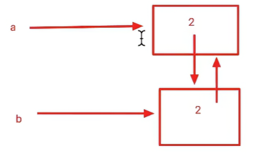

Python语言中的垃圾回收（Garbage Collection，简称GC）主要采用两种机制协同工作：

1. **引用计数（Reference Counting）** —— 主机制  
2. **分代回收（Generational GC）** —— 辅助机制，用于解决循环引用问题

下面详细介绍这两种机制以及它们如何配合工作。

### 1. 引用计数（主要机制）

Python的每一个对象内部都维护一个引用计数器（ob_refcnt），记录当前有多少个引用指向它。

- 当一个对象的引用计数变为0时，Python会立即销毁该对象并释放内存。
- 常见操作对引用计数的影响：
	- 引用计数增加
		- 对象被创建：`a = 23`
		- 对象被引用：`b = a`
		- 对象作为参数传入函数：`func(a)`
		- 对象作为元素储存在容器中：`list1 = [a, b]`
	- 引用计数减少
		- 对象的引用被显式撤销： del a
		- 对象的引用被赋予新的对象： a = 24
		- 一个对象离开他的作用域：函数执行完毕时函数中的局部变量
		- 对象所在的容器被销毁或者从容器中移除对象
- 获取引用计数
```python
import sys
a = "hello"
sys.getrefcount(a)
```

优点：实现简单、实时性强（引用计数为0时立即回收）  
缺点：无法处理循环引用（A引用B，B引用A，即使两者都不再被使用，引用计数永远不为0）
[Open: 11.00-垃圾回收-概念-1763437508761.png](attachments/7e80af3730a80d30f6679cde5a49e61b_MD5.jpg)


### 2. 分代回收（解决循环引用）

Python使用**标记-清除（Mark-Sweep）** + **分代（Generational）**算法来检测和回收循环引用的对象。
引用计数负责 99.9% 的即时回收，分代 GC 定期从“根对象”出发做可达性分析，把引用计数永远不会归零的“孤岛”（循环引用）标记为不可达，然后彻底回收。
#### 三代对象池
Python把对象分成0、1、2三代（generation 0、1、2）：
- 新创建的对象先放入第0代
- 如果一个对象在一次GC中存活下来，就会被移动到下一代
- 代数越高，触发GC的频率越低（因为大多数对象“要么很快死亡，要么长寿”）

默认阈值（可以通过gc.get_threshold()查看）：
```python
>>> import gc
>>> gc.get_threshold() # (700, 10, 10)
>>> gc.get_count() # (575, 7, 5)

```
意思是：
- 第0代达到700个对象时触发一次GC
- 第0代经历了10次GC还没被回收的对象，晋升到第1代
- 第1代经历了10次GC还没被回收的对象，晋升到第2代
- 当前第0代对象数是575，当前第一代对象池清理过7次，当前第二代对象池清理过5次

#### 标记-清除过程
1. 从一组根对象（全局对象、当前栈帧的局部变量等）开始遍历
2. 能访问到的对象标记为“存活”
3. 遍历所有对象，回收未被标记的对象（这些往往就是循环引用导致的垃圾）
4. 解除标记，准备下次GC

### 3. 手动控制垃圾回收

```python
import gc

# 手动触发一次完整垃圾回收（三代都检查）
gc.collect()

# 查看各代对象的数量
gc.get_count()          # 返回 (gen0_count, gen1_count, gen2_count)

# 查看触发阈值
gc.get_threshold()      # (700, 10, 10)

# 修改阈值（不推荐随意改）
gc.set_threshold(1000, 15, 15)

# 关闭/开启自动GC（调试时有用）
gc.disable()
gc.enable()
```

### 4. 常见问题与注意事项

1. **__del__ 方法与循环引用**
   如果对象定义了 __del__ 方法，即使形成了循环引用，引用计数也不会彻底归零，分代GC也无法回收它，会导致内存泄漏。
   解决办法：避免在有循环引用的对象上定义 __del__，或者使用 weakref 弱引用。
	- Python 的 __del__ ≈ “对象临死前最后一声哀嚎”，根本不能依赖来释放资源
	- 在 Python 里，凡是需要“一定清理”的资源，100% 都要用 with / try-finally / 上下文管理器

2. **弱引用（weakref）**
   弱引用不增加引用计数，常用来打破循环引用：
   ```python
   import weakref
   a = {}
   b = {}
   a['b'] = b
   b['a'] = weakref.ref(a)   # 弱引用，不影响引用计数
   ```

3. **大对象与内存碎片**
   Python有自己的内存池（pymalloc），小于512字节的对象会复用内存块。GC只回收对象本身，不负责归还给操作系统，所以长时间运行的程序内存占用可能不会下降。

### 总结

| 机制             | 是否能回收循环引用 | 回收时机               | 实时性 |
|------------------|--------------------|------------------------|--------|
| 引用计数         | 不能               | 引用计数为0时立即回收  | 高     |
| 分代GC（标记-清除）| 能                | 达到阈值或手动调用时   | 较低   |

两者配合：99%以上的垃圾通过引用计数实时回收，只有极少数循环引用的垃圾交给分代GC定期处理，这也是Python内存管理高效的关键。

这就是Python垃圾回收的核心原理了！有任何具体场景想深入讨论欢迎继续问。