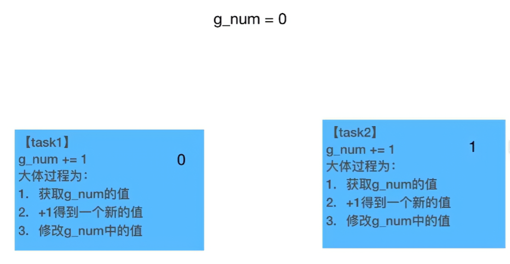

[Open: 14.00-互斥锁-1763540185169.png](attachments/73272d2ec1875e3aefefea27f9bca00a_MD5.jpg)

在 Python 中，互斥锁（Mutual Exclusion Lock，简称 **mutex**）是最常用的线程同步原语，用于防止多个线程同时访问共享资源（如全局变量、文件、数据库连接等），从而避免**数据竞争（race condition）**。
[Open: 14.00-互斥锁-1763539697648.png](attachments/d56285d997afeebe1bafecdf57c2cd3a_MD5.jpg)

- 如果task1只执行了第一句：获取g_num = 0，此时并发的执行task2，task2执行完毕，g_num = 1
- 此时继续执行task1，0 + 1 = 1，g_num = 1
- 两个线程各执行一次，g_num的值应该为2，但是却是1，因为全局变量 g_num += 1不是线程安全的。
- 这就是race condition数据竞争

Python 中提供互斥锁的主要方式是通过 `threading` 模块的 `Lock` 类（还有更高级的 `RLock`）。

### 1. 基本用法：threading.Lock

```python
import threading

# 创建一个互斥锁
lock = threading.Lock()

# 共享资源
counter = 0

def increment():
    global counter
    for _ in range(100000):
        # 获取锁（如果已经被其他线程持有，就阻塞等待）
        lock.acquire()
        try:
            counter += 1          # 临界区（critical section）
        finally:
            lock.release()        # 确保一定释放锁

# 或者更推荐使用 with 语句（自动获取和释放锁）
def increment_safe():
    global counter
    for _ in range(100000):
        with lock:                # 自动 acquire 和 release
            counter += 1

# 创建多个线程
threads = [threading.Thread(target=increment_safe) for _ in range(10)]

for t in threads:
    t.start()
for t in threads:
    t.join()

print("最终计数:", counter)   # 应该正好是 1000000
```

### 2. 推荐写法：使用 context manager（with 语句）

```python
with lock:
    # 临界区代码
    shared_resource.modify()
```

优点：
- 自动获取和释放锁
- 即使在临界区发生异常，也能保证锁被正确释放，避免死锁

### 3. Lock 的主要方法

| 方法                | 说明                                      |
|---------------------|-------------------------------------------|
| `lock.acquire(blocking=True, timeout=-1)` | 获取锁，可设置超时 |
| `lock.release()`    | 释放锁（只能由持有锁的线程调用）          |
| `lock.locked()`     | 返回是否已被某个线程持有                   |
| `with lock:`        | 推荐方式，自动管理锁                      |

### 4. RLock（可重入锁）

`threading.RLock` 是可重入的互斥锁，同一个线程可以多次 `acquire` 而不会死锁，必须对应次数的 `release` 才能真正释放。

```python
rlock = threading.RLock()

def func():
    with rlock:
        print("第一次获取")
        with rlock:        # 同一个线程可以再次获取
            print("第二次获取")
```

适用场景：一个函数内部需要锁，而这个函数又可能被另一个已持有锁的函数调用。

### 5. Lock vs RLock 对比

| 特性               | Lock                  | RLock                     |
|--------------------|-----------------------|---------------------------|
| 可重入             | 不支持                | 支持（同一线程可多次获取） |
| 性能               | 略高                  | 略低                      |
| 死锁风险           | 更高（容易忘记 release）| 更安全                    |
| 典型使用场景       | 简单共享资源保护      | 类方法中递归或相互调用    |

### 6. 其他线程同步工具（了解即可）

| 工具            | 用途                                    |
|-----------------|-----------------------------------------|
| `threading.Event`      | 线程间事件通知                          |
| `threading.Condition`  | 条件变量，常用于生产者-消费者模型       |
| `threading.Semaphore`  | 限制同时访问资源的线程数（信号量）      |
| `queue.Queue`          | 线程安全的队列（推荐用于生产者消费者）  |

### 7. 注意事项

1. 锁粒度要尽量小：只保护真正需要同步的代码段，减少锁竞争。
2. 避免嵌套锁（容易死锁），除非非常清楚依赖顺序。
3. 多线程中不要依赖线程执行顺序。
4. Python 的 GIL（全局解释器锁）让同一时刻只有一个线程执行 Python 字节码，所以在 CPU-bound 任务中锁的影响可能被掩盖，但在 I/O-bound 或多核释放 GIL 的场景（如 numpy、c扩展）中，锁非常重要。

### 总结一句话：
Python 中的互斥锁就是 `threading.Lock()`（推荐配合 `with` 使用），用来确保同一时刻只有一个线程能进入临界区，防止多线程下数据被踩坏。如果需要同一个线程多次获取锁，就用 `threading.RLock()`。