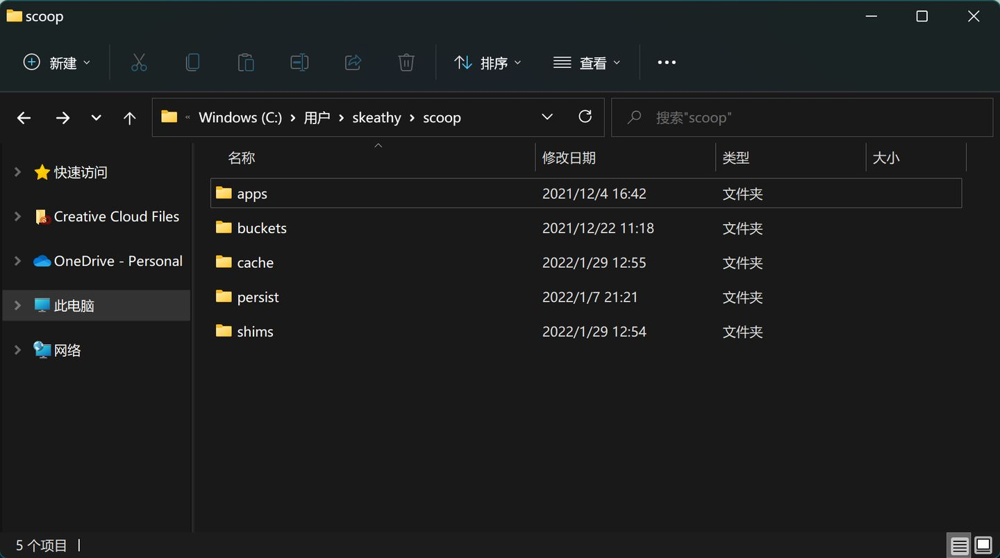
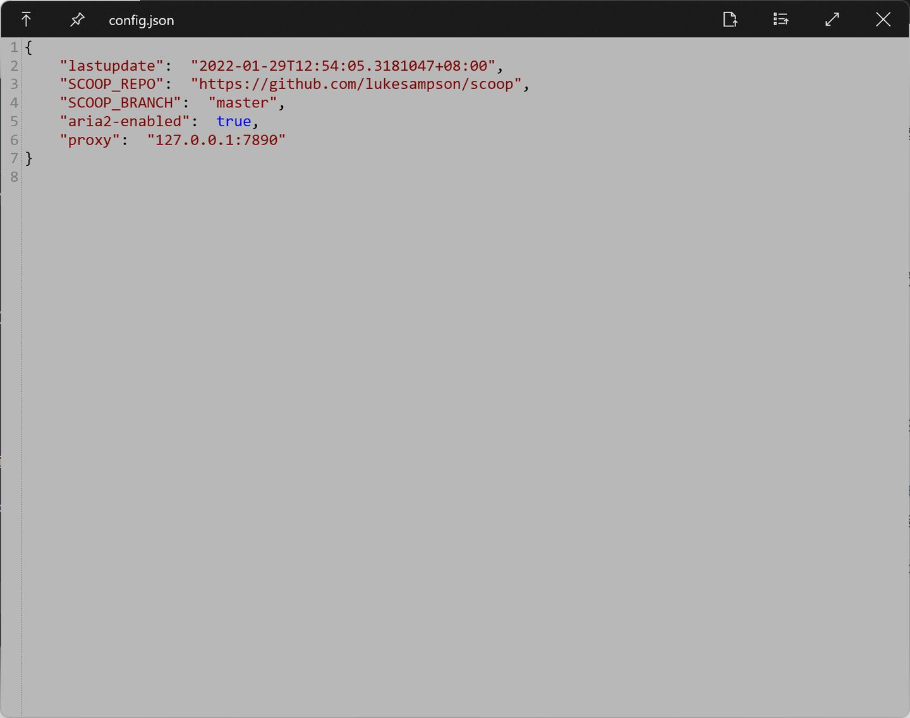

### 设置PowerShell权限

为了让PowerShell可以执行脚本，首先需要设置PowerShell执行策略，通过输入以下命令`Set-ExecutionPolicy -ExecutionPolicy RemoteSigned -Scope CurrentUser`即可。（如果之前已开启，可忽略。）

### 安装Scoop

通过以下命令，可以将Scoop安装到默认目录（`C:\Users\<username>\scoop`）：

```powershell
Invoke-Expression (New-Object System.Net.WebClient).DownloadString('https://get.scoop.sh')
```

或者另一条更短的命令：

```powershell
iwr -useb get.scoop.sh | iex
```

如果你需要更改默认的安装目录，则需要在执行以上命令前添加环境变量的定义，通过执行以下命令完成：

```powershell
$env:SCOOP='D:\Applications\Scoop'
[Environment]::SetEnvironmentVariable('SCOOP', $env:SCOOP, 'User')
```

其中目录`D:\Applications\Scoop`可根据自己的情况修改。

完成之后，相应位置就会生成一个scoop文件夹，如图所示：

  



  

简单解释下子目录中其他文件夹的含义：

- apps——所有通过scoop安装的软件都在里面。
- buckets——管理软件的仓库，用于记录哪些软件可以安装、更新等信息，默认添加`main`仓库，主要包含无需GUI的软件，可手动添加其他仓库或自建仓库，具体在[推荐软件仓库](https://zhuanlan.zhihu.com/write#%E6%8E%A8%E8%8D%90%E8%BD%AF%E4%BB%B6%E4%BB%93%E5%BA%93)中介绍。
- cache——软件下载后安装包暂存目录。
- persit——用于储存一些用户数据，不会随软件更新而替换。
- shims——用于软链接应用，使应用之间不会互相干扰，实际使用过程中无用户操作不必细究。

### 中国用户专享

如果你访问Github有问题，或下载其中的资源有问题，可尝试以下方法：

1. 设置Scoop代理。在命令行中输入（PowerShell或者CMD中都行）`scoop config proxy 127.0.0.1:7890`（一看就是clash用户）让scoop网络连接走代理，后面的ip地址和端口根据自己的代理设置。
2. 使用[Gitee镜像源](https://link.zhihu.com/?target=https%3A//gitee.com/squallliu/scoop)。可能备份更新得不是那么勤快，以及实际下载软件包同样会有网络问题，所以不推荐。在命令行中输入`scoop config SCOOP_REPO https://gitee.com/squallliu/scoop`修改仓库源的地址。

（或者更直接点，找到Scoop配置文件，路径`C:\Users\username\.config\scoop\config.json`，然后直接修改里面的配置，如下图：

  



)

## Scoop常用命令

Scoop的操作命令十分简单，基本结构是`scoop + 动词 + 对象`，动词就是一个操作动作，如安装、卸载，对象一般就是软件名了（支持通配符*操作），当然这需要你先打开命令行工具。比如我想安装typora，通过输入`scoop install typora`即可自动完成软件的官网进入+下载+安装等操作。

以下是一些常用的命令说明：

- search——搜索仓库中是否有相应软件。
- install——安装软件。
- uninstall——卸载软件。
- update——更新软件。可通过`scoop update *`更新所有已安装软件，或通过`scoop update`更新所有软件仓库资料及Scoop自身而不更新软件。
- hold——锁定软件阻止其更新。
- info——查询软件简要信息。
- home——打开浏览器进入软件官网。

如果忘记了，可通过输入`scoop help`来查询语法，以及更多不怎么常用的操作指导。

```powershell
C:\Users\skeathy>scoop help
Usage: scoop <command> [<args>]

Some useful commands are:

alias       Manage scoop aliases
bucket      Manage Scoop buckets
cache       Show or clear the download cache
cat         Show content of specified manifest.
checkup     Check for potential problems
cleanup     Cleanup apps by removing old versions
config      Get or set configuration values
create      Create a custom app manifest
depends     List dependencies for an app
export      Exports (an importable) list of installed apps
help        Show help for a command
hold        Hold an app to disable updates
home        Opens the app homepage
info        Display information about an app
install     Install apps
list        List installed apps
prefix      Returns the path to the specified app
reset       Reset an app to resolve conflicts
search      Search available apps
status      Show status and check for new app versions
unhold      Unhold an app to enable updates
uninstall   Uninstall an app
update      Update apps, or Scoop itself
virustotal  Look for app's hash on virustotal.com
which       Locate a shim/executable (similar to 'which' on Linux)


Type 'scoop help <command>' to get help for a specific command.
```

在实际使用过程中，我们可以先通过`search`命令查询一下是否有相应软件，软件名称是否正确，然后通过`install`命令完成软件的安装。另外，有两个必备的软件需要安装——git和7zip，建议完成Scoop安装后先执行以下命令：`scoop install git 7zip`（没错，Scoop支持多个软件同时依次安装），虽然后续操作中未安装这两个软件时也会提醒用户安装就是了。

## 推荐软件仓库

软件仓库是Scoop软件管理的重要基础，通过json文件记录仓库中每一个软件的信息，从而实现软件的管理等便捷命令行操作，并由仓库管理员（其实开源项目都是大家用爱发电）负责软件信息的更新。

前面提到，默认安装Scoop后仅有`main`仓库，其中主要是面向程序员的工具，对于一般用户而言并不是那么实用。好在Scoop本身考虑到了这一点，添加了面向一般用户的软件仓库`extras`，其中收录大量好用的小软件，足够日常的使用。

Scoop添加软件仓库的命令是`scoop bucket add bucketname (+ url可选)`。如添加`extras`的命令是`scoop bucket add extras`，执行此命令后会在scoop文件夹中的buckets子文件夹中添加extras文件夹。

此外，Scoop官方还有一些仓库可供使用，本人没有什么需求就不在此处介绍了，仅贴一下官方的介绍：

> [main](https://link.zhihu.com/?target=https%3A//github.com/ScoopInstaller/Main) - Default bucket for the most common (mostly CLI) apps  
> [extras](https://link.zhihu.com/?target=https%3A//github.com/ScoopInstaller/Extras) - Apps that don't fit the main bucket's [criteria](https://link.zhihu.com/?target=https%3A//github.com/ScoopInstaller/Scoop/wiki/Criteria-for-including-apps-in-the-main-bucket)  
> [games](https://link.zhihu.com/?target=https%3A//github.com/Calinou/scoop-games) - Open source/freeware games and game-related tools  
> [nerd-fonts](https://link.zhihu.com/?target=https%3A//github.com/matthewjberger/scoop-nerd-fonts) - Nerd Fonts  
> [nirsoft](https://link.zhihu.com/?target=https%3A//github.com/kodybrown/scoop-nirsoft) - Almost all of the [250+](https://link.zhihu.com/?target=https%3A//rasa.github.io/scoop-directory/by-apps%23kodybrown_scoop-nirsoft) apps from [Nirsoft](https://link.zhihu.com/?target=https%3A//nirsoft.net/)  
> [java](https://link.zhihu.com/?target=https%3A//github.com/ScoopInstaller/Java) - A collection of Java development kits (JDKs), Java runtime engines (JREs), Java's virtual machine debugging tools and Java based runtime engines.  
> [nonportable](https://link.zhihu.com/?target=https%3A//github.com/TheRandomLabs/scoop-nonportable) - Non-portable apps (may require UAC)  
> [php](https://link.zhihu.com/?target=https%3A//github.com/ScoopInstaller/PHP) - Installers for most versions of PHP  
> [versions](https://link.zhihu.com/?target=https%3A//github.com/ScoopInstaller/Versions) - Alternative versions of apps found in other buckets

除了官方的软件仓库，Scoop也支持用户自建仓库并共享，于是又有很多大佬提供了许多好用的软件仓库。这里强推[dorado](https://link.zhihu.com/?target=https%3A//github.com/chawyehsu/dorado)仓库，里面有许多适合中国用户的软件，或者你有兴趣可以去看看仓库作者[关于Scoop更多技术方面的探讨](https://link.zhihu.com/?target=https%3A//chawyehsu.com/blog/talk-about-scoop-the-package-manager-for-windows-again)。添加`dorado`仓库的命令如下：`scoop bucket add dorado https://github.com/chawyehsu/dorado`。

此外，若多个仓库间的软件名称冲突，可以通过在软件名前添加仓库名的方式避免冲突，如`scoop install dorado/appname`。

最后，分享一下自己的软件列表：

```powershell
C:\Users\skeathy>scoop list
Installed apps:

  7zip 21.07 [main]
  aria2 1.36.0-1 [main]
  captura 8.0.0 [extras]
  ccleaner 5.89.9401 [extras]
  clash-for-windows 0.19.7 [dorado]
  dark 3.11.2 [main]
  dingtalk 6.3.25.1219101 [dorado]
  dismplusplus 10.1.1002.1 [extras]
  draw.io 16.5.1 [extras]
  ffmpeg 5.0 [main]
  git 2.35.0.windows.1 [main]
  github 2.9.6 [extras]
  gridea 0.9.2 [extras]
  innounp 0.50 [main]
  lessmsi 1.10.0 [main]
  marktext 0.16.3 [extras]
  neteasemusic 2.9.6.199543 [dorado]
  nodejs 17.4.0 [main]
  obs-studio 27.1.3 [extras]
  pandoc 2.17.0.1 [main]
  picgo 2.3.0 [dorado]
  potplayer 220106 [extras]
  qbittorrent 4.4.0 [extras]
  rufus 3.17 [extras]
  steam nightly-20200720 [extras]
  sublime-text 4-4126 [extras]
  sumatrapdf 3.3.3 [extras]
  trafficmonitor 1.82 [extras]
  typora 0.11.18 *hold* [extras]
  utools 2.5.2 [dorado]
  ventoy 1.0.64 [extras]
  wechat nightly-20201231 [dorado]
  xmind8 3.7.9 [extras]
```
# 安装aria2
Scoop可以利用aria2来使用多连接下载。通过Scoop 安装后，可用于以后的所有下载，命令如下:

```
scoop install aria2
```

aria2相关配置

```
aria2-enabled (默认值: true)
aria2-retry-wait (默认值: 2)
aria2-split (默认值: 5)
aria2-max-connection-per-server (默认值: 5)
aria2-min-split-size (默认值: 5M)
```
