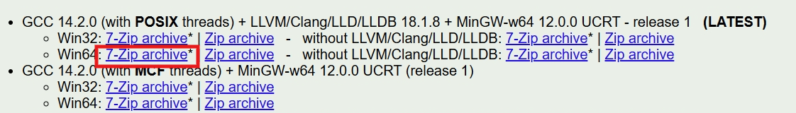
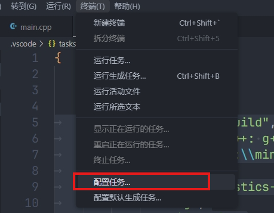
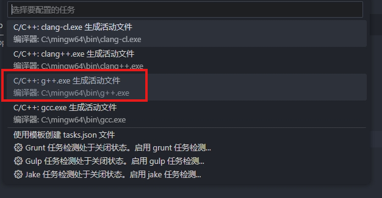
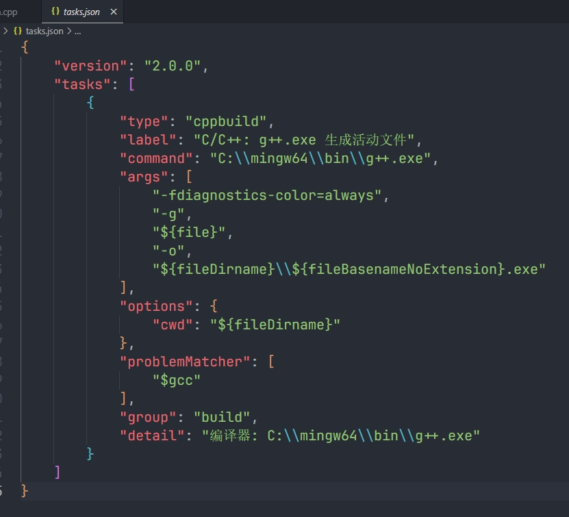
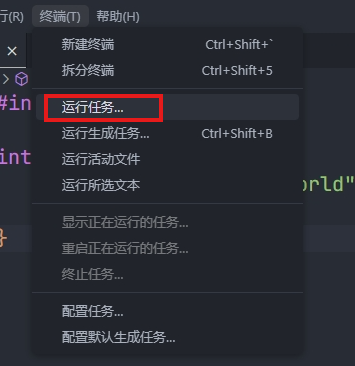
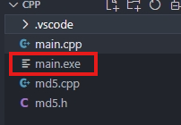
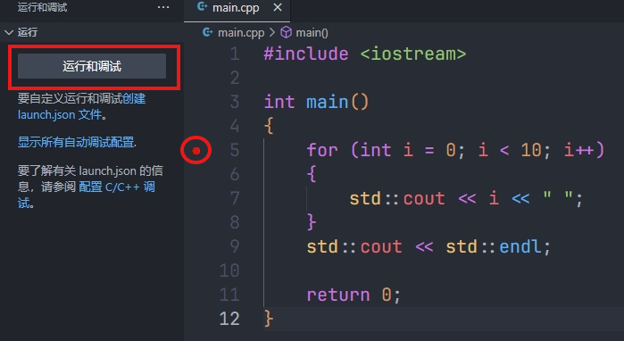
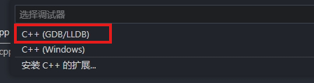
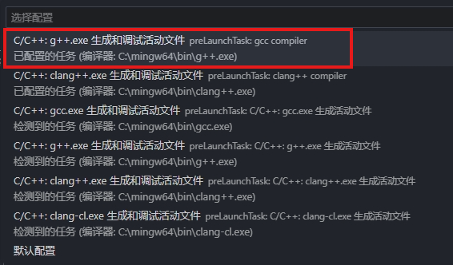

# 下载编译器
- gcc，clang下载：[WinLibs - GCC+MinGW-w64 compiler for Windows](https://winlibs.com/)

- msvc下载：[Microsoft C++ 生成工具 - Visual Studio](https://visualstudio.microsoft.com/zh-hans/visual-cpp-build-tools/)

- 测试安装是否成功`g++ --version`，`clang++ --version`
- 路径添加环境变量`C:\mingw64\bin`
# 单文件编译
- VScode中选择菜单命令：终端->配置任务

- 然后选择编译器，这里gcc选择g++，clang的话选择clang++

- 此时会生成一个任务配置文件`tasks.json`

- 可修改此文件中的标签选项`"label": "gcc compiler",`，使其便于识别；新增参数`"-std=c++20",`使其支持C++20。
```json
{
	"version": "2.0.0",
	"tasks": [
		{
			"type": "cppbuild", // 定义任务类型为 cppbuild，这适用于 C++ 构建任务
			"label": "gcc compiler", // 任务名称，用于在 VS Code 中识别该任务
			"command": "C:\\mingw64\\bin\\g++.exe", // 明确指定了 MinGW-w64 中的 g++ 编译器路径
			"args": [
				"-fdiagnostics-color=always", // 启用彩色诊断信息，方便在终端中查看错误和警告
				"-g", // 生成调试信息，用于调试
				"-std=c++20", // 使用 C++20 标准
				"${file}", // 当前文件作为输入源文件
				"-o",
				"${fileDirname}\\${fileBasenameNoExtension}.exe" // 输出可执行文件，名称与源文件相同
			],
			"options": {
				"cwd": "${fileDirname}" // 设置工作目录为当前文件所在目录
			},
			"problemMatcher": [
				"$gcc" // 使用内置的 GCC 错误匹配器来捕捉编译器输出中的错误信息
			],
			"group": "build", // 将此任务归类为构建任务
			"detail": "编译器: C:\\mingw64\\bin\\g++.exe" // 对任务的详细描述，方便理解任务的作用
		}
	]
}
```
- 此时即可编译CPP文件，VScode中选择菜单命令：终端->运行任务

- 此时会在目录下生成一个exe文件，编译完成

- 此时，即可运行文件，在终端中输入`.\main.exe`，即能运行文件

# 调试
- 在代码中打断点，点击运行和调试

- 选择gbd调试器和GCC编译器


- 此时，可以开始调试了。
# 多文件编译
## 命令行多文件编译
- 头文件引入`#include "yourfile.h"`
	- 一般会在`yourfile.h`中声明,在`yourfile.cpp`中定义
- 编译命令：`g++ -o main.exe main.cpp yourfile.cpp`，该命令实际为两步：
	- 将cpp文件生成object文件：`g++ -c main.cpp yourfile.cpp`，会生成main.o和yourfile.o文件
	- 将object文件链接生成二进制文件：`g++ -o main.exe main.o yourfile.o`，会生成main.exe二进制文件。
- 其中，在GCC编译器中，`-c` 和 `-o` 都是选项的缩写：
	1. **`-c`**：表示 **compile**，即“编译”的意思。这个选项告诉编译器只进行编译而不进行链接，生成目标文件（`.o` 文件）。
	2. **`-o`**：表示 **output**，即“输出”的意思。这个选项用于指定编译后的输出文件名。
- 执行程序
- `./main.exe`，可执行该程序，**`./`**：代表当前目录。
## 通过run task编译多文件
- 修改task.json文件，在args中
	-  `"${file}",`改为`"${workspaceFolder}\\*.cpp"`
	- `"${fileDirname}\\${fileBasenameNoExtension}.exe"`改为`"${workspaceFolder}\\main.exe"`
### 案例
```json
{
	"version": "2.0.0",
	"tasks": [
		{
			"type": "cppbuild", // 任务类型为 C++ 构建
			"label": "gcc compiler", // 任务标签
			"command": "C:\\mingw64\\bin\\g++.exe", // 指定 MinGW-w64 的 g++ 编译器路径
			"args": [
				"-fdiagnostics-color=always", // 彩色输出诊断信息
				"-g", // 生成调试信息
				"-std=c++20", // 使用 C++20 标准
				"${workspaceFolder}\\*.cpp", // 编译工作区中的所有 .cpp 文件
				"-o",
				"${workspaceFolder}\\${fileBasenameNoExtension}.exe" // 将所有cpp 文件链接生成当前打开文件名.exe
			],
			"options": {
				"cwd": "${workspaceFolder}" // 设置工作目录为工作区根目录
			},
			"problemMatcher": [
				"$gcc" // 使用 GCC 的错误匹配器
			],
			"group": "build", // 设置为构建任务
			"detail": "编译器: C:\\mingw64\\bin\\g++.exe" // 任务的详细描述
		}
	]
}
```
# 中文乱码问题
## 原因
出现这个现象的原因是因为编码方式的不同。（VScode的默认编码方式为UTF-8，中国地区下cmd的编码方式GBK）
因为VScode终端调用的是cmd，两者编码方式的不同的就导致了中文乱码的问题。
所以我们解决乱码的方式，就是将两者的编码方式统一，要么将两者都统一为UTF-8，要么统一为GBK
## 解决方案
### 查看cmd编码方式
使用chcp命令可以查看cmd的编码方式，直接在当前文件夹目录下，输入：chcp
**说明：**
1. **GBK2312**代码页编号为**936**
2. **UTF-8**代码页编号为**65001**
### 修改编码方式
**1. 改成UTF-8编码，输入：chcp 65001，回车**