**“** 本文旨在为初学者和高级开发者提供全方位的 Git 版本管理教程，从基础概念到高级技巧，由浅入深地讲解 Git 的强大功能。Git，作为分布式版本控制系统中的佼佼者，已经成为现代软件开发团队不可或缺的一部分，本文将带你从零开始，逐步掌握 Git 的核心操作，深入了解其工作原理，以及如何在实际项目中高效应用 Git 进行版本控制。**”**

01

# **概述** 

本文分享分布式版本控制工具：Git。本文主要从四个角度进行讲解：

1. git是什么？
    
2. git有什么用？
    
3. 为什么要用git?
    
4. 要学什么？以及怎么用？
    

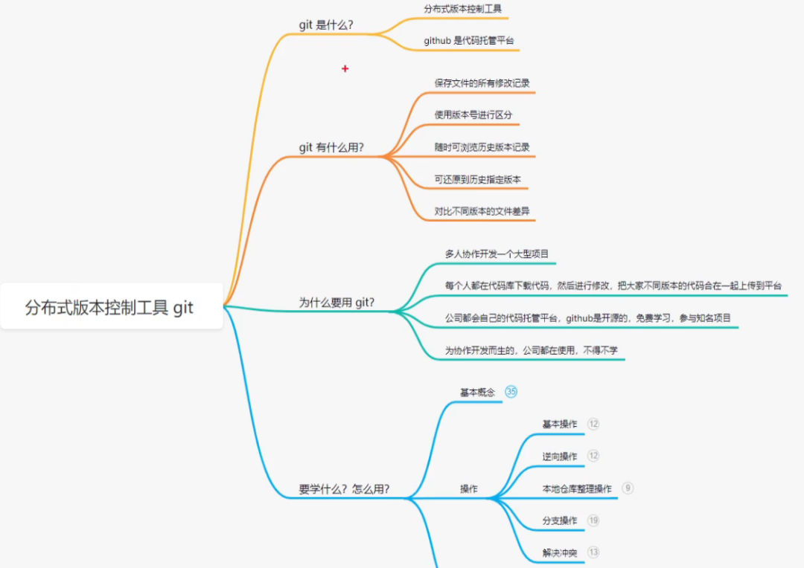

## 1.1、git是什么？

git是一个分布式的版本控制工具，用于跟踪文件的更改，协作开发和管理项目代码。它允许多个开发者协同工作，跟踪代码的修改历史，并在需要时进行回溯或合并。

一提到这个Git工具，马上能联想到一个非常著名的平台：GitHub。GitHub 是一个基于 Git 版本控制系统的代码托管平台。它是一个存储代码的地方，可以通过网络访问并在全球范围内进行协作。GitHub上面有很多优秀的开源框架和代码，我们可以在上面分享代码，和其他开发者协作开发项目。GitHub现在是微软旗下的公司。

除了GitHub，国内还有gitee和gitlab，gitee目前还有一些问题，比如有些私有的项目只能私有，无法开放。

## 1.2、git有什么用？

- `git`可以保存文件的所有修改记录。进行开发的时候，在本地可以保存我们代码，然后上传到服务器中。
    
- 使用版本号进行区分。每次和服务器交互时都会提交一些修改的代码，git会为每一次提交生成版本号，用这个版本号来进行区分每一次的提交。这个版本号在git当中会使用一个`hash`值进行唯一区分；这个`hash`函数使用的是`sha1`（不仅git使用这个`sha1`生成`hash`值，一些著名的软件，如`redis`、`lua`等也是使用`sha1`产生`hash`值）。
    
- 随时可以浏览历史版本记录。协同开发的时候，产生的每次提交都会在git上保存有历史版本信息，根据历史版本信息可以追溯到具体代码提交；以及当代码出现bug时可以根据历史版本锁定bug位置。
    
- 可还原到历史指定版本。当代码出现bug时，可以还原到历史指定的版本。
    
- 对比不同版本之间的文件差异。使用`git diff`工具进行比较文件差异。
    

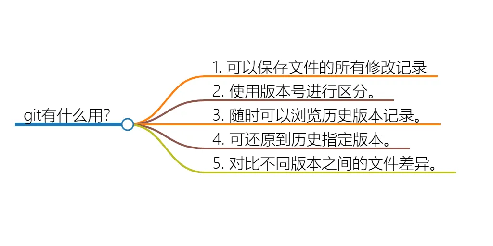

## 1.3、为什么用git？

主要因为Git是目前最热门的分布式版本控制工具。多人协作开发大型项目时，都离不开Git的帮助。使用`git`后每个人具体的工作方式：从代码库下载代码，然后在本地进行修改，最后将每个人不同的代码版本合并到一起，上传到平台上。

一般来说，每个公司都有一个自己的代码托管平台，比如 gitlab。git是为协作开发而生。

`git`的意义：

1. 多人协作开发大型项目。
    
2. 为协作开发而生，大势所趋，公司都在使用。
    
3. 每个人都从代码库下载代码，然后修改，将所有人的代码合并后统一上传到平台。
    
4. 每个公司都有自己的代码托管平台，github是免费的、开源的托管平台。
    

## 1.4、Git与SVN的区别

SVN是一种集中式的版本管理工具：

1. 版本管理有一个中央服务器，可以保存所有代码、文档。
    
2. 每一次的修改都可以提交到版本库，修改有记录，可追踪。
    
3. 不害怕某个同事离职了，代码没有入库。
    
4. 本地的代码流失后，可以从版本库检出。
    
5. 多人协作，每个同事完成的工作提交到版本库，方便进行集成。
    
6. 当我们要开发需求或修复PR时，可以从版本库上拉出分支管理。
    
7. 在大的企业，每次提交都可能触发一次构建，实时检查代码的质量。
    
8. 如果构建失败了，可以自动`revert`掉某次提交。
    

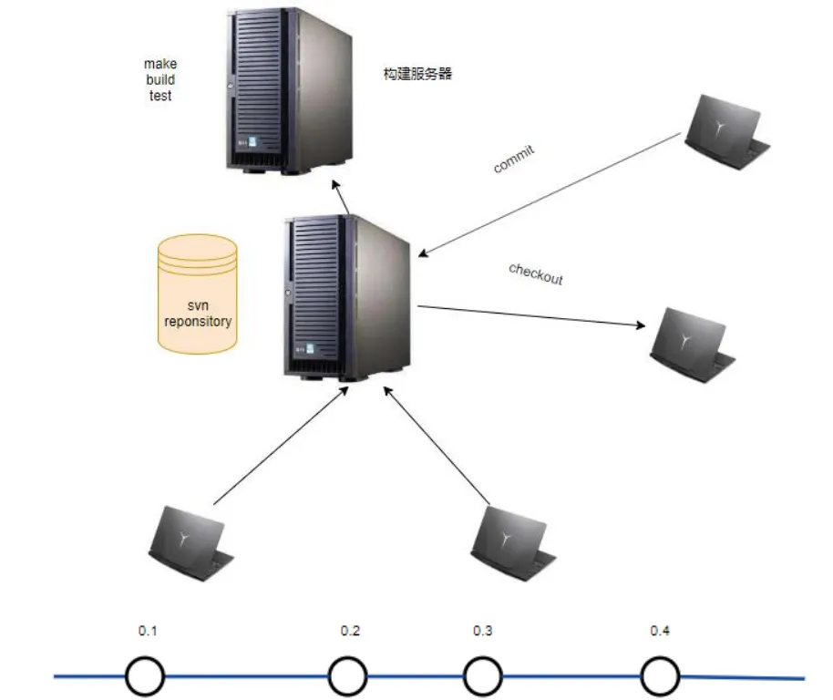

SVN只有一个服务器，部署在远端，本地都是和远端进行交互。而Git是分布式的版本控制工具，除了一个中央服务器进行代码托管之外，本地也会有一个仓库，进行代码提交时，可以先提交到本地仓库，然后根据需要或时机再推送到远端；除了本地推送到远端服务器，还可以进行两台机器之间的本地仓库相互协作，不一定非要跟远端的服务器交互（即Git允许个人之间的互相协作）。

git的仓库主要存储差异文件，存储的数据非常高效。当我们把修改的文件推送到仓库时，仓库会把历史版本文件进行比较，然后存储差异数据。  
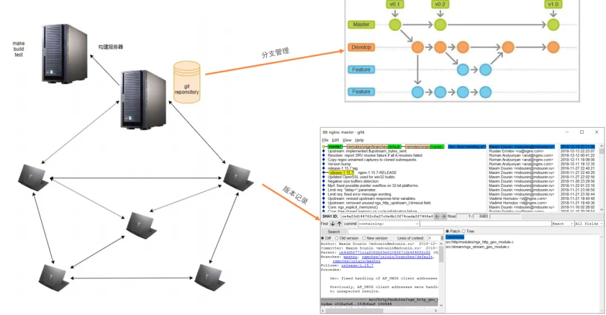

它们的区别：

- 分支管理：Git采用轻量级分支，而SVN每次切换分支需复制整个项目目录。
    
- 合并操作：Git的合并操作相对简单，而SVN合并时可能出现大量的冲突。
    
- 分布式：Git是分布式版本控制系统，而SVN则是集中式系统。
    
- 适用场景：Git更适合大型项目或开源项目的协作，而SVN更适合中小型团队或需要集中式管理的项目。
    
- 版本号：Git没有一个全局的版本号，而SVN有。
    
- 内容存储：Git的内容是按元数据方式存储，而SVN是按文件处理。
    
- 分支：SVN的分支是一个目录，而Git不是。
    

## 1.5、怎么学习Git ？

接下来介绍怎么学习Git。主要从三个维度进行讲解：

1. 基本概念。要了解Git的抽象，它抽象了哪几个环节，那么我们去具体使用的时候，是从哪几个环节去下手的好。
    
2. 操作。包括：
    

- 基本操作；
    
- 逆向操作；即当我们按着顺的方式去操作时，如果出错了，怎么退回来，就是逆向操作。
    
- 本地仓库的整理操作；就是提交代码的时候，我们希望这个提交记录比较美观，并且有条理性，那么我们需要对本地仓库进行一个整理，然后再把它部署到我们的远端服务器。
    
- 分支操作；就是我们怎么跟其他人协作，上面的几点都是我们自己在开发功能，然后提交一些内容，然后做一些修改，那么分支呢，就是我们跟其他的分支跟主分支进行交互，我们把最新的数据推到远端去，或者从远端拉最新的数据到我们本地等等这些分支操作。
    
- 解决冲突；因为多个人同时来开发一个功能的时候呢，可能会产生一些冲突，那么产生冲突我们怎么解决？
    

4. 使用规范。介绍一下在公司当中通常需要使用到的一些规范，这个规范是可以参考的，每一个公司会不一样，但是它们遵遵循的原则都是一样的。  
    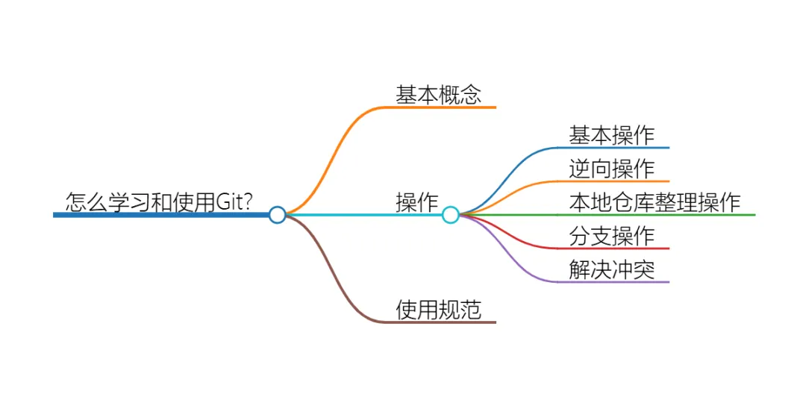
    

  

02

# **安装 Git 和配置 Git 环境** 

## 2.1、Linux上安装git

在linux上建议用二进制的方式来安装 `git`，可以使用发行版包含的基础软件包管理工具来安装，如果你是 CentOS 或者 Fedora 的操作系统，可以使用`yum`命令来安装`git`：

```
sudo yum install git
```

如果你是 ubuntu 或者是 Debian 可以使用`apt-get`的命令来安装`git`：

```
sudo apt-get install git
```

要了解更多选择，Git 官方网站上有在各种 Unix 风格的系统上安装步骤，网址为 http://git-scm.com/download/linux。

## 2.2、Windows上安装Git

在 Windows 上安装 Git 也有几种安装方法。官方版本可以在 Git 官方网站下载。打开http://git-scm.com/download/win，可能会检查你的操作系统是32位的还是64位的，并自动开始下载对应的安装包。如果没有自动下载，可以在页面选择合适的安装包进行安装。

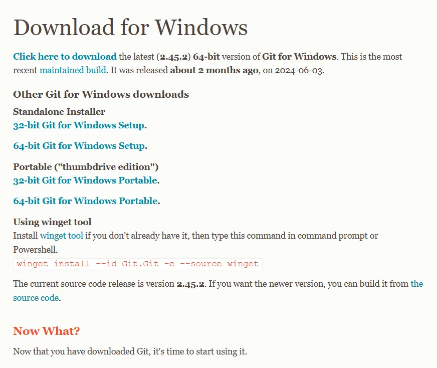

另一个简单的方法是安装 GitHub for Windows。该安装程序包含图形化和命令行版本的 Git。它也能支持Powershell，提供了稳定的凭证缓存和健全的换行设置。你可以在 GitHub for Windows 网站下载，网址为 http://windows.github.com。

## 2.3、MAC上安装git

首先查看电脑是否已经安装git，打开终端输入：`git`，安装过则会输出：

```
MacBook-Pro:~ WENBO$ gitusage: git [--version] [--help] [-C <path>] [-c name=value]        [--exec-path[=<path>]] [--html-path] [--man-path] [--info-path]        [-p | --paginate | --no-pager] [--no-replace-objects] [--bare]        [--git-dir=<path>] [--work-tree=<path>] [--namespace=<name>]        <command> [<args>]These are common Git commands used in various situations:start a working area (see also: git help tutorial)    clone Clone a repository into a new directory    init Create an empty Git repository or reinitialize an existing one
```

方法一：通过homebrew安装git。

1. 首先homebrew： `/usr/bin/ruby -e "$(curl -fsSL https://raw.githubusercontent.com/Homebrew/install/master/install)"`
    
2. 安装git: `brew install git`
    

  

方法二：通过xcode。直接从AppStore安装Xcode，Xcode集成了Git，不过默认没有安装，你需要运行Xcode，选择菜单“Xcode”->“Preferences”，在弹出窗口中找到“Downloads”，选择“Command Line Tools”，点“Install”就可以完成安装了。

## 2.4、配置git

当安装完 Git 应该做的第一件事就是设置你的用户名称与邮件地址。这样做很重要，因为每一个 Git 的提交都会使用这些信息，并且它会写入到你的每一次提交中，不可更改：

```
git config --global user.name "LionLong"git config --global user.email ntf_work@163.com
```

再次强调，如果使用了 `--global` 选项，那么该命令只需要运行一次，因为之后无论你在该系统上做任何事情，Git 都会使用那些信息。当你想针对特定项目使用不同的用户名称与邮件地址时，可以在那个项目目录下运行没有 `--global` 选项的命令来配置。

很多 GUI 工具都会在第一次运行时帮助你配置这些信息。你也可以使用`git config --list`来查看`git`的所有配置。

## 2.5、获取帮助

若使用 Git 时需要获取帮助，有三种方法可以找到 Git 命令的使用手册：

```
git help <verb>git <verb> --helpman git-<verb>
```

例如，要想获得 config 命令的手册，执行：

```
git help config
```

当然，如果遇到问题也可以查看git的官方文档https://git-scm.com/book/zh/v2。

03

# **基本概念** 

接下来介绍Git的一些基本概念。

## 3.1、创建仓库

首先要理解仓库的概念。什么是仓库呢？就是可以用`git`管理的一个目录，这个仓库里所有的文件的改动（增加 / 修改 / 删除）都由`git`跟踪记录。也能通过`git`查看所有的记录，当然也能够通过`git`“还原”到某个记录点。

仓库可以把它想象成一个文件数据库，这个仓库分为两个仓库：一个是远端仓库，一个是我们的本地仓库。

如何创建一个仓库呢？

1. 首先创建一个目录：`mkdir mysql_test`
    
2. 然后进入这个目录：`cd mysql_test`
    
3. 初始化一个空的仓库：`git init`
    

  

上面三个步骤就可以创建一个空的仓库了，这个时候会在仓库目录下多了一个`.git`目录，`.git`目录里由很多关于`git`管理的文件，这里面的东西不用我们管，没事也别去瞎折腾。

如果是创建远端仓库，在第三步初始化时一般都会使用`--bare`参数来初始化成一个裸仓库。例如：

```
git init --bare
```

输出：

```
Initialized empty Git repository in /home/fly/mathlib/
```

这样就初始化成一个空的裸仓库了。那什么是裸仓库？裸仓库表示目里面不会出现任何代码，只有一些版本信息、分支管理信息、配置相关等内容。这些东西一般不需要特别的关注，我们后面提交代码时这个目录的内容也不会产生过多的变化（即不会产生具体的代码）。

```
$ lltotal 32Kdrwxrwxr-x 2 fly fly 4.0K Jul 26 20: 10 branches-rw-rw-r-- 1 fly fly   66 Jul 26 20: 10 config-rw-rw-r-- 1 fly fly   73 Jul 26 20: 10 description-rw-rw-r-- 1 fly fly   23 Jul 26 20: 10 HEADdrwxrwxr-x 2 fly fly 4.0K Jul 26 20: 10 hooksdrwxrwxr-x 2 fly fly 4.0K Jul 26 20: 10 infodrwxrwxr-x 4 fly fly 4.0K Jul 26 20: 10 objectsdrwxrwxr-x 4 fly fly 4.0K Jul 26 20: 10 refs
```

如果服务器不小心泄露了，让别人拿到这个裸仓库内容，他也做不了什么，因为完全看不到我们的源代码，这样我们的代码是安全的。所以，裸仓库算是为了代码安全设计的。这就是为什么远端服务器使用的是裸仓库的重要原因。

注意，一旦创建了远端仓库之后，一般是本地仓库去与远端仓库进行交互。交互过程中Git会为远端仓库创建一个别名：`origin`。这个别名其实是远端仓库的一些地址，我们只需要记住这个别名即可。

接下来演示如何创建一些本地仓库。

1. 创建一个目录：`mkdir gitsrc`
    
2. 获取远端地址。
    
3. 拉取远端代码。`git clone ....`
    

  

有了仓库之后，就可以使用`git add`和`git commit`向仓库添加要跟踪的文件，和提交修改的内容了。

## 3.2、安全通信与协议

本地与远端交互的时候，需要遵循相同的协议。有四个协议可以用于交互：

- HTTP：使用HTTP协议进行Git操作时，由于其开放性与广泛支持，使得Git可以直接通过网页浏览器或简单的HTTP客户端进行访问。HTTP的广泛可用性意味着可以使用各种在线工具或服务器来进行Git操作，但同时也意味着可能需要额外的服务器配置来处理身份验证、SSL安全以及可能的防火墙限制。
    
- HTTPS：HTTPS是HTTP的加密版本，使用SSL/TLS协议来加密数据传输，确保了数据在从本地到远程仓库或从远程仓库到本地的传输过程中不被第三方截取或篡改。HTTPS提供了更高的安全性，是如今Web服务中数据传输的首选方式。在Git中使用HTTPS时，通常需要一个公钥和私钥对，公钥用于服务器验证，私钥则用于客户端身份验证和加密数据。
    
- SSH（Secure Shell）：SSH协议主要用于在两个计算机之间提供网络安全的通信。在Git中，SSH被用来安全地进行代码的远程传输，尤其适用于需要通过SSH密钥进行身份验证的情况，这种验证方式更加安全且无需输入用户名和密码。SSH协议通过端口22进行通信，提供了在用户认证、文件传输、远程命令执行等多个方面上的安全连接。
    
- Git：这是Git本身提供的协议，主要用于在Git仓库间进行快照和差异的存储和传输。Git协议是专为版本控制而设计的，它使用一种称为“轻量级的传输协议”（LWTP），能够有效地进行快照存储、分支和合并等功能。相比于HTTP和HTTPS，Git协议在进行版本控制时更加高效和直接，能够更好地处理分支和合并等特性，而无需通过外部协议进行数据传输。
    

  

本地仓库和远端仓库交互的时候是基于TCP进行数据交互的，那么就需要一个上层协议来完成，比较常用的是SSH协议。使用SSH协议的原因是因为通用的服务器默认都安装有SSH服务器。

  

接下来了解一下如何使用SSH协议来让本地仓库和远端仓库进行交互。SSH协议是一个验证授权的网络协议，使用非对称的加密方式。SSH 生成密钥的时候会产生公钥和私钥，通常需要将公钥放到远端仓库服务器，然后在每次发送数据时以私钥的方式进行验证，这样一来远端仓库和本地仓库交互就比较的安全。

那么，怎么生成 SSH 公钥和私钥呢？ 可以使用如下命令生成：

```
ssh-keygen –t rsa
```

这个命令后面一路按回车就行了。

那默认的公钥和私钥在哪个位置呢？  
一般是在用户 家目录（Windows是`C\用户\用户名\`，Linux是`\home\用户名\`）下的`.ssh`目录里，有一个公钥文件`id_rsa.pub`和一个私钥文件`id_rsa`。通常需要将公钥文件`id_rsa.pub`里的内容复制拷贝到目标服务器中；这时候需要找到目标服务器`\home\用户名\.ssh`目录的`authorized_keys`文件（如果没有这个文件就自己新建一个），然后把公钥的内容拷贝到里面并保存就可以了。

这样一来，本地仓库就可以通过SSH免密登录远端仓库进行交互了。之后就可以通过 SSH协议 + 远端仓库的用户名 + 远端机器的IP地址 + 具体的仓库路径 拉取代码到本地了。

要想拉取远端代码到本地，就需要使用`git clone`命令，这个命令需要指定具体的协议，示例如下：

```
git clone ssh://fly@192.168.31.91:/home/fly/srcs
```

这时，会生成对应的目录，并且在该目录下会有一个`.git`的文件夹，这个`.git`的文件夹就是本地仓库。  
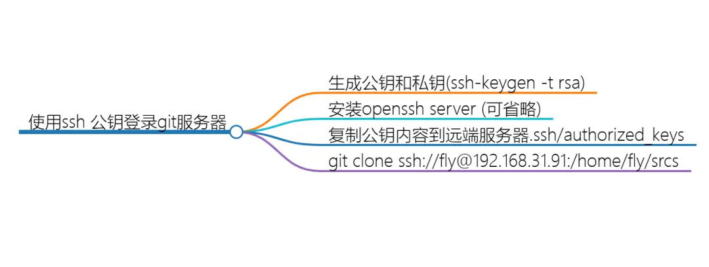 
拉完远端仓库到本地之后，通常需要设置用户名和邮箱，因为提交代码到远端仓库的时候，git需要在服务器记录是谁在什么时候提交的哪个版本。

设置用户名和邮箱主要使用`git config`命令，这个命令有全局的设置方式（通过`--global`参数）和局部的设置方式。比如，本地的设置方式：

```
git config user.name "LionLong"git config user.email ntf_work@163.com
```

这个设置 git 一般是不会去验证的。注意，如果没有`--global`参数，设置的是当前目录的用户名和邮箱地址，只在当前目录有效；一般保存在`.git\config`文件下。

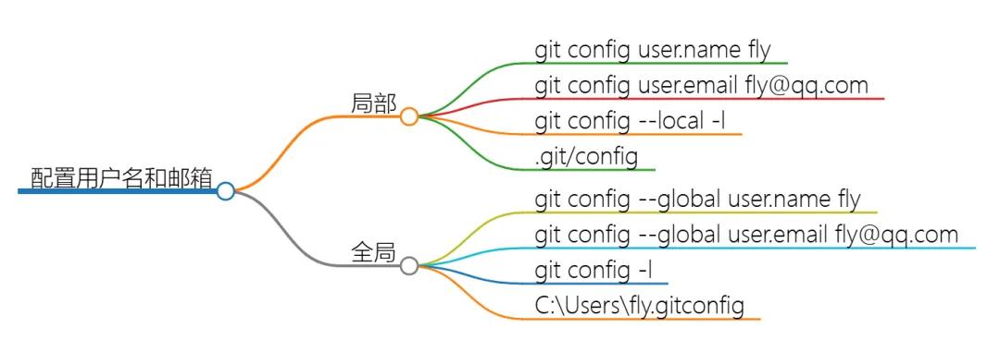

## 3.3、Git 服务器搭建与操作

虽然说git是一个分布式的版本管理工具，不像 SVN 那样离开了中央服务器的仓库就干不了活了，但是如果有个中央服务器存在，还是方便了多人之间的协作。  
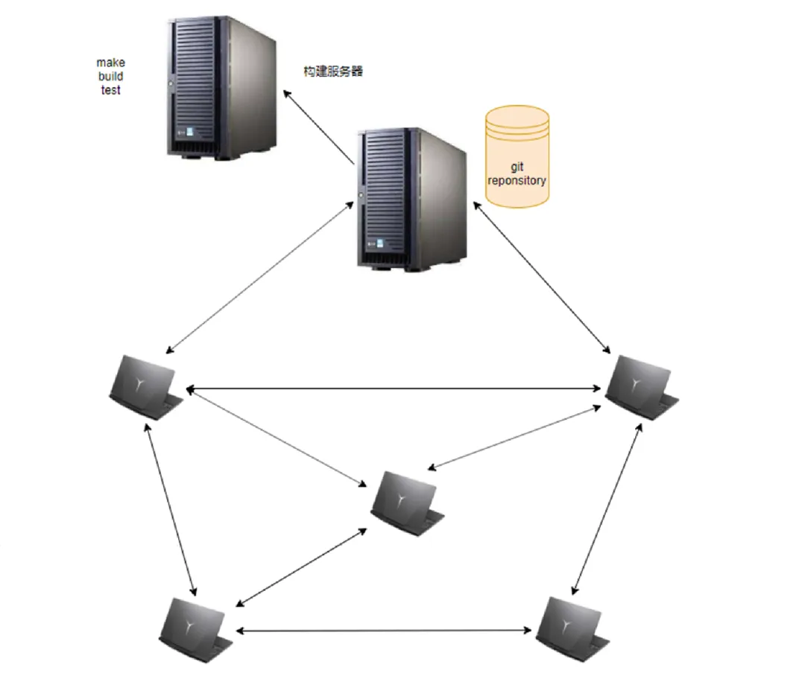 
那如何创建git的中央服务器呢？

1. 创建git账号和git用户组。
    
    ```
    $ sudo adduser git  #添加git用户$ sudo passwd git   #添加git的密码$ sudo groupadd git #添加git用户组$ sudo usermod -G git git #添加git用户到git用户组
    ```
    
2. 创建git仓库。
    
    ```
    $ cd /srv            # srv目录下存放git的仓库$ mkdir src-docs.git # 创建src-docs.git目录$ cd src-docs.git$ git init --bare    # bare选项指示该仓库为裸仓库$ sudo chown -R git:git /srv/src-docs.git # 修改权限为git用户
    ```
    
3. 禁止git用户登录shell，这样git通过sh服务登录会被拒绝。
    
    ```
    chsh git
    ```
    
4. 克隆远程仓库。比如在我的windows电脑上打开git bash shell，输入：
    
    ```
    git clone git@192.106.79.26:/srv/src-docs.git
    ```
    
    即clone命令为：`git clone git@<您的 CVM IP 地址>:git仓库路径`。在这个过程中需要输入用户名和密码，可以通过rsa认证的方式省略掉密码的输入。
    
5. 免密输入的配置。就是通过rsa认证，生成公钥和私钥，然后把客户端的公钥告诉git服务器，具体步骤如下：
    

- 在客户端机器上，比如我在windows机器上已经配置用户名和密码，见上一章的git配置说明。
    
- 然后打开`git bash shell`，生成rsa的秘钥对，`ssh-keygen –t rsa`命令后一路按回车，此时会在`C:/Users/fly/.ssh/`目录下生成`id_rsa.pub`和`id_rsa`文件，`id_rsa.pub`是公钥文件，`id_rsa`是私钥文件。
    
- 在git服务器上的仓库路径执行`ssh-keygen –t rsa`和`touch authorized_keys`，然后把客户端的`id_rsa.pub`追加到这个文件里。这样后，我们就不需要每次都输入git密码了。
    

看起来很复杂，其实一点也不，简单概述就是：

1. 创建远端仓库。
    
2. 指定协议，通常是SSH协议。
    
3. 设置免密。
    
4. 配置用户名和密码。
    

## 3.4、Git 工作流程与原理

下面这张图就是 Git 的整个工作流程，也是 Git 抽象出来的几个概念。  
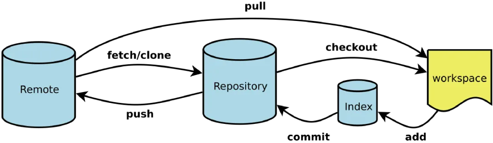 
Git 的四个区域：

- `workspace`：本地工作区，就是你平时存放项目代码的地方。比如你拉取代码`git clone ssh://fly@192.168.31.91:/home/fly/srcs`，`srcs`目录就是本地工作区了。开发者就在工作区里写代码。
    
- `Index / Stage`：暂存区，用于临时存放你的改动，事实上它只是一个文件，保存即将提交到文件列表信息。值得一提的是，SVN 是没有暂存区概念的。暂存区允许把多次修改统一放在暂存区中，然后再由暂存区统一提交到本地仓库，确保提交记录清晰。
    
- `Repository`：本地仓库区（或版本库），就是安全存放数据的位置，这里面有你提交到所有版本的数据。其中`HEAD`指向最新放入仓库的版本。
    
- `Remote`：远程仓库，托管代码的服务器，可以简单的认为是你项目组中的一台电脑用于远程数据交换。
    

  

Git 的工作流程 一般是这样的：  
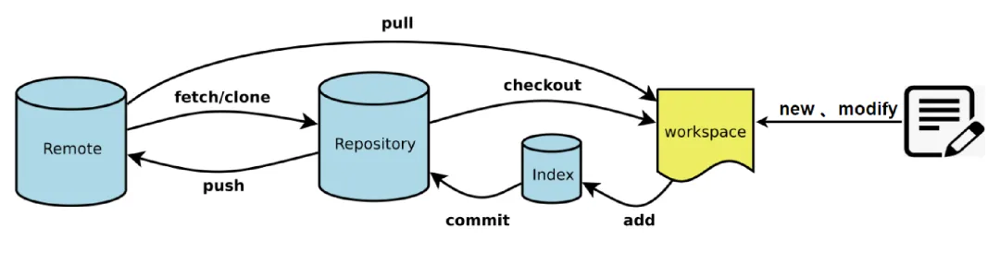

1. 在工作区目录中添加、修改文件；产生数据变更。
    
2. 将需要进行版本管理的文件`add`到暂存区域；
    
3. 将暂存区域的文件`commit`到`git`仓库；
    
4. 本地的修改`push`到远程仓库，如果失败则执行第5步；
    
5. `git pull`将远程仓库的修改拉取到本地，如果有冲突需要修改冲突，回到第三步。
    

因此，git管理的文件至少有三种状态：已修改（modified）、已暂存（staged）、已提交(committed)。

开发者在工作区修改文件，然后把工作区修改的文件 暂存 到 暂存区，再使用`git commit`命令将暂存区的内容提交到本地仓库，`git commit`命令一般要加`-m`参数告诉 Git 当前是提交的什么内容；最后通过`git push origin master`命令推送到远端仓库。

可以使用`git status`查看工作区的文件状态。文件主要有四种状态：  
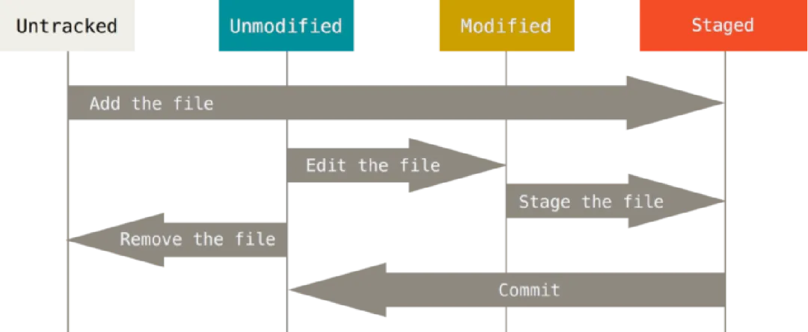

- `Untracked`：未追踪的文件，此文件在文件夹中，但并没有加入到git库，不参与版本控制。即Git还没有管理的文件。要想让文件变成被 Git 管理，需要将文件添加到暂存区，即使用`git add`命令将状态变为`Staged`。
    
- `Unmodify`：文件已经入库且未修改, 即版本库中的文件快照内容与文件夹中完全一致，这种类型的文件有两种去处，如果它被修改， 而变为`Modified`，如果使用`git rm`移出版本库, 则成为`Untracked`文件。
    
- `Modified`：文件已修改，仅仅是修改，并没有进行其他的操作，这个文件也有两个去处，通过`git add`可进入暂存`staged`状态，使用`git checkout` 则丢弃修改，返回到`unmodify`状态, 这个`git checkout`即从库中取出文件，覆盖当前修改。
    
- `Staged`：暂存状态，执行`git commit`则将修改同步到库中，这时库中的文件和本地文件又变为一致，文件为`Unmodify`状态。
    
- `new file`：新建的文件，并且加入了 Git 暂存区管理。
    

## 3.5、Git日志与操作

可以使用`git log`命令查看提交日志，例如：

```
$ git logcommit 4b16e0b15c412e977d95a122f4b16e0b15c412e9 (HEAD -> master, origin/master)Author: fly <fly@qq.com>Date:   Tue Ju1 26 20:28:18 2022 +0800    feat:add func
```

可以注意到，有一个40位的`hash`值`4b16e0b15c412e977d95a122f4b16e0b15c412e9` （`hash`值是通过`sha1`函数来生成的），这个值就是当次提交生成的唯一标识ID，这个唯一标识ID也称为版本号。通常可以通过这个版本号查到是哪一次提交。

除了40位的`hash`值，还有一个`HEAD`也是需要注意的，`HEAD`是当前检出记录的符号引用，可以理解为一个指针，也可以理解为一个引用。因为是协作开发，所以通常会有一个很长的提交记录（即提交序列或列表），`HEAD`就是一个指向最近一次提交的指针。上述例子中`HEAD`指向`master`，同时和`origin/master`是在相同位置。如果我们需要获取任何一个版本的信息，就可以以`HEAD`作为基本依据，往前推几个版本。

回顾工作区、暂存区和仓库的概念：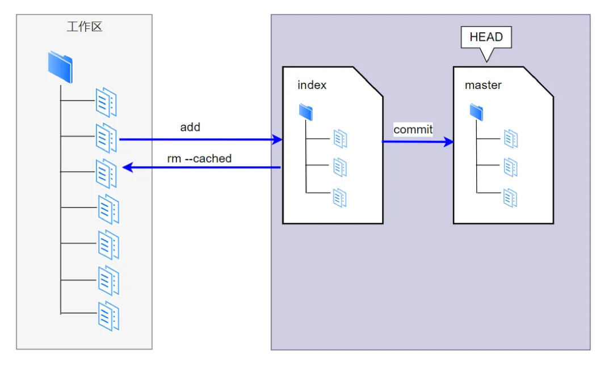

  

04

# **Git 常用操作命令** 

## 4.1、暂存：git add

在仓库里刚新建的文件是不会被跟踪起来的，比如我们使用`git status`就能查看到文件的状态。  
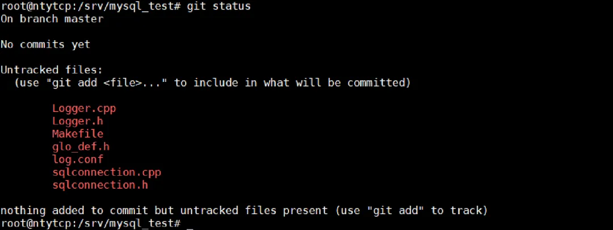 
需要使用`git add`才可以把本地修改的数据暂存到暂存区。暂存区的作用：像 SVN 这种没有暂存区概念的版本控制，可能会产生很多无意义的提交，暂存区可以先将一些修改暂存一下，后面再统一提交到仓库，从而减少提交次数。

基本用法：

```
git add <path>
```

通过`git add <path>`的方式把`path`目录下的所有文件添加到`git`的暂存区，当然这些文件不包含已经被删除的文件。  
示例：

```
# 将所有修改添加到暂存区git add .  # 将以.cpp结尾的文件的所有修改添加到暂存区git add *.cpp   # 将所有以Hello开头的文件的修改添加到暂存区，例如: helloWorld.txt,hello.h,helloGit.md ...git add hello*   # 将以hello开头后面只有一位的文件提交到暂存区 # 例如:hello1.txt,helloA.cpp 如果是helloGit.txt和hello.cxx是不会被添加的。git add hello?.*
```

`git add` 是把文件添加到暂存区，那如果想从暂存区删除呢？可以使用`git rm -f` 或者 `git rm –cached` 把文件从暂存区里移除，这个移除并不是把代码文件从磁盘上删除了，只是说不被`git`管理了而已。  
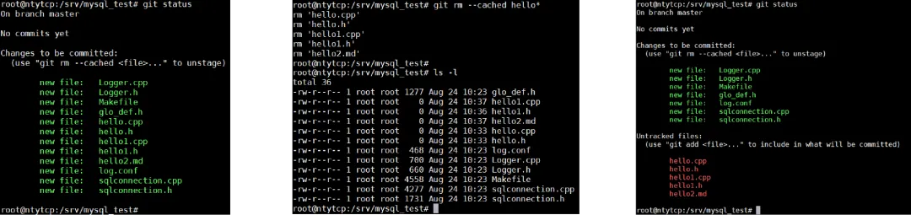

## 4.2、提交：git commit

`git add` 只是把文件添加到暂存区而已，并没有真正跟踪起来，需要使用`git commit`命令提交到本地仓库才能真正被`git`跟踪记录，`git commit`命令的用法如下：  
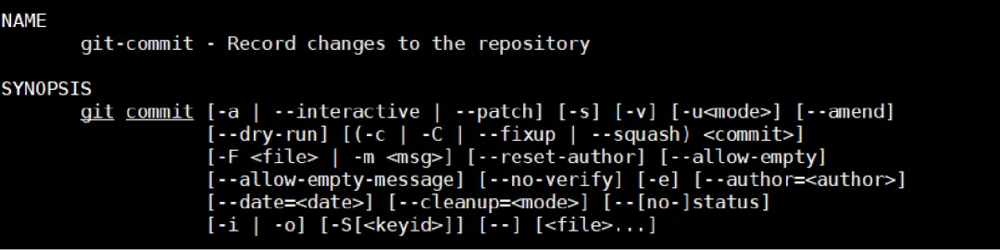 
示例：

```
#把暂存区和当前已被跟踪的文件的所有的修改提交到仓库里，-m参数指定了此次提交的message内容git commit -a -m "initial commit" .# 提交Makefile和Logger.cpp的修改git commit Makefile Logger.cpp –m "修改编译错误，添加了对log4cpp库的依赖" 
```

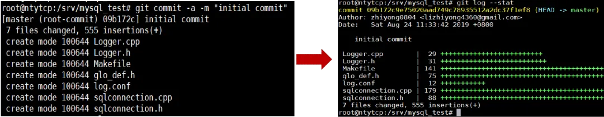

## 4.3、拉取、拉取合并

拉取（`git fetch`）：`fetch`是拉取的意思，`git fetch`只将远端仓库数据拉取到本地仓库，主要是 将远程仓库所包含分支的最新`commit-id`记录到本地文件。比如，远端的数据比本地多两个版本，`fetch`会将最新版本的版本ID写到本地仓库，但是，远端的文件修改并没有拉取到工作区（workspace），它只是拉取最近提交的信息出来，通过这个可以让我们知道本地比远端落后几个版本。

`git fetch`通常很少去使用，因为在实际使用中会使用一个有GUI的客户端工具，并不需要敲命令。这里介绍`git fetch`命令以及其他命令主要是为了了解 Git 的工作流程。

拉取合并：`git pull`直接将数据拉取到工作区（workspace）。它主要由两部分构成：

- `git fetch`：先拉取，看一下本地仓库落后多少个版本信息。
    
- `git merge` ：将数据拉取到工作区。
    

也就是说，别人修改的代码，我们可以先`git fetch`到本地仓库，然后`git merge`拉取到工作区；也可以通过一个命令`git pull`一起完成这两个操作。

## 4.4、推送：git push

`git push` 用于将本地仓库中的更改推送到远程仓库。这个命令将本地分支的提交（commits）上传到远程仓库，从而使其他协作者能够看到并合并这些更改。

基本语法：

```
git push [<remote>] [<branch>]
```

- `<remote>`: 远程仓库的名字，通常是 `origin`（默认远程仓库的名字）。
    
- `<branch>`: 想推送的本地分支名。
    

  

示例：

1. 推送到默认远程仓库（origin）和当前分支：
    
    ```
    git push
    ```
    
    如果当前分支已经配置了上游分支（upstream branch），这个命令会将更改推送到默认远程仓库的对应分支。
    
2. 推送到指定的远程仓库和分支：
    
    ```
    git push origin main
    ```
    
    将本地的 `main` 分支推送到远程的 `main` 分支。
    
3. 推送所有本地分支：
    
    ```
    git push --all
    ```
    
    将所有本地分支推送到远程仓库。
    
4. 推送所有标签（tags）：
    
    ```
    git push --tags
    ```
    
    将所有本地标签推送到远程仓库。
    

常见选项：

- -u 或 --set-upstream：将本地分支与远程分支关联起来，后续可以只用 git push 或 git pull 不指定分支。
    
    ```
    git push -u origin feature-branch
    ```
    
- --force 或 -f：强制推送，覆盖远程仓库的历史记录。注意使用这个选项时要非常小心，因为这可能会导致数据丢失。
    
    ```
    git push --force
    ```
    
- --force-with-lease：在强制推送时确保不会覆盖别人推送的更改。相对比 --force 更安全一些。
    
    ```
    git push --force-with-lease
    ```
    
- --dry-run：模拟推送操作，不真正推送任何更改，适用于检查即将推送的内容。
    
    ```
    git push --dry-run
    ```
    

错误处理：

- rejected 错误：通常是因为远程分支比本地分支有更新，可能需要先拉取远程更改并解决冲突。
    
- non-fast-forward 错误：通常需要进行合并或变基操作。
    
    ```
    git pull --rebasegit push
    ```
    

## 4.5、查看状态：git status

`git status` 是 Git 中一个非常有用的命令，用于显示当前工作目录和暂存区的状态。这有助于了解哪些文件被修改了、哪些文件被暂存了、以及哪些文件是未跟踪的。

基本语法：

```
git status
```

执行 `git status` 后，会看到以下几类信息：

1. 当前分支信息：显示你当前所在的分支以及它与远程分支的关系（例如，是否领先或落后于远程分支）。
    
    ```
    On branch mainYour branch is up to date with 'origin/main'.
    ```
    
2. 暂存区状态：显示哪些文件被暂存（即已准备好进行提交）。
    
    ```
    Changes to be committed:  (use "git reset HEAD <file>..." to unstage)    new file:   file1.txt  modified:   file2.txt
    ```
    
3. 工作目录状态：显示哪些文件被修改但尚未暂存。
    
    ```
    Changes not staged for commit:  (use "git add <file>..." to update what will be committed)  (use "git restore <file>..." to discard changes in working directory)    modified:   file3.txt
    ```
    
4. 未跟踪的文件：显示哪些文件存在于工作目录中，但 Git 还没有跟踪它们。
    
    ```
    Untracked files:  (use "git add <file>..." to include in what will be committed)    file4.txt
    ```
    

常见选项：

- -s 或 --short：以简短的格式显示状态。
    
    ```
    git status -s
    ```
    
    输出类似于：
    
    ```
    A  file1.txtM  file2.txtM  file3.txt?? file4.txt
    ```
    
    这里的 `A` 表示新文件已暂存，`M` 表示修改已暂存，`??` 表示未跟踪的文件。
    
- -b 或 --branch：显示分支信息。
    
    ```
    git status -b
    ```
    
    输出类似于：
    
    ```
    On branch mainYour branch is up to date with 'origin/main'.
    ```
    
- --porcelain：以机器可读的格式输出状态信息，通常用于脚本。
    
    ```
    git status --porcelain
    ```
    

如果工作目录中有很多未跟踪的文件或修改，可以考虑使用 `git clean` 或 `git restore` 命令来清理。

## 4.6、查看历史：git log

`git log` 是 Git 中一个非常重要的命令，用于查看提交历史。它显示了当前分支的提交记录，帮助了解代码的演变过程。

基本语法：

```
git log [options] [<revision range>] [--] [<path>...]
```

- `<revision range>`: 可以指定一个或多个提交范围。
    
- `<path>`: 仅显示特定路径的提交记录。
    

基本用法：

1. 查看提交历史：
    
    ```
    git log
    ```
    
    这将显示当前分支的所有提交记录，包括提交的哈希值、作者、日期和提交信息。
    
2. 查看简洁的提交历史：
    
    ```
    git log --oneline
    ```
    
    以简洁的一行格式显示提交记录，每个提交显示其简短的哈希值和提交信息。
    
3. 查看特定文件的提交历史：
    
    ```
    git log -- <file>
    ```
    
    显示对指定文件的所有提交记录。
    
4. 查看某个分支的提交历史：
    
    ```
    git log branch-name
    ```
    
    显示指定分支的提交记录。
    

常见选项：

- --pretty: 自定义日志的输出格式。
    
    ```
    git log --pretty=format:"%h - %an, %ar : %s"
    ```
    
    这将以自定义格式显示提交记录，其中 `%h` 是提交的简短哈希， `%an` 是作者名， `%ar` 是相对时间， `%s` 是提交信息。
    
- --graph: 显示提交历史的图形化表示。
    
    ```
    git log --graph
    ```
    
    这将以图形化的方式展示提交历史和分支合并情况。
    
- --abbrev-commit: 显示简短的提交哈希。
    
    ```
    git log --abbrev-commit
    ```
    
    这会显示缩短的提交哈希值，而不是完整的哈希值。
    
- --since 和 --until: 显示指定时间范围内的提交记录。
    
    ```
    git log --since="2024-01-01" --until="2024-07-01"
    ```
    
    只显示在指定时间范围内的提交记录。
    
- --author: 显示由特定作者提交的记录。
    
    ```
    git log --author="John Doe"
    ```
    
    只显示指定作者的提交记录。
    
- --grep: 按提交信息的关键词过滤记录。
    
    ```
    git log --grep="fix bug"
    ```
    
    只显示包含指定关键词的提交记录。
    
- --patch: 显示每个提交的差异（diff）。
    
    ```
    git log -p
    ```
    
    显示每个提交中修改的具体内容。
    

高级用法：

- 查看合并提交历史： 只显示合并提交的记录。
    
    ```
    git log --merges
    ```
    
- 查看特定分支的提交历史：
    
    ```
    git log branch1..branch2
    ```
    
    显示从 `branch1` 到 `branch2` 的提交记录，即 `branch2` 上而不在 `branch1` 上的提交记录。
    
- 结合多个选项使用：
    
    ```
    git log --pretty=format:"%h - %an, %ar : %s" --graph --abbrev-commit
    ```
    
    以自定义格式显示提交记录，并附带图形化表示和简短的哈希值。
    
- 日志文件过长：如果提交历史记录非常长，可以使用分页工具（如 less）来查看：
    
    ```
    git log | less
    ```
    
- 在大项目中，查看提交历史可能会比较慢。可以限制显示的提交数量，例如：
    
    ```
    git log -n 10
    ```
    

## 4.7、引用日志：git reflog

`git reflog` 是 Git 中一个非常重要的命令，用于查看和管理引用日志（reflog）。引用日志记录了对 Git 引用（如分支、HEAD）的所有修改历史，包括提交、合并、重置、移动分支等操作。它在恢复丢失的提交、调试和审计历史方面非常有用。

基本语法：

```
git reflog [options]
```

这将显示 HEAD 的所有历史记录，包括提交、重置、合并等操作。输出内容包括操作编号（reflog index）、提交哈希、操作类型和消息。

也可以查看特定操作的引用日志：

```
git reflog show HEAD@{<n>}
```

这里的 `<n>` 是 `reflog` 的索引。例如，`HEAD@{1}` 表示上一个 `HEAD` 状态。可以用来查看指定历史状态的详细信息。

05

# **Git 的逆向操作** 

## 5.1、什么是逆向操作？

Git 操作流程图：  
  
对于正向操作来说，Git 操作是由 `workspace`进行`add`操作进入`Index`，再`commit`到`Repository`，最后`push`到`Remote`。

但有时候也需要一些逆向操作，比如数据文件已经由 `workspace`进行`add`操作进入`Index`了，但是发现本次提交的数据有些问题，想把它撤回来，即撤到`workspace`中；或者数据文件已经`commit`到`Repository`了，但是，我们想把数据回退，将其回退到`Index`或 `workspace`，甚至删除提交记录等。这就需要逆向操作。

逆向操作思维导图：  
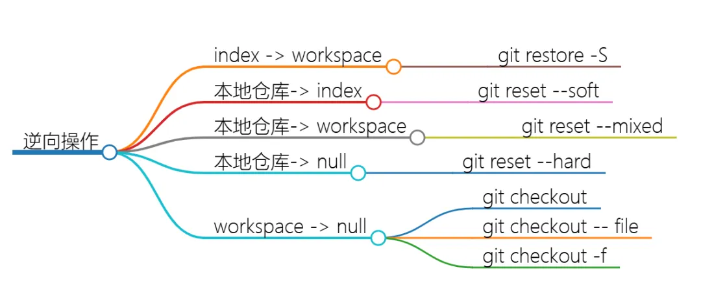

## 5.2、暂存区 到 工作空间

如果数据已经由工作空间（`workspace`）提交（`add`）到暂存区（`Index`）了，现在想要回退，应该怎么操作？

可以使用`git restore -S` 命令，它主要用于将某个文件的状态恢复为指定的状态。

`git restore -S` 的用途：

- 恢复文件状态：可以将文件恢复到某个特定的提交（commit）状态。
    
- 签名验证: 使用 `-S` 选项可以确保恢复的内容经过签名验证，符合安全标准。
    

使用示例：假设有一个文件 `example.cc`，可以使用以下命令将其恢复到指定的提交状态（例如 `abc123`）。

```
git restore -S example.cc
```

这样，原本在暂存区的`example.cc`数据将回退到`Untracked files`状态。

## 5.3、本地仓库 到 暂存区、工作区及清空

如果数据已经由暂存区（`Index`）提交（`commit`）到本地仓库（`Repository`）了，现在想要回退，应该怎么操作？

可以使用`git reset --soft`， `git reset --mixed` 和 `git reset --hard` ，它们的区别在于它们对工作区、暂存区和提交历史的影响程度不同。

1. `git reset --soft`：主要是回退到 暂存区。
    

- 影响范围：仅影响 HEAD 的位置。
    
- 效果：不更改工作区和暂存区的内容，仅仅移动 HEAD 指针。
    
- 适用场景：适合于需要修改最近提交历史的情况，但不想丢失当前工作区和暂存区的变更。
    

3. git reset --mixed：主要是回退到 工作区（workspace），--mixed是git reset命令的默认参数。
    

- 影响范围：影响 HEAD 的位置和暂存区。
    
- 效果：不更改工作区内容，但是会将 HEAD 移动到指定提交，同时将这个提交之后的修改放入暂存区。
    
- 适用场景：当需要撤销提交并且希望保留更改但不立即提交时使用。可以重新选择要包含在下一次提交中的更改。
    

5. git reset --hard：完全取消提交和相关更改，就像重来没提交过一样。
    

- 影响范围：影响 HEAD、暂存区和工作区。
    
- 效果：将 HEAD 指向指定的提交，同时重置暂存区和工作区到该提交，丢弃所有未提交的更改。
    
- 适用场景：适合于需要完全撤销到某个提交的情况，且不关心之前的修改。
    

`git reset --soft`命令用于重置当前分支的 `HEAD` 到一个指定的提交（commit），但不会更改工作区的文件或暂存区的内容。这个命令主要用于在不丢失当前工作内容的情况下，调整提交历史。因此`--soft`的方式是一种比较温和的方式进行重置。

语法:

```
git reset <--soft or --mixed or --hard> <commit or HEAD>
```

选择 `git reset --soft` 的场景：

- 修改最近的提交历史：当你需要修改最近的一个或多个提交时，可以使用 `git reset --soft` 将 HEAD 重置到相应的提交，然后重新组织和提交更改。
    
- 保留当前工作内容：如果你希望保留当前工作区和暂存区的内容，并在之后再次提交它们，`git reset --soft` 是一个不会丢失更改的选择。
    
- 合并多次提交：可以用 `git reset --soft` 将多个小的提交合并成一个更大的提交，这样可以保持提交历史的整洁性和可读性。
    

## 5.4、工作区清空

要将工作区的数据清空，可以使用`git checkout`命令。主要用于在不同的分支之间切换、恢复文件或提交状态，以及创建新分支。

`git checkout`命令可以丢弃未暂存的更改，但是不会删除新文件，或者说仅删除修改标志。例如：

```
# 丢弃所有未暂存的更改：git checkout .# 丢弃自上次提交以来对文件的所有未暂存更改git checkout <file>
```

`git checkout -f` 是 Git 中用于强制切换分支或者恢复文件到某个状态的命令。

基本用法：

- 切换分支：当你想要切换到另一个分支，而当前分支上有未提交的更改时，执行 `git checkout -f <branch>` 会强制你切换到指定的 `<branch>`，并丢弃当前分支上的所有未保存的更改。也就是说，未提交的更改会被清除。
    
- 恢复文件：如果你想要恢复某些文件到最后一次提交的状态，可以使用 `git checkout -f <file>`。这也会丢弃该文件在工作区中的更改，恢复为上次提交的状态。但是不会删除新文件。
    

例子：

```
# 强制切换到分支 `feature-branch`git checkout -f feature-branch# 强制恢复文件 `example.txt` 到最后一次提交的状态git checkout -f example.txt
```

06

# **本地仓库整理操作** 

为什么需要本地仓库整理操作呢？  
因为本地仓库提交到远程仓库是无法撤回的，只能是从远端仓库拉取数据到本地，然后对相关数据进行回退，最后再提交到远端仓库。

为什么远端仓库不能撤回？  
因为已经提交到远端仓库的数据可能已经别别人拉取并进行修改了，因此，我们不能把提交到远端的数据进行撤销操作。只能重新拉取下来，修改相关数据，再提交一次。

什么是整理操作呢？  
本地仓库可能存在多次的提交记录，其中可能包括很多无意义的提交，因此，在将本地的修改推送到远端之前，本地需要先做一个整理，把多个提交记录合并成一个或者修改提交记录的内容等等。

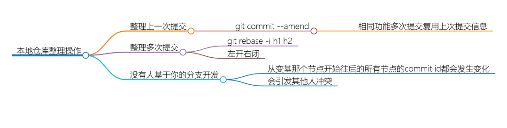

## 6.1、整理上一次提交

“整理上一次提交” 通常是指对最近一次提交进行修改或优化，主要使用`git commit --amend`命令完成。包括：

1. 修改提交信息：更改上一次提交时填写的提交信息，可以使用以下命令：
    
    ```
    git commit --amend -m "新的提交信息"
    ```
    
    如果是复用提交记录，可以不带`-m`参数，这时会进入编辑器状态。
    
2. 添加遗漏的文件：如果在上一次提交后意识到还有文件没有被提交，可以先将这些文件添加到暂存区，然后使用 --amend 将它们合并到上次提交中：
    
    ```
    git add 忘记的文件git commit --amend
    ```
    
3. 修改提交的内容：类似于添加文件，你也可以修改文件的内容，然后执行 `git commit --amend`，这会将更改合并到上一次提交中。
    

## 6.2、整理多次提交

“整理多次提交” 通常是指对多个提交进行重写、合并、修改或优化。最常见的是使用交互式变基（interactive rebase）方式实现。

交互式变基主要用于：

- 整理提交历史：合并多个提交为一个提交，消除多余的提交，保持代码库的整洁。
    
- 修改提交信息：更新已有的提交信息，以反映更准确的变更描述。
    
- 修改提交内容：在变基过程中，可以对某个提交进行编辑，修复错误或添加更改。
    
- 重新排序提交：可以更改提交的顺序，以确保提交历史的逻辑性和连贯性。
    

整理多次提交 非常重要，因为在分支操作和解决冲突时非常有用。对于协作开发来说，当产生冲突之后，可能会影响我们制定规则的提交序列，因此，可能需要将产生冲突的文件合并到某个提交中，这时候就需要整理多次提交。

整理多次提交的实现方式：

1. 交互式变基（Interactive Rebase）：通过执行命令 `git rebase -i HEAD~n`，可以对最近的 n 次提交进行整理。在交互式模式下，可以选择对每个提交执行不同的操作，例如：
    

- pick：保留该提交。
    
- squash：将该提交与前一个提交合并。
    
- edit：修改该提交。
    
- reword：修改该提交的提交信息。
    
- drop：丢弃该提交。
    

3. 合并提交（Squash）：通过将多个提交合并为一个，也就是将几个小的、相关的提交整合为一个更大的提交，从而使历史记录更加简洁。
    
4. 重新排序提交：可以改变提交的顺序，以确保日志是按逻辑顺序排列的。
    
5. 修复提交：如果在多个提交中发现错误，可以通过整理提交来修复历史记录。
    

这里重点讲一下交互式变基 方式，因为这是最常用的。使用交互式变基 整理多次提交的语法：

```
# 修改hash1之后的提交信息（不包含hash1）git rebase -i hash1# 修改hash1到hash2的提交信息（不包含hash1）git rebase -i h1 h2
```

`h1`是指`hash1`,`h2`是指`hash2`，也就是`commit`的版本号，这是一个左开右闭的区间。因为我们总是基于上一次修改下一次，可能要使用到`git commit -amend`命令，所以区别必须 左开右闭。

如果`git rebase -i`后面不跟任何的`hash`值，默认整理的就是上一次`push`到远端的版本到最近的一个`commit`版本。

在修改提交的时候，只能使用两个命令：`git commit --amend`和`git rebase --continue`；并且进入`REBASE`状态（即变基状态）。  
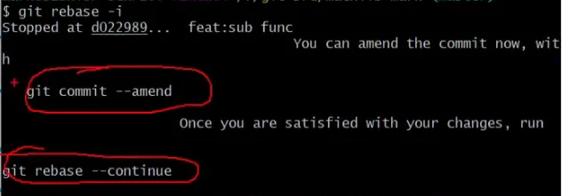 
进入`REBASE`状态后，就可以修改文件，然后`git add`到暂存区，再使用`git commit --amend`整理到本地仓库。整理完成之后，使用`git rebase --continue`继续（因为可能会有多个`REBASE`，如果有多个`REBASE`就要按照需要重复前面的整理操作），直到回到`master`分支。

这里再介绍另一个实际工作中常见的整理操作：合并提交（Squash）。这个同样要用到交互式变基，合并多个提交时使用 `squash`操作，修改为`squash`操作后需要重新写提交记录。

整理操作也可以借助Git可可视化工具完成，比如 SourceTree、TortoiseGit（小乌龟）。

整理多次提交的好处：

1. 简化历史：将多个小提交合并为一个有意义的提交，使得提交历史更加清晰、易读。
    
2. 提高可理解性：清晰的提交记录使得团队成员能够更容易理解每个变更的意图，容易查找问题。
    
3. 减少“噪音”：避免提交日志中充斥着很多小的、细微的提交（如“修复错误”、“更新文档”等），提高版本控制的质量。
    
4. 修复错误：如果某个提交包含错误，通过整理可以修复该提交，保持历史的清晰性。
    
5. 增强代码审查：整理后的提交在进行代码审查时，能够更加方便审查者理解每个提交的改动。
    
6. 避免冲突：在合并分支时，明确的提交历史可以减少后续合并时可能出现的冲突。
    

## 6.3、注意事项

进行整理操作的时候，必须是自己的仓库，也就是别人不会依赖你的仓库。因为作为开发者，都会有一个自己的功能分支，这个分支是自己私有的，不会被别人依赖。

千万不要在`develop`分支或者`master`分支做变基操作，因为从变基那个节点开始往后的所有节点的`commit id`都会发生变化，如果被别人依赖的话，会造成别人依赖一个不存在的提交，会引发其他人冲突。

正常的开发流程都是从`develop`分支或者`master`分支创建一个属于自己的私有分支，不被其他人依赖。这种情况下可以使用变基操作。

总结：整理本地 Git 仓库是一项重要的维护工作，可以提高代码质量和团队协作效率。通过遵循以上注意事项，可以在进行整理操作时减少潜在风险，并确保代码历史的清晰性。

# **分支操作** 

## 7.1、分支简介

管理代码的时候，在集中式管理（比如SVN）中会创建Trunk、Branches、Tag等一些目录，分别放置开发代码、代码分支以及代码的里程碑。那么在 Git 中也使用分支和tag来管理代码。分支就是就是一个代码的副本，可以基于分支进行独立开发。比如我们创建 Bug 分支或者 Feature 分支，等开发好了再合并到主干上。使用 Git 可以非常方便灵活地管理分支和基于分支工作：

```
git branch   # 查看分支git branch develop  # 创建develop分支git checkout –b feature/FT-123456  # 创建FT-123456的一个feature分支git checkout develop   # 切换分支git merge feature/FT-123456   # 合并分支git branch –d feature/FT-123456   # 删除FT-123456的feature分支git push –u origin hotfix/ISSUE-345678    # 推送分支
```

版本管理的标准流程：

- `Master` ：稳定压倒一切，禁止尚 review 和测试过的代码提交到这个分支上，Master上的代码是可以随时部署到线上生产环境的。
    
- `Develop` ：开发分支，我们的持续集成工作在这里，code review过的代码合入到这里，我们以下要讲的BUG fix和feature开发都可以基于develop分支拉取，修改完之后合入到develop分支。
    
- `Feature` ：功能开发和change request的分支，也即我们每一个feature都可以从devlop上拉取一个分支，开发、review和测试完之后合入develop分支。
    
- `Hotfix` ：紧急修改的分支，在master发布到线上出现某个问题的时候，算作一个紧急布丁。从master分支上拉取代码，修改完之后合入develop和master分支。
    
- `Release` ：预发布分支，比如0.1、0.2、1.12版本，我们一般说的系统测试就是基于这些分支做的，如果出现bug，则可以基于该release分支拉取一个临时bug分支。
    
- `Bug` ： bug fix的分支，当我们定位、解决后合入develop和Release分支，然后让测试人员回归测试，回归测试后由close这个bug。
    

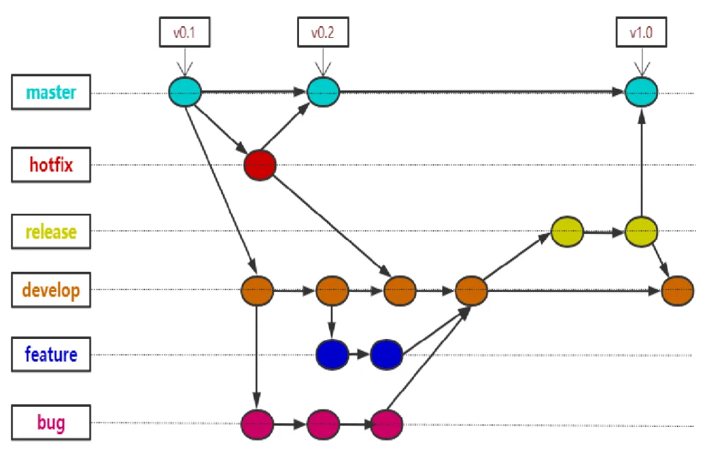

## 7.2、查看分支

首先要知道怎么去查看分支，使用`git branch`命令，这个命令只打印本地仓库的分支；如果想把远端的分支也查看一番，可以使用`git branch -a`命令。其中其星号`*`表示当前在哪个分支。示例：

```
fly@LAPTOP-V34UPA81:~/workspace/fly-mem-test$ git branch* masterfly@LAPTOP-V34UPA81:~/workspace/fly-mem-test$ git branch -a* master  remotes/origin/HEAD -> origin/master  remotes/origin/masterfly@LAPTOP-V34UPA81:~/workspace/fly-mem-test$
```

## 7.3、创建、切换分支

创建分支有两种方式：

```
git branch 分支名git checkout -b 分支名
```

它们的不同：

- `git branch 分支名`虽然创建了分支，但不会自动切换到新建的分支；而且是在本地创建的分支，远端没有这个分支。
    
- `git checkout -b`也会创建分支，而且会自动切换到新的分支上。
    

切换分支也有两种方式：

```
git checkout 分支名git switch 分支名
```

`git check`命令的功能很多，除了切换分支，还可以做版本回退等操作，因此，后来 Git 又增加了一个`git switch`命令。

`git checkout -b`可以理解为两个命令的结合，即 创建分支 + 切换分支两个操作合成一个命令。

## 7.4、合并分支

合并分支有两个命令：

- `git merge`。
    
- `git rebase`，不推荐使用。`git rebase`不仅可以合并提交，还可以合并分支。
    

合并分支的主要作用：通常，在实际项目开发过程中，会有多个分支，而且都是基于某个主分支进行开发。最终，所有的分支实现的功能都要合并到主分支，所有人都可以看到项目的修改。我们要把自己分支的修改应用到主分支，就需要合并分支。  
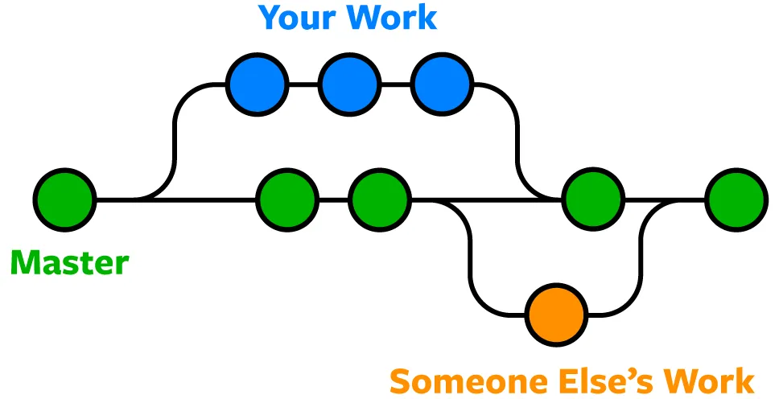 
`git merge`合并 Git 分支的步骤：

1. 切换到目标分支：这是你希望将更改合并到的分支。例如，如果你想将 feature-branch 合并到 main，需要首先切换到 main 分支，拉取该分支的最新代码。
    
    ```
    git checkout maingit pull
    ```
    
2. 合并分支：使用 git merge 命令将另一个分支合并到当前分支。例如，将 feature-branch 合并到 main：
    
    ```
    git merge feature-branch
    ```
    
3. 处理冲突（如果有）：如果存在冲突，Git 会提示你解决冲突。你需要手动编辑冲突的文件，然后添加更改并完成合并。
    
    ```
    # 编辑冲突文件vim 冲突的文件# 解决冲突后，添加已解决的文件git add <file-with-conflict># 完成合并git commit . -i -m "merge fix conflicts."
    ```
    
    冲突文件示例：  
    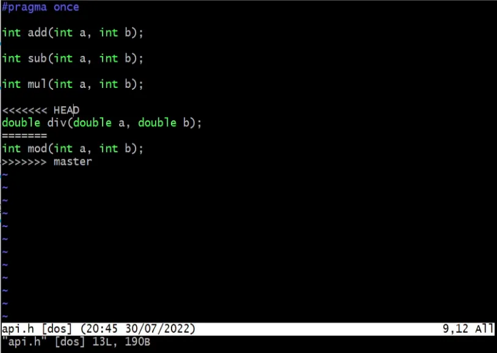
    
4. 测试代码并推送更改（如果需要）：将合并后的更改推送到远程仓库。
    
    ```
    git push origin main
    ```
    

`git rebase`合并分支（不推荐使用）：  
使用 `git rebase` 进行分支合并的步骤如下：

1. 切换到需要更新的分支：假设要将 feature-branch 的更改应用到 main 分支上，首先需要切换到 feature-branch。
    
    ```
    git checkout feature-branch
    ```
    
2. 执行 rebase 操作：将 feature-branch 的更改应用到 main 分支上。
    
    ```
    git rebase main
    ```
    
    这会将 `feature-branch` 上的提交“移到” `main` 分支的顶部。`feature-branch` 上的更改将会被逐个应用到 `main` 上的最新提交之后。
    
3. 解决冲突（如果有）：如果在 rebase 过程中出现冲突，Git 会提示解决冲突。解决冲突后，继续 rebase 操作。注意，git rebase解决完冲突后并不会增加一次提交。
    
    ```
    # 编辑冲突文件vim 冲突的文件# 解决冲突后，添加已解决的文件git add <file-with-conflict># 继续 rebasegit rebase --continue
    ```
    
    rebase示例：  
    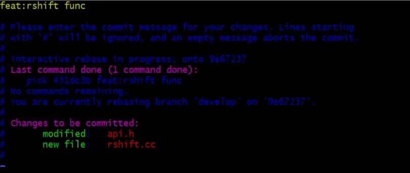
    
4. 推送更改（如果需要）：由于 rebase 操作会改变提交历史，如果已经将 feature-branch 推送到远程仓库，需要强制推送更新。
    
    ```
    git push --force origin feature-branch
    ```
    
    注意：强制推送会覆盖远程仓库中的 `feature-branch`，在共享仓库中使用时请小心。
    

不推荐使用`git rebase`的原因：虽然`git rebase`让提交记录非常整洁，它整体上比`git merge`上一个提交记录，但是它会让人造成混淆（时间线错乱），无法辨别真正的版本依赖关系。

`git merge`更加符合实际开发的时间线。

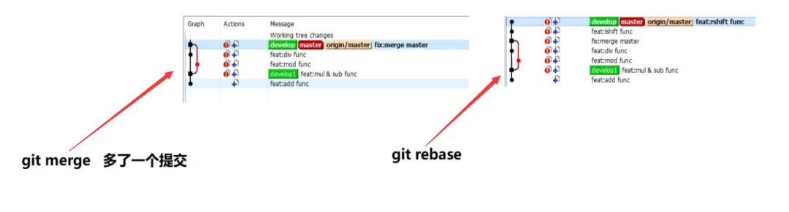 
什么时候使用`git rebase` ?  
依据是：是否有其他人依赖我当前`rebase`的这个分支。如果有依赖，则应当采用`git merge`进行合并，否则可以 使用`git rebase` 命令。因为`git rebase`会改变提交日志（即 commit id），如果有人依赖我的分支，就可能出现异常。

`git rebase`原理：从两个分支的共同祖先开始提取当前分支上的修改，提取的提交应用到目标分支的最新提交的后面，将当前分支指向目标分支的最新提交，可能引发其他人基底发生改变。

## 7.5、删除分支

删除本地分支：

1. 切换到其他分支：在删除分支之前，确保不在要删除的分支上。例如，如果要删除 feature-branch，可以切换到 main 或其他分支。
    
    ```
    git checkout main
    ```
    
2. 删除本地分支：使用 -d 选项删除本地分支，如果分支上有未合并的更改，Git 会警告你。
    
    ```
    git branch -d feature-branch
    ```
    
    如果你确定要删除分支，即使它有未合并的更改，可以使用 `-D`（强制删除）：
    
    ```
    git branch -D feature-branch
    ```
    

删除远程分支：使用 `git push` 命令并指定 `--delete` 选项来删除远程分支。例如，删除远程 `feature-branch`。

```
git push origin --delete feature-branch# orgit push origin -d feature-branch
```

## 7.6、解决冲突

冲突产生原因：不同分支修改了同一文件的同一行或者相邻行。  
解决原则：不要影响其他人提交的功能，也不能破坏自己提交的功能。也可以跟其他人协商解决。  
建议：提交前先`pull`更新最新代码。  
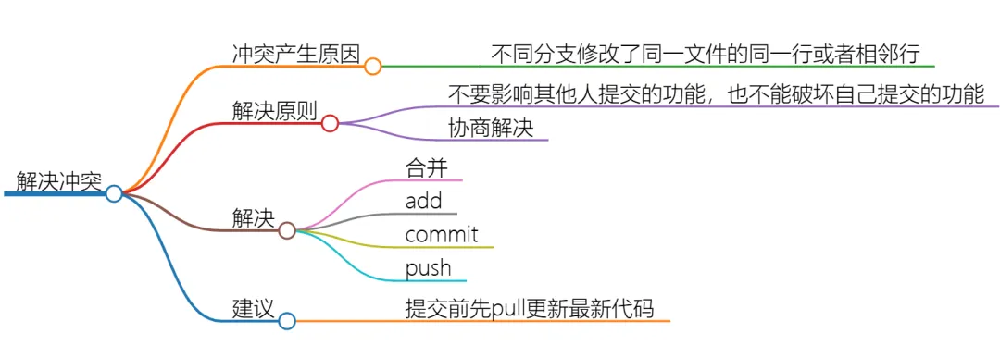 
`git merge`和`git rebase`解决冲突的不同：

- `git merge`先解决冲突文件，然后使用`git add`，最后`git commit . -i -m "...."`，完成。
    
- `git rebase`先解决冲突文件，然后使用`git add.`标记解决，最后`git rebase --continue`，完成。
    

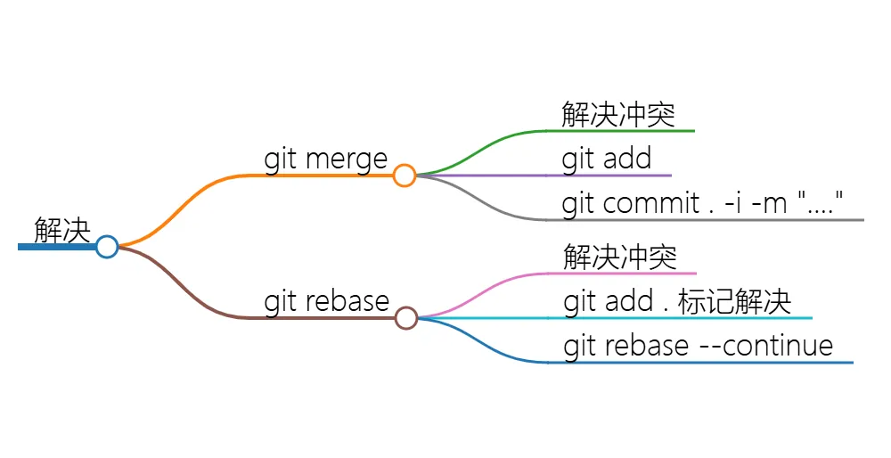

# **总结**

本文介绍了 Git 是什么、有什么用、为什么使用Git、学什么东西以及怎么用。重点掌握 Git 的相关基本概念，比如仓库、协议、配置用户名和邮箱等，这时最开始都要解决的问题。接下来了解本地工作区、暂存区、本地仓库、远程仓库、版本号、HEAD等的概念。重要的是具体的操作，包括基本操作、逆向操作、整理操作、分支操作、解决冲突等。最后我们需要知道 Git 在一个项目当中的使用规范。

---

> **配套环境笔记**：本篇正文多处使用 `git bash shell`（如克隆仓库、`ssh-keygen` 生成密钥）。Git Bash 本身的安装选项、路径写法（`/d/` 盘符）、参数路径自动转换坑与 CRLF 处理，见 [Git Bash 使用指南](Git%20Bash%20使用指南.md)。另注：正文里的 `ssh-keygen -t rsa` 现已不推荐，改用 `ssh-keygen -t ed25519`（GitHub 自 2022 年起推荐，且已停止支持 DSA/较短 RSA 密钥）。
