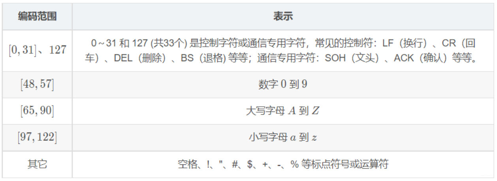

## 一、ASCII码简介

  

### 1、ASCII码的定义

ASCII 码(即 **American Standard Code for Information Interchange**)，翻译过来是美国信息交换标准代码。我们一般念成 **ask 2 马**。

### 2、ASCII码的起源

它是一套编码系统。由于计算机用 高电平 和 低电平 分别表示 1 和 0，所以，在计算机中所有的数据在存储和运算时都要使用二进制数表示，例如，像 a-z、A-Z 这样的52个字母以及 0-9 的数字还有一些常用的符号（例如 ?*#@!@#$%^&*() 等）在计算机中存储时也要使用二进制数来表示，具体用哪些二进制数字表示哪个符号，每个人都可以约定自己的一套规则，这就叫编码。

即 一个数字 和 一个字符 的一一映射。为了通信而不造成混淆，所以需要所有人都使用相同的规则。


### 3、ASCII码的表示方式

ASCII 码使用指定的 7 位或 8 位二进制数组合来表示 128 或 256 种可能的字符。

标准 ASCII码，使用 7位二进制数（剩下的1位二进制位0）来表示所有的大写he小写字母，数字 0 到 9、标点符号，以及在英语中使用的特殊控制字符。



  

## 二、ASCII码的输出

  

### 1、字符

当成字符用的时候，用格式化输出 %c 来控制，如下：

```c
#include <stdio.h>

int main()
{
printf("%c", '0');
printf("%c", 'A');
printf("%c", 'a');
printf("%c", '$');
return 0;
}
```

得到的输出结果如下：

```
0
A
a
$
```
  

  

### 2、整数

当成整数用的时候，用格式化输出 %d 来控制，如下：

```c
#include <stdio.h>

int main()
{
printf("%d", '0');
printf("%d", 'A');
printf("%d", 'a');
printf("%d", '$');
return 0;
}
```

得到的输出结果如下：
```
48
65
97
36
```

这是因为一个字符代表的是一个整数到符号的映射，它本质还是一个整数，所以我们可以用整数的形式来输出，字符 '0' 整数编码为 48，字符 '1' 的整数编码为 49，以此类推。

  

  

## 三、ASCII 码的运算

既然把它当成了整数，那么就可以进行简单的四则运算了。

我们简单来看下下面这段代码：

```c
#include <stdio.h>

int main()
{
printf("%c", '0' + 5);
printf("%c", 'A' + 3);
printf("%c", 'a' + 5);
printf("%c", '$' + 1);
return 0;
}
```

它的输出如下：

```
5
D
f
%
```

字符加上一个数字，我们可以认为是对字符编码进行了一个对应数字的偏移，字符 '0' 向右偏移 5 个单位，就是字符 '5'；同样的，'A' 向右偏移 3 个单位，就是字符 'D'。

有加法当然就有减法，给出如下代码，请在评论区给出它的输出结果：

```c
#include <stdio.h>

int main() {
printf("%c\n", 'A' - 10);
return 0;
}
```

  
这段代码使用ASCII值打印字符。让我们来分解一下：

- `'A'` 是代表字母 'A' 的字符文字。
- `'A' - 10` 从 'A' 的ASCII值中减去10。在ASCII码中，字符 'A' 的十进制值为65。所以，从65中减去10得到55。
- `printf("%c\n", 'A' - 10);` 打印对应于ASCII值55的字符。在ASCII码中，55对应字符 '7'。
```
字符    ASCII值
---------------------
0       48
1       49
2       50
3       51
4       52
5       53
6       54
7       55
8       56
9       57
---------------------
A       65
B       66
C       67
D       68
E       69
F       70
G       71
H       72
I       73
J       74
K       75
L       76
M       77
N       78
O       79
P       80
Q       81
R       82
S       83
T       84
U       85
V       86
W       87
X       88
Y       89
Z       90
---------------------
a       97
b       98
c       99
d       100
e       101
f       102
g       103
h       104
i       105
j       106
k       107
l       108
m       109
n       110
o       111
p       112
q       113
r       114
s       115
t       116
u       117
v       118
w       119
x       120
y       121
z       122
```

因此，当你运行这段代码时，它会打印：
```
  7
```

## 四、ASCII 码的比较

既然 ASCII 码可以和整数无缝切换，那么自然也可以进行比较了。通过上一节，我们了解到了 '0' 加上 1 得到 '1'，那么顺理成章可以得出：`'0' < '1' `（因为 48 小于 49）。同样的，`'a' < 'b'、'X' < 'Y'`。