# 进制转换
## 何为进制
- **X进制**，表示每一个数位上的数，运算时都是逢 X 进一位。
- 例如：十进制是逢十进一，十六进制是逢十六进一，二进制就是逢二进一，八进制是逢八进一，以此类推，X进制就是 逢X进一。
## 计算机中的进制
### 二进制
- C语言中，我们如果想表示一个二进制数，可以用 0b 作为前缀，然后跟上 0 和 1 组成的数字，我们来看一段代码：
```c
#include <stdio.h>

int main() 
{
int a = 0b101;
printf("%d\n", a);
return 0;
}
```
这段代码中，输出的结果如下：
```
5
```
因为 `%d` 代表输出的数是十进制，所以我们需要将二进制转换成十进制以后输出，`0b101` 在十进制下的值为 `5`。因为数字比较小，所以我们可以简单列出二进制和十进制的对应关系如下：
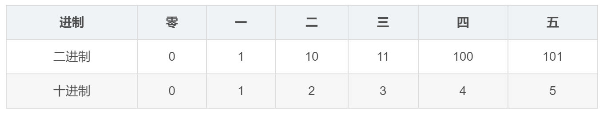
也就是二进制下 `101` 对应于十进制下的`5`。
### 八进制
讲八进制之前，我们还是先来看一段代码：

```c
#include <stdio.h>

int main() 
{
int a = 0123;
printf("%d\n", a);
return 0;
}
```

那么，这段代码的输出值为多少呢？

```
83
```

嗯，如果没有学过C语言，肯定认为这是 $123$，实际上它的答案是：$83$。

为什么呢？参考二进制的表示法，==八进制的表示法是前缀1个0==，然后跟上$0-7$的数字；

换言之，我们需要把 $123$ 这个八进制数转换成十进制后再输出。而转换结果就是 $83$，由于这里数字较大，我们已经无法一个一个数出来了，所以需要进行进制转换，关于进制转换，在第四节进制转换初步里再来讲解。
### 十六进制
同样的，对于十六进制数，表示方式为：以 `0x` 或者 `0X` 作为前缀，跟上 `0-9`、`a-f`、`A-F`的数字，其中大小写字母的含义相同，分别代表从 $10$ 到 $15$ 的数字。如下表所示：
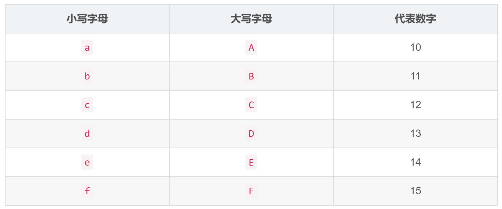

我们看看这段代码的输出：
```c
#include <stdio.h>

int main() 
{
int a = 0X123;
printf("%d\n", a);
return 0;
}
```
对于这段代码，输出的是： `291`。
所以这里就涉及到了十六进制转换成十进制，接下来让我们来看下进制转换。
## 进制转换初级
### X进制 转 十进制
对于X进制的数来说，我们定义一下几个概念
1. 对于数字部分从右往左编号以此为 $0$ 到 n ，第i个数字表示为$d_i$，这个数字就是，$d_n ... d_1, d_0$；
2. 每个数字位有一个权值，我们称之为位权；
3. 第 i 个数字位的权值为 $X^i$；
基于以上几个概念，X进制 转 十进制 的值为 每一位数字 和 它的权值 的乘积的累加和，如下：
$$
\sum_{i = 0}^{n}X^id_i
$$
举个例子，对于上文提到的八进制数 0123，转换成十进制，只需要套用如下公式：
$$
\sum_{i = 0}^{2}8^id_i\\
=8^2 * 1 + 8^1 * 2 + 8^0 *3
$$
上文提到的十六进制数 $0X123$，转换成十进制，套用同样的公式，如下：
$$
\sum_{i = 0}^{2}16^id_i\\
=16^2 * 1 + 16^1 * 2 + 16^0 *3
$$

### 十进制 转 X进制
对于 十进制 转 X进制 的问题，我们可以这么来考虑：

> 从 X进制 转 十进制 的原理可知，任何一个十进制数字都是由 X进制 的幂的倍数累加而成。所以，一个数一定有 $X^0$ 这部分，而这部分，可以通过原数除上 X 的余数得到。然后我们把原数除上 X 后得到的数，肯定又有 $X^0$ 的部分，就这样重复的试除，直到得到的商为 零 时结束，过程中的余数，逆序一下就是对应进制的数了。

还是一上文的例子来说，对于 291 我们可以通过如下方式，转换成 十六进制。

```
291 除 16 ========== 18 余 3
18 除 16 =========== 1 余 2
1 除 16 ============ 0 余 1
```
  结果为：123
而对于十进制的83，我们可以通过如下方式，转换成 八进制。

```
83 除 8 ============ 10 余 3
10 除 8 ============ 1 余 2
1 除 8 ============= 0 余 1
```
结果为：123

举个例子，将十进制数$42$转换为二进制：

```
1. 目标进制为二进制，基数为2
2. 42 ÷ 2 = 21 余 0
3. 21 ÷ 2 = 10 余 1
4. 10 ÷ 2 = 5 余 0
5. 5 ÷ 2 = 2 余 1
6. 2 ÷ 2 = 1 余 0
7. 1 ÷ 2 = 0 余 1
```
倒转余数：101010。所以，42的二进制表示为101010。

# 位运算概览
## 再谈二进制
1. **二进制加法**：
    
    - 0 + 0 = 0
    - 0 + 1 = 1
    - 1 + 0 = 1
    - 1 + 1 = 10（二进制进位）
2. **二进制减法**：
    
    - 1 - 0 = 1
    - 1 - 1 = 0
    - 10 - 1 = 1
    - 0 - 0 = 0
    - 如果需要借位，则从高位借1
3. **二进制乘法**：
    
    - 0 × 0 = 0
    - 0 × 1 = 0
    - 1 × 0 = 0
    - 1 × 1 = 1
    - 乘法涉及到进位，类似于十进制的乘法，但只包含0和1两个数字
4. **二进制除法**：
    
    - 除法操作涉及到除数、被除数和商，二进制的除法与十进制的除法类似，但只包含0和1两个数字。

加法举例：
```
  101
+ 011 
-----
 1000 
```
- 从低位开始逐位相加，遇到1+1时需要进位。
- 二进制数的运算与十进制数的运算类似，但在处理进位和借位时需要格外小心，因为二进制数只有0和1两个数字。
## 位运算简介
位运算可以理解成对二进制数字上的每一个位进行操作的运算。
位运算分为 布尔位运算符 和 移位位运算符。
布尔位运算符又分为 位与(&)、位或(|)、异或(^)、按位取反(~)；移位位运算符分为 左移(<<) 和 右移(>>)。
```
任何数与上0 就是0 
任何数与上1 是本身

任何数或上0 是本身
任何数或上1 就是1

任何数异或0 是本身
任何数异或1 是取反
```

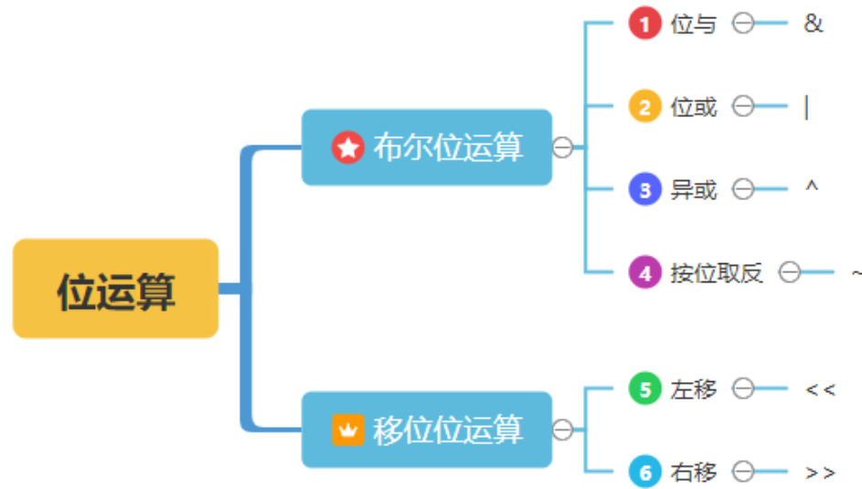

## 位运算概览

今天，我们先来对位运算进行一个初步的介绍。后面会对每个运算符的应用做详细介绍，包括刷题的时候如何运用位运算来加速等等。

### 1、布尔位运算

对于布尔位运算，总共有四个，如下表所示：

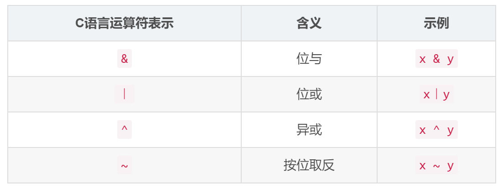

####  位与`&`
- 每位都为1，结果才为1
位与就是对操作数的每一位按照如下表格进行运算，对于每一位只有 0 或 1 两种情况，所以组合出来总共 4 种情况。
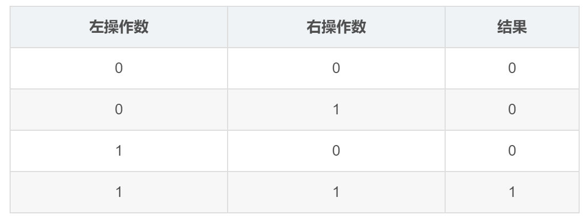

```c
#include <stdio.h>

int main() 
{
int a = 0b1010; // (1)
int b = 0b0110; // (2)
printf("%d\n", (a & b) ); // (3)
return 0;
}
```
(1) 在C语言中，以 0b 作为前缀，表示这是一个二进制数。那么 a 的实际值就是 (1010)。
(2) 同样的，b 的实际值就是 (0110)；
(3) 那么这里 a & b 就是对 (1010) 和 (0110) 的每一个二进制位做表格中的 & 运算。
它的二进制表示为： (0010)。因为输出的是十进制数，所以最后输出结果为：`2`

注意：这里的 **前导零** 可有可无，作者写上前导零只是为了对齐以及让读者更加清楚位与的运算方式。
#### 位或`|`
- 每位只要有1，结果就是1。
位或的运算结果如下：
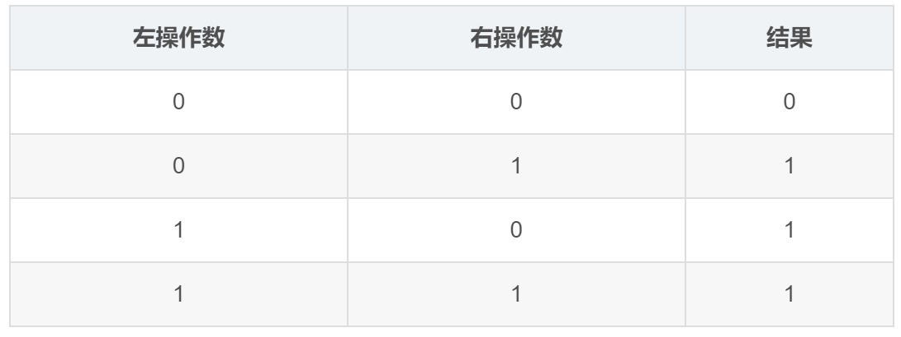

我们来看以下这段程序：

```c
#include <stdio.h>

int main() 
{
int a = 0b1010;
int b = 0b0110;
printf("%d\n", (a | b) );
return 0;
}
```

以上程序的输出结果为：`14`
即二进制下的 (1110)。

####  异或`^`
异或的运算结果如下：相同为假，不同为真
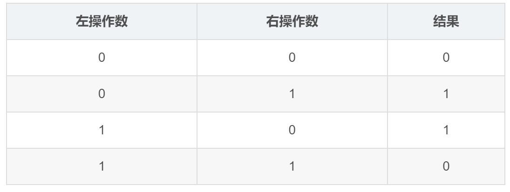

我们来看以下这段程序：

```c
#include <stdio.h>
int main() 
{
int a = 0b1010;
int b = 0b0110;
printf("%d\n", (a ^ b) );
return 0;
}
```

以上程序的输出结果为：`12`，即二进制下的 (1100)。

#### 取反`~`
按位取反其实就是 0 变 1， 1 变 0。

同样，我们来看一段程序。

```c
#include <stdio.h>

int main() 
{
int a = 0b1;
printf("%d\n", ~a );
return 0;
}
```

自己尝试一下，看看输出的结果是否符合你的认知呢？
结果为`-2`

> 这段代码将整数1（二进制表示为0000 0001）赋值给变量a，然后对a进行取反操作（按位取反），并打印结果。
> 取反操作后，每个位上的值都会反转。因此，1的二进制取反后为1111 1110。
> 十进制下，1111 1110对应的是-2。

###  移位位运算
对于移位位运算，总共有两个，如下表所示：

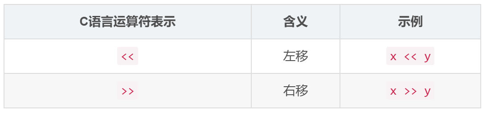
####  左移`<<`
其中 x << y 代表将二进制的 x 的末尾添加 y 个零，就好比向左移动了 y 位。
比如 (1011) 左移三位的结果为：(1011000)。
####  右移`>>`
其中 x >> y 代表将二进制的 x 从右边开始截掉 y 个数，就好比向右移动了 y 位。
比如 (101111) 右移三位的结果为：(101)。
# 位运算 `&` 的应用
##  位与运算符性质
- 位与运算符是一个二元的位运算符，也就是有两个操作数，表示为 x & y。
- 位与运算会对操作数的每一位按照如下表格进行运算，对于每一位只有 0 或 1 两种情况，所以组合出来总共 4 种情况。

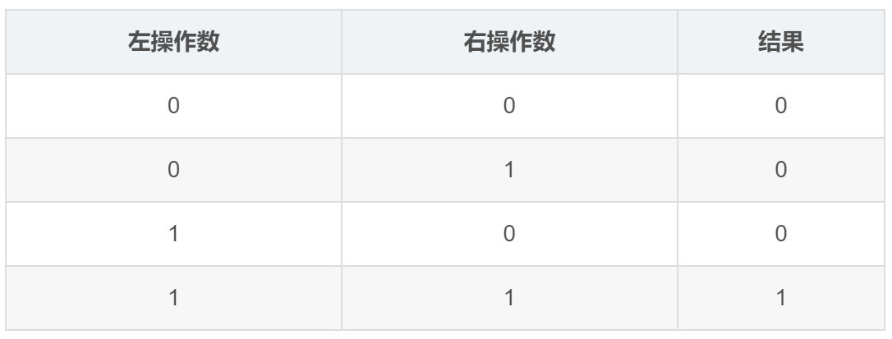

 通过这个表，我们得出一些结论：
 1. ==无论0或1，只要与上1，还是它本身==
 2. ==无论0或1，只要与上0，就会变成0.==
 所以对于位与来说，只要这一位上有一个零，这一位的结果就会是0.
 ```c
 #include <stdio.h>
int main()
{
	int a = 0b1010;
	int b = 0b0110;
	printf("%d\n", (a & b));
	return 0;
}
```
1. (1) 在C语言中，以 0b 作为前缀，表示这是一个二进制数。那么 a 的实际值就是 (1010) 。
2. (2) 同样的， b 的实际值就是 (0110) ；
3. (3) 那么这里 a & b 就是对 (1010) 和 (0110) 的每一位做表格中的 & 运算。
4. 所以最后输出结果为：`2`
5. 因为输出的是十进制数，它的二进制表示为： (0010)。
6. 注意：这里的 **前导零** 可有可无，作者写上前导零只是为了对齐以及让读者更加清楚位与的运算方式
## 位与运算符的应用
### 奇偶性判定
- 我们判定一个数是奇数还是偶数， 通常是通过取模`%`来判断的,如下
```c
#include <stdio.h>

int main() {
if(5 % 2 == 1) {
printf("5是奇数\n");
}
if(6 % 2 == 0) {
printf("6是偶数\n");
}
return 0;
}
```
- 然而，我们也可以这么写：
```c
#include <stdio.h>

int main()
{
	if(5 & 1){
	printf("5是奇数\n");
	}
	if((6 & 1) == 0){
	printf("6是偶数\n");
	}
	return 0;
}
```
- 这是利用了奇偶数的二进制特性，如图所示：
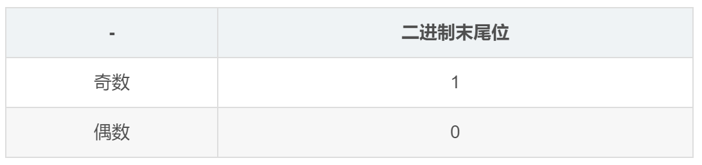

- 所以，我们对任何一个数，通过将它和 `1`进行位与`&`，结果为`0`，则必然这个数的二进制末尾位为`0`，根据以上表就能得出它是**偶数**了；否则，就是**奇数**。
### 取末五位
>【例题1】给定一个数，求它的二进制表示的末五位，以十进制输出即可。
1. 这个问题的核心就是：我们只需要末五位，剩下的位我们是不需要的，所以可以将给定的数 位与`&`上`0b11111`。**无论0或1，只要与上1，还是它本身**，这样一来就直接得到末五位的值了。
2. 代码实现如下：
```c
#include <stdio.h>
int main(){
	int x;
	scanf("%d", &x);
	printf("%d\n", (x & 0b11111));
	return 0;
}
```
>【例题2】如果是想得到末七位、末九位、末十四位、末 K 位，应该如何实现呢？
### 消除末尾五位
>【例题3】给定一个 32 位二进制整数，要求消除它的末五位。

还是根据位与的性质，消除末五位的含义，有两层：
1. 1）末五位，要全变成零；
2. 2）剩下的位不变；
-  那么，根据位运算的性质，我们需要位与`&`一个数，它的高27位都为1，低五位都为 0，则这个数就是：
$$
(11111111111111111111111111100000)
$$
- 但是如果要这么写，代码不疯掉，人也会疯掉，所以一般我们把它转成十六进制，所以得到十六进制数为 `0xffffffe0`。提示： f 代表 4 个1； e 代表 3个1,1个0； 0 代表 4 个 0；
> [!INFO] INFO
> 将二进制数转换为十六进制数需要将二进制数按照四位一组进行分组，然后将每组二进制数转换为对应的十六进制数。具体步骤如下：
> 1. 将二进制数按照四位一组进行分组，如果最左边的组不足四位，则在最左边补零。
>2. 将每组四位二进制数转换为对应的十六进制数。
>3. 将每组转换后的十六进制数依次排列，即得到最终的十六进制数。
>- 举例：假设我们有一个二进制数：110110101011。
>	1. 分组：在此示例中，可以分为 0011, 0110, 1010, 1011。
>	2. 转换为十六进制：将每组二进制数转换为对应的十六进制数。0011对应3，0110对应6，1010对应A，1011对应B。
>	3. 排列：得到的十六进制数为 3 6 A B。
- 代码实现如下：
```c
#include <stdio.h>
int main() {
    int x;
    scanf("%d", &x);
    printf("%d\n", (x & 0xffffffe0) );
    return 0;
} 
```
### 消除末尾连续1
>【例题4】给出一个整数，现在要求将这个整数转换成二进制以后，将末尾连续的1都变成0，输出改变后的数（以十进制输出即可）。
- 我们知道这个数的二进制的表示形式一定是：
$$...011...11$$
- 如果，我们给这个数加上1，得到的结果是
$$...100...00$$
- 我们把这两个数位与`&`运算，得到
$$...000...00$$
此题的答案为：`y = x & (x + 1)`
### 2的幂判定
>【例题5】请用一句话，判断一个正数是不是2的幂。
- 如果一个数是 2 的k 次幂，它的二进制表示必然为以下形式：末尾有k个0
$$100...00$$
- 这个数的十进制为2的k次幂，那么我们将它减1，即 $2^k-1$ 的二进制表示如下：
$$011...11$$
- 于是 这两个数位与的结果为零，于是我们就知道了如果一个数 x 是 2 的幂，那么 `x & (x-1)` 必然为零。而其他情况则不然。所以本题的答案为：
```
(x & (x - 1) )== 0
```
# 位运算` |` 的应用
## 位或运算符性质

  

位或运算符是一个二元的位运算符，也就是有两个操作数，表示为 x | y。位或运算会对操作数的每一位按照如下表格进行运算，对于每一位只有 0 或 1 两种情况，所以组合出来总共 4 种情况。
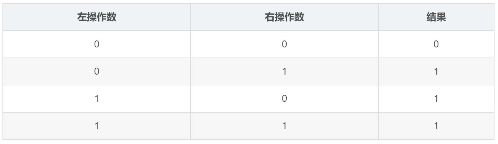

通过这个表，我们得出一些结论：
1）无论是 0 或 1，只要位或上 1，就变成1；
2）只有当两个操作数都是0的时候，才变成 0；
案例：
```c
#include <stdio.h>
int main(){
int a = 0b1010;
int b = 0b0110;
printf("%d\n", (a|b));
return 0;
}
```
最后输出结果为`1110`也就是`14`
## 位或运算符的应用
### 设置标记位
>[例题1] 给定一个数，判断它二进制低位的第五位，如果为0则设置它为1.

1. 这个问题，我们很容易联想到位或,我们分析一下题目意思。
2. 如果第 5 位为 1，不用进行任何操作；
3. 如果第 5 位为 0，则置为 1。
4. 言下之意，无论第五位是什么，我们都直接置为 1 即可
代码如下：
```c
# include <stdio.h>
int main(){
int x;//声明一个变量x
scanf("%d", &x);//将输入的数字通过引用写入X
printf("%d\n", x | 0b10000);//执行位或运算

return 0;
}
```
### 置空标记位

> 【例题2】给定一个数，判断它二进制低位的第 5 位，如果为 1，则将它置为 0。
当我们学过位与以后，很容易得出这样一种做法：
```c
#include <stdio.h>

int main() 
{
int x;
scanf("%d", &x);
printf("%d\n", x & 0b11111111111111111111111111101111);
return 0;
}
```
其它位不能变，所以 位与 上1；第5位要置零，所以 位与 上0；这样写有个问题，就是这串数字太长了，一点都不美观，而且容易写错，当然我们也可以转换成 十六进制，转换的过程也有可能出错。

而我们利用位或，只能将第5位设置成1，怎么把它设置成0呢？

>我们可以配合减法来用。分成以下两步：
1）首先，强行将低位的第5位置成1；
2）然后，强行将低位的第5位去掉；

第 (1) 步可以采用位或运算，而第 (2) 步，我们可以直接用减法即可。代码实现如下：
```c
#include <stdio.h>

int main() 
{
int x;
int a = 0b10000;
scanf("%d", &x);
printf("%d\n", (x | a) - a );//(x | a) 强行将低位的第5位置成1； 再- a 强行将低位的第5位去掉；

return 0;
}
```
### 低位连续零变一
>【例题3】给定一个整数 x，将它低位连续的 0 都变成 1。

- 假设这个整数低位连续有 k 个零，二进制表示如下：
$$...100...00$$
- 那么，如果我们对它进行减一操作，得到的二进制数就是：
$$...011...11$$
- 我们发现，只要对这两个数进行位或，就能得到：
$$...111...11$$
也正是题目所求，所以代码实现如下：
```c
#include <stdio.h>

int main() {
int x;
scanf("%d", &x);
printf("%d\n", x | (x-1) ); // x | (x-1) 就是题目所求的 "低位连续零变一" 。

return 0;
}
```

# 异或运算符
异或运算符是一个二元的位运算符，也就是有两个操作数，表示为 x ^ y。

异或运算会对操作数的每一位按照如下表格进行运算，对于每一位只有 0 或 1 两种情况，所以组合出来总共 4 种情况。


通过这个表，我们得出一些结论：

1. 两个相同的十进制数异或的结果一定为零。
2. 任何一个数和 0 的异或结果一定是它本身。
3. 异或运算满足结合律和交换律。

```c
#include <stdio.h>
int main() {
    int a = 0b1010;           // (1)
    int b = 0b0110;           // (2)
    printf("%d\n", (a ^ b) ); // (3)
    return 0;
}
```

它的二进制表示为： `(1100)`。所以最后输出结果为：`12`

## 异或运算符的应用
### 标记位取反
>【例题1】给定一个数，将它的低位数起的第 4 位取反，0 变 1，1 变 0。

这个问题，我们很容易联想到异或。我们分析一下题目意思，如果第 4 位为 1，则让它异或上 0b1000 就能变成 0；如果第 4 位 为 0，则让它异或上 0b1000 就能变成 1，也就是无论如何都是异或上 0b1000 ，代码如
```c
#include <stdio.h>
int main() {
    int x;
    scanf("%d", &x);
    printf("%d\n", x ^ 0b1000); 
    return 0;
}
```
### 变量交换
>【例题2】给定两个数 a 和 b，用异或运算交换它们的值。

```c
#include <stdio.h>
int main() {
    int a = 10, b = 20; 
    a = a ^ b; 
    b = a ^ b;//相当于 b 等于 a ^ b ^ b ，根据异或的几个性质，我们知道，这时候的 b 的值已经变成原先 a 的值了。
    a = a ^ b;//相当于 a 等于 a ^ b ^ a，还是根据异或的几个性质，这时候，a 的值已经变成了原先 b 的值。
    printf("a = %d, b = %d\n", a, b);//从而实现了变量 a 和 b 的交换。
	return 0;
}
```

解析：
```
a = 01010, b = 10100;
a = a ^ b = 11110;
b = a ^ b = (a ^ b) ^ b = 01010;
a = a ^ b = (a ^ b) ^ a = 10100;
```
### 出现奇数次的数
>【例题3】输入 n 个数，其中只有一个数出现了奇数次，其它所有数都出现了偶数次。求这个出现了奇数次的数。

根据异或的性质，两个一样的数异或结果为零。也就是所有出现偶数次的数异或都为零，那么把这 n 个数都异或一下，得到的数就一定是一个出现奇数次的数了。
```c
#include <stdio.h>
int main() {
    int n, x, i, ans;//(1)
    scanf("%d", &n);//(2)
    ans = 0;//(3)
    for(i = 0; i < n; ++i) {//(4)
        scanf("%d", &x);
        ans = (ans ^ x);
    } 
    printf("%d\n", ans);//(5)
    return 0;
}
```
解析：
1. 这行代码声明了五个整数变量：

	- `n`: 存储从用户读取的数组大小（元素数量）。
	- `x`: 用于存储从用户读取的每个元素。
	- `i`: 循环计数器变量，用于遍历数组。
	- `ans`: 该变量将累积数组中所有元素的异或值。它初始化为 0，因为任何数字与 0 的异或值都是它本身。
2. 使用 `scanf` 从用户读取一个整数并将其存储在 `n` 变量中。这代表数组中的元素数量。
3. 初始化异或累加器，这行代码将 `ans` 变量初始化为 0。正如之前提到的，任何数字与 0 的异或值都是它本身。
4. 此 `for` 循环迭代 `n` 次（数组中的元素数量）。以下是循环内部发生的事情：
	- **`scanf("%d", &x);`**: 从用户读取一个整数并将其存储在 `x` 变量中。这代表数组中的每个元素。
	- **`ans = (ans ^ x);`**: 这行代码执行 `ans` 的当前值和 `x` 中的值之间的异或运算。结果存储回 `ans` 中。通过重复对所有元素进行异或运算，最终结果将是数组中所有元素的异或值。
5. 这行代码打印存储在 `ans` 中的最终值，该值代表数组中所有元素的异或值。
### 丢失的数
>【例题4】给定一个 n-1 个数，分别代表 1 到 n 的其中 n-1 个，求丢失的那个数。

- 对所有数字进行异或运算，结果将是缺失的数字与其他所有数字的异或值。
- 再次对所有数字（包括缺失的数字）进行异或运算，由于每个数字都会被异或两次，因此最终结果将是缺失的数字本身。
```
1 ^ 2 ^ 3 ^ 4  = 4
1 ^ 2 ^ 3 ^ 4 ^ 5 = 1
4 ^ 1 = 5 //这一步将消除两次异或中间的相同值(1,2 3 4)，并揭示缺失的数字5。
缺失的数字是5
```
### 简单加密
基于 **两个数异或为零**，**任何数和零异或为其本身** 这两个特点，异或还可以用来做简单的加密。将明文异或上一个固定的数变成密文以后，可以通过继续异或上这个数，再将密文转变成明文。

```c
#include <stdio.h>

int main() {
    char message[] = "Hello, world!";
    char key = 7; // 加密密钥

    for (int i = 0; i < strlen(message); i++) {
        message[i] = message[i] ^ key; // 加密每个字符
    }

    printf("Encrypted message: %s\n", message); // 输出: Encrypted message: Kfool/#tlqog

    // 解密消息
    for (int i = 0; i < strlen(message); i++) {
        message[i] = message[i] ^ key; // 解密每个字符
    }

    printf("Decrypted message: %s\n", message); // 输出: Decrypted message: Hello, world!

    return 0;
}

```

# 按位取反运算符
取反运算符是一个单目位运算符，也就是只有一个操作数，表示为 ~x。取反运算会对操作数的每一位按照如下表格进行运算，对于每一位只有 0 或 1 两种情况。

  

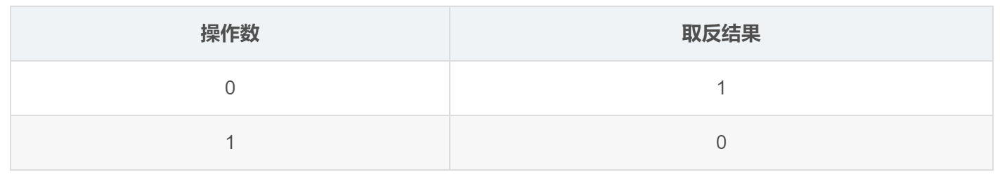
```c
#include <stdio.h>
int main() {
    int a = 0b1;
    printf("%d\n", ~a );
    return 0;
}
```
这里 ~a 代表的是对二进制数 1 进行取反，直观感受应该是 0。但是实际输出的却是：`-2`
这是为什么呢？那是因为，`int`是一个4字节， 32 位整数，实际的取反操作是这样的：
```
~ 00000000 00000000 00000000 00000001
--------------------------------------
11111111 11111111 11111111 11111110
```
32位整数的二进制表示，前导零也要参与取反。而对于一个有符号的 32 位整数，我们需要用最高位来代表符号位，即最高位为 0，则代表正数；最高位为 1，则代表负数；

这时候我们就需要引入补码的概念了。
## 补码的概念
在计算机中，二进制编码是采用补码的形式表示的，补码定义如下：
>正数的补码是它本身，符号位为 0；负数的补码为正数数值二进制位`取反加1`，符号位为1；
## 补码举例
根据补码的定义，-2的补码计算，需要经过两步：
1. 对 2 的二进制进行按位取反，如下：
```
~ 00000000 00000000 00000000 00000010
--------------------------------------
11111111 11111111 11111111 11111101
```
2. 然后加上 1，如下：
```
   11111111 11111111 11111111 11111101
 + 00000000 00000000 00000000 00000001
 --------------------------------------
   11111111 11111111 11111111 11111110
```
结果正好为我们开始提到的 ~1 的结果。
## 补码的真实含义
### “[模](https://baike.baidu.com/item/%E6%A8%A1/13332718?fromModule=lemma_inlink)”的概念
在介绍补码概念之前，先介绍一下“[模](https://baike.baidu.com/item/%E6%A8%A1/13332718?fromModule=lemma_inlink)”的概念：“模”是指一个计量系统的计数范围，如过去计量粮食用的斗、时钟等。计算机也可以看成一个计量机器，因为计算机的字长是定长的，即存储和处理的位数是有限的，因此它也有一个计量范围，即都存在一个“模”。如：时钟的计量范围是0~11，模=12。表示n位的[计算机](https://baike.baidu.com/item/%E8%AE%A1%E7%AE%97%E6%9C%BA/140338?fromModule=lemma_inlink)计量范围是$0\rightarrow2^n-1$，模=$2^n$．“模”实质上是计量器产生“溢出”的量，它的值在计量器上表示不出来，计量器上只能表示出模的余数。任何有模的计量器，均可化减法为加法运算 [3]。

就是`取反后加1`。

假设当前时针指向8点，而准确时间是6点，调整时间可有以下两种拨法：一种是倒拨2小时，即8-2=6；另一种是顺拨10小时，8+10=12+6=6，即8-2=8+10=8+12-2(mod 12)．在12为模的系统里，加10和减2效果是一样的，因此凡是减2运算，都可以用加10来代替。若用一般公式可表示为：a-b=a-b+mod=a+mod-b。对“模”而言，2和10互为补数。实际上，以12为模的系统中，11和1，8和4，9和3，7和5，6和6都有这个特性，共同的特点是两者相加等于模。对于[计算机](https://baike.baidu.com/item/%E8%AE%A1%E7%AE%97%E6%9C%BA/140338?fromModule=lemma_inlink)，其概念和方法完全一样。n位计算机，设n=8，所能表示的最大数是11111111，若再加1成100000000(9位)，但因只有8位，最高位1自然丢失（相当于丢失一个模）。又回到了 00000000，所以8位[二进制](https://baike.baidu.com/item/%E4%BA%8C%E8%BF%9B%E5%88%B6/361457?fromModule=lemma_inlink)系统的模为$2^8$。在这样的系统中减法问题也可以化成加法问题，只需把减数用相应的补数表示就可以了。把补数用到计算机对数的处理上，就是补码 [3]。

### 真实含义
补码的真实含义，其实体现在 “补” 这个字上，在数学上，两个互为相反数的数字相加等于 0，而在计算机中，两个互为相反数的数字相加等于 2 的 n 次。

换言之，互为相反数的两个数互补，补成 2 的 n 次。

对于 32位整型，n = 32；对于 64 位整型，n = 64。所以补码也可以表示成如下形式：

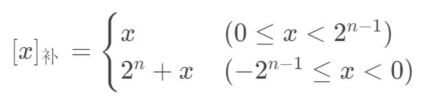

于是，对于 int 类型，就有：

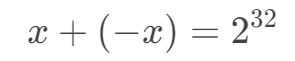

即：

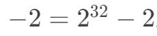

于是，我们开始数数……
```
2^32        = 1 00000000 00000000 00000000 00000000
2^32 - 1    =   11111111 11111111 11111111 11111111
2^32 - 2    =   11111111 11111111 11111111 11111110
```
近一步了解了 -2 的二进制表示。

## 按位取反运算符的应用
### 0 的取反
>【例题1】0 的取反结果为多少呢？
```
 ~ 00000000 00000000 00000000 00000000
 --------------------------------------
   11111111 11111111 11111111 11111111
```
这个问题，我们刚讨论完，这个答案为 2^32 - 1。但是实际输出时，你会发现，它的值是 -1 。这是为什么？
原因是因为在C语言中有两种类型的 int ，分别为 unsigned int 和 signed int ，我们之前讨论的 int 都是 signed int 的简称。
#### 1）有符号整型
对于有符号整型 signed int 而言，最高位表示符号位，所以只有 31 位能表示数值，能够表示的数值范围是：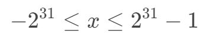
所以，对于有符号整型，输出采用 %d ，如下：
```c
#include <stdio.h>
int main() {
    printf("%d\n", ~0 );
    return 0;
}
```
结果为：-1
#### 2）无符号整型
对于无符号整型 unsigned int 而言，由于不需要符号位，所以总共有32位表示数值，数值范围为：

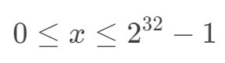

对于无符号整型，输出采用 %u ，如下：
```c
#include <stdio.h>
int main() {
    printf("%u\n", ~0 );
    return 0;
}
```
结果为：$4294967295$即 $2^ {32} - 1$ 。
### 相反数
> 【例题2】给定一个 int 类型的正数 x ，求 x 的相反数（注意：不能用负号）。

这里，我们可以直接利用补码的定义，对于正数 x ，它的相反数的补码就是 x 二进制取反加一。即： ~x + 1 。
```c
#include <stdio.h>
int main() {
    int x = 18;
    printf("%d\n", ~x + 1 );
    return 0;
}
```
运行结果如下：-18
### 代替减法
>【例题3】给定两个 int 类型的正数 x 和 y，实现 x - y（注意：不能用减号）。

这个问题比较简单，如果上面的相反数已经理解了，那么， x - y 其实就可以表示成 x + (-y) ，而 -y 又可以表示成 ~y + 1 ，所以减法 x - y 就可以用 x + ~y + 1 来代替。
```c
#include <stdio.h>
int main() {
    int a = 8;
    int b = 17; 
    printf("%d\n", a + ~b + 1 );
    return 0;
}
```
### 代替加法
> 【例题4】给定两个 int 类型的正数 x 和 y ，实现 x + y （注意：不能用加号）。

我们可以把 x + y 变成 x - (-y) ，而 -y 又可以替换成 ~y + 1 ；
所以 x + y 就变成了 x - ~y - 1 ，不用加号实现了加法运算。
```c
#include <stdio.h>
int main() {
    int x = 18;
    int y = 7; 
    printf("%d\n", x - ~y - 1 );
    return 0;
}
```
运行结果为：25
# 位运算 `<<` 的应用
## 左移运算符
### 1、左移的二进制形态

左移运算符是一个二元的位运算符，也就是有两个操作数，表示为 x << y 。其中 x 和 y 均为整数。

x << y 念作：“将 x 左移 y 位”，这里的位当然就是二进制位了，那么它表示的意思也就是：先将 x 用二进制表示，然后再左移 y 位，并且在尾部添上 y 个零。

举个例子：对于二进制数 (10111) 左移 y 位的结果就是：

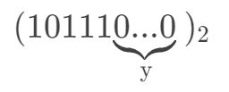

### 2、左移的执行结果

x << y 的执行结果等价于：

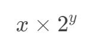

如下代码：
```c
#include <stdio.h>
int main() {
    int x = 3;
    int y = 5;
    printf("%d\n", x << y);
    return 0;
}
```
输出结果为：96
正好符合这个左移运算符的实际含义：

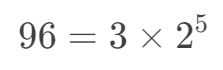

最常用的就是当 x = 1 时，1 << y 代表的就是 $2^y$，即 2 的幂。
### 3、负数左移的执行结果

所谓负数左移，就是 x << y 中，当 x 为负数的情况，代码如下：
```c
#include <stdio.h>
int main() {
    printf("%d\n", -1 << 1);
    return 0;
}
```
它的输出如下：-2
- 我们发现同样是满足的，这个可以用补码来解释，-1的补码为：

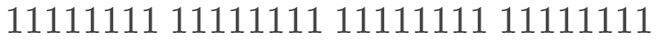

- 左移一位后，最高位的 1 就没了，低位补上 0，得到：

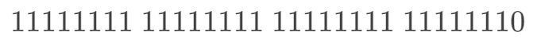

- 而这，正好是 -2 的补码，同样，继续左移 1 位，得到：

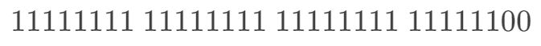

这是 -4 的补码，以此类推，所以负整数的左移结果同样也是满足的。

> 可以理解成 - (x << y) 和 (-x) << y 是等价的。
### 左移负数位是什么情况
刚才我们讨论了 x < 0 的情况，那么接下来，我们试下 y < 0 的情况会是如何？

是否同样满足如下等式呢？

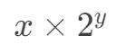

如果还是满足，那么两个整数的左移就有可能产生小数了。

看个例子：
```c
#include <stdio.h>
int main() {
    printf("%d\n", 32 << -1);   // 16
    printf("%d\n", 32 << -2);   // 8
    printf("%d\n", 32 << -3);   // 4
    printf("%d\n", 32 << -4);   // 2
    printf("%d\n", 32 << -5);   // 1
    printf("%d\n", 32 << -6);   // 0
    printf("%d\n", 32 << -7);   // 0
    return 0;
}
```
虽然能够正常运行，但是结果好像不是我们期望的，而且会报警告如下：

> [Warning] left shift count is negative [-Wshift-count-negative]

实际上，编辑器告诉我们尽量不用左移的时候用负数，但是它的执行结果不能算错误，起码例子里面对了，结果不会出现小数，而是取整了。

左移负数位其实效果和右移对应正数数值位一致。
### 左移时溢出会如何
我们知道， int 类型的数都是 32 位的，最高位代表符号位，那么假设最高位为 1，次高位为 0，左移以后，符号位会变成 0，会产生什么问题呢？

举个例子，对于 $-2^{31} + 1$ 的二进制表示为：最高位和最低位为 1，其余为零。
```c
#include <stdio.h>
int main() {
    int x = 0b10000000000000000000000000000001;
    printf("%d\n", x);                          // -2147483647
    return 0;
}
```
输出结果为：$-2147483647$
那么，将它进行左移一位以后，得到的结果是什么呢？
```c
#include <stdio.h>
int main() {
    int x = 0b10000000000000000000000000000001;
    printf("%d\n", x << 1);
    return 0;
}
```
我们盲猜一下，最高位的 1 被移出去，最低位补上 0，结果应该是 0b10 。

实际输出的结果，的确是：2
但是如果按照之前的规则，答案应该是：
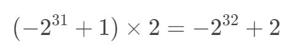
这里又回到了补码的问题上，事实上，在计算机中， int 整型其实是一个环，溢出以后又会回来，而环的长度正好是 2^32，所以 -2^32 + 2 = 2，这个就有点像同余的概念，这两个数是模 2^32 同余的。更多关于同余的知识，可以参考我的算法系列文章：[夜深人静写算法（三）- 初等数论入门](https://blog.csdn.net/WhereIsHeroFrom/article/details/111693538)。
## 左移运算符的应用
### 取模转化成位运算
对于 x 模上一个 2 的次幂的数 y，我们可以转换成位与$2^y-1$。
即在数学上的：

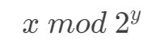
在计算机中就可以用一行代码表示：`x & ((1 << y) - 1)`。就是x & ($2^y$ - 1)`
- **一个数对 $2^n$ 取模相当于一个数和 $(2^n - 1)$ 做按位与运算。**
举例：
1. 假设 n 为 3，则 $2^3 = 8$，表示成 2 进制就是 $(1000)$。$2^3 - 1 = 7$ ，即 (0111)。
2. 此时 x & ($2^3$ - 1) 就是 x &(0111) ，取 X 的 2 进制的最后三位数。
3. 从二进制角度来看，$x / 8$相当于 X >> 3，即把 X 右移 3 位，此时得到了 X / 8 的商，而被移掉的部分(后三位)，则是 X % 8，也就是余数。
推广到一般：
- 对于所有 $2^n$ 的数，二进制表示为：`1000…000`
- 而 $2^n - 1$ 的二进制为：`0111…111`
- $x / 2^n$ 是 `X >> n`，那么 x & ($2^n$ - 1) 就是取被移掉的后 n 位，也就是 X % $2^n$。
### 生成标记码
我们可以用左移运算符来实现标记码，即 1 << k 作为第 k 个标记位的标记码，这样就可以通过一句话，实现对标记位置 0、置 1、取反等操作。
#### 标记位置1
>【例题1】对于 x 这个数，我们希望对它二进制位的第 k 位（从0开始，从低到高数）置为 1。
- 置 1 操作，让我们联想到了 位或 运算。
- 它的特点是：位或上 1，结果为 1；位或上0，是他本身。
- 所以我们对标记码的要求是：第 k 位为 1，其它位为 0，正好是 (1 << k) ，那么将 第 k 位 置为 1 的语句可以写成：x | (1 << k)。
#### 标记位置0
>【例题2】对于 x 这个数，我们希望对它二进制位的第 k 位（从0开始，从低到高数）置为 0。
- 首先置零运算让我们想到位与运算
- 位与运算的性质为：任何数与1是其本身，任何数与0都是0
- 所以在我们对标记码的要求是：第 k 位为 0，其它位为 1，我们需要的是 (~(1 << k))，那么将 第 k 位 置为 0 的语句可以写成：x & (~(1 << k))。
#### 标记位取反
>【例题3】对于 x 这个数，我们希望对它二进制位的第 k 位（从0开始，从低到高数）取反。
- 取反操作，联想到的是 异或 运算。
- 异或运算的性质为：任何数异或0，是其本身，任何数异或1，结果取反。
- 所以我们对标记码的要求是：第 k 位为1，其余位为 0，其值为 (1 << k) 。那么将 第 k 位 取反的语句可以写成： x ^ (1 << k) 。
### 生成掩码
我们可以用左移来生成一个掩码，完成对某个数的二进制末 k 位执行一些操作。
- 对于 (1 << k) 的二进制表示为：1 加上 k 个 0，那么 (1 << k) - 1 的二进制则代表 k 个 1。
- 把末尾的 k 位都变成 1，可以写成：x | ((1 << k) - 1)。
- 把末尾的 k 为都变成 0，可以写成：x & ~((1 << k) - 1)。
- 把末尾的 k 位都取反，可以写成：x ^ ((1 << k) - 1)。

# 位运算 `>>` 的应用
## 右移的二进制形态
右移运算符是一个二元的位运算符，也就是有两个操作数，表示为 x >> y。其中 x 和 y 均为整数。
x >> y 念作：“将 x 右移 y 位”，这里的位当然就是二进制位了，那么它表示的意思也就是：先将 x 用二进制表示，对于正数，右移 y 位；对于负数，右移 y 位后高位都补上 1。
举个例子：对于十进制数 87，它的二进制是 (1010111)， ## 右移 . 位的结果就是：(1010)
## 右移的执行结果
x >> y 的执行结果等价于：
$$\lfloor \frac{x}{2^y}\rfloor $$
$\lfloor x \rfloor$这个符号代表取下整,如下代码：
```c
#include <stdio.h>
int main() {
    int x = 0b1010111;
    int y = 3;
    printf("%d\n", x >> y);
    return 0;
}
```
输出结果为：10
正好符合这个右移运算符的实际含义：
$$10 = \lfloor \frac{87}{2^3}\rfloor $$
>由于除法可能造成不能整除，所以才会有 取下整 这一步运算。
## 负数右移的执行结果
所谓负数右移，就是 x >> y 中，当 x 为负数的情况，代码如下：
```c
#include <stdio.h>
int main() {
    printf("%d\n", -1 >> 1);
    return 0;
}
```
它的输出如下：-1
我们发现同样是满足如下式子的$$\lfloor \frac{x}{2^y}\rfloor $$
- 这个可以用补码来解释，-1 的补码为：
$$1111...11$$
- 右移一位后，由于是负数，高位补上 1，得到：
$$1111...11$$
- 可以理解成 - (x >> y）和 (-x) >> y 是等价的。

> 【例题1】要求不运行代码，肉眼看出这段代码输出多少。

```c
#include <stdio.h>
int main() {
    int x = (1 << 31) | (1 << 30) | 1;
    int y = (1 << 31) | (1 << 30) | (1 << 29);
    printf("%d\n", (x >> 1) / y);
    return 0;
}
```
## 右移负数位是什么情况
刚才我们讨论了 x < 0 的情况，那么接下来，我们试下 y < 0 的情况会是如何？是否同样满足如下性质呢？
$$\lfloor \frac{x}{2^y}\rfloor $$
如果还是满足，那么两个整数的左移就有可能产生小数了。看个例子：
```c
#include <stdio.h>
int main() {
    printf("%d\n", 1 >> -1);   // 2
    printf("%d\n", 1 >> -2);   // 4
    printf("%d\n", 1 >> -3);   // 8
    printf("%d\n", 1 >> -4);   // 16
    printf("%d\n", 1 >> -5);   // 32
    printf("%d\n", 1 >> -6);   // 64
    printf("%d\n", 1 >> -7);   // 128
    return 0;
}```
虽然能够正常运行，但是结果好像不是我们期望的，而且会报警告如下：

> [Warning] right shift count is negative [-Wshift-count-negative]
实际上，编辑器告诉我们尽量不用右移的时候用负数，但是它的执行结果不能算错误，起码例子里面对了。
右移负数位其实效果和左移对应正数数值位一致。
## 右移运算符的应用
### 去掉低 k 位
> 【例题2】给定一个数 x，去掉它的低 k 位以后进行输出。

这个问题，可以直接通过右移来完成，如下：x >> k。
### 取低位连续 1
> 【例题3】获取一个数 x 低位连续的 1 并且输出。
- 对于一个数 x，假设低位有连续 k 个 1。如下：$$...01...1$$
- 然后我们将它加上 1 以后，得到的就是：$$...10...0$$
- 这时候将这两个数异或结果为：$$...11...1$$
- 这时候，再进行右移一位，就得到了 连续 k 个 1 的值，也正是我们所求。所以可以用以下语句来求：(x ^ (x + 1)) >> 1。

### 3、取第k位的值

>【例题4】获取一个数 x 的第 k(0 <= k <= 30) 位的值并且输出。

- 对于二进制数来说，第 k 位的值一定是 0 或者 1。
- 而 对于 1 到 k-1 位的数字，对于我们来说是没有意义的，我们可以用右移来去掉。
- 再用位与运算符来获取二进制的最后一位是 0 还是 1，如下：(x >> k) & 1。


